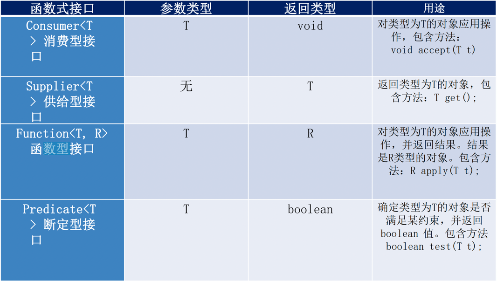
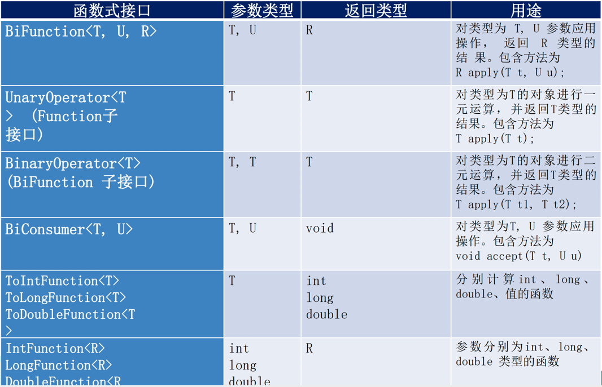

##Java8新特性
###速度更快
HashMap：数组+链表 -> 数组+链表+红黑树
```java
static final int DEFAULT_INITIAL_CAPACITY = 1 << 4; //初始容量16
static final int MAXIMUM_CAPACITY = 1 << 30; //最大容量
static final float DEFAULT_LOAD_FACTOR = 0.75f;//负载因子
 
//链表树化条件：链表长度>8 && 数组容量>64 
static final int TREEIFY_THRESHOLD = 8;
static final int MIN_TREEIFY_CAPACITY = 64;
```
链表树化条件：**链表长度>8 && 数组容量>64**

ConcurrentHashMap由分段锁改为无锁算法CAS，效率更高。分段锁取消原因：`ConcurrentLevel不好评定`

###代码更少
###强大的Stream API
###便于并行
###最大化减少空指针异常

###Lambda表达式
####Lambda常见语法格式
1) 语法格式一：无参数，无返回值
```java
() -> System.out.println("Hello Lambda!");
```

2) 语法格式二：有一个参数，并且无返回值
```java
(x) -> System.out.println(x)
```

3) 语法格式三：若只有一个参数，小括号可以省略不写
```java
x -> System.out.println(x)
```

4) 语法格式四：有两个以上的参数，有返回值，并且 Lambda 体中有多条语句
```java
Comparator<Integer> com = (x, y) -> {
    System.out.println("函数式接口");
    return Integer.compare(x, y);
};
```

5) 语法格式五：若 Lambda 体中只有一条语句， return 和 大括号都可以省略不写
```java
Comparator<Integer> com = (x, y) -> Integer.compare(x, y);
```

6) Lambda 表达式的参数列表的数据类型可以省略不写，因为JVM编译器通过上下文推断出，数据类型，即“类型推断”
```java
(Integer x, Integer y) -> Integer.compare(x, y);
```

####函数式接口
**函数式接口：接口中只有一个抽象方法的接口**，Lambda 表达式需要“函数式接口”的支持。使用注解 @FunctionalInterface 修饰，可以检查是否是函数式接口。

#####Java内置四大核心函数式接口
> 消费型接口 Consumer<T> : void accept(T t);  
> 供给型接口 Supplier<T> : T get();  
> 函数型接口 Function<T, R> : R apply(T t);  
> 断言型接口 Predicate<T> : boolean test(T t);  
 


#####其他函数式接口
