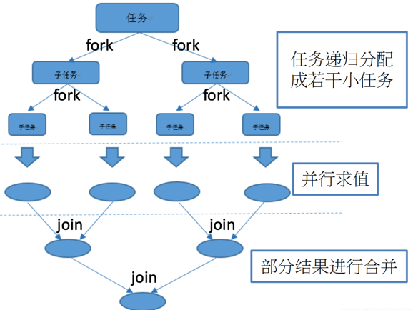
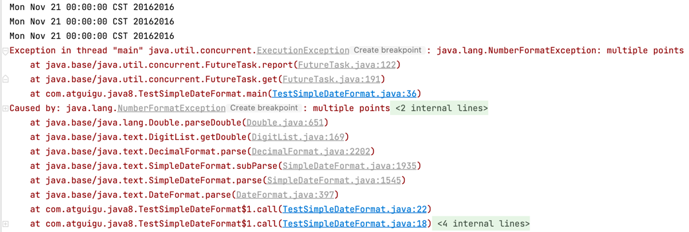
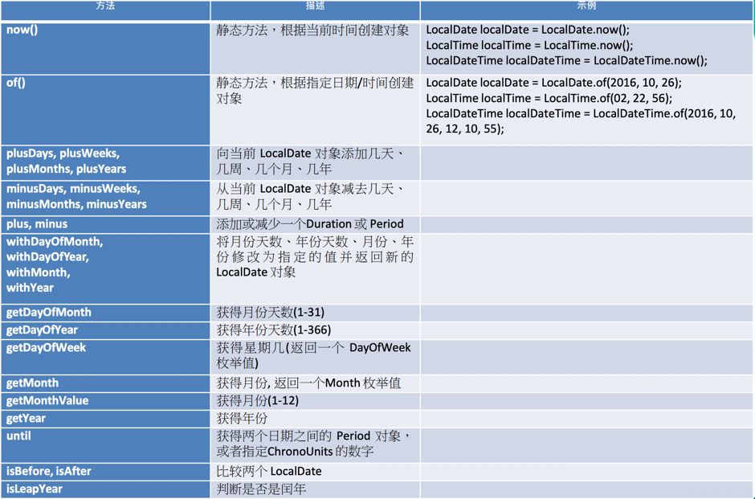
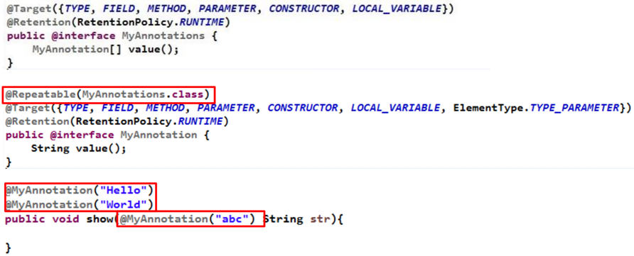

##Java8新特性
###速度更快
HashMap：数组+链表 -> 数组+链表+红黑树
```java
static final int DEFAULT_INITIAL_CAPACITY = 1 << 4; //初始容量16
static final int MAXIMUM_CAPACITY = 1 << 30; //最大容量
static final float DEFAULT_LOAD_FACTOR = 0.75f;//负载因子
 
//链表树化条件：链表长度>8 && 数组容量>64 
static final int TREEIFY_THRESHOLD = 8;
static final int MIN_TREEIFY_CAPACITY = 64;
```
链表树化条件：**链表长度>8 && 数组容量>64**

ConcurrentHashMap由分段锁改为无锁算法CAS，效率更高。分段锁取消原因：`ConcurrentLevel不好评定`

###代码更少
###强大的Stream API
###便于并行
###最大化减少空指针异常

###Lambda表达式
####Lambda常见语法格式
1) 语法格式一：无参数，无返回值
```java
() -> System.out.println("Hello Lambda!");
```

2) 语法格式二：有一个参数，并且无返回值
```java
(x) -> System.out.println(x)
```

3) 语法格式三：若只有一个参数，小括号可以省略不写
```java
x -> System.out.println(x)
```

4) 语法格式四：有两个以上的参数，有返回值，并且 Lambda 体中有多条语句
```java
Comparator<Integer> com = (x, y) -> {
    System.out.println("函数式接口");
    return Integer.compare(x, y);
};
```

5) 语法格式五：若 Lambda 体中只有一条语句， return 和 大括号都可以省略不写
```java
Comparator<Integer> com = (x, y) -> Integer.compare(x, y);
```

6) Lambda 表达式的参数列表的数据类型可以省略不写，因为JVM编译器通过上下文推断出，数据类型，即“类型推断”
```java
(Integer x, Integer y) -> Integer.compare(x, y);
```

####函数式接口
**函数式接口：接口中只有一个抽象方法的接口**，Lambda 表达式需要“函数式接口”的支持。使用注解 @FunctionalInterface 修饰，可以检查是否是函数式接口。

#####Java内置四大核心函数式接口
> 消费型接口 Consumer<T> : void accept(T t);  
> 供给型接口 Supplier<T> : T get();  
> 函数型接口 Function<T, R> : R apply(T t);  
> 断言型接口 Predicate<T> : boolean test(T t);  
 


#####其他函数式接口


###方法引用
#####对象::实例方法
```java
Employee emp = new Employee(101, "张三", 18, 9999.99);

Supplier<String> sup1 = () -> emp.getName();
//等同于
Supplier<String> sup2 = emp::getName;
```

#####类::静态方法
```java
BiFunction<Double, Double, Double> fun1 = (x, y) -> Math.max(x, y);
//等同于
BiFunction<Double, Double, Double> fun2 = Math::max;
```

#####类::实例方法
```java
BiPredicate<String, String> bp1 = (x, y) -> x.equals(y);
//等同于
BiPredicate<String, String> bp2 = String::equals;
```
###构造器引用 ClassName::new
```java
Supplier<Employee> sup1 = () -> new Employee();
//等同于
Supplier<Employee> sup2 = Employee::new;
```

**具体匹配哪个构造器，取决于是否有该构造器函数**。如Function<String, Employee> fun1、BiFunction<String, Integer, Employee> fun2`分别没有带一参、两参的构造函数，则会报错`。
```java
Function<String, Employee> fun1 = Employee::new;
BiFunction<String, Integer, Employee> fun2 = Employee::new;
```

###数组引用 type[]::new
```java
Function<Integer, String[]> fun1 = (args) -> new String[args];
String[] strs1 = fun1.apply(10);
//等同于
Function<Integer, String[]> fun2 = String[]::new;
String[] strs2 = fun2.apply(10);
```

###Stream

Stream操作的三个步骤
- 创建Stream 
- 中间操作
- 终止操作(终端操作)

###创建Stream
1) 通过Collection获取串行流和并行流
```java
List<String> list = new ArrayList<>();
Stream<String> stream1 = list.stream(); //获取一个顺序流
Stream<String> parallelStream = list.parallelStream(); //获取一个并行流
```

2) 通过Arrays的静态方法stream()
```java
Integer[] nums = new Integer[10];
Stream<Integer> stream2 = Arrays.stream(nums);
```

3) 通过Stream的静态方法of()
```java
tream<Integer> stream3 = Stream.of(1, 2, 3, 4, 5, 6);
```

4) 创建无限流
- 通过Stream的静态方法iterate()
```java
Stream<Integer> stream4 = Stream.iterate(0, (x) -> x + 2).limit(10);
stream4.forEach(System.out::println);
```
- 通过Stream的静态方法generate()
```java
Stream<Double> stream4 = Stream.generate(Math::random).limit(2);
stream4.forEach(System.out::println);
```

###Stream的中间操作
####筛选与切片

####映射

####排序

多个`中间操作`可以连接起来形成一个`流水线`，除非流水线上触发终止操作，否则`中间操作不会执行任何的处理`！而在终止操作时一次性全部处理，称为**惰性求值**。
```java
//未出现终止操作，所有的中间操作不会做任何的处理，即下列语句无输出
Stream<Employee> stream = emps.stream()
        .filter((e) -> {
        System.out.println("测试中间操作");
        return e.getAge() <= 35;
        });
```
```java
Stream<Employee> stream = emps.stream()
        .filter((e) -> {
            System.out.println("测试中间操作");
            return e.getAge() <= 35;
        });

//出现终止操作，所有的中间操作会一次性的全部执行，称为“惰性求值”
stream.forEach(System.out::println);
```

###Stream的终止操作
####查找与匹配


####规约（约简）

####收集

>######Collectors实用类提供了很多静态方法，可以方便地创建常见收集器实例
>
>

###串行流与并行流
Java 8 中将并行进行了优化，我们可以很容易的对数据进行并行操作。Stream API 可以声明性地通过 parallel() 与 sequential() 在并行流与顺序流之间进行切换。  
>并行流基于**Fork/Join 框架**：就是在必要的情况下，将一个大任务，进行拆分(fork)成若干个小任务（拆到不可再拆时），再将一个个的小任务运算的结果进行 join 汇总。
>####Fork/Join框架原理图
>

####代码示例：
```java
public class TestForkJoin {
    //串行计算
    @Test
    public void test2() {
        long start = System.currentTimeMillis();
		
        long sum = 0L;
        for (long i = 0L; i <= 10000000000L; i++) {
            sum += i;
        }
        System.out.println(sum);
		
        long end = System.currentTimeMillis();
        System.out.println("耗费的时间为: " + (end - start)); //34-3174-3132-4227-4223-31583
    }

    //手动实现ForkJoin并行计算
    @Test
    public void test1() {
        long start = System.currentTimeMillis();

        ForkJoinPool pool = new ForkJoinPool();
        ForkJoinTask<Long> task = new ForkJoinCalculate(0L, 10000000000L);
        long sum = pool.invoke(task);
        System.out.println(sum);

        long end = System.currentTimeMillis();
        System.out.println("耗费的时间为: " + (end - start)); //112-1953-1988-2654-2647-20663-113808
    }

    //并行流计算
    @Test
    public void test3() {
        long start = System.currentTimeMillis();
		
        Long sum = LongStream.rangeClosed(0L, 10000000000L)
                .parallel()
                .sum();
        System.out.println(sum);
		
        long end = System.currentTimeMillis();
        System.out.println("耗费的时间为: " + (end - start)); //2061-2053-2086-18926
    }
}
```

###Optional类
Optional<T> 类(java.util.Optional) 是一个容器类，代表一个值存在或不存在，
原来用 null 表示一个值不存在，现在 Optional 可以更好的表达这个概念。并且
可以避免空指针异常。  
####常用方法：
- Optional.of(T t): 创建一个 Optional 实例  
- Optional.empty(): 创建一个空的 Optional 实例  
- Optional.ofNullable(T t): 若 t 不为 null，创建 Optional 实例，否则创建空实例  
- isPresent(): 判断是否包含值  
- orElse(T t): 如果调用对象包含值，返回该值，否则返回t  
- orElseGet(Supplier s):如果调用对象包含值，返回该值，否则返回 s 获取的值  
- map(Function f): 如果有值对其处理，并返回处理后的Optional，否则返回 Optional.empty()  
- flatMap(Function mapper): 与 map 类似，要求返回值必须是Optional  

###新时间日期API
>Java8出了一套全新的时间API，代替了原来的时间API。其部分原因如下：
>- JDK1.0的Date类：Date(int year, int month, int date, int hrs, int min)构造年份时需对日期做加减法，比如2022年需传122，因其内部会默认加1900。
>- JDK1.1的Calendar类：其改善了Date的类上述问题，并对日期可进行运算。但是也存在一些问题：
>   - 日期加减，加两天add(2)、减两天add(-2)
>   - 每周第一天，默认的是星期日
>   - 不支持时区（注意即便支持，Java中的时区TimeZone类也是线程不安全的）
>- Date和Calendar类声明在java.util包中，但时间格式化类SimpleDateFormat在java.text包中，声明不规范

####Date线程安全举例
```java
public class TestSimpleDateFormat {
    public static void main(String[] args) throws Exception {
        SimpleDateFormat sdf = new SimpleDateFormat("yyyyMMdd");
        Callable<Date> task = new Callable<Date>() {
            @Override
            public Date call() throws Exception {
                return sdf.parse("20161121");
            }
        };

        ExecutorService pool = Executors.newFixedThreadPool(10);
        List<Future<Date>> results = new ArrayList<>();
        for (int i = 0; i < 10; i++) {
            results.add(pool.submit(task));
        }
        for (Future<Date> future : results) {
            System.out.println(future.get());
        }

        pool.shutdown();
    }
}
```
上述代码，会出现如下报错：


####Java8之前的解决方案：加锁
```java
public class TestSimpleDateFormat {
    public static void main(String[] args) throws Exception {
        Callable<Date> task = new Callable<Date>() {
            @Override
            public Date call() throws Exception {
                return DateFormatThreadLocal.convert("20161121");
            }
        };

        ExecutorService pool = Executors.newFixedThreadPool(10);
        List<Future<Date>> results = new ArrayList<>();
        for (int i = 0; i < 10; i++) {
            results.add(pool.submit(task));
        }
        for (Future<Date> future : results) {
            System.out.println(future.get());
        }

        pool.shutdown();
    }
}
```

####Java8可使用LocalDate类
>LocalDate类的实例是不可变对象，本身线程安全
```java
public class TestSimpleDateFormat {
    public static void main(String[] args) throws Exception {
        DateTimeFormatter dtf = DateTimeFormatter.ofPattern("yyyyMMdd");
        Callable<LocalDate> task = new Callable<LocalDate>() {
            @Override
            public LocalDate call() throws Exception {
                return LocalDate.parse("20161121", dtf);
            }
        };

        ExecutorService pool = Executors.newFixedThreadPool(10);
        List<Future<LocalDate>> results = new ArrayList<>();
        for (int i = 0; i < 10; i++) {
            results.add(pool.submit(task));
        }
        for (Future<LocalDate> future : results) {
            System.out.println(future.get());
        }

        pool.shutdown();
    }
}
```

####LocalDate、LocalTime、LocalDateTime类
LocalDate、LocalTime、LocalDateTime 类的实例是<font color='red'>不可变的对象</font>，分别表示使用`ISO-8601日历系统`的日期、时间、日期和时间。

>注：ISO-8601日历系统是国际标准化组织制定的现代公民的日期和时间的表示法  

####Instant类
用于“时间戳”的运算，<font color='red'>默认使用UTC时区</font>。它是以Unix元年(传统的设定为UTC时区1970年1月1日午夜时分)开始所经历的描述进行运算。常见的方法如下：
```java
Instant ins = Instant.now();  //默认使用 UTC 时区
System.out.println(ins);
		
OffsetDateTime odt = ins.atOffset(ZoneOffset.ofHours(8)); //东八区时区
System.out.println(odt);
```

####Duration和Period类
- Duration:用于计算两个“时间”间隔
- Period:用于计算两个“日期”间隔

###时间校正器TemporalAdjuster
TemporalAdjuster<font color='red'>s</font>: 该类通过静态方法提供了大量的常用 TemporalAdjuster 的实现。
```java
public class TestLocalDateTime {
    public void test() {
        //获取当前时间
        LocalDateTime ldt1 = LocalDateTime.now();
        System.out.println(ldt1);

        //获取本月十号
        LocalDateTime ldt2 = ldt1.withDayOfMonth(10);
        System.out.println(ldt2);

        //获取下个周日
        LocalDateTime ldt3 = ldt1.with(TemporalAdjusters.next(DayOfWeek.SUNDAY));
        System.out.println(ldt3);

        //自定义：获取下一个工作日
        LocalDateTime ldt5 = ldt1.with((l) -> {
            LocalDateTime ldt4 = (LocalDateTime) l;
            DayOfWeek dow = ldt4.getDayOfWeek();
            if (dow.equals(DayOfWeek.FRIDAY)) {
                return ldt4.plusDays(3);
            } else if (dow.equals(DayOfWeek.SATURDAY)) {
                return ldt4.plusDays(2);
            } else {
                return ldt4.plusDays(1);
            }
        });
        System.out.println(ldt5);
    }
}
```

###日期格式化
使用java.time.format.DateTimeFormatter类，该类提供了三种格式化方法：
- 预定义的标准格式
- 语言环境相关的格式
- 自定义的格式
```java
public class TestLocalDateTime {
    public void test(){
        DateTimeFormatter dtf1 = DateTimeFormatter.ISO_LOCAL_DATE;//标准格式
        DateTimeFormatter dtf2 = DateTimeFormatter.ofPattern("yyyy年MM月dd日 HH:mm:ss E");//自定义格式

        LocalDateTime ldt = LocalDateTime.now();
        System.out.println(ldt.format(dtf1));
        System.out.println(ldt.format(dtf2));

        LocalDateTime newLdt = ldt.parse(ldt.format(dtf2), dtf2);
        System.out.println(newLdt);
    }
}
```

###时区
Java8 中加入了对时区的支持，带时区的时间为分别为：ZonedDate、ZonedTime、ZonedDateTime。
>其中每个时区都对应着ID，地区ID都为“{区域}/{城市}”的格式。例如：Asia/Shanghai 等。
```java
public class TestLocalDateTime {
    public void test(){
        //获取所有时区信息
        Set<String> set = ZoneId.getAvailableZoneIds();
        set.forEach(System.out::println);

        //LocalDateTime带时区
        LocalDateTime ldt = LocalDateTime.now(ZoneId.of("Asia/Shanghai"));
        System.out.println(ldt);

        //ZonedDateTime带时区
        ZonedDateTime zdt = ZonedDateTime.now(ZoneId.of("US/Pacific"));
        System.out.println(zdt);
    }
}
```

###重复注解与类型注解
Java 8对注解处理提供了两点改进：可重复的注解及可用于类型的注解。
