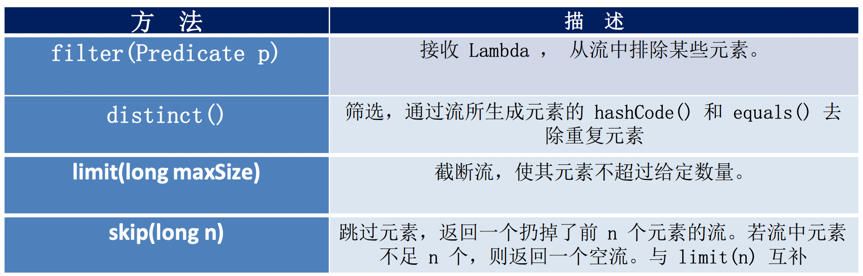
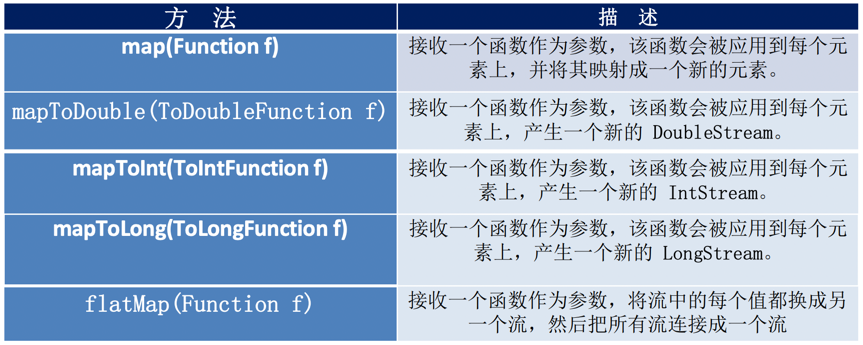
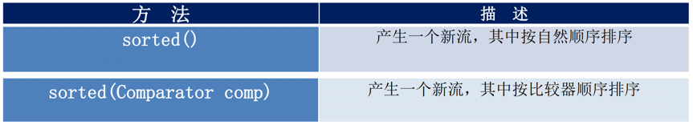

##Java8新特性
###速度更快
HashMap：数组+链表 -> 数组+链表+红黑树
```java
static final int DEFAULT_INITIAL_CAPACITY = 1 << 4; //初始容量16
static final int MAXIMUM_CAPACITY = 1 << 30; //最大容量
static final float DEFAULT_LOAD_FACTOR = 0.75f;//负载因子
 
//链表树化条件：链表长度>8 && 数组容量>64 
static final int TREEIFY_THRESHOLD = 8;
static final int MIN_TREEIFY_CAPACITY = 64;
```
链表树化条件：**链表长度>8 && 数组容量>64**

ConcurrentHashMap由分段锁改为无锁算法CAS，效率更高。分段锁取消原因：`ConcurrentLevel不好评定`

###代码更少
###强大的Stream API
###便于并行
###最大化减少空指针异常

###Lambda表达式
####Lambda常见语法格式
1) 语法格式一：无参数，无返回值
```java
() -> System.out.println("Hello Lambda!");
```

2) 语法格式二：有一个参数，并且无返回值
```java
(x) -> System.out.println(x)
```

3) 语法格式三：若只有一个参数，小括号可以省略不写
```java
x -> System.out.println(x)
```

4) 语法格式四：有两个以上的参数，有返回值，并且 Lambda 体中有多条语句
```java
Comparator<Integer> com = (x, y) -> {
    System.out.println("函数式接口");
    return Integer.compare(x, y);
};
```

5) 语法格式五：若 Lambda 体中只有一条语句， return 和 大括号都可以省略不写
```java
Comparator<Integer> com = (x, y) -> Integer.compare(x, y);
```

6) Lambda 表达式的参数列表的数据类型可以省略不写，因为JVM编译器通过上下文推断出，数据类型，即“类型推断”
```java
(Integer x, Integer y) -> Integer.compare(x, y);
```

####函数式接口
**函数式接口：接口中只有一个抽象方法的接口**，Lambda 表达式需要“函数式接口”的支持。使用注解 @FunctionalInterface 修饰，可以检查是否是函数式接口。

#####Java内置四大核心函数式接口
> 消费型接口 Consumer<T> : void accept(T t);  
> 供给型接口 Supplier<T> : T get();  
> 函数型接口 Function<T, R> : R apply(T t);  
> 断言型接口 Predicate<T> : boolean test(T t);  
 


#####其他函数式接口


###方法引用
#####对象::实例方法
```java
Employee emp = new Employee(101, "张三", 18, 9999.99);

Supplier<String> sup1 = () -> emp.getName();
//等同于
Supplier<String> sup2 = emp::getName;
```

#####类::静态方法
```java
BiFunction<Double, Double, Double> fun1 = (x, y) -> Math.max(x, y);
//等同于
BiFunction<Double, Double, Double> fun2 = Math::max;
```

#####类::实例方法
```java
BiPredicate<String, String> bp1 = (x, y) -> x.equals(y);
//等同于
BiPredicate<String, String> bp2 = String::equals;
```
###构造器引用 ClassName::new
```java
Supplier<Employee> sup1 = () -> new Employee();
//等同于
Supplier<Employee> sup2 = Employee::new;
```

**具体匹配哪个构造器，取决于是否有该构造器函数**。如Function<String, Employee> fun1、BiFunction<String, Integer, Employee> fun2`分别没有带一参、两参的构造函数，则会报错`。
```java
Function<String, Employee> fun1 = Employee::new;
BiFunction<String, Integer, Employee> fun2 = Employee::new;
```

###数组引用 type[]::new
```java
Function<Integer, String[]> fun1 = (args) -> new String[args];
String[] strs1 = fun1.apply(10);
//等同于
Function<Integer, String[]> fun2 = String[]::new;
String[] strs2 = fun2.apply(10);
```

###Stream

Stream操作的三个步骤
- 创建Stream 
- 中间操作
- 终止操作(终端操作)

###创建Stream
1) 通过Collection获取串行流和并行流
```java
List<String> list = new ArrayList<>();
Stream<String> stream1 = list.stream(); //获取一个顺序流
Stream<String> parallelStream = list.parallelStream(); //获取一个并行流
```

2) 通过Arrays的静态方法stream()
```java
Integer[] nums = new Integer[10];
Stream<Integer> stream2 = Arrays.stream(nums);
```

3) 通过Stream的静态方法of()
```java
tream<Integer> stream3 = Stream.of(1, 2, 3, 4, 5, 6);
```

4) 创建无限流
- 通过Stream的静态方法iterate()
```java
Stream<Integer> stream4 = Stream.iterate(0, (x) -> x + 2).limit(10);
stream4.forEach(System.out::println);
```
- 通过Stream的静态方法generate()
```java
Stream<Double> stream4 = Stream.generate(Math::random).limit(2);
stream4.forEach(System.out::println);
```

###Stream的中间操作
####筛选与切片

####映射

####排序

多个`中间操作`可以连接起来形成一个`流水线`，除非流水线上触发终止操作，否则`中间操作不会执行任何的处理`！而在终止操作时一次性全部处理，称为**惰性求值**。
```java
//未出现终止操作，所有的中间操作不会做任何的处理，即下列语句无输出
Stream<Employee> stream = emps.stream()
        .filter((e) -> {
        System.out.println("测试中间操作");
        return e.getAge() <= 35;
        });
```
```java
Stream<Employee> stream = emps.stream()
        .filter((e) -> {
            System.out.println("测试中间操作");
            return e.getAge() <= 35;
        });

//出现终止操作，所有的中间操作会一次性的全部执行，称为“惰性求值”
stream.forEach(System.out::println);
```

###Stream的终止操作
####查找与匹配


####规约（约简）

####收集

>######Collectors实用类提供了很多静态方法，可以方便地创建常见收集器实例
>
>