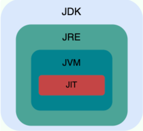
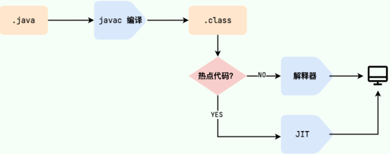

## Java 语言基础
### JDK、JRE、JVM、JIT的关系
- JDK（Java Development Kit），它是功能齐全的 Java SDK，是提供给开发者使用的。它包含了 JRE，同时还包含了编译 java 源码的编译器 javac、jdb（调试器）、javap（反编译工具）等等。
- JRE（Java Runtime Environment） 是 Java 运行时环境。主要包括 Java 虚拟机（JVM）、Java 基础类库（Class Library）。  



### 什么是字节码?采用字节码的好处是什么？
在 Java 中，JVM 可以理解的代码就叫做字节码（即扩展名为 `.class` 的文件），它不面向任何特定的处理器，只面向虚拟机。Java 语言通过字节码的方式，在一定程度上解决了传统解释型语言执行效率低的问题，同时又保留了解释型语言可移植的特点。所以， Java 程序运行时相对来说还是高效的（不过，和C、 C++，Rust，Go 等语言还是有一定差距的），而且，由于字节码并不针对一种特定的机器，因此，Java 程序无须重新编译便可在多种不同操作系统的计算机上运行。  

Java 程序从源代码到运行的过程如下图所示： 


我们需要格外注意的是 `.class->机器码` 这一步。在这一步 JVM 类加载器首先加载字节码文件，然后通过解释器逐行解释执行，这种方式的执行速度会相对比较慢。而且，有些方法和代码块是经常需要被调用的(也就是所谓的热点代码)，所以后面引进了 JIT（Just in Time Compilation） 编译器，而 JIT 属于运行时编译。当 JIT 编译器完成第一次编译后，其会将字节码对应的机器码保存下来，下次可以直接使用。而我们知道，机器码的运行效率肯定是高于 Java 解释器的。这也解释了我们为什么经常会说 **Java 是编译与解释共存的语言**。

## IO
### 阻塞 I/O (Blocking I/O)
阻塞 I/O 是最简单的模型之一。在这种模型中，当应用程序调用 I/O 操作（比如读或写）时，如果没有数据可用或操作未完成，该调用将会被阻塞，直到数据准备就绪或操作完成为止。这种模型的缺点是会造成线程阻塞，如果有大量的并发连接，需要大量的线程来处理。  

### 非阻塞 I/O (Non-blocking I/O)
非阻塞 I/O 允许应用程序执行非阻塞的 I/O 操作，即使没有数据也能立即返回。应用程序需要轮询或使用多路复用（select、poll、epoll等）等机制来检查数据是否准备就绪，这样可以避免线程被阻塞。但需要在循环中不断地检查，会造成 CPU 资源的浪费。  

### 异步 I/O (Asynchronous I/O)
AIO（Asynchronous I/O，异步 I/O）是一种用于处理 I/O 操作的编程模型，旨在提供更高效的 I/O 处理方式。AIO 与传统的阻塞式 I/O 或非阻塞式 I/O 不同，它使应用程序能够在发起 I/O 操作后继续执行其他任务，而无需等待 I/O 操作完成。  

泛型是 Java 中的一种特性，它允许你编写出可以应用于多种数据类型的代码，同时提供编译时类型安全检查。它在集合类、方法和类中经常被使用，可以让代码更加灵活、安全和可重用。

## 泛型 
### 泛型的主要概念和特点
#### 参数化类型： 
泛型允许你在定义类、接口、方法时使用参数，使得代码可以适用于多种类型。例如，List<T> 中的 T 就是一个类型参数。

#### 类型安全： 
泛型可以在编译时捕获类型错误，减少了在运行时出现类型转换错误的可能性，提高了代码的可靠性和稳定性。

#### 代码重用性： 
泛型代码可以被多种类型重复使用，这提高了代码的灵活性和可维护性。

### 泛型的基本使用方式：
#### 类型参数化类：
```
public class MyGenericClass<T> {
private T data;

    public void setData(T data) {
        this.data = data;
    }
    
    public T getData() {
        return data;
    }
}
```

#### 类型参数化方法：
```
public <T> T myGenericMethod(T value) {
// 方法体中使用 T 类型的参数
return value;
}
```

#### 类型通配符：
```
public void myMethod(List<?> list) {
// 使用通配符 ? 表示未知类型
// 可以读取列表中的元素，但无法添加元素（除了 null）
}
```

### 注意事项：
#### 类型擦除： 
Java 的泛型是通过类型擦除来实现的，在编译时会进行类型擦除，最终的字节码中不包含类型参数的信息。这可能导致一些限制和需要额外注意的地方。

#### 泛型方法和类的使用限制： 
泛型类或方法中不能使用基本类型（如 int、char 等）作为类型参数。例如，List<int> 是不允许的，需要使用其对应的包装类 List<Integer>。

#### 通配符和子类型限制： 
通配符 ? 表示未知类型，但无法直接添加元素到通配符类型的集合中，除了添加 null。子类型限制（例如 <? extends Number>）可以解决一些类型转换的问题，但是也需要谨慎使用以避免出现编译错误。

#### 类型擦除可能导致运行时异常： 
由于类型擦除，有时候泛型在运行时可能丢失类型信息，这可能导致一些运行时异常，比如 ClassCastException。因此，在使用泛型时要格外小心。

总结：
泛型是 Java 中强大的特性，能够提高代码的灵活性和可读性。尽管有些限制和注意事项，但合理地使用泛型可以编写更加通用、安全的代码。


## Session、Token、JWT
### Session
- 定义： Session是一种服务器端存储用户状态信息的机制。在Web应用中，服务器会为每个客户端（通常是浏览器）创建一个唯一的Session，并且将这个Session标识符存储在客户端的Cookie中。  
- 工作方式： 用户登录成功后，服务器会创建一个Session，将其唯一标识符存储在Cookie中发送给客户端，客户端在后续请求中通过Cookie将Session ID发送给服务器。服务器利用Session ID识别用户，并维护用户的会话状态信息。

### Token
- 定义： Token是一种用于进行身份验证和访问授权的令牌。它可以是随机生成的字符串，代表着特定用户的身份信息，通常包含一些加密签名、有效期等信息。  
- 工作方式： 用户登录成功后，服务器生成一个Token并发送给客户端。客户端在后续的请求中将Token放置在请求头、URL参数或者其他方式发送给服务器，服务器使用Token来识别和验证用户。

### JWT（JSON Web Token）
- 定义： JWT是一种开放标准（RFC 7519），它定义了一种用于安全传输声明的紧凑且独立的方式。JWT可以被加密或签名，用于在不同系统之间传递信息。它基于JSON格式，通常包含用户的一些声明和信息。  
- 工作方式： JWT通常由三部分组成：Header（头部）、Payload（有效载荷）和Signature（签名）。它们通过.分隔，并由Base64编码组成。客户端在登录后，服务器生成JWT并将其发送给客户端，客户端在后续请求中将JWT放置在请求头中，服务器验证JWT的有效性来确认用户身份。
    > JWT（JSON Web Token）可以看作是一种Token的实现方式之一。Token是一种用于进行身份验证和授权的令牌，而JWT是基于JSON格式的一种特定的Token，具有一些特定的属性和特征。

### 比较
- 持久性： Session通常存储在服务器端，而Token和JWT通常存储在客户端（如Cookie或LocalStorage）。
- 安全性： JWT相对于简单Token更具安全性，因为它可以加密和签名，在传输过程中更难被篡改或伪造。
- 状态管理： Session可以在服务器端保存用户状态信息，而Token和JWT通常无状态，服务器不需要在内存中维护任何信息。
- 跨域支持： Token和JWT更容易实现跨域的支持，因为它们可以存储在客户端，而Session通常会面临跨域的问题。  
    > Session面临跨域问题是因为：  
    **同源策略限制**： 浏览器的同源策略限制了不同域下的JavaScript代码无法直接访问其他域下的 Cookie。  
    **Cookie 属性限制**： 如果 Session ID 的 Cookie 没有设置为可在多个子域之间共享，则在跨域情况下，Session Cookie 也无法在不同的子域之间共享。   
    **安全性考虑**： 跨域共享 Session Cookie 可能存在安全风险。如果所有域都可以访问同一个 Session ID，那么攻击者就可以轻易地在其他域中冒充用户。

这些机制和工具在身份验证和授权中有着不同的应用场景和优缺点，选择合适的方式取决于具体的应用需求和安全考虑。

## 迭代器
迭代器（Iterator）是一种设计模式，也是 Java 中常用的接口，用于遍历集合（Collection）中的元素，而无需暴露集合的内部结构。它提供了一种统一的访问集合元素的方法，使得可以在不同的集合上进行相似的操作。
### 迭代器的常用方法
1) forEachRemaining(Consumer<? super E> action)： 对集合中的每个剩余元素执行给定操作，使用给定的消费者动作。
    ```java
    Iterator<String> iterator = list.iterator();
    iterator.forEachRemaining(System.out::println);
    ```
2) remove()： 移除集合中上一次 next() 返回的元素（可选操作）。
3) hasNext()： 检查集合中是否还有下一个元素。
4) next()： 返回集合中的下一个元素。
5) remove()： 移除集合中最后一个返回的元素（可选操作）。
6) forEachRemaining()： 在 Java 8 中添加的方法，用于以更简洁的方式遍历集合。

### 迭代器的不同实现类方法
不同类型的集合在实现迭代器时，可能会提供特定于该集合类型的迭代器方法，例如：
1) ListIterator： 除了基本的迭代器方法外，还提供了 hasPrevious()、previous()、nextIndex()、previousIndex() 和 set(E e) 等方法，允许双向访问和修改列表元素。
2) Iterator for Map： Map 的迭代器不同于集合迭代器，它通过 entrySet()、keySet() 或 values() 方法获得。
3) Spliterator（Java 8+）： 一种用于分割集合元素的迭代器，可用于并行遍历大型集合或流。

## 使用注意事项：
1) 并发修改异常： 在迭代过程中，如果集合被修改（添加、删除元素）可能会抛出 ConcurrentModificationException 异常。
2) 不支持双向访问： 迭代器只支持单向访问集合元素。  
3) 删除元素限制： 不是所有的集合都支持 remove() 操作，如果迭代器不支持 remove()，调用此方法会抛出 UnsupportedOperationException 异常。  
总体来说，迭代器是一种方便而强大的工具，但需要注意在使用过程中遵循集合的规则，避免并发修改和不支持的操作，以保证程序的稳定性和正确性。

## 一些比较好的观点
当代三高互联网架构：高并发、高性能、高可用。--多、快、稳


