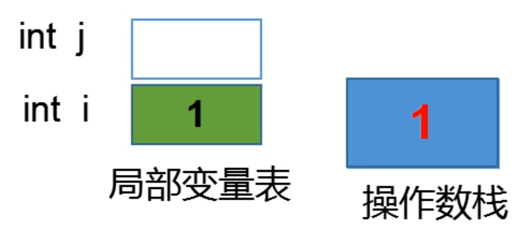
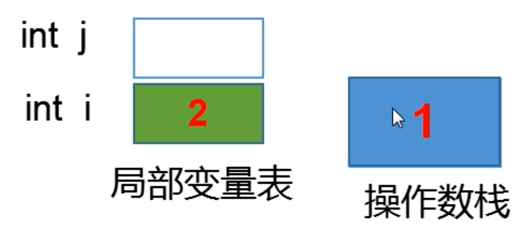
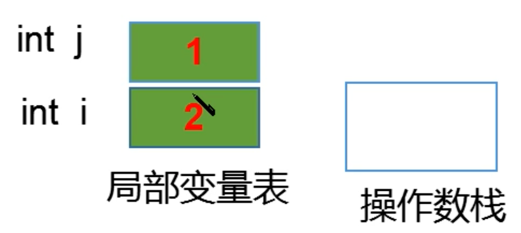
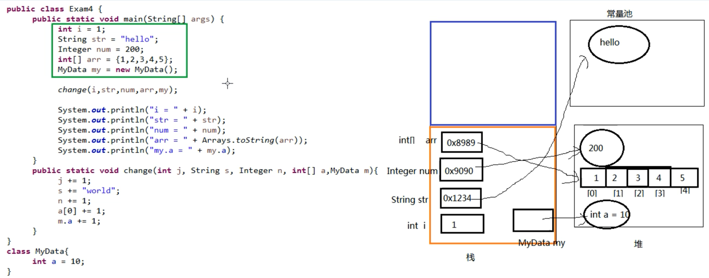
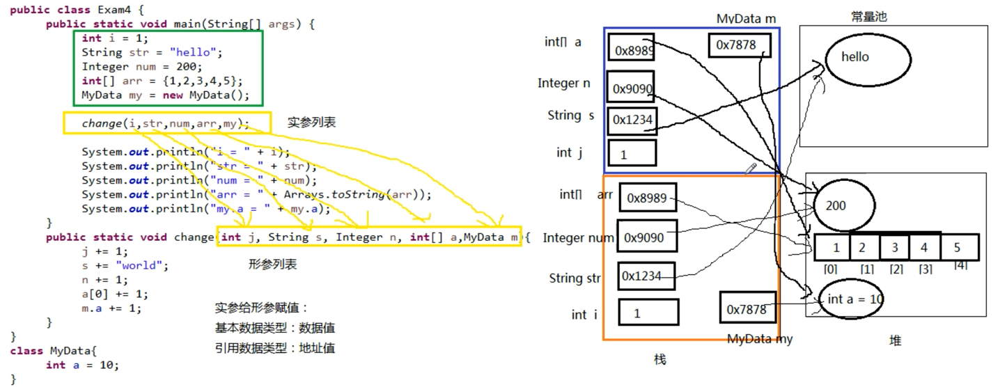
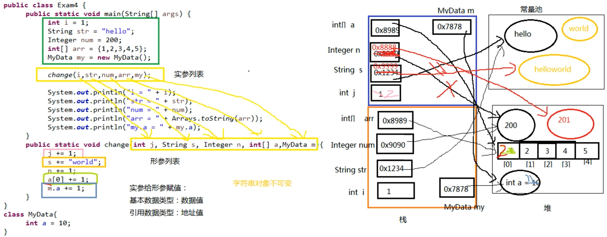

### 自增变量
#### 自增变量举例
```java
/**
 * @author andy_ruohan
 * @description 自增测试
 * @date 2023/7/25 22:55
 */
public class AutoIncrementDemo {
    public static void main (String[] args) {
        int i = 1;
        i = i++;
        int j = i++;
        int k = i + ++i * i++;
        System.out.println("i=" + i);
        System.out.println("j=" + j);
        System.out.println("k=" + k);
    }
}
```

#### 字节码文件解读
可通过如下命令查看字节码class文件
>lijunxin@lijunxins-Air firstInterview % javap -c AutoIncrementDemo.class

```java
Compiled from "AutoIncrementDemo.java"
public class basic.AutoIncrementDemo {
  public basic.AutoIncrementDemo();
    Code:
       0: aload_0
       1: invokespecial #1                  // Method java/lang/Object."<init>":()V
       4: return

  public static void main(java.lang.String[]);
    Code:
       0: iconst_1
       1: istore_1
       2: iload_1
       3: iinc          1, 1
       6: istore_1
       7: iload_1
       8: iinc          1, 1
      11: istore_2
      12: iload_1
      13: iinc          1, 1
      16: iload_1
      17: iload_1
      18: iinc          1, 1
      21: imul
      22: iadd
      23: istore_3
      24: getstatic     #2                  // Field java/lang/System.out:Ljava/io/PrintStream;
      27: new           #3                  // class java/lang/StringBuilder
      30: dup
      31: invokespecial #4                  // Method java/lang/StringBuilder."<init>":()V
      34: ldc           #5                  // String i=
      36: invokevirtual #6                  // Method java/lang/StringBuilder.append:(Ljava/lang/String;)Ljava/lang/StringBuilder;
      39: iload_1
      40: invokevirtual #7                  // Method java/lang/StringBuilder.append:(I)Ljava/lang/StringBuilder;
      43: invokevirtual #8                  // Method java/lang/StringBuilder.toString:()Ljava/lang/String;
      46: invokevirtual #9                  // Method java/io/PrintStream.println:(Ljava/lang/String;)V
      49: getstatic     #2                  // Field java/lang/System.out:Ljava/io/PrintStream;
      52: new           #3                  // class java/lang/StringBuilder
      55: dup
      56: invokespecial #4                  // Method java/lang/StringBuilder."<init>":()V
      59: ldc           #10                 // String j=
      61: invokevirtual #6                  // Method java/lang/StringBuilder.append:(Ljava/lang/String;)Ljava/lang/StringBuilder;
      64: iload_2
      65: invokevirtual #7                  // Method java/lang/StringBuilder.append:(I)Ljava/lang/StringBuilder;
      68: invokevirtual #8                  // Method java/lang/StringBuilder.toString:()Ljava/lang/String;
      71: invokevirtual #9                  // Method java/io/PrintStream.println:(Ljava/lang/String;)V
      74: getstatic     #2                  // Field java/lang/System.out:Ljava/io/PrintStream;
      77: new           #3                  // class java/lang/StringBuilder
      80: dup
      81: invokespecial #4                  // Method java/lang/StringBuilder."<init>":()V
      84: ldc           #11                 // String k=
      86: invokevirtual #6                  // Method java/lang/StringBuilder.append:(Ljava/lang/String;)Ljava/lang/StringBuilder;
      89: iload_3
      90: invokevirtual #7                  // Method java/lang/StringBuilder.append:(I)Ljava/lang/StringBuilder;
      93: invokevirtual #8                  // Method java/lang/StringBuilder.toString:()Ljava/lang/String;
      96: invokevirtual #9                  // Method java/io/PrintStream.println:(Ljava/lang/String;)V
      99: return
}
```

其中，
```
    Code:
       0: iconst_1               //int i=1;
       1: istore_1               //int i=1;
       2: iload_1                //i = i++;
       3: iinc          1, 1     //i = i++;
       6: istore_1               //i = i++;
       7: iload_1                //int j = i++;
       8: iinc          1, 1     //int j = i++;
      11: istore_2               //int j = i++;
      12: iload_1                //int k = i + ++i * i++;
      13: iinc          1, 1     //int k = i + ++i * i++;
      16: iload_1                //int k = i + ++i * i++;
      17: iload_1                //int k = i + ++i * i++;
      18: iinc          1, 1     //int k = i + ++i * i++;
      21: imul                   //int k = i + ++i * i++; 乘法操作
      22: iadd                   //int k = i + ++i * i++; 加法操作
      23: istore_3               //int k = i + ++i * i++; 
```

#### 局部变量表和操作数栈过程举例
以int j = i++;展示局部变量表和操作数栈（执行此语句前i = 1）
首先iload_1，把i的值压入操作数栈


其次iinc，i变量自增1


最后istore_2，把操作数中的值赋值给j


### 类和对象加载过程
#### 父类举例
```java
/**
 * @author andy_ruohan
 * @description 类加载顺序测试-父类
 * @date 2023/7/27 23:11
 */
public class Father {
    private int i = test();
    private static int j = method();

    static {
        System.out.println("(1)");
    }

    Father() {
        System.out.println("(2)");
    }

    {
        System.out.print("(3)");
    }

    public int test() {
        System.out.print("(4)");
        return 1;
    }

    public static int method() {
        System.out.print("(5)");
        return 1;
    }
}
```

#### 子类举例
```java
/**
 * @author andy_ruohan
 * @description 类加载顺序测试-子类
 * @date 2023/7/27 23:14
 */
public class Son extends Father {
    private int i = test();
    private static int j = method();

    static {
        System.out.print("(6)");
    }

    Son() {
        System.out.print("(7)");
    }

    {
        System.out.print("(8)");
    }

    @Override
    public int test() {
        System.out.print("(9)");
        return 1;
    }

    public static int method() {
        System.out.print("(10)");
        return 1;
    }

    public static void main(String[] args) {
        Son s1 = new Son();
        System.out.println();
        Son s2 = new Son();
    }
}
```

#### 运行结果(尚不清楚为何出现了换行)
```
(5)(1)
(10)(6)(9)(3)(2)
(9)(8)(7)
(9)(3)(2)
(9)(8)(7) 
```

#### 执行细节  
类初始化：(5)(1)(10)(6)，其中(5)(1)为父类初始化，(10)(6)为子类初始化。  
实例初始化：第一个Son对象实例化，(9)(3)(2)(9)(8)(7)。其中(9)(3)(2)为父类对象实例化，<font color = 'red'>(9)为子类重写方法</font>；(9)(8)(7)为子类对象实例化。  
实例初始化：第二个Son对象实例化，(9)(3)(2)(9)(8)(7)。其中(9)(3)(2)为父类对象实例化，<font color = 'red'>(9)为子类重写方法</font>；(9)(8)(7)为子类对象实例化。

### 知识补充  
#### 类初始化过程
- 一个类要创建实例需要先加载并初始化该类
  - main方法所在的类需要先加载和初始化
- 一个子类要初始化需要先初始化父类
- 一个类初始化就是`执行\<clinit>()`方法
  - \<clinit>()方法由静态类变量显示赋值代码和静态代码块组成
  - 类变量显示赋值代码和静态代码块代码从上到下顺序执行
  - \<clinit>()方法只执行一次
  
#### 实例初始化过程
- 实例初始化就是`执行\<init>()`方法
  - \<init>()方法可能重载有多个，有几个构造器就有几个\<init>方法
  - \<init>()方法由非静态实例变量显示赋值代码和非静态代码块、对应构造器代码组成
  - 非静态实例变量显示赋值代码和非静态代码块代码从上到下顺序执行，而对应构造器的代码最后执行
  - 每次创建实例对象，调用对应构造器，执行的就是对应的\<init>方法
  - \<init>方法的首行是super()或super(实参列表)，即对应父类的\<init>方法


#### 方法的重写
- 哪些方法不可以被重写
  - final方法
  - 静态方法
  - private等子类中不可见方法
- 对象的多态性
  - 子类如果重写了父类的方法，通过子类对象调用的一定是子类重写过的代码
  - 非静态方法默认的调用对象是this
  - this对象在构造器或者说<init>方法中就是正在创建的对象


### 方法的参数传递机制

#### 参数传递代码举例

```java
/**
 * @author andy_ruohan
 * @description 方法的参数传递机制Demo
 * @date 2023/7/30 17:07
 */
public class ParameterTransmissionDemo {
    public static void main(String[] args) {
        int i = 1;
        String str = "hello";
        Integer num = 2;
        int[] arr = {1, 2, 3, 4, 5};
        MyData my = new MyData();
        change(i, str, num, arr, my);
        System.out.println("j = " + i);
        System.out.println("str = " + str);
        System.out.println("num = " + num);
        System.out.println("arr = " + Arrays.toString(arr));
        System.out.println("my.a = " + my.a);
    }

    public static void change(int j, String s, Integer n, int[] a, MyData m) {
        j += 1;
        s +="world";
        n += 1;
        a[0] += 1;
        m.a += 1;
    }
}

class MyData {
    int a = 10;
}
```

#### 运行过程分析

1. main方法局部变量初始化（左侧绿线部分，右侧橙框部分）


2. change方法局部变量初始化（左侧黄线部分，右侧蓝框部分）


3. 执行change方法（左侧彩线部分，右侧红线部分）


4. 执行完change方法后，右侧蓝框部分全部销毁

#### 知识点
- 形参是基本数据类型
  - 传递数据值
- 实参是引用数据类型
  - 传递地址值
  - 特殊的类型：`String、包装类等对象不可变性`

### 索引
#### 是什么
MysQL官方对索引的定义为：素引(Index)是帮助MySQL高效获取数据的数据结构。

#### 优势
- 类似大学图书馆建书目素引，提高数据<font color = 'red'>检索</font>的效率，降低数据库的IO成本。
- 通过索引列对数据进行<font color = 'red'>排序</font>，降低数据排序的成本，降低了CPU的消耗。

#### 劣势
- 虽然索引大大提高了查询速度，同时却会<font color = 'red'>降低更新表的速度</font>，如对表进行INSERT、UPDATE和DELETE。因为更新表时，MysQL不仅要保存数据，还要保存一下素引文件每次更新添加了素引列的字段，都会调整因为更新所带来的键值变化后的索引信息。
- 实际上索引也是一张表，该表保存了主键与索引字段，并指向实体表的记录，所以索引列也是要<font color = 'red'>占用空间</font>的。

#### 哪些情况需要创建索引
- 主键自动建立唯一索引
- 频繁作为查询条件的宇段应该创建索引
- 查询中与其它表关联的字段，外键关系建立索引
- 单键/组合索引的选择问题，组合索引性价比更高
- 查询中排序的字段，排序字段若通过索引去访问将大大提高排序速度
- 查询中统计或者分组字段

>**排序和分组哪个更好性能？**  
分组，分组之前已经排序过。

#### 哪些情况不要创建索引
- 表记录太少
- 经常增删改的表或者字段
- Where条件里用不到的字段不创建索引
- 过滤性不好的不适合建索引

### 消息队列在项目中的使用
背景：在分布式系统中如何处理高并发的  

由于在高并发的环境下，来不及同步处理用户发送的请求，则会导致请求发生阻塞。比如说，大量的insert、update之类的请求同时到达数据库，直接导致无数的行锁表，甚至会导致请求堆积很多，从而触发too many connections错误。使用消息队列可以解决【异步通信】

