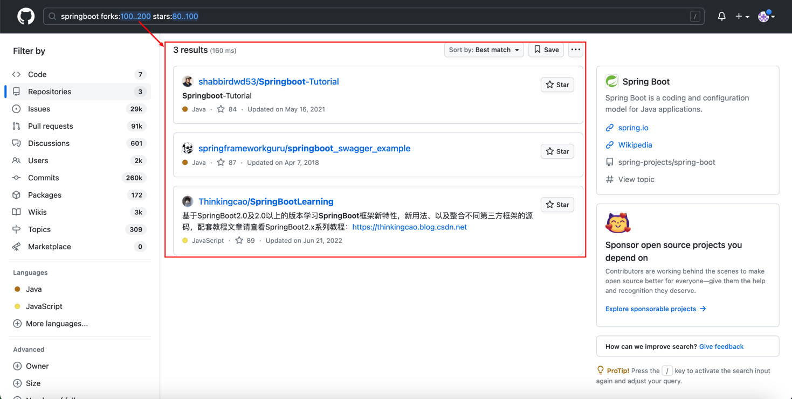
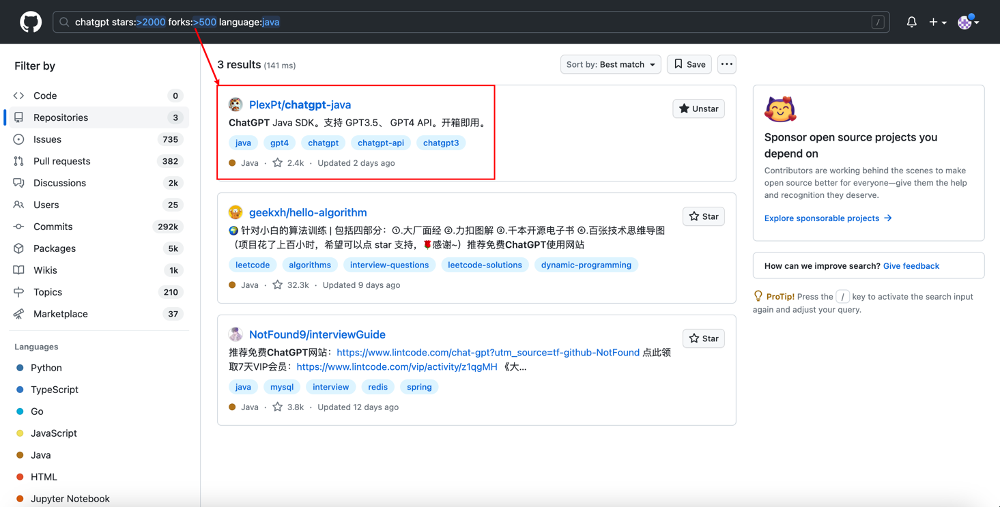
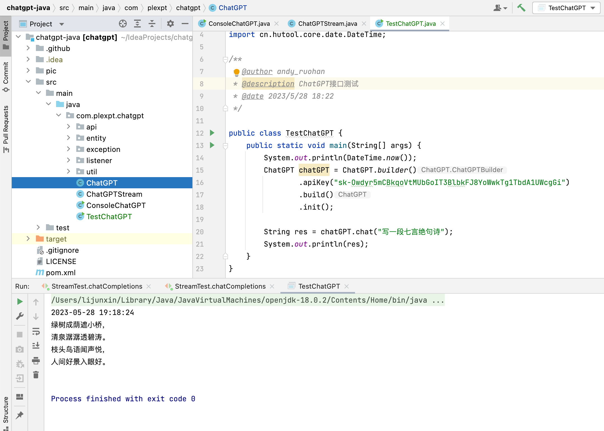
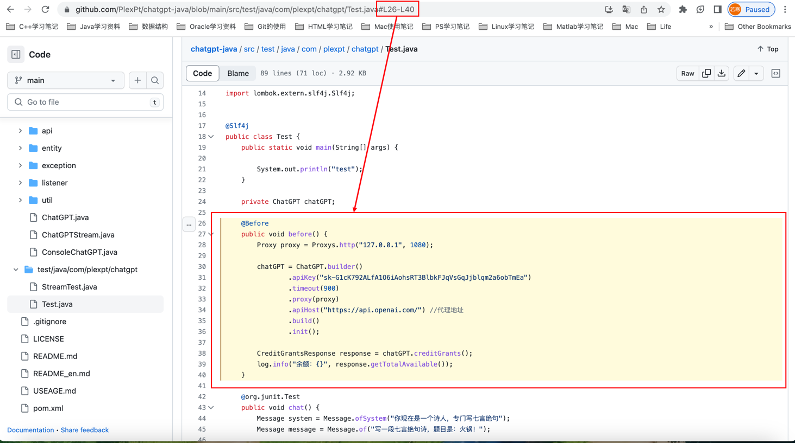
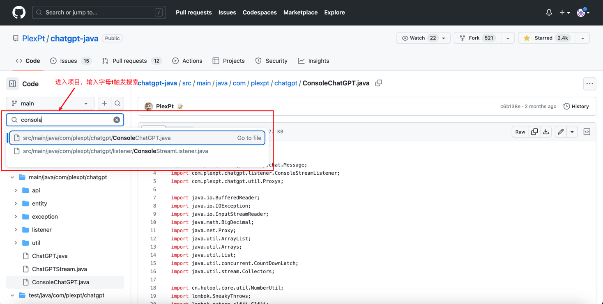
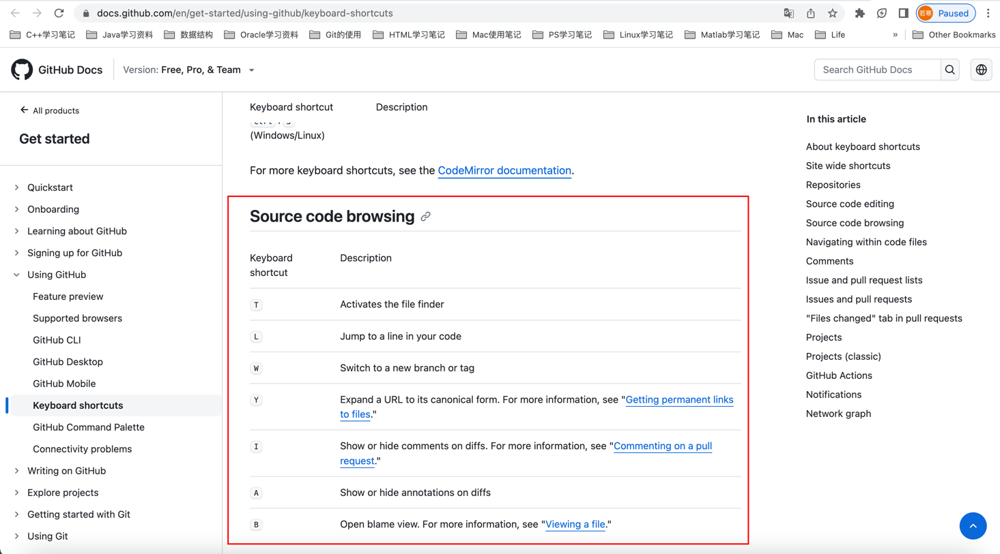

#### in 关键词限制搜索范围
```
关键词 in name 或 description 或 readme
```
xxx in:name 项目名称中包含xxx的  

xxx in:description 项目描述中包含xxx  

xxx in:readme 项目readme文件中包含xxx

组合使用：xxx in:name, description, readme


#### star 或 forks 数量区间查找
```
xxx 关键词 stars:> 或者 :>=
xxx 关键词 stars:数字1..数字2
```

springboot stars:>=5000 查找stars数大于等于5000的springboot项目

springcloud forks:>500 查找forks大于500的springcloud项目  


组合使用1：  
springboot forks:100..200 stars:80..100 查找forks在100到200并且stars在80到100的springboot项目


组合使用2：  
以 stars 和 forks 和 language 的组合搜索 chatgpt 

克隆 chatgpt 项目并运行


#### <font color = 'red'>awesome 加强搜索</font>
```
awesome 关键词
```
搜索优秀的关键词相关的项目，包括框架、教程等
```
An awesome list is a list of awesome things curated by the community. There are awesome lists about everything from CLI applications to fantasy books. The main repository serves as a curated list of awesome lists. 
```
  

使用awesome java搜索

注：若直接搜java约有2.2M的结果

#### 高亮显示某一行代码
```
Github地址后紧跟#L数字
GitHub地址后紧跟#L数字1-L数字2
```


#### 项目内搜索
``` 
t
```

相当于Linux的vi快捷键，GitHub快捷键总揽：
https://help.github.com/en/articles/using-keyboard-shortcuts 


#### 搜索某个地区的大佬
``` 
location:xxx language:xxx
```
location:chengdu language:java 搜索成都地区的java活跃用户
