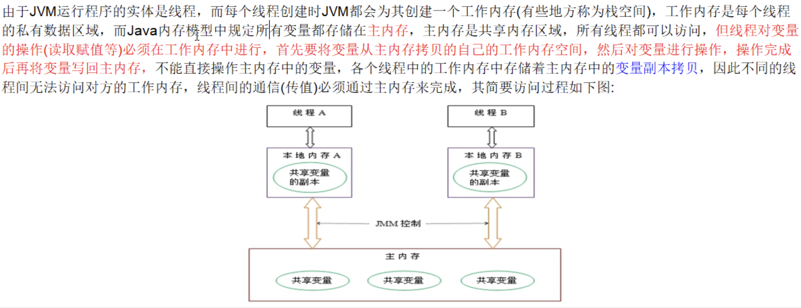
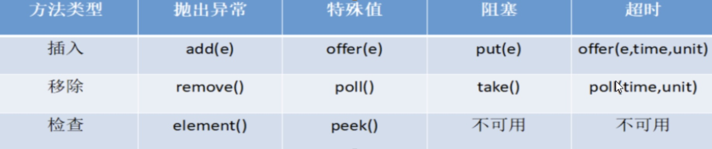
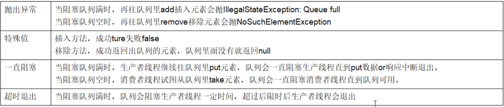
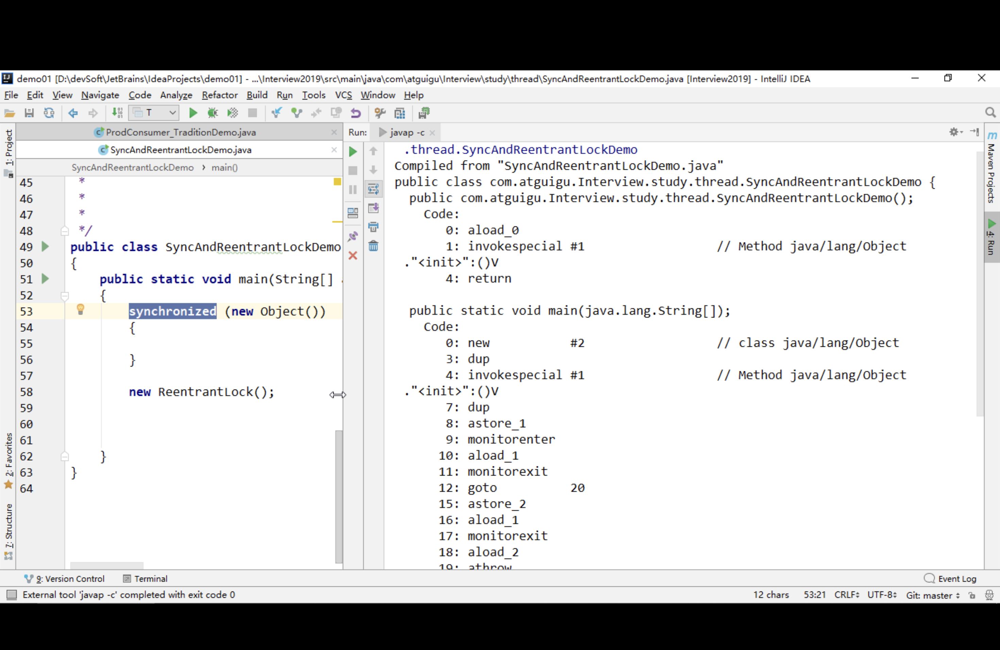

面试高频考点：
1) JVM/GC
2) JUC(java.util.concurrent)
3) Collection

volatitle是Java虚拟机提供的轻量级的同步机制
1) 保证可见性
    >可见性：一个线程修改了主内容的值，其它线程马上获得相应通知。
2) 禁止指令重排
3) <font color = 'red'>不保证原子性</font>

ß


volatile不保证原子性问题解决：
1. synchronized（杀鸡用牛刀，不推荐）
2. AtomicInteger等（推荐）


####synchronized线程不安全举例（配合volatile解决）
```java {.line-numbers}
public class SingleInstance{

    // 使用 volatile 禁止 new 对象时进行指令重排
    // new 对象，有三条指令完成
    // 1 JVM为对象分配一块内存M在堆区
    // 2 在内存M上为对象进行初始化
    // 3 将内存M的地址复制给instance变量
    private volatile static SingleInstance instance;

    private SingleInstance(){
        if(instance != null){
            throw new RuntimeException("single instance existed");
        }
    }

    public SingaleInstance getInstance(){
        // 减少锁竞争，避免过多的线程进入同步队列，进入 blocking 状态
        if(instance == null){
            // 此处 synchronized 可以保证原子性和可见性
            // 而有序性，指的是保证线程串行进入 synchronized代码块内
            // 所以，此有序性无法保证 synchronized 代码块内部的有序性
            synchronized(SingleInstance.class){
                // 避免重复创建对象
                if(instance == null){
                    instance = new SingleInstance();
                }
            }
        }
        return instance;
    }    
}
```
>new对象的三个步骤(简化）: 
① JVM为对象分配一块内存M。
② 在内存M上为对象进行初始化。
③ 将内存M的地址复制给singleton变量。


假设有两个线程ThreadA 和ThreadB同时来请求SingleInstance.getInstance方法，正常情况按照 ①②③ 的顺序来执行。但由于多线程<font color='red'>指令重排</font>的存在，对象初始化的时候可能按照 ①③② 的顺序，即：**ThreadB是可以拿到一个引用已经有了但是内存资源还没有分配的对象**。此时在变量 instance 前加入 volatitle 禁止指令重排，便可以解决。

```java
/**
 * Description: ABA问题的产生
 **/
public class ABADemo {
    private static AtomicReference<Integer> atomicReference = new AtomicReference<>(100);
    private static AtomicStampedReference<Integer> stampedReference = new AtomicStampedReference<>(100, 1);

    public static void main(String[] args) {
        System.out.println("以下是ABA问题的产生");

        new Thread(() -> {
            atomicReference.compareAndSet(100, 101);
            atomicReference.compareAndSet(101, 100);
        }, "t1").start();

        new Thread(() -> {
            //先暂停1秒 保证完成ABA
            try {
                TimeUnit.SECONDS.sleep(1);
            } catch (InterruptedException e) {
                e.printStackTrace();
            }
            System.out.println(atomicReference.compareAndSet(100, 2019) + "\t" + atomicReference.get());
        }, "t2").start();
        try {
            TimeUnit.SECONDS.sleep(2);
        } catch (InterruptedException e) {
            e.printStackTrace();
        }
    }
}
```
>以下是ABA问题的产生
true	2019

```java
public class ABADemo {
    private static AtomicReference<Integer> atomicReference = new AtomicReference<>(100);
    private static AtomicStampedReference<Integer> stampedReference = new AtomicStampedReference<>(100, 1);

    public static void main(String[] args) {
        System.out.println("以下是ABA问题的解决");

        new Thread(() -> {
            int stamp = stampedReference.getStamp();
            System.out.println(Thread.currentThread().getName() + "\t 第1次版本号" + stamp + "\t值是" + stampedReference.getReference());
            //暂停1秒钟t3线程
            try {
                TimeUnit.SECONDS.sleep(1);
            } catch (InterruptedException e) {
                e.printStackTrace();
            }

            stampedReference.compareAndSet(100, 101, stampedReference.getStamp(), stampedReference.getStamp() + 1);
            System.out.println(Thread.currentThread().getName() + "\t 第2次版本号" + stampedReference.getStamp() + "\t值是" + stampedReference.getReference());
            stampedReference.compareAndSet(101, 100, stampedReference.getStamp(), stampedReference.getStamp() + 1);
            System.out.println(Thread.currentThread().getName() + "\t 第3次版本号" + stampedReference.getStamp() + "\t值是" + stampedReference.getReference());
        }, "t3").start();

        new Thread(() -> {
            int stamp = stampedReference.getStamp();
            System.out.println(Thread.currentThread().getName() + "\t 第1次版本号" + stamp + "\t值是" + stampedReference.getReference());
            //保证线程3完成1次ABA
            try {
                TimeUnit.SECONDS.sleep(3);
            } catch (InterruptedException e) {
                e.printStackTrace();
            }
            boolean result = stampedReference.compareAndSet(100, 2019, stamp, stamp + 1);
            System.out.println(Thread.currentThread().getName() + "\t 修改成功否" + result + "\t最新版本号" + stampedReference.getStamp());
            System.out.println("最新的值\t" + stampedReference.getReference());
        }, "t4").start();
    }
}
```
>以下是ABA问题的解决
t3	 第1次版本号1	值是100
t4	 第1次版本号1	值是100
t3	 第2次版本号2	值是101
t3	 第3次版本号3	值是100
t4	 修改成功否false	最新版本号3
最新的值	100

##集合类不安全之并发修改异常
###ArrayList
```java
public class UnsafeDemo {
    public static void main(String[] args) {
        List<String> list = new ArrayList<>();
        for (int i = 1; i <= 30; i++) {
            new Thread(() -> {
                list.add(UUID.randomUUID().toString().substring(0, 8));
                System.out.println(list);
            }, String.valueOf(i)).start();
        }
    }
}
```
多线程环境下运行上例，会报如下错误：
```
Exception in thread "20" Exception in thread "15" java.util.ConcurrentModificationException
	at java.base/java.util.ArrayList$Itr.checkForComodification(ArrayList.java:1013)
	at java.base/java.util.ArrayList$Itr.next(ArrayList.java:967)
	at java.base/java.util.AbstractCollection.toString(AbstractCollection.java:456)
	at java.base/java.lang.String.valueOf(String.java:4213)
	at java.base/java.io.PrintStream.println(PrintStream.java:1060)
	at jvm.arrayList.unsafeCase.UnsafeDemo.lambda$main$0(UnsafeDemo.java:16)
	at java.base/java.lang.Thread.run(Thread.java:833)
Exception in thread "11" java.util.ConcurrentModificationException
	at java.base/java.util.ArrayList$Itr.checkForComodification(ArrayList.java:1013)
	at java.base/java.util.ArrayList$Itr.next(ArrayList.java:967)
	at java.base/java.util.AbstractCollection.toString(AbstractCollection.java:456)
	at java.base/java.lang.String.valueOf(String.java:4213)
	at java.base/java.io.PrintStream.println(PrintStream.java:1060)
	at jvm.arrayList.unsafeCase.UnsafeDemo.lambda$main$0(UnsafeDemo.java:16)
	at java.base/java.lang.Thread.run(Thread.java:833)
java.util.ConcurrentModificationException
	at java.base/java.util.ArrayList$Itr.checkForComodification(ArrayList.java:1013)
	at java.base/java.util.ArrayList$Itr.next(ArrayList.java:967)
	at java.base/java.util.AbstractCollection.toString(AbstractCollection.java:456)
	at java.base/java.lang.String.valueOf(String.java:4213)
	at java.base/java.io.PrintStream.println(PrintStream.java:1060)
	at jvm.arrayList.unsafeCase.UnsafeDemo.lambda$main$0(UnsafeDemo.java:16)
	at java.base/java.lang.Thread.run(Thread.java:833)
```

####解决方法一：Vector
```java
public class SafeDemoByVector {
    public static void main(String[] args) {
        List<String> list = new Vector<>();
        for (int i = 1; i <= 30; i++) {
            new Thread(() -> {
                list.add(UUID.randomUUID().toString().substring(0, 8));
                System.out.println(list);
            }, String.valueOf(i)).start();
        }
    }
}
```

>Vector JDK 1.0：加锁，并发行急剧下降
Array JDK 1.2：以牺牲多线程安全性为代价，提升并发性能
所以，不建议使用Vector，相当于在开倒车

####解决方法二：Collections.synchronizedList
```java
public class SafeDemoBySynchronizedList {
    public static void main(String[] args) {
        List<String> list = Collections.synchronizedList(new ArrayList<>());
        for (int i = 1; i <= 30; i++) {
            new Thread(() -> {
                list.add(UUID.randomUUID().toString().substring(0, 8));
                System.out.println(list);
            }, String.valueOf(i)).start();
        }
    }
}
```

####解决方法三：CopyOnWriteArrayList
```java
public class SafeDemoByCopyOnWriteArrayList {
    public static void main(String[] args) {
        List<String> list = new CopyOnWriteArrayList<>();
        for (int i = 1; i <= 30; i++) {
            new Thread(() -> {
                list.add(UUID.randomUUID().toString().substring(0, 8));
                System.out.println(list);
            }, String.valueOf(i)).start();
        }
    }
}
```

copyOnWrite容器，即写时复制的容器。其底层 add 方法源码如下：
```java
public boolean add(E e) {
    final ReentrantLock lock = this.lock;
    lock.lock();
    try {
    Object[] elements = getArray();
        int len = elements.length;
        Object[] newElements = Arrays.copyOf(elements, len + 1);
        newElements[len] = e;
        setArray(newElements);
        return true;
    } finally {
        lock.unlock();
    }
}
```
>1. 往容器添加元素的时候，不直接往当前容器 object[] 添加，而是先将当前容器 object[] 进行 copy 复制出一个新的 object[] newElements ，然后向新容器 object[] newElements 里面添加元素。
>2. 添加元素后，再将原容器的引用指向新的容器 setArray(newElements) 。这样的好处是可以对 copyOnWrite 容器进行并发的读，而不需要加锁（因为当前容器不会添加任何元素）。所以 copyOnwrite 容器也是一种**读写分离**的思想，读和写不同的容器.

###HashSet 和 HashMap
类似地 HashSet 和 HashMap 也会遇到相应并发问题，其中：
1. HashSet 可通过 Collections.synchronizedSet 和 CopyOnWriteArraySet 来解决
2. HashMap 可通过 Collections.synchronizedMap 和 ConcurrentHashMap 来解决

####公平锁和非公平锁
公平锁：是指多个线程按照申请锁的顺序来获取锁类似排队打饭，先来后到。
非公平锁：是指在多线程获取锁的顺序并不是按照申请锁的顺序，有可能后申请的线程比先申请的线程优先获取到锁。在高并发的情况下，有可能造成优先级反转或者饥饿现象。
>- ReentrantLock( )不带参数时等同于ReentrantLock(false)，默认是非公平锁。
>- synchronized也是一种非公平锁。

####可重入锁（也叫做递归锁）
可重入锁：指的是同一线程外层函数获得锁之后，内层递归函数仍然能获取该锁的代码，在同一个线程在外层方法获取锁的时候，在进入内层方法会自动获取锁。
>ReentrantLock和synchronized就是典型的可重入锁。

```java {.line-numbers}
class Phone implements Runnable {
    private Lock lock = new ReentrantLock();

    @Override
    public void run() {
        get();
    }

    private void get() {
        lock.lock();
        try {
            System.out.println(Thread.currentThread().getName() + "\tget");
            set();
        } finally {
            lock.unlock();
        }
    }

    private void set() {
        lock.lock();
        try {
            System.out.println(Thread.currentThread().getName() + "\tset");
        } finally {
            lock.unlock();
        }
    }
}

/**
 * Description:可重入锁(也叫做递归锁)
 * 指的是同一先生外层函数获得锁后,内层敌对函数任然能获取该锁的代码
 * 在同一线程外外层方法获取锁的时候,在进入内层方法会自动获取锁
 *
 * 也就是说,线程可以进入任何一个它已经标记的锁所同步的代码块
 **/
public class ReentrantLockDemo {
    public static void main(String[] args) {
        Phone phone = new Phone();
        Thread t1 = new Thread(phone);
        Thread t2 = new Thread(phone);
        t1.start();
        t2.start();
    }
}
```

运行结果：
>Thread-0	get
Thread-0	set
Thread-1	get
Thread-1	set

值得一提的是，如果在10行后再加一个lock.lock()，即
```java{.line-number}
    private void get() {
        lock.lock();
        lock.lock();
        try {
            System.out.println(Thread.currentThread().getName() + "\tget");
            set();
        } finally {
            lock.unlock();
        }
    }
```
运行结果，会变为：(第2个线程无法获取到锁)
>Thread-0	get
Thread-0	set

####自旋锁
自旋锁（spinlock）：是指尝试获取锁的线程不会立即阻塞，而是`采用循环的方式去尝试获取锁`，这样的好处是减少线程上下文切换的消耗，缺点是循环会消耗CPU。

```java
public class SpinLockDemo {
    AtomicReference<Thread> atomicReference = new AtomicReference<>();

    public void myLock() {
        Thread thread = Thread.currentThread();
        System.out.println(Thread.currentThread().getName() + " It come in 0(n_n)o");
        while (!atomicReference.compareAndSet(null, thread)) {
        }
    }

    public void myUnlock() {
        Thread thread = Thread.currentThread();
        atomicReference.compareAndSet(thread, null);
        System.out.println(Thread.currentThread().getName() + " It invoked myUnLock()");
    }

    public static void main(String[] args) {
        SpinLockDemo spinLockDemo = new SpinLockDemo();
        new Thread(() -> {
            spinLockDemo.myLock();
            try {
                TimeUnit.SECONDS.sleep(5);
            } catch (InterruptedException e) {
                e.printStackTrace();
            }
            spinLockDemo.myUnlock();
        }, "AA").start();

        try {
            TimeUnit.SECONDS.sleep(1);
        } catch (InterruptedException e) {
            e.printStackTrace();
        }

        new Thread(() -> {
            spinLockDemo.myLock();
            try {
                TimeUnit.SECONDS.sleep(1);
            } catch (InterruptedException e) {
                e.printStackTrace();
            }
            spinLockDemo.myUnlock();
        }, "BB").start();
    }
}
```

####独占锁和共享锁
独占锁：指该锁一次只能被一个线程所持有。对ReentrantLock和synchronized而言都是独占锁。
共享锁：指该锁可以被多个线程所持有。对ReentrantReadWriteLock其写锁是独占锁。读锁的共享锁保证并发读是高效的，读写、写读、写写的过程是互斥的。

```java
/**
 * 资源类
 */
class MyCaChe {
    /**
     * 保证可见性
     */
    private volatile Map<String, Object> map = new HashMap<>();
    private ReentrantReadWriteLock reentrantReadWriteLock = new ReentrantReadWriteLock();

    /**
     * 写
     *
     * @param key
     * @param value
     */
    public void put(String key, Object value) {
        reentrantReadWriteLock.writeLock().lock();
        try {
            System.out.println(Thread.currentThread().getName() + "\t正在写入" + key);
            //模拟网络延时
            try {
                TimeUnit.MICROSECONDS.sleep(300);
            } catch (InterruptedException e) {
                e.printStackTrace();
            }
            map.put(key, value);
            System.out.println(Thread.currentThread().getName() + "\t正在完成");
        } finally {
            reentrantReadWriteLock.writeLock().unlock();
        }
    }

    /**
     * 读
     *
     * @param key
     */
    public void get(String key) {
        reentrantReadWriteLock.readLock().lock();
        try {
            System.out.println(Thread.currentThread().getName() + "\t正在读取");
            //模拟网络延时
            try {
                TimeUnit.MICROSECONDS.sleep(300);
            } catch (InterruptedException e) {
                e.printStackTrace();
            }
            Object result = map.get(key);
            System.out.println(Thread.currentThread().getName() + "\t正在完成" + result);
        } finally {
            reentrantReadWriteLock.readLock().unlock();
        }
    }

    public void clearCaChe() {
        map.clear();
    }
}

/**
 * Description:
 * 多个线程同时操作 一个资源类没有任何问题 所以为了满足并发量
 * 读取共享资源应该可以同时进行
 * 但是
 * 如果有一个线程想去写共享资源来  就不应该有其他线程可以对资源进行读或写
 * 
 * 小总结:
 * 读 读能共存
 * 读 写不能共存
 * 写 写不能共存
 * 写操作 原子+独占 整个过程必须是一个完成的统一整体 中间不允许被分割 被打断
 **/
public class ReadWriteLockDemo {
    public static void main(String[] args) {
        MyCaChe myCaChe = new MyCaChe();
        for (int i = 1; i <= 5; i++) {
            final int temp = i;
            new Thread(() -> {
                myCaChe.put(temp + "", temp);
            }, String.valueOf(i)).start();
        }
        for (int i = 1; i <= 5; i++) {
            int finalI = i;
            new Thread(() -> {
                myCaChe.get(finalI + "");
            }, String.valueOf(i)).start();
        }
    }
}
```

####CountDownLatch
CountDownLatch主要有两个方法：
1. 当一个或多个线程调用`await`方法时，调用线程会被阻塞。
2. 其他线程调用`countDown`方法计数器减1(调用countDown方法时线程不会阻塞)，当计数器的值变为0，因调用await方法被阻塞的线程会被唤醒，继续执行。

######经典案例：下晚自习班长锁门、秦灭六国一统天下
```java{.line-numbers}
/**
 * 模拟下晚自习，班长最后一个走锁门离开教室
 */
public class CountDownLatchDemo {
    public static void main(String[] args) throws Exception {
        closeDoor();
    }

    private static void closeDoor() throws InterruptedException {
        CountDownLatch countDownLatch = new CountDownLatch(6);
        for (int i = 1; i <= 6; i++) {
            new Thread(() -> {
                System.out.println(Thread.currentThread().getName() + "\t" + "上完自习");
                countDownLatch.countDown();
            }, String.valueOf(i)).start();
        }
        countDownLatch.await();
        System.out.println(Thread.currentThread().getName() + "\t班长锁门离开教室");
    }
}
```

####CyclicBarrier
CyclicBarrier的字面意思是可循环(Cyclic)​。使用的屏障(barrier)它要做的事情是：让一组线程到达一个屏障(也可以叫做同步点)时被阻塞，知道最后一个线程到达屏障时，屏障才会开门，所有被屏障拦截的线程才会继续干活,线程进入屏障通过CyclicBarrier的await()方法。
######经典案例：集七龙珠、人齐了开会
```java{.line-numbers}
/**
 * 模拟集齐七颗龙珠，召唤神龙
 */
public class CyclicBarrierDemo {
    public static void main(String[] args) {
        CyclicBarrier cyclicBarrier=new CyclicBarrier(7,()->{
            System.out.println("召唤神龙");
        });

        for (int i = 1; i <=7; i++) {
            final int temp = i;
            new Thread(()->{
                System.out.println(Thread.currentThread().getName()+"\t 收集到第"+ temp +"颗龙珠");
                try {
                    cyclicBarrier.await();
                } catch (InterruptedException e) {
                    e.printStackTrace();
                } catch (BrokenBarrierException e) {
                    e.printStackTrace();
                }
            },String.valueOf(i)).start();
        }
    }
}
```

####Semaphore
信号量的主要用户两个目的，一个是用于多个共享资源的相互排斥使用，另一个用于并发资源数的控制。
######经典案例：抢车位。
```java{.line-numbers}
public class SemaphoreDemo {
    public static void main(String[] args) {
        //模拟3个停车位
        Semaphore semaphore = new Semaphore(3);
        //模拟6部汽车
        for (int i = 1; i <= 6; i++) {
            new Thread(() -> {
                try {
                    //抢到资源
                    semaphore.acquire();
                    System.out.println(Thread.currentThread().getName() + "\t抢到车位");
                    try {
                        TimeUnit.SECONDS.sleep(3);
                    } catch (InterruptedException e) {
                        e.printStackTrace();
                    }
                    System.out.println(Thread.currentThread().getName() + "\t 停3秒离开车位");
                } catch (InterruptedException e) {
                    e.printStackTrace();
                } finally {
                    //释放资源
                    semaphore.release();
                }
            }, String.valueOf(i)).start();
        }
    }
}

```

###BlockingQueue方法



#####抛出异常场景
```java
/**
 * @description 阻塞队列样例1：测试add、element、remove方法
 * @author andy_ruohan
 * @date 2023/3/14 23:25
 */
public class BlockingQueueDemo1 {
    public static void main(String[] args) throws Exception {
        BlockingQueue<String> blockingQueue = new ArrayBlockingQueue<>(3);
        System.out.println(blockingQueue.add("a"));
        System.out.println(blockingQueue.add("b"));
        System.out.println(blockingQueue.add("c"));

        System.out.println(blockingQueue.element());

        System.out.println(blockingQueue.remove());
        System.out.println(blockingQueue.remove());
        System.out.println(blockingQueue.remove());
        System.out.println(blockingQueue.remove()); // 该行会抛异常
    }
}
```
运行结果：
>true
true
true
a
a
b
c
Exception in thread "main" java.util.NoSuchElementException
	at java.base/java.util.AbstractQueue.remove(AbstractQueue.java:117)
	at jvm.blockingQueue.BlockingQueueDemo1.main(BlockingQueueDemo1.java:23)  

#####返回特殊值场景
```java
/**
 * @description 阻塞队列样例2：测试offer、peek、poll方法
 * @author andy_ruohan
 * @date 2023/3/14 23:25
 */
public class BlockingQueueDemo2 {
    public static void main(String[] args) throws Exception {
        BlockingQueue<String> blockingQueue = new ArrayBlockingQueue<>(3);
        System.out.println(blockingQueue.offer("a"));
        System.out.println(blockingQueue.offer("b"));
        System.out.println(blockingQueue.offer("c"));
        System.out.println(blockingQueue.offer("d")); // 该行会返回false

        System.out.println(blockingQueue.peek());

        System.out.println(blockingQueue.poll());
        System.out.println(blockingQueue.poll());
        System.out.println(blockingQueue.poll());
        System.out.println(blockingQueue.poll()); // 该行会返回null
    }
}
```
运行结果：
>true
true
true
false
a
a
b
c
null  
   
#####阻塞场景
```java
/**
 * @description 阻塞队列样例3：测试put、take方法
 * @author andy_ruohan
 * @date 2023/3/14 23:25
 */
public class BlockingQueueDemo3 {
    public static void main(String[] args) throws Exception {
        BlockingQueue<String> blockingQueue = new ArrayBlockingQueue<>(3);
        blockingQueue.put("a");
        blockingQueue.put("a");
        blockingQueue.put("a");
//        blockingQueue.put("a"); // 如加入该行，会阻塞

        System.out.println("=========================");

        blockingQueue.take();
        blockingQueue.take();
        blockingQueue.take();
        blockingQueue.take(); // 如加入该行，会阻塞
    }
}
```
运行结果：
>=========================
>（程序会一直挂起，不会终止）

#####
```java
/**
 * @description 阻塞队列样例4：测试offer、poll超时方法
 * @author andy_ruohan
 * @date 2023/3/14 23:41
 */
public class BlockingQueueDemo4 {
    public static void main(String[] args) throws Exception {
        BlockingQueue<String> blockingQueue = new ArrayBlockingQueue<>(3);
        System.out.println(blockingQueue.offer("a",     2L, TimeUnit.SECONDS));
        System.out.println(blockingQueue.offer("a",     2L, TimeUnit.SECONDS));
        System.out.println(blockingQueue.offer("a",     2L, TimeUnit.SECONDS));
        System.out.println(blockingQueue.offer("a",     2L, TimeUnit.SECONDS)); // 超时会返回false

        System.out.println(blockingQueue.poll(2L, TimeUnit.SECONDS));
        System.out.println(blockingQueue.poll(2L, TimeUnit.SECONDS));
        System.out.println(blockingQueue.poll(2L, TimeUnit.SECONDS));
        System.out.println(blockingQueue.poll(2L, TimeUnit.SECONDS)); // 超时会返回null
    }
}
```
运行结果：
>true
true
true
false（隔两秒后输出）
a
a
a
null（再隔两秒输出）

题目：synchronized和Lock有什么区别？用新的Lock有什么好处？举例说说。
1. 原始构成
   - synchronized是关健字属于JVM层面，monitorenter、monitorexit(底层是通过monitor对象来完成，其实wait/notify 等方法也依额于monitor对象，只有在同步块或方法中才能调wait/notify等方法。
   
   - Lock是具体类(java.util.concurrent.Locks.Lock)是api层面的锁。
2. 使用方法
   - synchronized不需要用户去手动释放锁，当synchronized代码执行完后，系统会自动让线程释成对锁的占用。
   - ReentrantLock则需要用户去手动释放锁，若没有主动释放锁，就有可能导致出现死锁现象，需要Lock()和unlock()方法配合try/finally语句块来完成。
3. 等待是否可中断
   - synchronized不可中断，除非抛出异常或者正常运行完成。
   - ReentrantLock可中断，
        >(i) 设置超时方法tryLock(Long timeout, Timeunit unit)
        >(ii) LockInterruptibly()放代码块中，调用interrupt()方法可中断
4. 加锁是否公平
   - synchronized非公平锁。
   - ReentrantLock两者都可以，默认非公平锁，构造方法可以传入boolean值，true为公平锁，false为非公平锁。
5. 锁绑定多个条件Condition
   - synchronized没有。
   - Reentrantlock用来实现分组唤醒需要唤醒的线程们，可以精确唤醒，而不是像synchronized要么随机唤醒一个线程要么唤醒全部线程。

#####已经有了Runnable方式调用线程，为什么还要使用Callable方式调用线程？
1. Thread构造方法参数虽然都是Runnable接口形式：

但FutureTask类构造方法以Callable接口作为参数，并实现了Runnable接口，可以透传到Thread类作为参数。

   >类似于适配器模式，比如Callable和Runnable两个人相互不认识，而FutureTask两个人都认知，将他们约在一起见面  

2. 使用Callable方式调用线程，可以带有返回值。(适用于并发+异步，获取结果的场景)
```java
/**
 * @author andy_ruohan
 * @description 通过实现Callable接口方式，来使用线程
 * @date 2023/3/19 18:26
 */
class MyThread implements Callable<Integer> {
    @Override
    public Integer call() throws Exception {
        System.out.println("***********come in Callable");
        return 1024;
    }
}

/**
 * @author andy_ruohan
 * @description 启用两个线程：主线程 + AA线程，计算结果
 * @date 2023/3/19 18:25
 */
public class CallableDemo1 {
    public static void main(String[] args) throws InterruptedException, ExecutionException {
        FutureTask<Integer> futureTask = new FutureTask<Integer>(new MyThread());
        Thread t1 = new Thread(futureTask, "AA");
        t1.start();

        int result1 = 100;
        int result2 = futureTask.get();
        System.out.println("***********result: " + (result1 + result2));
    }
}
```
多个线程共同计算结果：
>***********come in Callable
***********result: 1124

#####两个线程同时调用一个futureTask
```java
/**
 * @author andy_ruohan
 * @description 测试两个线程调用同一个futureTask
 * @date 2023/3/19 18:10
 */
public class CallableDemo2 {
    public static void main(String[] args) throws InterruptedException, ExecutionException {
        //FutureTask(Callable‹v> callable)
        FutureTask<Integer> futureTask = new FutureTask<Integer>(new MyThread());
        Thread t1 = new Thread(futureTask, "AA");
        Thread t2 = new Thread(futureTask, "BB");
        t1.start();
        t2.start();

        System.out.println("***********result: " + futureTask.get());
    }
}
```
当有两个线程调用同一个futureTask，实际futureTask只会进入一次：
>***********come in Callable
***********result: 1024  

#####提前获取futureTask结果，会造成线程阻塞
```java
/**
 * @author andy_ruohan
 * @description 通过实现Callable接口方式，来使用线程（带有sleep）
 * @date 2023/3/19 18:41
 */
public class MyThreadWithSleep implements Callable<Integer> {
    @Override
    public Integer call() throws Exception {
        System.out.println("***********come in Callable");
        Thread.sleep(5000);
        return 1024;
    }
}

/**
 * @author andy_ruohan
 * @description 提前获取futureTask结果
 * @date 2023/3/19 18:40
 */
public class CallableDemo3 {
    public static void main(String[] args) throws InterruptedException, ExecutionException {
        FutureTask<Integer> futureTask = new FutureTask<>(new MyThreadWithSleep());
        Thread t1 = new Thread(futureTask, "AA");
        t1.start();
        int result2 = futureTask.get();

        System.out.println("===========");

        int result1 = 100;
        System.out.println("***********result: " + (result1 + result2));
    }
}
```
>***********come in Callable
======(会带有5秒的延迟)
***********result: 1124

###线程池
#####newFixedThreadPool: 一池固定数线程源码
```java
    public static ExecutorService newFixedThreadPool(int nThreads) {
        return new ThreadPoolExecutor(nThreads, nThreads,
                                      0L, TimeUnit.MILLISECONDS,
                                      new LinkedBlockingQueue<Runnable>());
    }
```

#####newSingleThreadExecutor: 一池1个线程源码
```java
    public static ExecutorService newSingleThreadExecutor() {
        return new FinalizableDelegatedExecutorService
            (new ThreadPoolExecutor(1, 1,
                                    0L, TimeUnit.MILLISECONDS,
                                    new LinkedBlockingQueue<Runnable>()));
    }
```

#####newCachedThreadPool: 一池n个线程源码
```java
    public static ExecutorService newCachedThreadPool() {
        return new ThreadPoolExecutor(0, Integer.MAX_VALUE,
                                      60L, TimeUnit.SECONDS,
                                      new SynchronousQueue<Runnable>());
    }
```

#####综合样例：模拟银行窗口服务场景
```java
/**
 * @author andy_ruohan
 * @description 模拟银行窗口服务场景：2个常规窗口，等候区3个座位，3个加班窗口
 * @date 2023/3/22 21:50
 */
public class ThreadPoolDemo {
    public static void main(String[] args) {
        ExecutorService threadPool = new ThreadPoolExecutor(
                2, 5, 100L, TimeUnit.SECONDS,
                // 等候区
                new LinkedBlockingQueue<>(3),
                Executors.defaultThreadFactory(),
                new ThreadPoolExecutor.AbortPolicy());
        try {
            // 模找8个顾客来办理业务，受理窗口max只有5个
            for (int i = 1; i <= 8; i++) {
                final int tmpI = i;
                threadPool.execute(() -> {
                    System.out.println(Thread.currentThread().getName() + "号窗口，“＋“服务顾客" + tmpI);
                    try {
                        TimeUnit.SECONDS.sleep(4);
                    } catch (InterruptedException e) {
                        e.printStackTrace();
                    }
                });
            }
        } catch (Exception e) {
            e.printStackTrace();
        } finally {
            threadPool.shutdown();
        }
    }
}
```
运行过程：
1. 常规窗口2个，前两个客户来了以后正常进入窗口；
   >(int corePoolSize: 常规窗口数)
2. 若前两个窗口已满，后续来的客户会进入等候区；
   >(BlockingQueue<Runnable> workQueue: 等候区)
3. 若等候区已满，后续来的客户会直接进入加班窗口、而不是等候区；
   >(int maximumPoolSize: 常规窗口 + 加班窗口)
4. 若再有客户来，银行网点承载能力已满，执行拒绝策略
   >(RejectedExecutionHandler handler: 拒绝策略)
5. 若客户慢慢减少，加班窗口会进入等待，等待一段时间后仍无客户，加班窗口会取消
   >(long keepAliveTime: 等待时间， TimeUnit unit: 计时单位) 

    此外，`ThreadFactory threadFactory`相当于网点的窗口、取款机等标准配置。  

    ---
    上述的几个变量亦即线程池的七大参数：
    ```java
    public ThreadPoolExecutor(int corePoolSize,
                              int maximumPoolSize,
                              long keepAliveTime,
                              TimeUnit unit,
                              BlockingQueue<Runnable> workQueue,
                              ThreadFactory threadFactory,
                              RejectedExecutionHandler handler)
    ```

#####JDK内置的拒绝策略
1. AbortPolicy(默认)：直接抛出RejectedException异常阻止系统正常运行。
2. CallerRunPolicy："调用者运行"一种调节机制，该策略既不会抛弃任务，也不会抛出异常，而是将某些任务回退给调用者，从而降低新任务的流量。
3. DiscardOldestPolicy：抛弃队列中等待最久的任务，然后把当前任务加入队列中尝试再次提交。
4. DiscardPolicy：接丢弃任务，不予任何处理也不抛出异常。如果允许任务丢失，这是最好的拒绝策略。
 
#####<font color = 'red'>【超级大坑】你在工作中单一的/固定数的/可变你的三种创建线程池的方法，你用哪个多?</font>
答案是：一个都不用，我们生产上只能使用自定义的。参考阿里巴巴《阿里巴巴java开发手册》
>【强制】线程池不允许使用Executors去创建，而是通过ThreadPoolExecutor的方式，这样的处理方式让写的同学更加明确线程池的运行规则，规避资源耗尽的风险。说明：Executors返回的线程池对象的弊端如下：
1）<font color = 'red'>FixedThreadPool</font>和<font color = 'red'>SingleThreadPool</font>:允许的请求队列长度为Integer.MAX_VALUE，可能会堆积大量的请求，从而导致OOM。 

即源码中的new LinkedBlockingQueue<Runnable>( )：
```java
    public static ExecutorService newFixedThreadPool(int nThreads) {
        return new ThreadPoolExecutor(nThreads, nThreads,
                                      0L, TimeUnit.MILLISECONDS,
                                      new LinkedBlockingQueue<Runnable>());
    }
```

>2）<font color = 'red'>CachedThreadPool</font>和<font color = 'red'>ScheduledThreadPool</font>:允许的创建线程数量为Integer.MAX_VALUE，可能会创建大量的线程，从而导致OOM。  

即源码中的Integer.MAX_VALUE：
```java
    public static ExecutorService newCachedThreadPool() {
        return new ThreadPoolExecutor(0, Integer.MAX_VALUE,
                                      60L, TimeUnit.SECONDS,
                                      new SynchronousQueue<Runnable>());
    }
```

#####如何合理配置线程池？
首先熟悉自己的硬件，清楚CPU是几核心：System.out.println(Runtime.getRuntime().availableProcessors());
- 单核情况：无论开几个模拟的多线程任务，都不可能得到加速；
- 多核情况：
    - CPU密集型：应配置尽可能少的线程数量。一般公式：CPU核数+1个线程的线程池。
    - IO密集型：IO密集型线程任务并不是一直在执行任务，则应配置尽可能多的线程。
    >参考公式：CPU核数 / 1 - 阻塞系数，阻塞系数通常在0.8～0.9。
    比如8核CPU：8 / 1 - 0.9 = 80个线程。