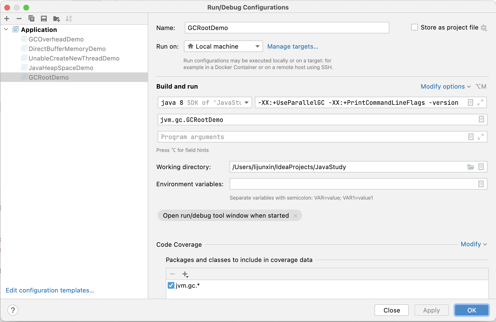

面试高频考点：
1) JVM/GC
2) JUC(java.util.concurrent)
3) Collection

volatitle是Java虚拟机提供的轻量级的同步机制
1) 保证可见性
    >可见性：一个线程修改了主内容的值，其它线程马上获得相应通知。
2) 禁止指令重排
3) <font color = 'red'>不保证原子性</font>

ß


volatile不保证原子性问题解决：
1. synchronized（杀鸡用牛刀，不推荐）
2. AtomicInteger等（推荐）


####synchronized线程不安全举例（配合volatile解决）
```java {.line-numbers}
public class SingleInstance{

    // 使用 volatile 禁止 new 对象时进行指令重排
    // new 对象，有三条指令完成
    // 1 JVM为对象分配一块内存M在堆区
    // 2 在内存M上为对象进行初始化
    // 3 将内存M的地址复制给instance变量
    private volatile static SingleInstance instance;

    private SingleInstance(){
        if(instance != null){
            throw new RuntimeException("single instance existed");
        }
    }

    public SingaleInstance getInstance(){
        // 减少锁竞争，避免过多的线程进入同步队列，进入 blocking 状态
        if(instance == null){
            // 此处 synchronized 可以保证原子性和可见性
            // 而有序性，指的是保证线程串行进入 synchronized代码块内
            // 所以，此有序性无法保证 synchronized 代码块内部的有序性
            synchronized(SingleInstance.class){
                // 避免重复创建对象
                if(instance == null){
                    instance = new SingleInstance();
                }
            }
        }
        return instance;
    }    
}
```
>new对象的三个步骤(简化）: 
① JVM为对象分配一块内存M。
② 在内存M上为对象进行初始化。
③ 将内存M的地址复制给singleton变量。


假设有两个线程ThreadA 和ThreadB同时来请求SingleInstance.getInstance方法，正常情况按照 ①②③ 的顺序来执行。但由于多线程<font color='red'>指令重排</font>的存在，对象初始化的时候可能按照 ①③② 的顺序，即：**ThreadB是可以拿到一个引用已经有了但是内存资源还没有分配的对象**。此时在变量 instance 前加入 volatitle 禁止指令重排，便可以解决。

```java
/**
 * Description: ABA问题的产生
 **/
public class ABADemo {
    private static AtomicReference<Integer> atomicReference = new AtomicReference<>(100);
    private static AtomicStampedReference<Integer> stampedReference = new AtomicStampedReference<>(100, 1);

    public static void main(String[] args) {
        System.out.println("以下是ABA问题的产生");

        new Thread(() -> {
            atomicReference.compareAndSet(100, 101);
            atomicReference.compareAndSet(101, 100);
        }, "t1").start();

        new Thread(() -> {
            //先暂停1秒 保证完成ABA
            try {
                TimeUnit.SECONDS.sleep(1);
            } catch (InterruptedException e) {
                e.printStackTrace();
            }
            System.out.println(atomicReference.compareAndSet(100, 2019) + "\t" + atomicReference.get());
        }, "t2").start();
        try {
            TimeUnit.SECONDS.sleep(2);
        } catch (InterruptedException e) {
            e.printStackTrace();
        }
    }
}
```
>以下是ABA问题的产生
true	2019

```java
public class ABADemo {
    private static AtomicReference<Integer> atomicReference = new AtomicReference<>(100);
    private static AtomicStampedReference<Integer> stampedReference = new AtomicStampedReference<>(100, 1);

    public static void main(String[] args) {
        System.out.println("以下是ABA问题的解决");

        new Thread(() -> {
            int stamp = stampedReference.getStamp();
            System.out.println(Thread.currentThread().getName() + "\t 第1次版本号" + stamp + "\t值是" + stampedReference.getReference());
            //暂停1秒钟t3线程
            try {
                TimeUnit.SECONDS.sleep(1);
            } catch (InterruptedException e) {
                e.printStackTrace();
            }

            stampedReference.compareAndSet(100, 101, stampedReference.getStamp(), stampedReference.getStamp() + 1);
            System.out.println(Thread.currentThread().getName() + "\t 第2次版本号" + stampedReference.getStamp() + "\t值是" + stampedReference.getReference());
            stampedReference.compareAndSet(101, 100, stampedReference.getStamp(), stampedReference.getStamp() + 1);
            System.out.println(Thread.currentThread().getName() + "\t 第3次版本号" + stampedReference.getStamp() + "\t值是" + stampedReference.getReference());
        }, "t3").start();

        new Thread(() -> {
            int stamp = stampedReference.getStamp();
            System.out.println(Thread.currentThread().getName() + "\t 第1次版本号" + stamp + "\t值是" + stampedReference.getReference());
            //保证线程3完成1次ABA
            try {
                TimeUnit.SECONDS.sleep(3);
            } catch (InterruptedException e) {
                e.printStackTrace();
            }
            boolean result = stampedReference.compareAndSet(100, 2019, stamp, stamp + 1);
            System.out.println(Thread.currentThread().getName() + "\t 修改成功否" + result + "\t最新版本号" + stampedReference.getStamp());
            System.out.println("最新的值\t" + stampedReference.getReference());
        }, "t4").start();
    }
}
```
>以下是ABA问题的解决
t3	 第1次版本号1	值是100
t4	 第1次版本号1	值是100
t3	 第2次版本号2	值是101
t3	 第3次版本号3	值是100
t4	 修改成功否false	最新版本号3
最新的值	100

##集合类不安全之并发修改异常
###ArrayList
```java
public class UnsafeDemo {
    public static void main(String[] args) {
        List<String> list = new ArrayList<>();
        for (int i = 1; i <= 30; i++) {
            new Thread(() -> {
                list.add(UUID.randomUUID().toString().substring(0, 8));
                System.out.println(list);
            }, String.valueOf(i)).start();
        }
    }
}
```
多线程环境下运行上例，会报如下错误：
```
Exception in thread "20" Exception in thread "15" java.util.ConcurrentModificationException
	at java.base/java.util.ArrayList$Itr.checkForComodification(ArrayList.java:1013)
	at java.base/java.util.ArrayList$Itr.next(ArrayList.java:967)
	at java.base/java.util.AbstractCollection.toString(AbstractCollection.java:456)
	at java.base/java.lang.String.valueOf(String.java:4213)
	at java.base/java.io.PrintStream.println(PrintStream.java:1060)
	at jvm.arrayList.unsafeCase.UnsafeDemo.lambda$main$0(UnsafeDemo.java:16)
	at java.base/java.lang.Thread.run(Thread.java:833)
Exception in thread "11" java.util.ConcurrentModificationException
	at java.base/java.util.ArrayList$Itr.checkForComodification(ArrayList.java:1013)
	at java.base/java.util.ArrayList$Itr.next(ArrayList.java:967)
	at java.base/java.util.AbstractCollection.toString(AbstractCollection.java:456)
	at java.base/java.lang.String.valueOf(String.java:4213)
	at java.base/java.io.PrintStream.println(PrintStream.java:1060)
	at jvm.arrayList.unsafeCase.UnsafeDemo.lambda$main$0(UnsafeDemo.java:16)
	at java.base/java.lang.Thread.run(Thread.java:833)
java.util.ConcurrentModificationException
	at java.base/java.util.ArrayList$Itr.checkForComodification(ArrayList.java:1013)
	at java.base/java.util.ArrayList$Itr.next(ArrayList.java:967)
	at java.base/java.util.AbstractCollection.toString(AbstractCollection.java:456)
	at java.base/java.lang.String.valueOf(String.java:4213)
	at java.base/java.io.PrintStream.println(PrintStream.java:1060)
	at jvm.arrayList.unsafeCase.UnsafeDemo.lambda$main$0(UnsafeDemo.java:16)
	at java.base/java.lang.Thread.run(Thread.java:833)
```

####解决方法一：Vector
```java
public class SafeDemoByVector {
    public static void main(String[] args) {
        List<String> list = new Vector<>();
        for (int i = 1; i <= 30; i++) {
            new Thread(() -> {
                list.add(UUID.randomUUID().toString().substring(0, 8));
                System.out.println(list);
            }, String.valueOf(i)).start();
        }
    }
}
```

>Vector JDK 1.0：加锁，并发行急剧下降
Array JDK 1.2：以牺牲多线程安全性为代价，提升并发性能
所以，不建议使用Vector，相当于在开倒车

####解决方法二：Collections.synchronizedList
```java
public class SafeDemoBySynchronizedList {
    public static void main(String[] args) {
        List<String> list = Collections.synchronizedList(new ArrayList<>());
        for (int i = 1; i <= 30; i++) {
            new Thread(() -> {
                list.add(UUID.randomUUID().toString().substring(0, 8));
                System.out.println(list);
            }, String.valueOf(i)).start();
        }
    }
}
```

####解决方法三：CopyOnWriteArrayList
```java
public class SafeDemoByCopyOnWriteArrayList {
    public static void main(String[] args) {
        List<String> list = new CopyOnWriteArrayList<>();
        for (int i = 1; i <= 30; i++) {
            new Thread(() -> {
                list.add(UUID.randomUUID().toString().substring(0, 8));
                System.out.println(list);
            }, String.valueOf(i)).start();
        }
    }
}
```

copyOnWrite容器，即写时复制的容器。其底层 add 方法源码如下：
```java
public boolean add(E e) {
    final ReentrantLock lock = this.lock;
    lock.lock();
    try {
    Object[] elements = getArray();
        int len = elements.length;
        Object[] newElements = Arrays.copyOf(elements, len + 1);
        newElements[len] = e;
        setArray(newElements);
        return true;
    } finally {
        lock.unlock();
    }
}
```
>1. 往容器添加元素的时候，不直接往当前容器 object[] 添加，而是先将当前容器 object[] 进行 copy 复制出一个新的 object[] newElements ，然后向新容器 object[] newElements 里面添加元素。
>2. 添加元素后，再将原容器的引用指向新的容器 setArray(newElements) 。这样的好处是可以对 copyOnWrite 容器进行并发的读，而不需要加锁（因为当前容器不会添加任何元素）。所以 copyOnwrite 容器也是一种**读写分离**的思想，读和写不同的容器.

###HashSet 和 HashMap
类似地 HashSet 和 HashMap 也会遇到相应并发问题，其中：
1. HashSet 可通过 Collections.synchronizedSet 和 CopyOnWriteArraySet 来解决
2. HashMap 可通过 Collections.synchronizedMap 和 ConcurrentHashMap 来解决

####公平锁和非公平锁
公平锁：是指多个线程按照申请锁的顺序来获取锁类似排队打饭，先来后到。
非公平锁：是指在多线程获取锁的顺序并不是按照申请锁的顺序，有可能后申请的线程比先申请的线程优先获取到锁。在高并发的情况下，有可能造成优先级反转或者饥饿现象。
>- ReentrantLock( )不带参数时等同于ReentrantLock(false)，默认是非公平锁。
>- synchronized也是一种非公平锁。

####可重入锁（也叫做递归锁）
可重入锁：指的是同一线程外层函数获得锁之后，内层递归函数仍然能获取该锁的代码，在同一个线程在外层方法获取锁的时候，在进入内层方法会自动获取锁。
>ReentrantLock和synchronized就是典型的可重入锁。

```java {.line-numbers}
class Phone implements Runnable {
    private Lock lock = new ReentrantLock();

    @Override
    public void run() {
        get();
    }

    private void get() {
        lock.lock();
        try {
            System.out.println(Thread.currentThread().getName() + "\tget");
            set();
        } finally {
            lock.unlock();
        }
    }

    private void set() {
        lock.lock();
        try {
            System.out.println(Thread.currentThread().getName() + "\tset");
        } finally {
            lock.unlock();
        }
    }
}

/**
 * Description:可重入锁(也叫做递归锁)
 * 指的是同一先生外层函数获得锁后,内层敌对函数任然能获取该锁的代码
 * 在同一线程外外层方法获取锁的时候,在进入内层方法会自动获取锁
 *
 * 也就是说,线程可以进入任何一个它已经标记的锁所同步的代码块
 **/
public class ReentrantLockDemo {
    public static void main(String[] args) {
        Phone phone = new Phone();
        Thread t1 = new Thread(phone);
        Thread t2 = new Thread(phone);
        t1.start();
        t2.start();
    }
}
```

运行结果：
>Thread-0	get
Thread-0	set
Thread-1	get
Thread-1	set

值得一提的是，如果在10行后再加一个lock.lock()，即
```java{.line-number}
    private void get() {
        lock.lock();
        lock.lock();
        try {
            System.out.println(Thread.currentThread().getName() + "\tget");
            set();
        } finally {
            lock.unlock();
        }
    }
```
运行结果，会变为：(第2个线程无法获取到锁)
>Thread-0	get
Thread-0	set

####自旋锁
自旋锁（spinlock）：是指尝试获取锁的线程不会立即阻塞，而是`采用循环的方式去尝试获取锁`，这样的好处是减少线程上下文切换的消耗，缺点是循环会消耗CPU。

```java
public class SpinLockDemo {
    AtomicReference<Thread> atomicReference = new AtomicReference<>();

    public void myLock() {
        Thread thread = Thread.currentThread();
        System.out.println(Thread.currentThread().getName() + " It come in 0(n_n)o");
        while (!atomicReference.compareAndSet(null, thread)) {
        }
    }

    public void myUnlock() {
        Thread thread = Thread.currentThread();
        atomicReference.compareAndSet(thread, null);
        System.out.println(Thread.currentThread().getName() + " It invoked myUnLock()");
    }

    public static void main(String[] args) {
        SpinLockDemo spinLockDemo = new SpinLockDemo();
        new Thread(() -> {
            spinLockDemo.myLock();
            try {
                TimeUnit.SECONDS.sleep(5);
            } catch (InterruptedException e) {
                e.printStackTrace();
            }
            spinLockDemo.myUnlock();
        }, "AA").start();

        try {
            TimeUnit.SECONDS.sleep(1);
        } catch (InterruptedException e) {
            e.printStackTrace();
        }

        new Thread(() -> {
            spinLockDemo.myLock();
            try {
                TimeUnit.SECONDS.sleep(1);
            } catch (InterruptedException e) {
                e.printStackTrace();
            }
            spinLockDemo.myUnlock();
        }, "BB").start();
    }
}
```

####独占锁和共享锁
独占锁：指该锁一次只能被一个线程所持有。对ReentrantLock和synchronized而言都是独占锁。
共享锁：指该锁可以被多个线程所持有。对ReentrantReadWriteLock其写锁是独占锁。读锁的共享锁保证并发读是高效的，读写、写读、写写的过程是互斥的。

```java
/**
 * 资源类
 */
class MyCaChe {
    /**
     * 保证可见性
     */
    private volatile Map<String, Object> map = new HashMap<>();
    private ReentrantReadWriteLock reentrantReadWriteLock = new ReentrantReadWriteLock();

    /**
     * 写
     *
     * @param key
     * @param value
     */
    public void put(String key, Object value) {
        reentrantReadWriteLock.writeLock().lock();
        try {
            System.out.println(Thread.currentThread().getName() + "\t正在写入" + key);
            //模拟网络延时
            try {
                TimeUnit.MICROSECONDS.sleep(300);
            } catch (InterruptedException e) {
                e.printStackTrace();
            }
            map.put(key, value);
            System.out.println(Thread.currentThread().getName() + "\t正在完成");
        } finally {
            reentrantReadWriteLock.writeLock().unlock();
        }
    }

    /**
     * 读
     *
     * @param key
     */
    public void get(String key) {
        reentrantReadWriteLock.readLock().lock();
        try {
            System.out.println(Thread.currentThread().getName() + "\t正在读取");
            //模拟网络延时
            try {
                TimeUnit.MICROSECONDS.sleep(300);
            } catch (InterruptedException e) {
                e.printStackTrace();
            }
            Object result = map.get(key);
            System.out.println(Thread.currentThread().getName() + "\t正在完成" + result);
        } finally {
            reentrantReadWriteLock.readLock().unlock();
        }
    }

    public void clearCaChe() {
        map.clear();
    }
}

/**
 * Description:
 * 多个线程同时操作 一个资源类没有任何问题 所以为了满足并发量
 * 读取共享资源应该可以同时进行
 * 但是
 * 如果有一个线程想去写共享资源来  就不应该有其他线程可以对资源进行读或写
 * 
 * 小总结:
 * 读 读能共存
 * 读 写不能共存
 * 写 写不能共存
 * 写操作 原子+独占 整个过程必须是一个完成的统一整体 中间不允许被分割 被打断
 **/
public class ReadWriteLockDemo {
    public static void main(String[] args) {
        MyCaChe myCaChe = new MyCaChe();
        for (int i = 1; i <= 5; i++) {
            final int temp = i;
            new Thread(() -> {
                myCaChe.put(temp + "", temp);
            }, String.valueOf(i)).start();
        }
        for (int i = 1; i <= 5; i++) {
            int finalI = i;
            new Thread(() -> {
                myCaChe.get(finalI + "");
            }, String.valueOf(i)).start();
        }
    }
}
```

####CountDownLatch
CountDownLatch主要有两个方法：
1. 当一个或多个线程调用`await`方法时，调用线程会被阻塞。
2. 其他线程调用`countDown`方法计数器减1(调用countDown方法时线程不会阻塞)，当计数器的值变为0，因调用await方法被阻塞的线程会被唤醒，继续执行。

######经典案例：下晚自习班长锁门、秦灭六国一统天下
```java{.line-numbers}
/**
 * 模拟下晚自习，班长最后一个走锁门离开教室
 */
public class CountDownLatchDemo {
    public static void main(String[] args) throws Exception {
        closeDoor();
    }

    private static void closeDoor() throws InterruptedException {
        CountDownLatch countDownLatch = new CountDownLatch(6);
        for (int i = 1; i <= 6; i++) {
            new Thread(() -> {
                System.out.println(Thread.currentThread().getName() + "\t" + "上完自习");
                countDownLatch.countDown();
            }, String.valueOf(i)).start();
        }
        countDownLatch.await();
        System.out.println(Thread.currentThread().getName() + "\t班长锁门离开教室");
    }
}
```

####CyclicBarrier
CyclicBarrier的字面意思是可循环(Cyclic)​。使用的屏障(barrier)它要做的事情是：让一组线程到达一个屏障(也可以叫做同步点)时被阻塞，知道最后一个线程到达屏障时，屏障才会开门，所有被屏障拦截的线程才会继续干活,线程进入屏障通过CyclicBarrier的await()方法。
######经典案例：集七龙珠、人齐了开会
```java{.line-numbers}
/**
 * 模拟集齐七颗龙珠，召唤神龙
 */
public class CyclicBarrierDemo {
    public static void main(String[] args) {
        CyclicBarrier cyclicBarrier=new CyclicBarrier(7,()->{
            System.out.println("召唤神龙");
        });

        for (int i = 1; i <=7; i++) {
            final int temp = i;
            new Thread(()->{
                System.out.println(Thread.currentThread().getName()+"\t 收集到第"+ temp +"颗龙珠");
                try {
                    cyclicBarrier.await();
                } catch (InterruptedException e) {
                    e.printStackTrace();
                } catch (BrokenBarrierException e) {
                    e.printStackTrace();
                }
            },String.valueOf(i)).start();
        }
    }
}
```

####Semaphore
信号量的主要用户两个目的，一个是用于多个共享资源的相互排斥使用，另一个用于并发资源数的控制。
######经典案例：抢车位。
```java{.line-numbers}
public class SemaphoreDemo {
    public static void main(String[] args) {
        //模拟3个停车位
        Semaphore semaphore = new Semaphore(3);
        //模拟6部汽车
        for (int i = 1; i <= 6; i++) {
            new Thread(() -> {
                try {
                    //抢到资源
                    semaphore.acquire();
                    System.out.println(Thread.currentThread().getName() + "\t抢到车位");
                    try {
                        TimeUnit.SECONDS.sleep(3);
                    } catch (InterruptedException e) {
                        e.printStackTrace();
                    }
                    System.out.println(Thread.currentThread().getName() + "\t 停3秒离开车位");
                } catch (InterruptedException e) {
                    e.printStackTrace();
                } finally {
                    //释放资源
                    semaphore.release();
                }
            }, String.valueOf(i)).start();
        }
    }
}

```

###BlockingQueue方法


#####抛出异常场景
```java
/**
 * @description 阻塞队列样例1：测试add、element、remove方法
 * @author andy_ruohan
 * @date 2023/3/14 23:25
 */
public class BlockingQueueDemo1 {
    public static void main(String[] args) throws Exception {
        BlockingQueue<String> blockingQueue = new ArrayBlockingQueue<>(3);
        System.out.println(blockingQueue.add("a"));
        System.out.println(blockingQueue.add("b"));
        System.out.println(blockingQueue.add("c"));

        System.out.println(blockingQueue.element());

        System.out.println(blockingQueue.remove());
        System.out.println(blockingQueue.remove());
        System.out.println(blockingQueue.remove());
        System.out.println(blockingQueue.remove()); // 该行会抛异常
    }
}
```
运行结果：
>true
true
true
a
a
b
c
Exception in thread "main" java.util.NoSuchElementException
	at java.base/java.util.AbstractQueue.remove(AbstractQueue.java:117)
	at jvm.blockingQueue.BlockingQueueDemo1.main(BlockingQueueDemo1.java:23)  

#####返回特殊值场景
```java
/**
 * @description 阻塞队列样例2：测试offer、peek、poll方法
 * @author andy_ruohan
 * @date 2023/3/14 23:25
 */
public class BlockingQueueDemo2 {
    public static void main(String[] args) throws Exception {
        BlockingQueue<String> blockingQueue = new ArrayBlockingQueue<>(3);
        System.out.println(blockingQueue.offer("a"));
        System.out.println(blockingQueue.offer("b"));
        System.out.println(blockingQueue.offer("c"));
        System.out.println(blockingQueue.offer("d")); // 该行会返回false

        System.out.println(blockingQueue.peek());

        System.out.println(blockingQueue.poll());
        System.out.println(blockingQueue.poll());
        System.out.println(blockingQueue.poll());
        System.out.println(blockingQueue.poll()); // 该行会返回null
    }
}
```
运行结果：
>true
true
true
false
a
a
b
c
null  
   
#####阻塞场景
```java
/**
 * @description 阻塞队列样例3：测试put、take方法
 * @author andy_ruohan
 * @date 2023/3/14 23:25
 */
public class BlockingQueueDemo3 {
    public static void main(String[] args) throws Exception {
        BlockingQueue<String> blockingQueue = new ArrayBlockingQueue<>(3);
        blockingQueue.put("a");
        blockingQueue.put("a");
        blockingQueue.put("a");
//        blockingQueue.put("a"); // 如加入该行，会阻塞

        System.out.println("=========================");

        blockingQueue.take();
        blockingQueue.take();
        blockingQueue.take();
        blockingQueue.take(); // 如加入该行，会阻塞
    }
}
```
运行结果：
>=========================
>（程序会一直挂起，不会终止）

#####
```java
/**
 * @description 阻塞队列样例4：测试offer、poll超时方法
 * @author andy_ruohan
 * @date 2023/3/14 23:41
 */
public class BlockingQueueDemo4 {
    public static void main(String[] args) throws Exception {
        BlockingQueue<String> blockingQueue = new ArrayBlockingQueue<>(3);
        System.out.println(blockingQueue.offer("a",     2L, TimeUnit.SECONDS));
        System.out.println(blockingQueue.offer("a",     2L, TimeUnit.SECONDS));
        System.out.println(blockingQueue.offer("a",     2L, TimeUnit.SECONDS));
        System.out.println(blockingQueue.offer("a",     2L, TimeUnit.SECONDS)); // 超时会返回false

        System.out.println(blockingQueue.poll(2L, TimeUnit.SECONDS));
        System.out.println(blockingQueue.poll(2L, TimeUnit.SECONDS));
        System.out.println(blockingQueue.poll(2L, TimeUnit.SECONDS));
        System.out.println(blockingQueue.poll(2L, TimeUnit.SECONDS)); // 超时会返回null
    }
}
```
运行结果：
>true
true
true
false（隔两秒后输出）
a
a
a
null（再隔两秒输出）

题目：synchronized和Lock有什么区别？用新的Lock有什么好处？举例说说。
1. 原始构成
   - synchronized是关健字属于JVM层面，monitorenter、monitorexit(底层是通过monitor对象来完成，其实wait/notify 等方法也依额于monitor对象，只有在同步块或方法中才能调wait/notify等方法。
   
   - Lock是具体类(java.util.concurrent.Locks.Lock)是api层面的锁。
2. 使用方法
   - synchronized不需要用户去手动释放锁，当synchronized代码执行完后，系统会自动让线程释成对锁的占用。
   - ReentrantLock则需要用户去手动释放锁，若没有主动释放锁，就有可能导致出现死锁现象，需要Lock()和unlock()方法配合try/finally语句块来完成。
3. 等待是否可中断
   - synchronized不可中断，除非抛出异常或者正常运行完成。
   - ReentrantLock可中断，
        >(i) 设置超时方法tryLock(Long timeout, Timeunit unit)
        >(ii) LockInterruptibly()放代码块中，调用interrupt()方法可中断
4. 加锁是否公平
   - synchronized非公平锁。
   - ReentrantLock两者都可以，默认非公平锁，构造方法可以传入boolean值，true为公平锁，false为非公平锁。
5. 锁绑定多个条件Condition
   - synchronized没有。
   - Reentrantlock用来实现分组唤醒需要唤醒的线程们，可以精确唤醒，而不是像synchronized要么随机唤醒一个线程要么唤醒全部线程。

#####已经有了Runnable方式调用线程，为什么还要使用Callable方式调用线程？
1. Thread构造方法参数虽然都是Runnable接口形式：

但FutureTask类构造方法以Callable接口作为参数，并实现了Runnable接口，可以透传到Thread类作为参数。

   >类似于适配器模式，比如Callable和Runnable两个人相互不认识，而FutureTask两个人都认知，将他们约在一起见面  

2. 使用Callable方式调用线程，可以带有返回值。(适用于并发+异步，获取结果的场景)
```java
/**
 * @author andy_ruohan
 * @description 通过实现Callable接口方式，来使用线程
 * @date 2023/3/19 18:26
 */
class MyThread implements Callable<Integer> {
    @Override
    public Integer call() throws Exception {
        System.out.println("***********come in Callable");
        return 1024;
    }
}

/**
 * @author andy_ruohan
 * @description 启用两个线程：主线程 + AA线程，计算结果
 * @date 2023/3/19 18:25
 */
public class CallableDemo1 {
    public static void main(String[] args) throws InterruptedException, ExecutionException {
        FutureTask<Integer> futureTask = new FutureTask<Integer>(new MyThread());
        Thread t1 = new Thread(futureTask, "AA");
        t1.start();

        int result1 = 100;
        int result2 = futureTask.get();
        System.out.println("***********result: " + (result1 + result2));
    }
}
```
多个线程共同计算结果：
>***********come in Callable
***********result: 1124

#####两个线程同时调用一个futureTask
```java
/**
 * @author andy_ruohan
 * @description 测试两个线程调用同一个futureTask
 * @date 2023/3/19 18:10
 */
public class CallableDemo2 {
    public static void main(String[] args) throws InterruptedException, ExecutionException {
        //FutureTask(Callable‹v> callable)
        FutureTask<Integer> futureTask = new FutureTask<Integer>(new MyThread());
        Thread t1 = new Thread(futureTask, "AA");
        Thread t2 = new Thread(futureTask, "BB");
        t1.start();
        t2.start();

        System.out.println("***********result: " + futureTask.get());
    }
}
```
当有两个线程调用同一个futureTask，实际futureTask只会进入一次：
>***********come in Callable
***********result: 1024  

#####提前获取futureTask结果，会造成线程阻塞
```java
/**
 * @author andy_ruohan
 * @description 通过实现Callable接口方式，来使用线程（带有sleep）
 * @date 2023/3/19 18:41
 */
public class MyThreadWithSleep implements Callable<Integer> {
    @Override
    public Integer call() throws Exception {
        System.out.println("***********come in Callable");
        Thread.sleep(5000);
        return 1024;
    }
}

/**
 * @author andy_ruohan
 * @description 提前获取futureTask结果
 * @date 2023/3/19 18:40
 */
public class CallableDemo3 {
    public static void main(String[] args) throws InterruptedException, ExecutionException {
        FutureTask<Integer> futureTask = new FutureTask<>(new MyThreadWithSleep());
        Thread t1 = new Thread(futureTask, "AA");
        t1.start();
        int result2 = futureTask.get();

        System.out.println("===========");

        int result1 = 100;
        System.out.println("***********result: " + (result1 + result2));
    }
}
```
>***********come in Callable
======(会带有5秒的延迟)
***********result: 1124

###线程池
#####newFixedThreadPool: 一池固定数线程源码
```java
    public static ExecutorService newFixedThreadPool(int nThreads) {
        return new ThreadPoolExecutor(nThreads, nThreads,
                                      0L, TimeUnit.MILLISECONDS,
                                      new LinkedBlockingQueue<Runnable>());
    }
```

#####newSingleThreadExecutor: 一池1个线程源码
```java
    public static ExecutorService newSingleThreadExecutor() {
        return new FinalizableDelegatedExecutorService
            (new ThreadPoolExecutor(1, 1,
                                    0L, TimeUnit.MILLISECONDS,
                                    new LinkedBlockingQueue<Runnable>()));
    }
```

#####newCachedThreadPool: 一池n个线程源码
```java
    public static ExecutorService newCachedThreadPool() {
        return new ThreadPoolExecutor(0, Integer.MAX_VALUE,
                                      60L, TimeUnit.SECONDS,
                                      new SynchronousQueue<Runnable>());
    }
```

#####综合样例：模拟银行窗口服务场景
```java
/**
 * @author andy_ruohan
 * @description 模拟银行窗口服务场景：2个常规窗口，等候区3个座位，3个加班窗口
 * @date 2023/3/22 21:50
 */
public class ThreadPoolDemo {
    public static void main(String[] args) {
        ExecutorService threadPool = new ThreadPoolExecutor(
                2, 5, 100L, TimeUnit.SECONDS,
                // 等候区
                new LinkedBlockingQueue<>(3),
                Executors.defaultThreadFactory(),
                new ThreadPoolExecutor.AbortPolicy());
        try {
            // 模找8个顾客来办理业务，受理窗口max只有5个
            for (int i = 1; i <= 8; i++) {
                final int tmpI = i;
                threadPool.execute(() -> {
                    System.out.println(Thread.currentThread().getName() + "号窗口，“＋“服务顾客" + tmpI);
                    try {
                        TimeUnit.SECONDS.sleep(4);
                    } catch (InterruptedException e) {
                        e.printStackTrace();
                    }
                });
            }
        } catch (Exception e) {
            e.printStackTrace();
        } finally {
            threadPool.shutdown();
        }
    }
}
```
运行过程：
1. 常规窗口2个，前两个客户来了以后正常进入窗口；
   >(int corePoolSize: 常规窗口数)
2. 若前两个窗口已满，后续来的客户会进入等候区；
   >(BlockingQueue<Runnable> workQueue: 等候区)
3. 若等候区已满，后续来的客户会直接进入加班窗口、而不是等候区；
   >(int maximumPoolSize: 常规窗口 + 加班窗口)
4. 若再有客户来，银行网点承载能力已满，执行拒绝策略
   >(RejectedExecutionHandler handler: 拒绝策略)
5. 若客户慢慢减少，加班窗口会进入等待，等待一段时间后仍无客户，加班窗口会取消
   >(long keepAliveTime: 等待时间， TimeUnit unit: 计时单位) 

    此外，`ThreadFactory threadFactory`相当于网点的窗口、取款机等标准配置。  

    ---
    上述的几个变量亦即线程池的七大参数：
    ```java
    public ThreadPoolExecutor(int corePoolSize,
                              int maximumPoolSize,
                              long keepAliveTime,
                              TimeUnit unit,
                              BlockingQueue<Runnable> workQueue,
                              ThreadFactory threadFactory,
                              RejectedExecutionHandler handler)
    ```

#####JDK内置的拒绝策略
1. AbortPolicy(默认)：直接抛出RejectedException异常阻止系统正常运行。
2. CallerRunPolicy："调用者运行"一种调节机制，该策略既不会抛弃任务，也不会抛出异常，而是将某些任务回退给调用者，从而降低新任务的流量。
3. DiscardOldestPolicy：抛弃队列中等待最久的任务，然后把当前任务加入队列中尝试再次提交。
4. DiscardPolicy：接丢弃任务，不予任何处理也不抛出异常。如果允许任务丢失，这是最好的拒绝策略。
 
#####<font color = 'red'>【超级大坑】你在工作中单一的/固定数的/可变你的三种创建线程池的方法，你用哪个多?</font>
答案是：一个都不用，我们生产上只能使用自定义的。参考阿里巴巴《阿里巴巴java开发手册》
>【强制】线程池不允许使用Executors去创建，而是通过ThreadPoolExecutor的方式，这样的处理方式让写的同学更加明确线程池的运行规则，规避资源耗尽的风险。说明：Executors返回的线程池对象的弊端如下：
1）<font color = 'red'>FixedThreadPool</font>和<font color = 'red'>SingleThreadPool</font>:允许的请求队列长度为Integer.MAX_VALUE，可能会堆积大量的请求，从而导致OOM。 

即源码中的new LinkedBlockingQueue<Runnable>( )：
```java
    public static ExecutorService newFixedThreadPool(int nThreads) {
        return new ThreadPoolExecutor(nThreads, nThreads,
                                      0L, TimeUnit.MILLISECONDS,
                                      new LinkedBlockingQueue<Runnable>());
    }
```

>2）<font color = 'red'>CachedThreadPool</font>和<font color = 'red'>ScheduledThreadPool</font>:允许的创建线程数量为Integer.MAX_VALUE，可能会创建大量的线程，从而导致OOM。  

即源码中的Integer.MAX_VALUE：
```java
    public static ExecutorService newCachedThreadPool() {
        return new ThreadPoolExecutor(0, Integer.MAX_VALUE,
                                      60L, TimeUnit.SECONDS,
                                      new SynchronousQueue<Runnable>());
    }
```

#####如何合理配置线程池？
首先熟悉自己的硬件，清楚CPU是几核心：System.out.println(Runtime.getRuntime().availableProcessors());
- 单核情况：无论开几个模拟的多线程任务，都不可能得到加速；
- 多核情况：
    - CPU密集型：应配置尽可能少的线程数量。一般公式：CPU核数+1个线程的线程池。
    - IO密集型：IO密集型线程任务并不是一直在执行任务，则应配置尽可能多的线程。
    >参考公式：CPU核数 / 1 - 阻塞系数，阻塞系数通常在0.8～0.9。
    比如8核CPU：8 / 1 - 0.9 = 80个线程。


#####
```java
/**
 * @author andy_ruohan
 * @description 产生死锁的线程方法
 * @date 2023/3/26 20:49
 */
class HoldLockThread implements Runnable {
    private final String lockA;
    private final String lockB;

    public HoldLockThread(String lockA, String lockB) {
        this.lockA = lockA;
        this.lockB = lockB;
    }

    @Override
    public void run() {
        synchronized (lockA) {
            System.out.println(Thread.currentThread().getName() + "\t 自己持有锁" + lockA + "尝试获得" + lockB);
            try {
                TimeUnit.SECONDS.sleep(1);
            } catch (InterruptedException e) {
                e.printStackTrace();
            }
            synchronized (lockB) {
                System.out.println(Thread.currentThread().getName() + "\t 自己持有锁" + lockB + "尝试获得" + lockA);
            }
        }
    }
}
```

```java
/**
 * @author andy_ruohan
 * @description 产生死锁主函数 
 * @date 2023/3/26 20:50
 */
public class DeadLockDemo {
    public static void main(String[] args) {
        String lockA = "lockA";
        String lockB = "lockB";
        new Thread(new HoldLockThread(lockA, lockB), "threadAAA").start();
        new Thread(new HoldLockThread(lockB, lockA), "threadBBB").start();
    }
}
```

###死锁(Dead Lock)
####产生死锁的原因
**死锁**是指<font color='red'>两个或两个以上</font>的进程在执行过程中，因争夺资源而造成的一种<font color='red'>互相等待的现象</font>，若无外力干涉那它们都将无法推进下去。如果系统资源充足，进程的资源请求都能够得到满足，死锁出现的可能性就很低，否则就会因争夺有限的资源而陷入死锁。

####如何解决死锁?
系统 | 定位进程编号 | 查看死锁进程栈
----- | ----- | ----
Linux | ps -ef\|gref xxxx | ls -l 
Windows | jps  | jps-l
以Windows系统为例，首先定位进程编号:
>jps -l
```java
53104 jvm.deadlock.DeadLockDemo
37874 
53115 jdk.jcmd/sun.tools.jps.Jps
53103 org.jetbrains.jps.cmdline.Launcher
```

其次，查看死锁进程栈:
>jstack 53104
```java
"threadAAA":
        at jvm.deadlock.HoldLockThread.run(HoldLockThread.java:29)
        - waiting to lock <0x0000000787ead8a8> (a java.lang.String)
        - locked <0x0000000787ead878> (a java.lang.String)
        at java.lang.Thread.run(java.base@18.0.2/Thread.java:833)
"threadBBB":
        at jvm.deadlock.HoldLockThread.run(HoldLockThread.java:29)
        - waiting to lock <0x0000000787ead878> (a java.lang.String)
        - locked <0x0000000787ead8a8> (a java.lang.String)
        at java.lang.Thread.run(java.base@18.0.2/Thread.java:833)
       
Found 1 deadlock.
```
然后停止服务、修改代码、重新部署应用...

###GC
####Java体系结构概览：


类装载器，主要有：
- 启动类加载器（根加载器，用C++语言写的bootstrap）
- 拓展类加载器
- 应用类加载器  
也可继承classLoader，实现自定义加载器。

GC主要发生在方法区和堆区。

--------
背景：Oracle收购了BEA和SUN公司后，有了JRockit和Hotspot两套JDK规范，将两套方案混合了：干掉了JVM的永久代，变成了Java8的元空间。参考网页：https://openjdk.org/jeps/122  


#####JVM垃圾回收的时候如何确定垃圾？
基木思路就是通过一系列名为”GC Roots” 的对象作为起始点，从这个被称为GC Roots的对象开始向下搜素，如果一个对象到GC Roots没有任何引用链相连时，则说明此对象不可用。也即给定一个集合的引用作为根出发，通过引用关系遍历对象图，能被遍历到的(可到达的）对象就被判定为存活：没有被遍历到的就自然被判定为死亡。


>通俗地讲，“朝中有人好做官，没有背景就容易被回收”。亦或是，人养宠物狗，宠物狗丢了会变成流浪狗，没有主人保护狗狗就容易收到其他人欺负。

#####Java可以作为GCRoots的对象
- 虚拟机栈（栈帧中的局部变量区，也叫做局部变量表）中引用的对象。
- 方法区中的类静态属性引用的对象。
- 方法区中常量引用的对象。
- 本地方法栈中JNI（Native方法）引用的对象

#####JVM的参数类型
- 标配参数（了解）
  >例如java -version、java -help
- X参数（了解）
  >-Xint 解释执行
  -Xcomp 第一次使用就编译成本地代码，再执行
  -Xmixed 将解释模式预编译模式进行混合使用，由JVM自己决定
- XX参数（重点掌握）
  1. Boolean类型 -XX: +或者- 某个属性值（+表示开启、-表示关闭）
   例如：打印GC收集细节 -XX:+PrintGCDetails、使用串行垃圾收集器 -XX:+UseSerialGC
   
  2. kv设置类型 -XX:属性key=属性值value
   例如：设置元空间大小 -XX:MetaspaceSize=128m、设置垃圾最大停留年龄-XX:MaxTenuringThreshold=15
   
  3. jinfo -flag 配置项 进程编号
        >lijunxin@lijunxins-Air JavaStudy % jinfo -flag MetaspaceSize 62757
-XX:MetaspaceSize=22020096

        > lijunxin@lijunxins-Air JavaStudy % jinfo -flags 62846             
        VM Flags:
        -XX:CICompilerCount=4 -XX:ConcGCThreads=2 -XX:G1ConcRefinementThreads=8 -XX:G1EagerReclaimRemSetThreshold=12 -XX:G1HeapRegionSize=1048576 -XX:G1RemSetArrayOfCardsEntries=12 -XX:G1RemSetHowlMaxNumBuckets=8 -XX:G1RemSetHowlNumBuckets=4 -XX:GCDrainStackTargetSize=64 -XX:InitialHeapSize=134217728 -XX:MarkStackSize=4194304 -XX:MaxHeapSize=2147483648 -XX:MaxNewSize=1287651328 -XX:MetaspaceSize=134217728 -XX:MinHeapDeltaBytes=1048576 -XX:MinHeapSize=8388608 -XX:NonNMethodCodeHeapSize=5839564 -XX:NonProfiledCodeHeapSize=122909338 -XX:ProfiledCodeHeapSize=122909338 -XX:ReservedCodeCacheSize=251658240 -XX:+SegmentedCodeCache -XX:SoftMaxHeapSize=2147483648 -XX:+UseCompressedClassPointers -XX:+UseCompressedOops -XX:+UseG1GC -XX:-UseNUMA -XX:-UseNUMAInterleaving 

        <font color='red'>Xms与Xmx参数，是X参数还是XX参数</font>
        答：都属于XX参数，Xms等价于 -XX:InitialHeapSize，Xmx等价于-XX:MaxHeapSize。

#####JVM盘点家底的命令
- 第一种：
  - jinfo -flag 具体参数 java进程编号
  - jinfo -flags java进程编号
- 第二种：（更加正规的做法）
   - 查看初始默认值-XX:+PrintFlagsInitial
   - 查看修改更新值-XX:+PrintFlagsFinal
   - 查看一些关键参数如GC垃圾回收器-XX:+PrintCommandLineFlags

>输出结果key/value中键值对中，=未被修改的 :=人为或虚拟机修改的


#####堆内存初始化（Xms和Xmx参数初始值）
```java
/**
 * @author andy_ruohan
 * @description 虚拟机Xms和Xmx初始值
 * @date 2023/4/3 22:48
 */
public class HelloGC {
    public static void main(String[] args) throws InterruptedException {
        //返回 Java 虚拟机的内存总量。
        long totalMemory = Runtime.getRuntime().totalMemory();
        //返回 Java 虚拟机试图使用的最大内存量。
        long maxMemory = Runtime.getRuntime().maxMemory();
        System.out.println("TOTAL_MEMORY(-Xms) = " + totalMemory + " (字节) ，即" + (totalMemory / (double)1024 / 1024) + "MB");
        System.out.println("MAX_MEMORY(-Xmx) = " + maxMemory + " (字节) ，即" + (maxMemory / (double)1024 / 1024) + "MB");
    }
}
```
>TOTAL_MEMORY(-Xms) = 136314880 (字节) ，即130.0MB
MAX_MEMORY(-Xmx) = 2147483648 (字节) ，即2048.0MB  

即，`Xms初始值：1/64 * 物理内存、Xmx初始值：1/4 * 物理内存`


#####栈内存初始化（-Xss参数初始化）
注意与Xms和Xmx做区分，`栈管运行，堆管存储`。其默认大小见下方的JDK官方文档：

java8: https://docs.oracle.com/javase/8/docs/technotes/tools/windows/java.html#BGBCIEFC

示例：Java8虚拟机中ThreadStackSize=0代表的取默认值
```java
intx ThreadStackSize                           = 0                                   {pd product}
```

java9: https://docs.oracle.com/javase/9/tools/java.htm#JSWOR624


java20: https://docs.oracle.com/en/java/javase/20/docs/specs/man/java.html


#####设置新生代大小-Xmn
项目没有特殊需求，几乎用不到。

#####设置元空间大小-XX:MetaspaceSize
`元空间JVM默认大小为21M`并不大，故该命令在项目中可能会常用到。
元空间的本质和永久代类似，都是对JVM规范中方法区的实现。不过元空间与永久代之间最大的区别在于：<font color='red'>元空间并不在虚拟机中，而是使用本地内存。</font>因此，默认情况下，元空间的大小仅受本地内存限制。

#####打印垃圾回收器详情-XX:+PrintGCDetails


```java
/**
 * @author andy_ruohan
 * @description OOM运行测试、并打印GC运行详情（预先设置JVM参数-Xms10M -Xmx10M -XX:+PrintGCDetails）
 * @date 2023/4/5 20:00
 */
public class OutOfMemoryErrorTest {
    public static void main(String[] args) {
        // 下面该行会报：OutOfMemoryError: Java heap space
        Byte[] bytes = new Byte[50 * 1024 * 1024];
    }
}
```

运行结果：
```java
[GC (Allocation Failure) [PSYoungGen: 1437K->496K(4608K)] 1437K->512K(15872K), 0.0005106 secs] [Times: user=0.00 sys=0.00, real=0.00 secs] 
[GC (Allocation Failure) [PSYoungGen: 496K->496K(4608K)] 512K->536K(15872K), 0.0004586 secs] [Times: user=0.00 sys=0.01, real=0.00 secs] 
[Full GC (Allocation Failure) [PSYoungGen: 496K->0K(4608K)] [ParOldGen: 40K->359K(11264K)] 536K->359K(15872K), [Metaspace: 3166K->3166K(1056768K)], 0.0020345 secs] [Times: user=0.01 sys=0.00, real=0.00 secs] 
[GC (Allocation Failure) [PSYoungGen: 0K->0K(4608K)] 359K->359K(15872K), 0.0002599 secs] [Times: user=0.00 sys=0.00, real=0.01 secs] 
[Full GC (Allocation Failure) [PSYoungGen: 0K->0K(4608K)] [ParOldGen: 359K->334K(11264K)] 359K->334K(15872K), [Metaspace: 3166K->3166K(1056768K)], 0.0016703 secs] [Times: user=0.00 sys=0.00, real=0.00 secs] 
Heap
 PSYoungGen      total 4608K, used 205K [0x00000007bfb00000, 0x00000007c0000000, 0x00000007c0000000)
  eden space 4096K, 5% used [0x00000007bfb00000,0x00000007bfb334c8,0x00000007bff00000)
  from space 512K, 0% used [0x00000007bff00000,0x00000007bff00000,0x00000007bff80000)
  to   space 512K, 0% used [0x00000007bff80000,0x00000007bff80000,0x00000007c0000000)
 ParOldGen       total 11264K, used 334K [0x00000007bf000000, 0x00000007bfb00000, 0x00000007bfb00000)
  object space 11264K, 2% used [0x00000007bf000000,0x00000007bf0538d8,0x00000007bfb00000)
 Metaspace       used 3246K, capacity 4496K, committed 4864K, reserved 1056768K
  class space    used 351K, capacity 388K, committed 512K, reserved 1048576K
Exception in thread "main" java.lang.OutOfMemoryError: Java heap space
	at jvm.gc.GCRunTest.main(GCRunTest.java:11)
```

如何看GC所打出的日志详情，可参考下图：


#####堆内存结构占比命令

#####设置新生代结构比例-XX:SurvivorRatio（默认为8，即eden:from:to = 8:1:1）
```java
 PSYoungGen      total 4608K, used 205K [0x00000007bfb00000, 0x00000007c0000000, 0x00000007c0000000)
  eden space 4096K, 5% used [0x00000007bfb00000,0x00000007bfb334c8,0x00000007bff00000)
  from space 512K, 0% used [0x00000007bff00000,0x00000007bff00000,0x00000007bff80000)
  to   space 512K, 0% used [0x00000007bff80000,0x00000007bff80000,0x00000007c0000000)
```

#####设置老年代与新生代比例-XX:NewRatio（默认为2，old:young = 2:1）
```java
 PSYoungGen      total 4608K, used 205K 
 ParOldGen       total 11264K, used 334K [0x00000007bf000000, 0x00000007bfb00000, 0x00000007bfb00000)
```
注意：实测的时候为2.4:1，有一定的偏差

#####垃圾停留最大年龄-XX:MaxTenuringThreshold
垃圾停留：即新生代survivor区从from到to、从to到from来回复制的最大此处。默认为15，超过15JVM会报错。
```java
MaxTenuringThreshold of 20 is invalid; must be between 0 and 15
Error: Could not create the Java Virtual Machine.
Error: A fatal exception has occurred. Program will exit.
```


####综合样例：
#####配置前的JVM的设置

打印出的JVM配置：
```java
-XX:InitialHeapSize=134217728 -XX:MaxHeapSize=2147483648 -XX:+PrintCommandLineFlags -XX:+UseCompressedClassPointers -XX:+UseCompressedOops -XX:+UseParallelGC 
```

#####添加常见的JVM配置

具体配置信息为：-Xms128m -Xmx4096m -Xss1024k -XX:MetaspaceSize=512m -XX:+PrintCommandLineFlags -XX:+PrintGCDetails -XX:+UseSerialGC

#####最终打印出的JVM配置
```java
-XX:InitialHeapSize=134217728 -XX:MaxHeapSize=4294967296 -XX:MetaspaceSize=536870912 -XX:+PrintCommandLineFlags -XX:+PrintGCDetails -XX:ThreadStackSize=1024 -XX:+UseCompressedClassPointers -XX:+UseCompressedOops -XX:+UseSerialGC 
```

#####强引用、软引用、弱引用、虚引用
强引用：无论如何都不会被gc，即便是出现OOM。
软引用：系统内存充足，不会被gc；系统内存不足，会被gc。
弱引用：只要产生gc，就会被回收。
虚引用：如果一个对象仅持有虚引用，那么它就和没有任何引用一样，在任何时候都可能被垃圾回收器回收。类似于被判了死缓。

#####软引用和弱引用的使用场景
假如有一个应用需要读取大量的本地图片：
- 如果每次读取图片都从硬盘读取则会严重影响性能，
- 如果一次性全部加载到内存中又可能造成内存溢出。  
 
此时使用软引用可以解决这个问题。
设计思路是：用一个HashMap来保存图片的路径和相应图片对象关联的软引用之问的映射关系，在内存不足时，JVM会自动回收这些缓存图片对象所占用的空间，从而有效地避免了OOM的问题。
```java
Map<String, SoftReference<Bitmap>> imageCache = new HashMap<String, SoftReference<Bitmap>>();
```

#####虚引用的使用场景
虚引用不能单独使用也不能通过它访问对象，必须和引用队列(ReferenceQueue)联合使用，其主要作用是跟踪对象被垃圾回收的状态，在这个对象被收集器回收的时候收到一个系统通知或者后续添加进一步的处理。**有点类似于对象临终前的遗言**。
>Java技术允许使用finalize()方法在垃圾收集器将对象从内存中清除出去之前做必要的清理工作。

#####StackOverflowError
```java
/**
 * @author andy_ruohan
 * @description StackOverflowError测试
 * @date 2023/4/8 15:36
 */
public class StackOverflowErrorDemo {
    public static void main(String[] args) {
        stackOverflowError();

    }

    private static void stackOverflowError() {
        //Exception in thread "main" java.lang.StackOverFlowError
        stackOverflowError();
    }
}
```
运行结果：
```java
Exception in thread "main" java.lang.StackOverflowError
	at jvm.error.StackOverflowErrorDemo.stackOverflowError(StackOverflowErrorDemo.java:16)
	at jvm.error.StackOverflowErrorDemo.stackOverflowError(StackOverflowErrorDemo.java:16)
	at jvm.error.StackOverflowErrorDemo.stackOverflowError(StackOverflowErrorDemo.java:16)
	at jvm.error.StackOverflowErrorDemo.stackOverflowError(StackOverflowErrorDemo.java:16)
	at jvm.error.StackOverflowErrorDemo.stackOverflowError(StackOverflowErrorDemo.java:16)
	at jvm.error.StackOverflowErrorDemo.stackOverflowError(StackOverflowErrorDemo.java:16)
	at jvm.error.StackOverflowErrorDemo.stackOverflowError(StackOverflowErrorDemo.java:16)
	at jvm.error.StackOverflowErrorDemo.stackOverflowError(StackOverflowErrorDemo.java:16)
	at jvm.error.StackOverflowErrorDemo.stackOverflowError(StackOverflowErrorDemo.java:16)
	at jvm.error.StackOverflowErrorDemo.stackOverflowError(StackOverflowErrorDemo.java:16)

......
```

#####OutOfMemoryError: Java heap space
```java
/**
 * @author andy_ruohan
 * @description OutOfMemoryError: Java heap space 
 *  JVM参数: -Xms10M -Xmx10M
 * @date 2023/4/8 15:45
 */
public class JavaHeapSpaceDemo {
    public static void main(String[] args) {
        //Exception in thread "main" java.lang.OutOfMemoryError: Java heap space
        byte[] bytes = new byte[30 * 1024 * 1024];
    }
}
```
运行结果：
```java
Exception in thread "main" java.lang.OutOfMemoryError: Java heap space
	at jvm.error.JavaHeapSpaceDemo.main(JavaHeapSpaceDemo.java:11)
```

#####OutOfMemoryError: GC overhead limit exceeded
```java
/**
 * @author andy_ruohan
 * @description OutOfMemoryError: GC overhead limit exceeded测试
 *  JVM参数：-Xms10m -Xmx10m -XX:+PrintGCDetails
 * @date 2023/4/8 15:59
 */
public class GCOverheadDemo {
    public static void main(String[] args) {
        int i = 0;
        List<String> list = new ArrayList<>();
        try {
            while (true) {
                list.add(String.valueOf(++i).intern());
            }
        } catch (Throwable e) {
            System.out.println("**************i: " + i);
            e.printStackTrace();//Exception in thread "main" java. Lang.OutofMemoryError: GC overhead Limit exceeded throw e;
        }
    }
}
```
运行结果：
```java
java.lang.OutOfMemoryError: GC overhead limit exceeded
	at java.lang.Integer.toString(Integer.java:401)
	at java.lang.String.valueOf(String.java:3099)
	at jvm.error.GCOverheadDemo.main(GCOverheadDemo.java:21)
```

#####OutOfMemoryError: Direct buffer memory
```java
public class DirectBufferMemoryDemo {
    public static void main(String[] args) {
        System.out.println("配置的maxDirectMemory:" + (sun.misc.VM.maxDirectMemory() / (double) 1024 / 1024) + "MB");
        try {
            Thread.sleep(3000);
        } catch (InterruptedException e) {
            e.printStackTrace();
        }
        //-XX:MaxDirectMemorySize=5m 我们配置为5MB，但实际使用6MB，故意使坏
        ByteBuffer bb = ByteBuffer.allocateDirect(6 * 1024 * 1024);
    }
}
```

运行结果：
```java
Exception in thread "main" java.lang.OutOfMemoryError: Direct buffer memory
	at java.nio.Bits.reserveMemory(Bits.java:695)
	at java.nio.DirectByteBuffer.<init>(DirectByteBuffer.java:123)
	at java.nio.ByteBuffer.allocateDirect(ByteBuffer.java:311)
	at jvm.error.DirectBufferMemoryDemo.main(DirectBufferMemoryDemo.java:31)
```

#####OutOfMemoryError: unable to create new native thread
```java
/**
 * @author andy_ruohan
 * @description unable to create new native thread测试
 * @date 2023/4/10 22:27
 */
public class UnableCreateNewThreadDemo {
    public static void main(String[] args) {
        for (int i = 1; ; i++) {
            System.out.println("************* i = " + i);
            new Thread(() -> {
                try {
                    Thread.sleep(Integer.MAX_VALUE);
                } catch (InterruptedException e) {
                    e.printStackTrace();
                }
            }, "" + i).start();
        }
    }
}
```

运行结果：
```java
......

************* i = 2022
************* i = 2023
************* i = 2024
************* i = 2025
Exception in thread "main" java.lang.OutOfMemoryError: unable to create new native thread
	at java.lang.Thread.start0(Native Method)
	at java.lang.Thread.start(Thread.java:719)
	at jvm.error.UnableCreateNewThreadDemo.main(UnableCreateNewThreadDemo.java:28)
```
Linux可通过以下命令查看和修改线程数上限：
```
查看线程数上限：ulimit -u
```
```
修改线程数上限：vim /etc/security/limits.d/90-nproc.conf打开文件后，修改对应用户的上限
```

#####OutOfMemoryError: Metaspace
```java
/**
 * @author andy_ruohan
 * @description OutOfMemoryError: Metaspace测试
 *  JVM参数：-XX:MetaspaceSize=10m -XX:MaxMetaspaceSize=10m
 * @date 2023/4/10 23:02
 */
public class MetaspaceOomDemo {
    static class OomTest {
    }

    public static void main(String[] args) {
        //模拟计数多少次以后发生异常
        int i = 0;
        try {
            while (true) {
                i++;
                Enhancer enhancer = new Enhancer();
                enhancer.setSuperclass(OomTest.class);
                enhancer.setUseCache(false);
                enhancer.setCallback(new MethodInterceptor() {
                    @Override
                    public Object intercept(Object o, Method method, Object[] objects, MethodProxy methodProxy) throws Throwable {
                        return methodProxy.invokeSuper(o, args);
                    }
                });
                enhancer.create();
            }
        } catch (Throwable e) {
            System.out.println("**********多少次后发生了异常：" + i);
            e.printStackTrace();
        }
    }
}
```

运行结果：
```java
**********多少次后发生了异常：546
java.lang.OutOfMemoryError: Metaspace
	at net.sf.cglib.core.AbstractClassGenerator.generate(AbstractClassGenerator.java:348)
	at net.sf.cglib.proxy.Enhancer.generate(Enhancer.java:492)
	at net.sf.cglib.core.AbstractClassGenerator$ClassLoaderData.get(AbstractClassGenerator.java:117)
	at net.sf.cglib.core.AbstractClassGenerator.create(AbstractClassGenerator.java:294)
	at net.sf.cglib.proxy.Enhancer.createHelper(Enhancer.java:480)
	at net.sf.cglib.proxy.Enhancer.create(Enhancer.java:305)
	at jvm.error.MetaspaceOomDemo.main(MetaspaceOomDemo.java:46)
```

###垃圾回收器
垃圾回收器粗分的话有四种，即
串行垃圾回收器（Serial）：它为单线程环境设计并且只使用一个线程进行垃圾回收，会暂停所有的用户线程。所以不适合服务器环境。
并行垃圾回收器（Parallel）：多个垃圾回收线程并行工作，此时用户线程是暂停的，适用于科学计算/大数据处理等弱交互场景。
并行垃圾回收器（CMS）：用户线程和垃圾收集线程同时执行（不一定是并行，可能交替执行），不需要停顿用户线程。互联网公司多用它，适用于对响应时间有要求的场景。
G1垃圾回收器：G1垃圾回收器将堆内存分割成不同的区域然后并发的对其进行垃圾回收。
<font color = 'red'>注：串行垃圾回收器和并行垃圾回收器，会进行STW操作（Stop The World），即停下手中所有事。</font>

>串行垃圾回收器：类似于客人坐在一张桌子，来了一个服务员过来收拾桌子，但需要客人先离开桌子
并行垃圾回收器：类似于客人坐了一张桌子，来了一群服务员来收拾桌子，客人也需要离开桌子，但收拾的速度比单个服务员快
并发垃圾回收器：类似于客人拼桌，其中一个客人走了，一边有客户继续吃饭、一边有服务员收拾桌子

垃圾回收器细分的话有七种，即
`UseSerialOldGC`，UseSerialGC, UseParallelGC, UseConcMarkSweepGC, UseParNewGC, UseParallelOldGG, UseG1GC。其中UseSerialOldGC随着Java8以后升级的，已经被废弃淘汰了。类似于GC中引用计数算法已经被淘汰了，但是介绍知识体系的时候会提到。

#####查看垃圾回收器
```java
java -XX: +PrintCommandLineFlags -version
```
输出结果实例：
```java
-XX:ConcGCThreads=2 -XX:G1ConcRefinementThreads=8 -XX:GCDrainStackTargetSize=64 -XX:InitialHeapSize=134217728 -XX:MarkStackSize=4194304 -XX:MaxHeapSize=2147483648 -XX:MinHeapSize=6815736 -XX:+PrintCommandLineFlags -XX:ReservedCodeCacheSize=251658240 -XX:+SegmentedCodeCache -XX:+UseCompressedClassPointers -XX:+UseCompressedOops -XX:+UseG1GC 
openjdk version "18.0.2" 2022-07-19
OpenJDK Runtime Environment (build 18.0.2+9-61)
OpenJDK 64-Bit Server VM (build 18.0.2+9-61, mixed mode, sharing)

```
#####配置垃圾回收器
```java
-XX:+UseParallelGC
```

输出结果示例：
```java
-XX:InitialHeapSize=134217728 -XX:MaxHeapSize=2147483648 -XX:+PrintCommandLineFlags -XX:+UseCompressedClassPointers -XX:+UseCompressedOops -XX:+UseParallelGC 
openjdk version "1.8.0_362"
OpenJDK Runtime Environment Corretto-8.362.08.1 (build 1.8.0_362-b08)
OpenJDK 64-Bit Server VM Corretto-8.362.08.1 (build 25.362-b08, mixed mode)
```
#####新生代老年代垃圾回收算法概览

新生代：Serial、ParNew、Parallel Scavenge、G1
老年代：CMS、Serial Old、Parallel Old、G1
此外，新生代/老年代算法通常是按图上线条成对出现，比如新生代使用Serial算法、老年代使用Serial Old算法

#####垃圾收集器参数说明
DefNew: Default New Generation
Tenured: Old Generation
ParNew: Parallel New Generation
PSYoungGen: Parallel Scavenge
ParOldGen: Parallel Old Generation

####Serial垃圾收集器


####Serial Old收集器
serial Old 是Serial垃圾收集器老年代版本，它同样是个单线程的收集器，使用标记-整理算法，这个收集器也主要是运行在Client默认
的java虚拟机默认的年老代垃圾收集器。
在Server模式下，主要有两个用途（了解，版本已经到Java8及以后）
1. 在JDK1.5之前版本中与新生代的Parallel Scavenge 收集器搭配使用。 (Parallel Scavenge + Serial old）
2. 作为老年代版中使用CMS收集器的后备垃圾收集方案。

####ParNew垃圾收集器

常用对应JVM参数：<font color='red'>-XX:+UseParNewGC（启用ParNew收集器，只影响新生代的收集，不影响老年代）</font>
开启上述参数后，会使用：ParNew(Young区用) + Serial Old的收集器组合，新生代使用复制算法，老年代采用标记-整理算法。但是，**ParNew+Tenured这样的搭配，java8己经不再被推荐。**
>OpenJDK 64-Bit Server VM warning: Using the ParNew young collector with the Serial old collector is deprecated and will likely be removed in a future release

如果想控制并行回收的线程数，可使用以下命令
>-XX:ParallelGCThreads=N（N为限制线程数量，默认开启和CPU数目相同的线程数）

cu>8 N= 5/8 ？？？
Cpu<8 N=实际个数

####Parallel Scavenge收集器
Parallel Scavenge收集器类似ParNew也是一个新生代垃圾收集器，使用复制算法，也是一个并行的多线程的垃圾收集器，俗称吞吐量优先收集器。简言之：串行收集器在新生代和老年代的并行化。  


它重点关注的是：可控制的吞吐量（Thoughput=运行用户代码时间/(运行用户代码时间+垃圾收集时间)，也即比如程序运行100分钟，垃圾收集时间1分钟，吞吐量就是99%）。高吞吐量意味着高效利用CPU的时间，**它多用于在后台运算而不需要太多交互的任务**。  

常用JVM参数：-XX:+UseParallelGC或-XX:+UseParallelOldGC（可互相激活）使用Parallel Scanvenge收集器。  

>自适应调节策略是Parallel Scavenge收集器与ParNew收集器的一个重要区别。自适应调节策略：虚拟机会根据当前系统的运行情况收集性能监控信息，动态调整这些参数以提供最合适的停顿时间（-XX:MaxGCPauseMillis）或最大的吞吐量。

####Parallel Old收集器
Parallel Old收集器是Parallel Scavenge的老年代版本，使用多线程的标记-整理算法，Parallel Old收集器在JDK1.6才开始提供。 
JVM常用参数：-XX:+UseParallelOldGC使用Parallel Old收集器，设罝该参数后，新生代Parallel + 老年代Parallel Old。 

- 在JDK1.6之前，新生代使用Parallel Scavenge收集器只能搭配年老代的Serial Old收集器，只能保证新生代的吞吐量优先，无法保
证整体的吞吐量。  

- <font color = 'blue'>Parallel Old正是为了在老年代同样提供吞吐量优先的垃圾收集器</font>，如果系统对吞吐量要求比较高，JDK1.8后可以优先考虑新生代Parallel Scavenge和老年代Parallel Old收集器的搭配策略。

即：
在JDK1.6之前（Parallel Scavenge + Serial Old）  
在JDK1.8及后（Parallel Scavenge + Parallel Old）

>注：开启了-XX:+UseParallelOldGC，会同时开启新生代Parallel Scavenge收集器。开启了-XX:+UseParallelGC，会同时开启老年代ParallelOld收集器。


####CMS垃圾收集器
Concurrent Mark Sweep并发标记清除，并发收集低停顿，并发指的是与用户线程一起执行。  


开启该收集器的JVM参数：-XX:+UseConcMarkSweepGC开启该参数后会自动将-XX:+UseParNewGC打开。使用ParNew（Young区用）+ CMS（Old区 用）+ Serial Old的收集器组合，<font color='blue'>Serial Old将作为CMS出错的后备收集器</font>。
>由于并发进行，CMS在收集与应用线程会同时会增加对堆内存的占用，也就是说，<font color = 'red'>CMS必须要在老年代
堆内存用尽之前完成垃圾回收</font>，否则CMS回收失败时，将触发担保机制，串行老年代收集器将会以
STW的方式进行一次GC，从而造成较大停顿时间。

#####CMS算法概述

注意：<font color = 'red'>Initial Mark和Remark仍需要STW(Stop The World)</font>。但由于耗时最长的Concurrent Mark并发标记和Concurrent Sweep并发清除过程，垃圾收集线程可以和用户现在一起并发工作，所以总体上来看CMS收集器的内存回收和用户线程是一起并发地执行。

#####CMS运行实测


####G1垃圾收集器
G1之前的垃圾收集器的特点：
- 年轻代和老年代是各自独立且连续的内存块：
- 年轻代收集使用単Eden+S0+S1进行复制算法：
- 老年代收集必须扫描整个老年代区域；
- 都是以尽可能少而快速地执行GC为设计原则。

####G1收集器
#####什么是G1垃圾收集器
参考官网：https://www.oracle.com/technetwork/tutorials/tutorials-1876574.html
The Garbage-First (G1) collector is a server-style garbage collector, targeted for multi-processor machines with large memories. It meets garbage collection (GC) pause time goals with a high probability, while achieving high throughput. The G1 garbage collector is fully supported in Oracle JDK 7 update 4 and later releases. The G1 collector is designed for applications that:

  - Can operate concurrently with applications threads like the CMS collector.
  - Compact free space without lengthy GC induced pause times.
  - Need more predictable GC pause durations.
  - Do not want to sacrifice a lot of throughput performance.
  - Do not require a much larger Java heap.

#####G1垃圾收集器的特点
1. G1能充分利用多CPU、多核环境硬件优势，尽量缩短STW。
2. G1整体上采用标记-整理算法，局部是通过复制算法，<font color = 'blue'>不会产生内存碎片</font>。
3. 宏观上看G1之中不再区分年轻代和老年代。`把内存划分成多个独立的子区域（Region）`，可以近似理解为一个围棋的棋盘。
4. G1收集器里面讲整个的内存区都混合在一起了，`但其本身依然在小范围内要进行年轻代和老年代的区分`，保留了新生代和老年代。但它们不再是物理隔离的，而是一部分Region的集合且不需要Region是连续的，也就是说依然会采用不同的GC方式来处理不同的区域。
5. G1虽然也是分代收集器，但`整个内存分区不存在物理上的年轻代与老年代的区别`，也不需要完全独立的survivor(to space)堆做复制淮备。`G1只有逻辑上的分代概念`，或者说每个分区都可能随G1的运行在不同代之问前后切换。

<font color = 'red'>G1收集器的设计目标是取代CMS收集器</font>，它同CMS相比，在以下方面表现的更出色：
1. G1是一个有整理内存过程的垃圾收集器，不会产生很多内存碎片。
2. G1的Stop The World(STW)更可控，G1在停顿时间上添加了预测机制，`用户可以指定期望停顿时间`。

#####G1收集器的核心思想
核心思想是将整个堆内存区域分成大小相同的子区域(Region)，在JVM启动时会自动设置这些子区域的大小，在堆的使用上，G1并不要求对象的存储一定是物理上连续的只要逻辑上连续即可，每个分区也不会固定地为某个代服务，可以按需在年轻代和老年代之间切换。  

启动时可以通过参数-XX:G1HeapRegionSize=n可指定分区大小(1MB～32MB，且必须是2的幂)，默认将整堆划分为2048个分区。大小范围在1MB~32MB，最多能设置2048个区域，也即能够支持的最大内存为：32MB * 2048=65536MB=64G内存。

#####G1收集器下的Young GC
针对Eden区进行收集，Eden区耗尽后会被触发，主要是小区域收集 ＋形成连续的内存块，避免内存碎片
- Eden区的数据移动到Survivor区，假如出现Survivor区空间不够，Eden区数据会晋升到Old区。
- Survivor区的数据移动到新的Survivor区，部会数据晋升到Old区
- 最后Eden区收拾干净了，GC结束，用户的应用程序继续执行。


#####G1收集器运行图
初始标记：只标记GC Roots 能直接关联到的对象
并发标记：进行GC Roots Tracing的过程
最终标记：修正并发标记期间，因程序运行导致标记发生变化的那一部分对象
筛选回收：根据时间来进行价值最大化的回收
形如：


实际运行效果：
.png)

#####G1常用参数（了解）
- -XX:+UseG1GC
- -XX:G1HeapRegionSize=n: 设置G1区域的大小。值是2的幂，范围是1M到32M。目标是根据最小的Java堆大小划分出约2048个区域
- -XX:MaxGCPauseMillis=n: 最大停顿时间，这是个软目标，JVM将尽可能（但不保证）停顿时间小于这个时间
- -XX:InitiatingHeapOccupancyPercent=n: 堆占用了多少的时候就触发GC，默认是45
- -XX:ConcGCThreads=n: 并发GC使用的线程数
- -XX:G1ReservePercent=n: 设置作为空闲空间的预留内存百分比，以降低目标空间溢出的风险，默认值是10%

####垃圾收集器总结
#####各垃圾收集器使用场景
- 单CPU或小内存，单机程序
    ```
    -XX:+UseSerialGC
    ```
- 多CPU，需要最大吞吐量，如后台计算型应用
    ```
    -XX:+UseParallelGC或者-XX:+UseParallelOldGC
    ```
- 多CPU，追求低停顿时间，需快速响应如互联网应用
    ```
    -XX:+UseConcMarkSweepGC  
    -XX:+ParNewGC
    ```

#####垃圾收集器配置参数及算法汇总


#### JVMGC结合SpringBoot微服务优化
1.使用mvn celan package打包
2.在有包的路径下，运行jar命令，公式如下：
java -server jvm的各种参数 -jar 第1步上面的jar/war包名宇
>java -server -Xms1024m -Xmx1024m -XX:+UseG1GC - jar springboot2019-1.0-SNAPSHOT.war
