###JVM体系结构
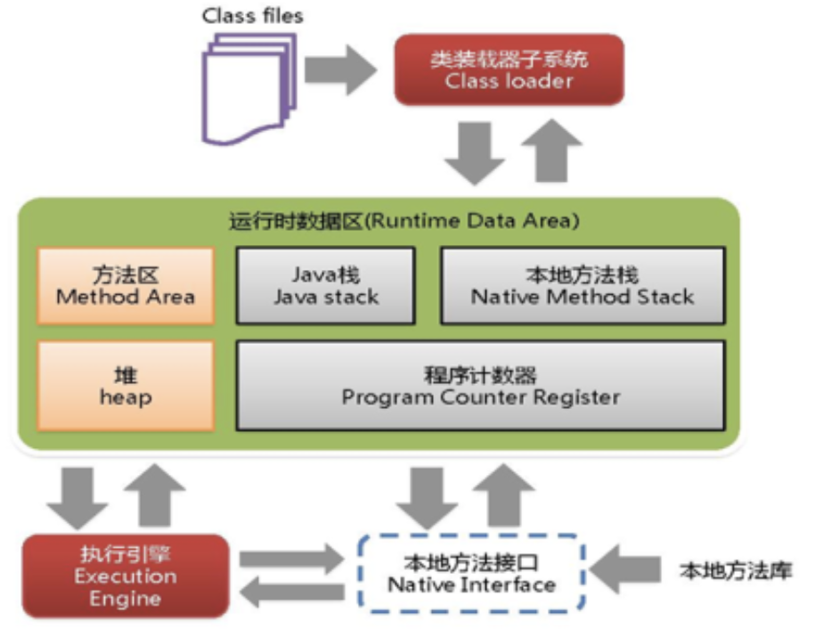
JVM发生在<strong><font color='red'>heap堆区</font></strong>

###GC是什么（分代收集算法）
次数上频繁收集young区 Minor GC
次数上较少手机old区 Full GC
基本不动Perm区

###GC算法
1) 引用计数法（已被JVM淘汰）
   > 缺点：较难处理循环引用问题
2) 复制算法 Copying（年轻代使用的minorGC，采用的该算法）
   > 优点：不会产生内存碎片
   > 缺点：需要双倍空间  
3) 标记清除算法 Mark-Sweep（发生在老年代，一般由标记清除，或标记清除与标记整理混合实现）
   > 优点：不需要额外空间
   > 缺点：两次扫描耗时严重，会产生内存碎片   
4) 标记压缩 Mark- Compact（发生在老年代）
   > 优点：没有内存碎片
   > 缺点：需要移动对象的成本  

注：**3和4经常结合一起使用**，即标记-压缩-整理（Mark-Sweep-Compact）：多次进行标记删除后，会产生大量内存碎片，再使用标记压缩进行内存整理

######以上为第一季的笔记  

---
######以下为第二季的笔记

###GC
####Java体系结构概览：


类装载器，主要有：
- 启动类加载器（根加载器，用C++语言写的bootstrap）
- 拓展类加载器
- 应用类加载器  
  也可继承classLoader，实现自定义加载器。

GC主要发生在方法区和堆区。

--------
背景：Oracle收购了BEA和SUN公司后，有了JRockit和Hotspot两套JDK规范，将两套方案混合了：干掉了JVM的永久代，变成了Java8的元空间。参考网页：https://openjdk.org/jeps/122  
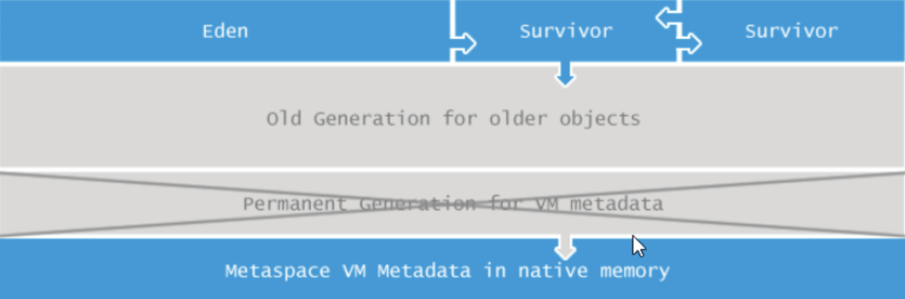

#####JVM垃圾回收的时候如何确定垃圾？
基木思路就是通过一系列名为”GC Roots” 的对象作为起始点，从这个被称为GC Roots的对象开始向下搜素，如果一个对象到GC Roots没有任何引用链相连时，则说明此对象不可用。也即给定一个集合的引用作为根出发，通过引用关系遍历对象图，能被遍历到的(可到达的）对象就被判定为存活：没有被遍历到的就自然被判定为死亡。
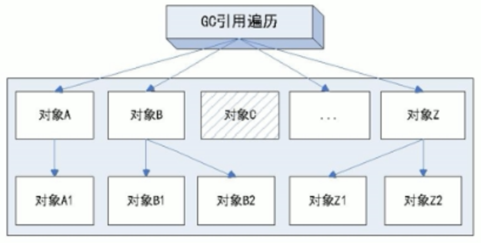

>通俗地讲，“朝中有人好做官，没有背景就容易被回收”。亦或是，人养宠物狗，宠物狗丢了会变成流浪狗，没有主人保护狗狗就容易收到其他人欺负。

#####Java可以作为GCRoots的对象
- 虚拟机栈（栈帧中的局部变量区，也叫做局部变量表）中引用的对象。
- 方法区中的类静态属性引用的对象。
- 方法区中常量引用的对象。
- 本地方法栈中JNI（Native方法）引用的对象

#####JVM的参数类型
- 标配参数（了解）
  >例如java -version、java -help
- X参数（了解）
  >-Xint 解释执行
  -Xcomp 第一次使用就编译成本地代码，再执行
  -Xmixed 将解释模式预编译模式进行混合使用，由JVM自己决定
- XX参数（重点掌握）
   1. Boolean类型 -XX: +或者- 某个属性值（+表示开启、-表示关闭）
      例如：打印GC收集细节 -XX:+PrintGCDetails、使用串行垃圾收集器 -XX:+UseSerialGC
      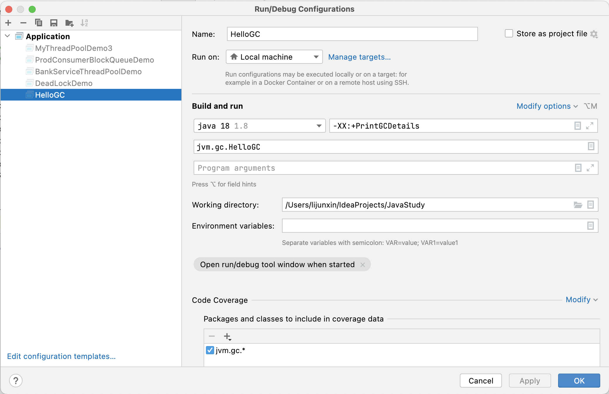
   3. kv设置类型 -XX:属性key=属性值value
      例如：设置元空间大小 -XX:MetaspaceSize=128m、设置垃圾最大停留年龄-XX:MaxTenuringThreshold=15
      
   4. jinfo -flag 配置项 进程编号
      >lijunxin@lijunxins-Air JavaStudy % jinfo -flag MetaspaceSize 62757
      -XX:MetaspaceSize=22020096

      > lijunxin@lijunxins-Air JavaStudy % jinfo -flags 62846             
      VM Flags:
      -XX:CICompilerCount=4 -XX:ConcGCThreads=2 -XX:G1ConcRefinementThreads=8 -XX:G1EagerReclaimRemSetThreshold=12 -XX:G1HeapRegionSize=1048576 -XX:G1RemSetArrayOfCardsEntries=12 -XX:G1RemSetHowlMaxNumBuckets=8 -XX:G1RemSetHowlNumBuckets=4 -XX:GCDrainStackTargetSize=64 -XX:InitialHeapSize=134217728 -XX:MarkStackSize=4194304 -XX:MaxHeapSize=2147483648 -XX:MaxNewSize=1287651328 -XX:MetaspaceSize=134217728 -XX:MinHeapDeltaBytes=1048576 -XX:MinHeapSize=8388608 -XX:NonNMethodCodeHeapSize=5839564 -XX:NonProfiledCodeHeapSize=122909338 -XX:ProfiledCodeHeapSize=122909338 -XX:ReservedCodeCacheSize=251658240 -XX:+SegmentedCodeCache -XX:SoftMaxHeapSize=2147483648 -XX:+UseCompressedClassPointers -XX:+UseCompressedOops -XX:+UseG1GC -XX:-UseNUMA -XX:-UseNUMAInterleaving

      <font color='red'>Xms与Xmx参数，是X参数还是XX参数</font>
      答：都属于XX参数，Xms等价于 -XX:InitialHeapSize，Xmx等价于-XX:MaxHeapSize。

#####JVM盘点家底的命令
- 第一种：
   - jinfo -flag 具体参数 java进程编号
   - jinfo -flags java进程编号
- 第二种：（更加正规的做法）
   - 查看初始默认值-XX:+PrintFlagsInitial
   - 查看修改更新值-XX:+PrintFlagsFinal
   - 查看一些关键参数如GC垃圾回收器-XX:+PrintCommandLineFlags

>输出结果key/value中键值对中，=未被修改的 :=人为或虚拟机修改的


#####堆内存初始化（Xms和Xmx参数初始值）
```java
/**
 * @author andy_ruohan
 * @description 虚拟机Xms和Xmx初始值
 * @date 2023/4/3 22:48
 */
public class HelloGC {
    public static void main(String[] args) throws InterruptedException {
        //返回 Java 虚拟机的内存总量。
        long totalMemory = Runtime.getRuntime().totalMemory();
        //返回 Java 虚拟机试图使用的最大内存量。
        long maxMemory = Runtime.getRuntime().maxMemory();
        System.out.println("TOTAL_MEMORY(-Xms) = " + totalMemory + " (字节) ，即" + (totalMemory / (double)1024 / 1024) + "MB");
        System.out.println("MAX_MEMORY(-Xmx) = " + maxMemory + " (字节) ，即" + (maxMemory / (double)1024 / 1024) + "MB");
    }
}
```
>TOTAL_MEMORY(-Xms) = 136314880 (字节) ，即130.0MB
MAX_MEMORY(-Xmx) = 2147483648 (字节) ，即2048.0MB

即，`Xms初始值：1/64 * 物理内存、Xmx初始值：1/4 * 物理内存`


#####栈内存初始化（-Xss参数初始化）
注意与Xms和Xmx做区分，`栈管运行，堆管存储`。其默认大小见下方的JDK官方文档：

java8: https://docs.oracle.com/javase/8/docs/technotes/tools/windows/java.html#BGBCIEFC
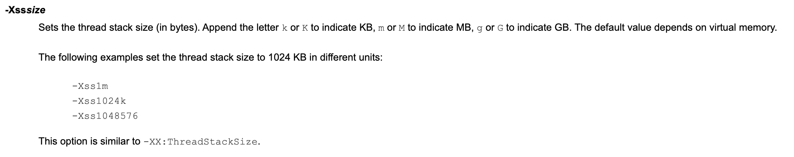
示例：Java8虚拟机中ThreadStackSize=0代表的取默认值
```java
intx ThreadStackSize                           = 0                                   {pd product}
```

java9: https://docs.oracle.com/javase/9/tools/java.htm#JSWOR624
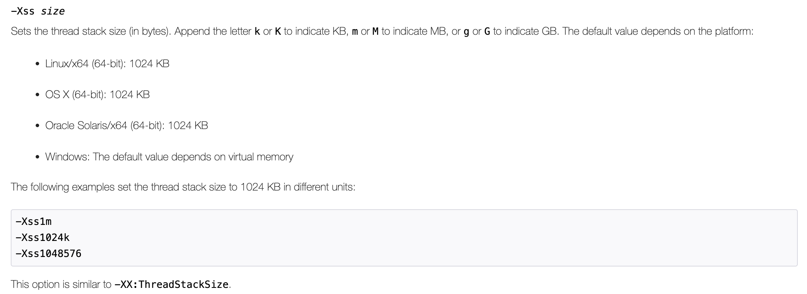

java20: https://docs.oracle.com/en/java/javase/20/docs/specs/man/java.html
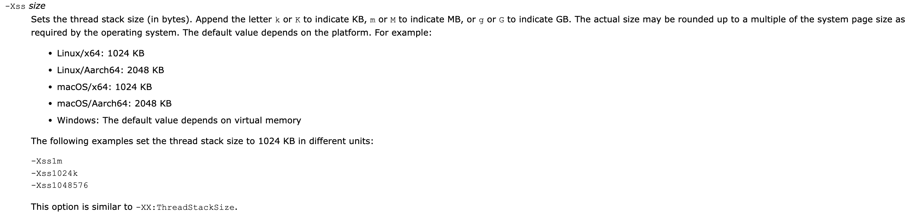

#####设置新生代大小-Xmn
项目没有特殊需求，几乎用不到。

#####设置元空间大小-XX:MetaspaceSize
`元空间JVM默认大小为21M`并不大，故该命令在项目中可能会常用到。
元空间的本质和永久代类似，都是对JVM规范中方法区的实现。不过元空间与永久代之间最大的区别在于：<font color='red'>元空间并不在虚拟机中，而是使用本地内存。</font>因此，默认情况下，元空间的大小仅受本地内存限制。

#####打印垃圾回收器详情-XX:+PrintGCDetails
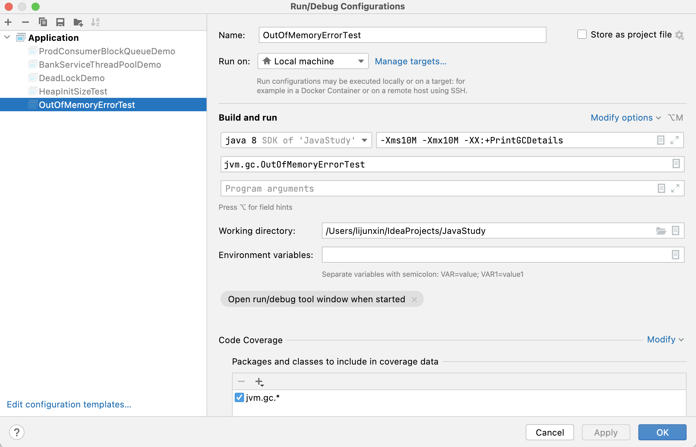
```java
/**
 * @author andy_ruohan
 * @description OOM运行测试、并打印GC运行详情（预先设置JVM参数-Xms10M -Xmx10M -XX:+PrintGCDetails）
 * @date 2023/4/5 20:00
 */
public class OutOfMemoryErrorTest {
    public static void main(String[] args) {
        // 下面该行会报：OutOfMemoryError: Java heap space
        Byte[] bytes = new Byte[50 * 1024 * 1024];
    }
}
```

运行结果：
```java
[GC (Allocation Failure) [PSYoungGen: 1437K->496K(4608K)] 1437K->512K(15872K), 0.0005106 secs] [Times: user=0.00 sys=0.00, real=0.00 secs] 
[GC (Allocation Failure) [PSYoungGen: 496K->496K(4608K)] 512K->536K(15872K), 0.0004586 secs] [Times: user=0.00 sys=0.01, real=0.00 secs] 
[Full GC (Allocation Failure) [PSYoungGen: 496K->0K(4608K)] [ParOldGen: 40K->359K(11264K)] 536K->359K(15872K), [Metaspace: 3166K->3166K(1056768K)], 0.0020345 secs] [Times: user=0.01 sys=0.00, real=0.00 secs] 
[GC (Allocation Failure) [PSYoungGen: 0K->0K(4608K)] 359K->359K(15872K), 0.0002599 secs] [Times: user=0.00 sys=0.00, real=0.01 secs] 
[Full GC (Allocation Failure) [PSYoungGen: 0K->0K(4608K)] [ParOldGen: 359K->334K(11264K)] 359K->334K(15872K), [Metaspace: 3166K->3166K(1056768K)], 0.0016703 secs] [Times: user=0.00 sys=0.00, real=0.00 secs] 
Heap
 PSYoungGen      total 4608K, used 205K [0x00000007bfb00000, 0x00000007c0000000, 0x00000007c0000000)
  eden space 4096K, 5% used [0x00000007bfb00000,0x00000007bfb334c8,0x00000007bff00000)
  from space 512K, 0% used [0x00000007bff00000,0x00000007bff00000,0x00000007bff80000)
  to   space 512K, 0% used [0x00000007bff80000,0x00000007bff80000,0x00000007c0000000)
 ParOldGen       total 11264K, used 334K [0x00000007bf000000, 0x00000007bfb00000, 0x00000007bfb00000)
  object space 11264K, 2% used [0x00000007bf000000,0x00000007bf0538d8,0x00000007bfb00000)
 Metaspace       used 3246K, capacity 4496K, committed 4864K, reserved 1056768K
  class space    used 351K, capacity 388K, committed 512K, reserved 1048576K
Exception in thread "main" java.lang.OutOfMemoryError: Java heap space
	at jvm.gc.GCRunTest.main(GCRunTest.java:11)
```

如何看GC所打出的日志详情，可参考下图：
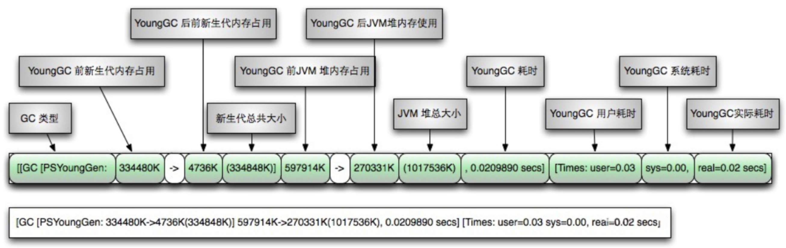
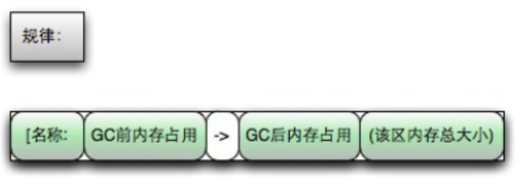

#####堆内存结构占比命令
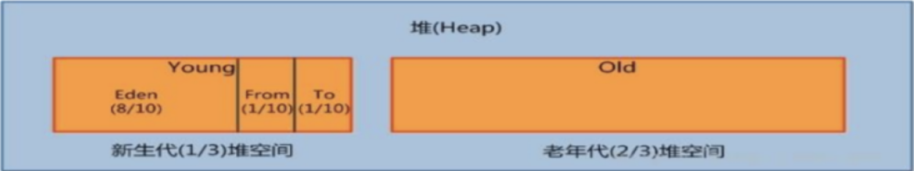
#####设置新生代结构比例-XX:SurvivorRatio（默认为8，即eden:from:to = 8:1:1）
```java
 PSYoungGen      total 4608K, used 205K [0x00000007bfb00000, 0x00000007c0000000, 0x00000007c0000000)
  eden space 4096K, 5% used [0x00000007bfb00000,0x00000007bfb334c8,0x00000007bff00000)
  from space 512K, 0% used [0x00000007bff00000,0x00000007bff00000,0x00000007bff80000)
  to   space 512K, 0% used [0x00000007bff80000,0x00000007bff80000,0x00000007c0000000)
```

#####设置老年代与新生代比例-XX:NewRatio（默认为2，old:young = 2:1）
```java
 PSYoungGen      total 4608K, used 205K 
 ParOldGen       total 11264K, used 334K [0x00000007bf000000, 0x00000007bfb00000, 0x00000007bfb00000)
```
注意：实测的时候为2.4:1，有一定的偏差

#####垃圾停留最大年龄-XX:MaxTenuringThreshold
垃圾停留：即新生代survivor区从from到to、从to到from来回复制的最大此处。默认为15，超过15JVM会报错。
```java
MaxTenuringThreshold of 20 is invalid; must be between 0 and 15
Error: Could not create the Java Virtual Machine.
Error: A fatal exception has occurred. Program will exit.
```


####综合样例：
#####配置前的JVM的设置
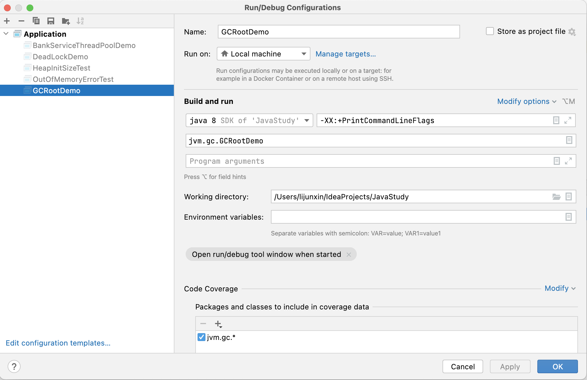
打印出的JVM配置：
```java
-XX:InitialHeapSize=134217728 -XX:MaxHeapSize=2147483648 -XX:+PrintCommandLineFlags -XX:+UseCompressedClassPointers -XX:+UseCompressedOops -XX:+UseParallelGC 
```

#####添加常见的JVM配置
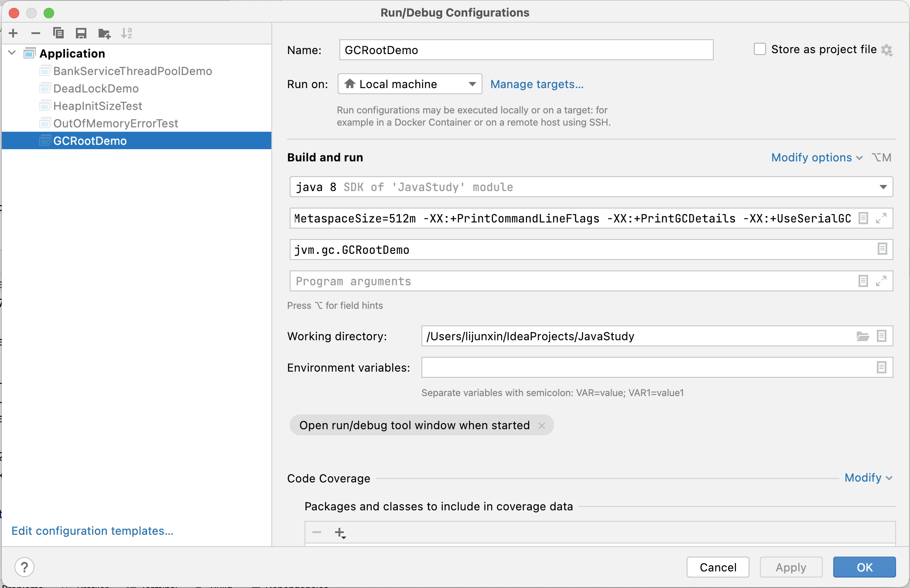
具体配置信息为：-Xms128m -Xmx4096m -Xss1024k -XX:MetaspaceSize=512m -XX:+PrintCommandLineFlags -XX:+PrintGCDetails -XX:+UseSerialGC

#####最终打印出的JVM配置
```java
-XX:InitialHeapSize=134217728 -XX:MaxHeapSize=4294967296 -XX:MetaspaceSize=536870912 -XX:+PrintCommandLineFlags -XX:+PrintGCDetails -XX:ThreadStackSize=1024 -XX:+UseCompressedClassPointers -XX:+UseCompressedOops -XX:+UseSerialGC 
```

#####强引用、软引用、弱引用、虚引用
强引用：无论如何都不会被gc，即便是出现OOM。
软引用：系统内存充足，不会被gc；系统内存不足，会被gc。
弱引用：只要产生gc，就会被回收。
虚引用：如果一个对象仅持有虚引用，那么它就和没有任何引用一样，在任何时候都可能被垃圾回收器回收。类似于被判了死缓。

#####软引用和弱引用的使用场景
假如有一个应用需要读取大量的本地图片：
- 如果每次读取图片都从硬盘读取则会严重影响性能，
- 如果一次性全部加载到内存中又可能造成内存溢出。

此时使用软引用可以解决这个问题。
设计思路是：用一个HashMap来保存图片的路径和相应图片对象关联的软引用之问的映射关系，在内存不足时，JVM会自动回收这些缓存图片对象所占用的空间，从而有效地避免了OOM的问题。
```java
Map<String, SoftReference<Bitmap>> imageCache = new HashMap<String, SoftReference<Bitmap>>();
```

#####虚引用的使用场景
虚引用不能单独使用也不能通过它访问对象，必须和引用队列(ReferenceQueue)联合使用，其主要作用是跟踪对象被垃圾回收的状态，在这个对象被收集器回收的时候收到一个系统通知或者后续添加进一步的处理。**有点类似于对象临终前的遗言**。
>Java技术允许使用finalize()方法在垃圾收集器将对象从内存中清除出去之前做必要的清理工作。

#####StackOverflowError
```java
/**
 * @author andy_ruohan
 * @description StackOverflowError测试
 * @date 2023/4/8 15:36
 */
public class StackOverflowErrorDemo {
    public static void main(String[] args) {
        stackOverflowError();

    }

    private static void stackOverflowError() {
        //Exception in thread "main" java.lang.StackOverFlowError
        stackOverflowError();
    }
}
```
运行结果：
```java
Exception in thread "main" java.lang.StackOverflowError
	at jvm.error.StackOverflowErrorDemo.stackOverflowError(StackOverflowErrorDemo.java:16)
	at jvm.error.StackOverflowErrorDemo.stackOverflowError(StackOverflowErrorDemo.java:16)
	at jvm.error.StackOverflowErrorDemo.stackOverflowError(StackOverflowErrorDemo.java:16)
	at jvm.error.StackOverflowErrorDemo.stackOverflowError(StackOverflowErrorDemo.java:16)
	at jvm.error.StackOverflowErrorDemo.stackOverflowError(StackOverflowErrorDemo.java:16)
	at jvm.error.StackOverflowErrorDemo.stackOverflowError(StackOverflowErrorDemo.java:16)
	at jvm.error.StackOverflowErrorDemo.stackOverflowError(StackOverflowErrorDemo.java:16)
	at jvm.error.StackOverflowErrorDemo.stackOverflowError(StackOverflowErrorDemo.java:16)
	at jvm.error.StackOverflowErrorDemo.stackOverflowError(StackOverflowErrorDemo.java:16)
	at jvm.error.StackOverflowErrorDemo.stackOverflowError(StackOverflowErrorDemo.java:16)

......
```

#####OutOfMemoryError: Java heap space
```java
/**
 * @author andy_ruohan
 * @description OutOfMemoryError: Java heap space 
 *  JVM参数: -Xms10M -Xmx10M
 * @date 2023/4/8 15:45
 */
public class JavaHeapSpaceDemo {
    public static void main(String[] args) {
        //Exception in thread "main" java.lang.OutOfMemoryError: Java heap space
        byte[] bytes = new byte[30 * 1024 * 1024];
    }
}
```
运行结果：
```java
Exception in thread "main" java.lang.OutOfMemoryError: Java heap space
	at jvm.error.JavaHeapSpaceDemo.main(JavaHeapSpaceDemo.java:11)
```

#####OutOfMemoryError: GC overhead limit exceeded
```java
/**
 * @author andy_ruohan
 * @description OutOfMemoryError: GC overhead limit exceeded测试
 *  JVM参数：-Xms10m -Xmx10m -XX:+PrintGCDetails
 * @date 2023/4/8 15:59
 */
public class GCOverheadDemo {
    public static void main(String[] args) {
        int i = 0;
        List<String> list = new ArrayList<>();
        try {
            while (true) {
                list.add(String.valueOf(++i).intern());
            }
        } catch (Throwable e) {
            System.out.println("**************i: " + i);
            e.printStackTrace();//Exception in thread "main" java. Lang.OutofMemoryError: GC overhead Limit exceeded throw e;
        }
    }
}
```
运行结果：
```java
java.lang.OutOfMemoryError: GC overhead limit exceeded
	at java.lang.Integer.toString(Integer.java:401)
	at java.lang.String.valueOf(String.java:3099)
	at jvm.error.GCOverheadDemo.main(GCOverheadDemo.java:21)
```

#####OutOfMemoryError: Direct buffer memory
```java
public class DirectBufferMemoryDemo {
    public static void main(String[] args) {
        System.out.println("配置的maxDirectMemory:" + (sun.misc.VM.maxDirectMemory() / (double) 1024 / 1024) + "MB");
        try {
            Thread.sleep(3000);
        } catch (InterruptedException e) {
            e.printStackTrace();
        }
        //-XX:MaxDirectMemorySize=5m 我们配置为5MB，但实际使用6MB，故意使坏
        ByteBuffer bb = ByteBuffer.allocateDirect(6 * 1024 * 1024);
    }
}
```

运行结果：
```java
Exception in thread "main" java.lang.OutOfMemoryError: Direct buffer memory
	at java.nio.Bits.reserveMemory(Bits.java:695)
	at java.nio.DirectByteBuffer.<init>(DirectByteBuffer.java:123)
	at java.nio.ByteBuffer.allocateDirect(ByteBuffer.java:311)
	at jvm.error.DirectBufferMemoryDemo.main(DirectBufferMemoryDemo.java:31)
```

#####OutOfMemoryError: unable to create new native thread
```java
/**
 * @author andy_ruohan
 * @description unable to create new native thread测试
 * @date 2023/4/10 22:27
 */
public class UnableCreateNewThreadDemo {
    public static void main(String[] args) {
        for (int i = 1; ; i++) {
            System.out.println("************* i = " + i);
            new Thread(() -> {
                try {
                    Thread.sleep(Integer.MAX_VALUE);
                } catch (InterruptedException e) {
                    e.printStackTrace();
                }
            }, "" + i).start();
        }
    }
}
```

运行结果：
```java
......

************* i = 2022
************* i = 2023
************* i = 2024
************* i = 2025
Exception in thread "main" java.lang.OutOfMemoryError: unable to create new native thread
	at java.lang.Thread.start0(Native Method)
	at java.lang.Thread.start(Thread.java:719)
	at jvm.error.UnableCreateNewThreadDemo.main(UnableCreateNewThreadDemo.java:28)
```
Linux可通过以下命令查看和修改线程数上限：
```
查看线程数上限：ulimit -u
```
```
修改线程数上限：vim /etc/security/limits.d/90-nproc.conf打开文件后，修改对应用户的上限
```

#####OutOfMemoryError: Metaspace
```java
/**
 * @author andy_ruohan
 * @description OutOfMemoryError: Metaspace测试
 *  JVM参数：-XX:MetaspaceSize=10m -XX:MaxMetaspaceSize=10m
 * @date 2023/4/10 23:02
 */
public class MetaspaceOomDemo {
    static class OomTest {
    }

    public static void main(String[] args) {
        //模拟计数多少次以后发生异常
        int i = 0;
        try {
            while (true) {
                i++;
                Enhancer enhancer = new Enhancer();
                enhancer.setSuperclass(OomTest.class);
                enhancer.setUseCache(false);
                enhancer.setCallback(new MethodInterceptor() {
                    @Override
                    public Object intercept(Object o, Method method, Object[] objects, MethodProxy methodProxy) throws Throwable {
                        return methodProxy.invokeSuper(o, args);
                    }
                });
                enhancer.create();
            }
        } catch (Throwable e) {
            System.out.println("**********多少次后发生了异常：" + i);
            e.printStackTrace();
        }
    }
}
```

运行结果：
```java
**********多少次后发生了异常：546
java.lang.OutOfMemoryError: Metaspace
	at net.sf.cglib.core.AbstractClassGenerator.generate(AbstractClassGenerator.java:348)
	at net.sf.cglib.proxy.Enhancer.generate(Enhancer.java:492)
	at net.sf.cglib.core.AbstractClassGenerator$ClassLoaderData.get(AbstractClassGenerator.java:117)
	at net.sf.cglib.core.AbstractClassGenerator.create(AbstractClassGenerator.java:294)
	at net.sf.cglib.proxy.Enhancer.createHelper(Enhancer.java:480)
	at net.sf.cglib.proxy.Enhancer.create(Enhancer.java:305)
	at jvm.error.MetaspaceOomDemo.main(MetaspaceOomDemo.java:46)
```


