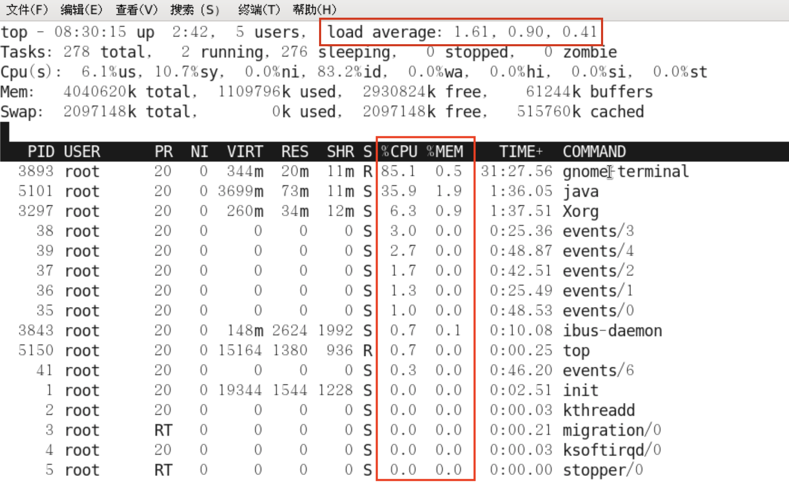
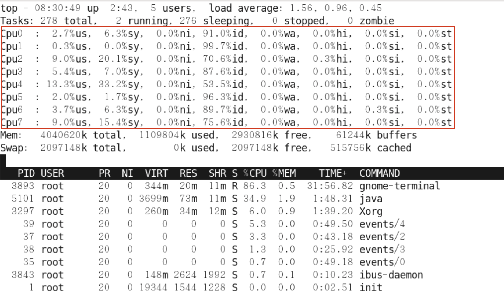
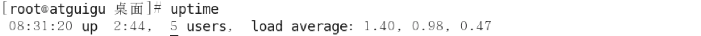
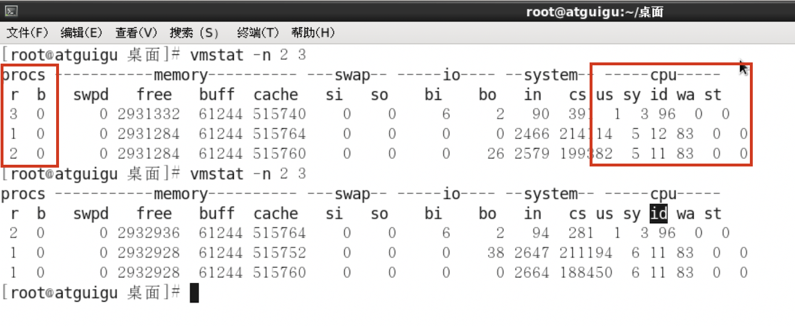

###Linux命令
####整机命令
```
top
```
运行效果：


一般主要看图上标红框的几个参数：CPU、MEM、Load average，其中负载均衡Load average后的三个数字分别代表系统1分钟、5分钟、15分钟的负载值，`如果三个值的和 / 3 * 100% > 60%，代表系统的压力重`。

按键盘数字1后的效果，可查看CPU使用详情：


注：用苹果电脑未复现，展不开数据

```
uptime
```
uptime是top命令的精简版，运行效果如下：



####CPU命令
```
vmstat
```
一股vmstat工具的使用是通过两个数字参数来完成的，第一个参数是采样的时间间隔数单位是秒，第一个参数是采样的次数。主要关注下图红框处参数值：


其中，
- procs
  - r：运行和等待CPU时间片的进程数，原则上1核的CPU的运行队列不要超过2，整个系统的运行队列不能超过总核数的2倍
  否则代表系统压力过大。
  - b：等待资源的进程数，比如正在等待磁盘I/O、网络I/O等。
- cpu
  - us：用户进程消耗CPU时间百分比，us值高，用户进程消托CPU时间多，如果长期大于50%，优化程序。
  - sy：内核进程消耗CPU时间百分比。
  - us + sy参考值为80%，如果us + sy大于80%，说明可能存在CPU不足。
  - id：处于空闲的CPU百分比。
  - wa：系统等待IO的CPU时间百分比。
  - st：来自于一个虚拟机偷取的CPU时间的百分比。