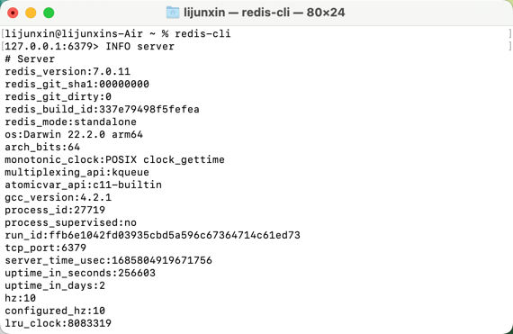
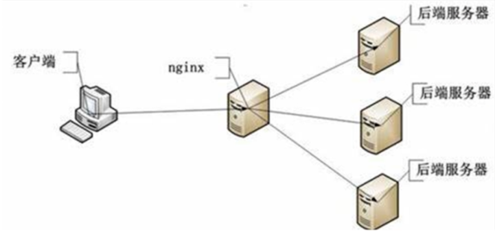
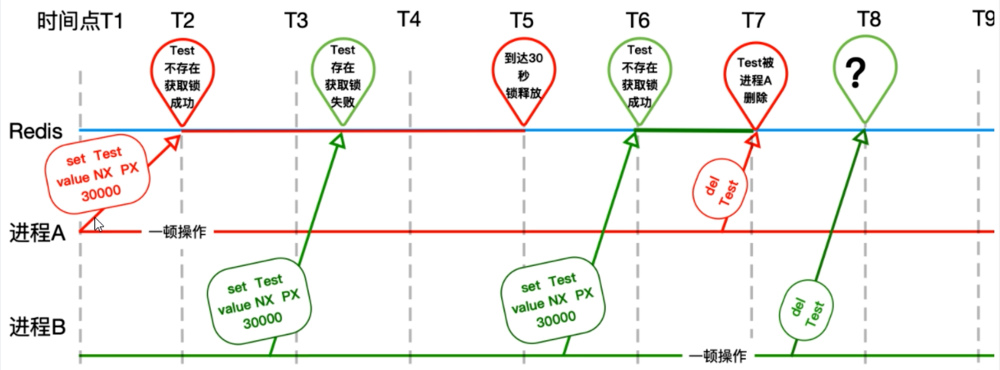
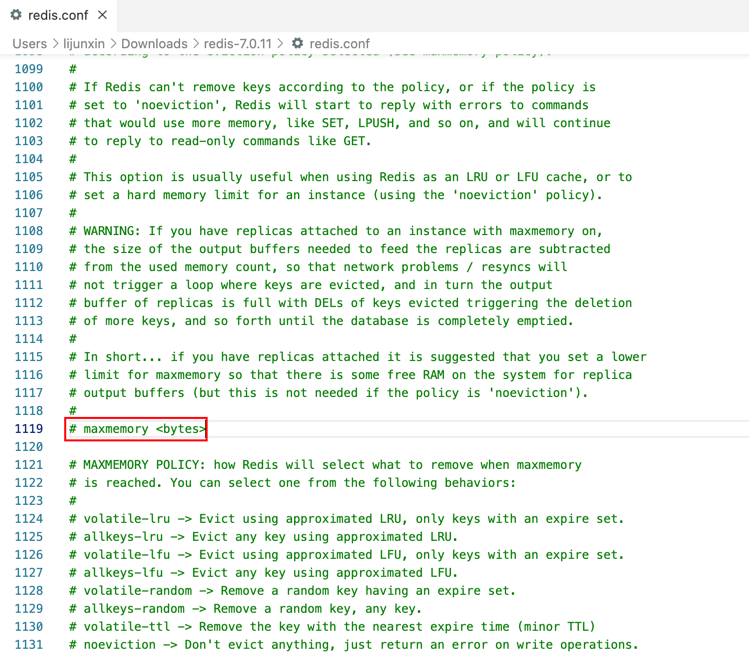
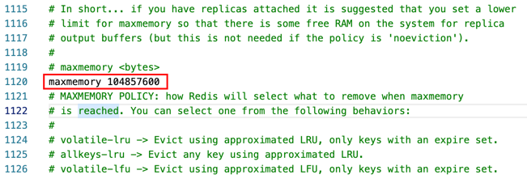

### mac 电脑 redis 的安装
1. 安装 redis
```
brew install redis
```
一般安装成功后，程序文件存放目录: /usr/local/opt/redis，配置文件存放目录: /usr/local/etc/...。
2. 添加 path 
```
vim ~/.bash_profile
```
如果使用的是默认安装路径，一般安装在/usr/local/opt/redis。

```
export REDIS = /usr/local/opt/reids/bin;
export = $REDIS:$PATH
```
3. 启动 redis-server  
```
brew services start redis
```
未进入 redis 命令行前，可通过查看如下代码查看 redis 版本
``` 
redis-server --version
```
4. 进入 redis 命令行
```
redis-cli
```
进入 redis 命令行后，可通过查看如下代码查看 redis 版本
``` 
INFO server
```




| 商品操作                          | redis命令                               |
|:------------------------------|:--------------------------------------|
| 商品编号1001的销量是9，商品编号1002的销量是15  | zadd goods:sellsort 9 1001 15 1002    |
| 有一个客户又买了2件商品1001，商品编号1001销量加2 | zincrby goods:sellsort 2 1001         |
| 求商品销量前10名                     | zrange goods:sellsort 0 10 withscores |

```
127.0.0.1:6379> zadd goods:sellsort 9 1001 15 1002
(integer) 2
127.0.0.1:6379> zrange goods:sellsort 0 10 withscores
1) "1001"
2) "9"
3) "1002"
4) "15"
127.0.0.1:6379> zincrby goods:sellsort 2 1001
"11"
127.0.0.1:6379> zrange goods:sellsort 0 10 withscores
1) "1001"
2) "11"
3) "1002"
4) "15"
```

### redis实践
```java {.line-numbers}
@RestController
public class GoodsController {
    @Autowired
    private StringRedisTemplate stringRedisTemplate;

    @Value("${server.port}")
    private String severPort;

    @GetMapping("/buy_goods")
    public String buyGoods() {
        String result = stringRedisTemplate.opsForValue().get("goods:001");
        int goodsNumber = result == null ? 0: Integer.parseInt(result);

        if (goodsNumber > 0) {
            int realNumber = goodsNumber - 1;
            stringRedisTemplate.opsForValue().set("goods:001", String.valueOf(realNumber));
            System.out.println("成功买到商品，库存还剩下" + realNumber + "件" + "\t服务提供端口 " + severPort);

            return "成功买到商品，库存还剩下" + realNumber + "件" + "\t服务提供端口 " + severPort;
        } else {
            System.out.println("商品已经售完/活动结束/调用超时，欢迎下次光临" + "\t服务提供端口 " + severPort);
        }
        return "商品已经售完/活动结束/调用超时，欢迎下次光临" + "\t服务提供端口 " + severPort;
    }
}
```
运行结果：


以上代码在高并发环境会出现的问题：
1. 11~12行非原子性
2. 14行条件会被越过

##### 错误优化：加synchronized
```java {.line-numbers}
@RestController
public class GoodsController {
    @Autowired
    private StringRedisTemplate stringRedisTemplate;

    @Value("${server.port}")
    private String severPort;

    @GetMapping("/buy_goods")
    public String buyGoods() {
        synchronized (this) {
            String result = stringRedisTemplate.opsForValue().get("goods:001");
            int goodsNumber = result == null ? 0: Integer.parseInt(result);

            if (goodsNumber > 0) {
                int realNumber = goodsNumber - 1;
                stringRedisTemplate.opsForValue().set("goods:001", String.valueOf(realNumber));
                System.out.println("成功买到商品，库存还剩下" + realNumber + "件" + "\t服务提供端口 " + severPort);

                return "成功买到商品，库存还剩下" + realNumber + "件" + "\t服务提供端口 " + severPort;
            } else {
                System.out.println("商品已经售完/活动结束/调用超时，欢迎下次光临" + "\t服务提供端口 " + severPort);
            }
            return "商品已经售完/活动结束/调用超时，欢迎下次光临" + "\t服务提供端口 " + severPort;
        }
    }
}
```
在11行处添加synchronized (this)，实际生产环境解决不了高并发问题：因为服务器端会通过nginx代理多台服务器，高并发的请求还是会进来，处理不了`超卖`、`多卖`的情况。


> 加锁场景拓展补充：  
> synchronized：不见不散，适用场景：等不到就一直等
reentrantLock：过时不候，适用场景：等了一段时间不想等了


问题3：出现异常的话，无法释放锁，必须在代码层面finally释放锁  
解决：加锁解锁，lock/unlock必须同时出现并保证调用

问题4：部署了微服务jar包的实例挂了，代码层面根本没有走到finally，没办法保证解锁，这个key没有被删除，需要加入一个过期时间限定key  
解决：需要对LockKey有过期时间的限定

问题5：设置key+过期超时分开了，不具备原子性  
解决：必须要合并成一行，具备原子性

问题6：张冠李戴，删除了别人的锁

解决：只能删除自己的，不能删除别人的  
redis官网：https://redis.io/commands/set/ 的解决方案：使用lua脚本
```java
if redis.call("get",KEYS[1]) == ARGV[1]
then
    return redis.call("del",KEYS[1])
else
    return 0
end
```

##Redis事务
### 事务介绍
- Redis的事务是通过<font color = 'orange'>MULTI，EXEC，DISCARD和WATCH</font>这四个命令来完成。
- Redis的单个命令都是<font color = 'orange'>原子性</font>的，所以这里确保事务性的对象是<font color = 'orange'>命令集合</font>。
- Redis将命令集合序列化并确保处于一事务的<font color = 'orange'>命令集合连续且不被打断</font>的执行。
- Redis<font color = 'orange'>不支持回滚</font>的操作。
### 相关命令
- MULTI 
  - 注：<font color = 'orange'>用于标记事务块的开始</font>。
  - Redis会将后续的命令逐个放入队列中，然后使用<font color = 'orange'>EXEC</font>命令原子化地执行这个命令序列。
  - 语法：<font color = 'orange'>MULTI</font>
- EXEC
  - 在一个<font color = 'orange'>事务中执行所有先前放入队列的命令</font>，然后恢复正常的连接状态。
  - 语法：<font color = 'orange'>EXEC</font>
- DISCARD
  - 清楚所有先前在一个事务中放入队列的命令，然后恢复正常的连接状态。
  - 语法：<font color = 'orange'>DISCARD</font> 
- WATCH
  - 当某个<font color = 'orange'>事务需要按条件执行</font>时，就要使用这个命令将给定的<font color = 'orange'>键设置为受监控</font>的<font color = 'orange'>状态</font>。
  - 语法：<font color = 'orange'>WATCH key [key...]</font>

### MUTI并发脚本实例


``` redis脚本1
127.0.0.1:6379> MULTI
OK
127.0.0.1:6379(TX)> set key1 v11
QUEUED
127.0.0.1:6379(TX)> set key2 v22
QUEUED
```
redis在上一个线程执行上述MULTI命令未执行完前，另一个线程先执行完下述命令：
``` redis脚本2
127.0.0.1:6379> set key1 aa
OK
127.0.0.1:6379> get key1
"aa"
127.0.0.1:6379> set key2 bb
OK
127.0.0.1:6379> get key2
"bb"
```
最终当第一个线程执行完MULTI后，最终的数据结果为<font color = 'blue'> key1 和 key2 被更新成功了</font>
``` 最终执行结果
127.0.0.1:6379(TX)> EXEC
1) OK
2) OK
127.0.0.1:6379> get key1
"v11"
127.0.0.1:6379> get key2
"v22"
```

### WATCH并发脚本示例
``` redis脚本1
127.0.0.1:6379> WATCH key1
OK
127.0.0.1:6379> MULTI
OK
127.0.0.1:6379(TX)> set key1 v11
QUEUED
127.0.0.1:6379(TX)> set key2 v22
QUEUED
```
redis在上一个线程执行上述MULTI命令未执行完前，另一个线程先执行完下述命令：
``` redis脚本2
127.0.0.1:6379> set key1 aa
OK
127.0.0.1:6379> set key2 bb
OK
```
最终当第一个线程执行完MULTI后，最终的数据结果为<font color = 'red'> key1 和 key2 都没有被更新</font>
``` 最终执行的结果
127.0.0.1:6379(TX)> EXEC
(nil)
127.0.0.1:6379> get key1
"aa"
127.0.0.1:6379> get key2
"bb"
127.0.0.1:6379> 
```

CAP 是分布式系统中的三个核心属性，它是由计算机科学家 Eric Brewer 提出的，代表一致性（Consistency）、可用性（Availability）、分区容错性（Partition tolerance）。

具体含义如下：

- 一致性（Consistency）：指系统在数据写入操作完成后，所有的数据副本都具有相同的值，保持数据的一致性。
- 可用性（Availability）：指系统能够在正常运行状态下提供服务，对于用户的请求可以及时响应。
- 分区容错性（Partition tolerance）：指系统能够继续工作并提供服务，即使系统内部发生了网络分区或者节点故障。    

CAP 原则指出，在一个分布式系统中，无法同时满足一致性、可用性和分区容错性这三个属性，最多只能满足其中的两个。这是由于在分布式系统中，网络通信的延迟和不确定性，以及节点故障等因素的存在，会导致在面临网络分区的情况下，要么保证一致性和分区容错性，但可用性降低（CP），要么保证可用性和分区容错性，但一致性降低（AP）。

参考样例：  
redis：AP  
zookeeper：CP

Redisson
https://redis.io/docs/manual/patterns/distributed-locks/

### redis缓存过期淘汰策略
### 生产上redis内存设置多少

### 如何配置、修改redis的内存大小
### 如果内存满了你怎么办  
### redis清理内存的方式？定期删除和惰性删除了解过吗
### redis缓存淘汰策略
### redis的LRU了解过吗？可否手写一个LRU算法


### redis默认内存多少？在哪里查看？如何修改设置？
#### 如何查看redis最大占用内存？
##### 方法1：redis.conf里看



注意maxmemory单位是bytes字节类型，注意转换。  
附注：如何找到redis.conf文件（不一定准确，待考究，默认不一定走这里）
```
redis-cli config get dir
```
> 1) "dir"
> 2) "/Users/lijunxin"

``` 
find /Users/lijunxin -name redis.conf
```
> /Users/lijunxin/Downloads/redis-7.0.11/redis.conf  

#### redis默认内存多少可以用？
如果不设置最大内存大小或者设置最大内存大小为0，`在64位操作系统下不限制内存大小`，在32位操作系统下最多使用3GB
内存  

#### 一般生产上你如何配置？
一般推荐Redis设置内存为最大物理内存的四分之三

#### 如何修改redis内存设置
- **通过修改配置文件**（永久生效）
  

  配置前
  ``` 
  127.0.0.1:6379> config get maxmemory
  1) "maxmemory"
  2) "0"
  ```
  配置后
  ```
  127.0.0.1:6379> config get maxmemory
  1) "maxmemory"
  2) "0"
  ```
- **通过命令修改**（临时生效）
  ```
  config set maxmemory 1024
  ```
  配置前
  ``` 
  127.0.0.1:6379> config get maxmemory
  1) "maxmemory"
  2) "0"
  ```
  配置后
  ```
  127.0.0.1:6379> config get maxmemory
  1) "maxmemory"
  2) "1024"
  ```

#### 什么命令可以查看redis使用情况？
``` 
info memory
```

### redis内存真的打满了怎么办
实测会产生OOM：
``` 
127.0.0.1:6379> config set maxmemory 1
OK
127.0.0.1:6379> set k1 v1
(error) OOM command not allowed when used memory > 'maxmemory'.
```


