##### 字符串常量加载
```java
public class StringPoolDemo {
    public static void main(String[] args) {
        String str1 = new StringBuilder("re").append("dius").toString();
        System.out.println(str1);
        System.out.println(str1.intern());
        System.out.println(str1 == str1.intern());
        
        String str2 = new StringBuilder("ja").append("va").toString();
        System.out.println(str2);
        System.out.println(str2.intern());
        System.out.println(str2 == str2.intern());
    }
}
```
上例运行结果为：
```
redius
redius
true
java
java
false
```
第一次 str1 == str1.intern() 结果为true，第二次 str1 == str1.intern() 的结果为false，原因在于：有一个初始化的java字符串（会在JDK类库的初始化过程中被加载并初始化），在加载sun.misc.Version这个类的时候进入常量池。
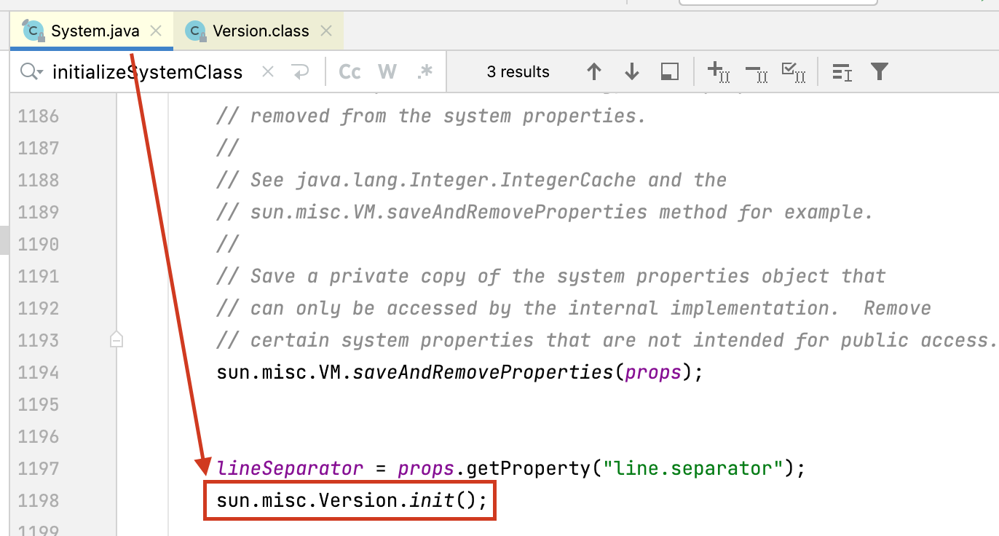
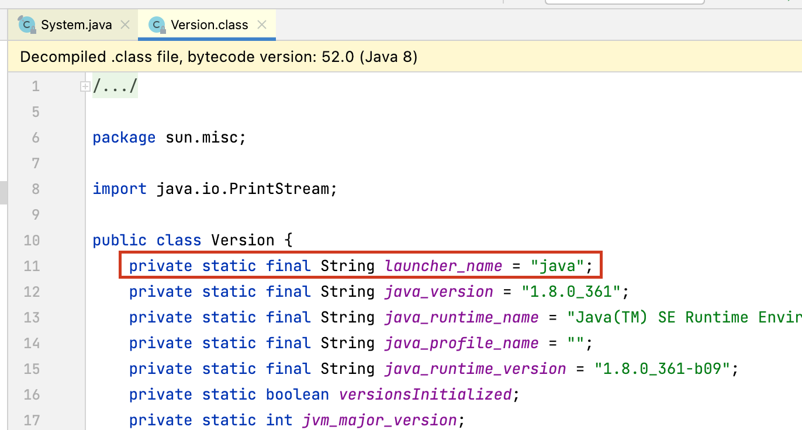
>可参考文献：《深入理解Java虚拟机：JVM高级特性与最佳实践（第3版）》代码清单2-8

##### synchronized底层解析
```java
/**
 * @author andy_ruohan
 * @description 用于synchronized字节码解析样例
 * @date 2023/5/10 21:32
 */
public class SyncDemo {
    private final Object objectLock = new Object();

    public void m1() {
        synchronized (objectLock) {
            System.out.println("---hello synchronized code block---");
        }
    }
}
```

针对以上代码，执行以下命令：
```
lijunxin@lijunxins-MacBook-Air reentrantLock % javac SyncDemo.java  
lijunxin@lijunxins-MacBook-Air reentrantLock % javap -c SyncDemo.class
```

运行结果：
```java
public class jvm.lock.reentrantLock.SyncDemo {
  public jvm.lock.reentrantLock.SyncDemo();
    Code:
       0: aload_0
       1: invokespecial #1                  // Method java/lang/Object."<init>":()V
       4: aload_0
       5: new           #2                  // class java/lang/Object
       8: dup
       9: invokespecial #1                  // Method java/lang/Object."<init>":()V
      12: putfield      #7                  // Field objectLock:Ljava/lang/Object;
      15: return

  public void m1();
    Code:
       0: aload_0
       1: getfield      #7                  // Field objectLock:Ljava/lang/Object;
       4: dup
       5: astore_1
       6: monitorenter
       7: getstatic     #13                 // Field java/lang/System.out:Ljava/io/PrintStream;
      10: ldc           #19                 // String ---hello synchronized code block---
      12: invokevirtual #21                 // Method java/io/PrintStream.println:(Ljava/lang/String;)V
      15: aload_1
      16: monitorexit
      17: goto          25
      20: astore_2
      21: aload_1
      22: monitorexit
      23: aload_2
      24: athrow
      25: return
    Exception table:
       from    to  target type
           7    17    20   any
          20    23    20   any
}

```
注意：`6: monitorenter`和`16: monitorexit`分别对应加锁、解锁。其中`22: monitorexit`是为了异常情况下解锁。

####synchronized可重入锁原理：  
<font color = 'red'>每个锁对象拥有一个锁计数器和一个指面持有该锁的线程的指针。</font>当执行monitorenter时，如果目标锁对象的计数器为零，那么说明它没有被其他线程所持有，Java虚拟机会将该锁对象的持有线程设置为当前线程，并且将其计数器加1。  

在目标锁对象的计数器不为零的情況下，如果锁对象的持有线程是当前线程，那么Java虚拟机可以将其计数器加1，否则需要等待，直至持有线程释放该锁。当执行monitorexit时，Java虚拟机则需将锁对象的计数器减1。计数器为零代表锁已被释放。

####LockSupport（线程等待唤醒机制wait/notify的加强版）
https://docs.oracle.com/javase/8/docs/api/
>Basic thread blocking primitives for creating locks and other synchronization classes.

#####3种让线程等待和唤醒的方法
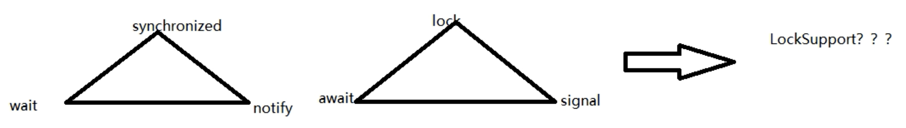
方式1：使用Object中的wait()方法让线程等待，使用object中的notify()方法唤醒线程  
方式2：使用JUC包中condition的await()方法让线程等待，使用signal()方法唤醒线程  
**方式3：LockSupport类可以阻塞当前线程以及唤醒指定被阻塞的线程**

#### LockSupport的底层实现
LockSupport 归根结底调用的 Unsafe 类中的 native 方法，其提供 park() 和 unpark() 方法实现阻塞线程和解除线程阻塞的过程。线程阻寒需要消耗凭证(permit)，这个凭证最多只有1个。当调用park方法时如果有凭证，则会直接消耗掉这个凭证然后正常退出。 
>Unlike with Semaphores though, permits do not accumulate. There is at most one.

##### 为什么可以先唤醒线程后阻塞线程？
因为unpark获得了一个凭证，之后再调用park方法，就可以名正言顺的凭证消费，故不会阻塞。  

##### 为什么唤醒两次后阻塞两次，但最终结果还会阻塞线程？
因为凭证的数量最多为1，连续调用两次 unpark 和 调用一次 unpark 效果一样，只会增加一个凭证；而调用两次 park 却需要消费两个凭证，证不够，不能放行。

### AQS
####AQS 是什么？
AQS是用来构建锁或者其它同步器组件（如CountDownLatch、CyclicBarrier）的重量级基础框架及整个JUC体系的基石，通过内置的FIFO队列来完成资源获取线程的排队工作，并通过个int类型变量表示持有锁的状态。
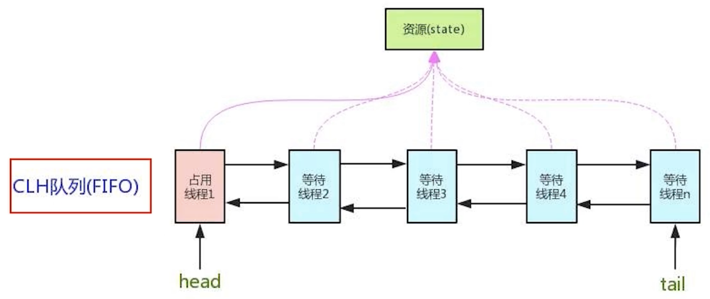
CLH队列（Craig、Landin and Hagersten为三个科学家的名字的首字母）：是一个单向链表，AQS中的队列是CLH变体的虛拟双向队列FIFO。

##### ReentrantLock中的AQS
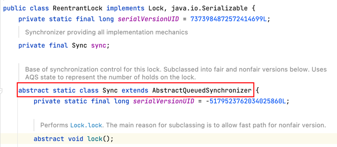

##### CountDownLatch中的AQS
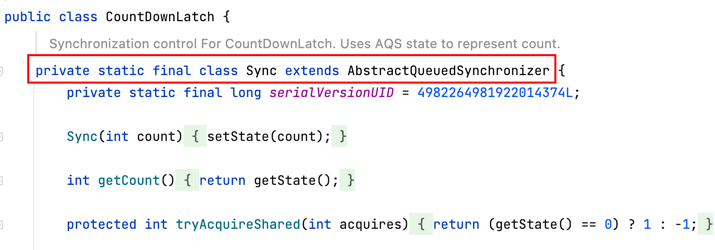

##### ReentrantReadWriteLock中的AQS
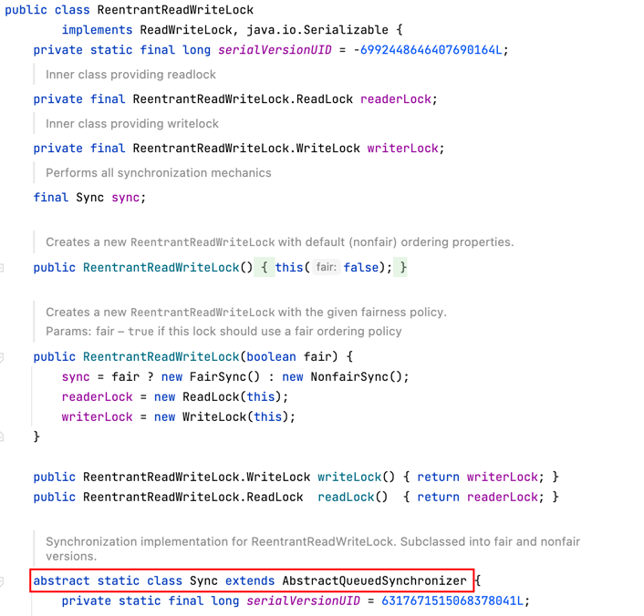

##### Semaphore中的AQS
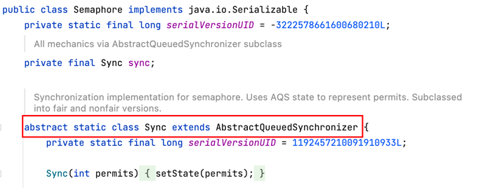

### AQS源码解析
AQS使用一个volatile的int类型的成员变量来表示同步状态，通过内罝的 FIFO队列来完成资源获取的排队工作，将每条要去抢占资源的线程封装成一个Node节点来实现锁的分配，通过CAS完成对State值的修改。

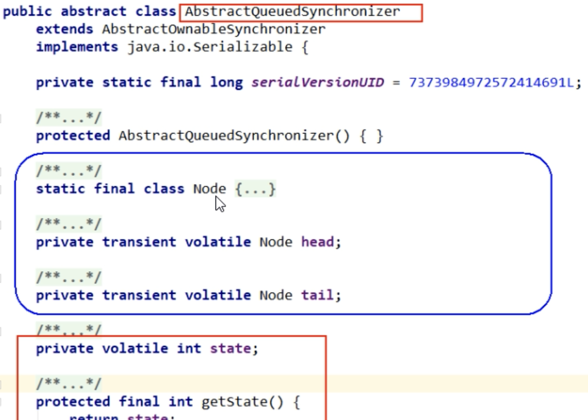

##### AQS类比HashMap的结构
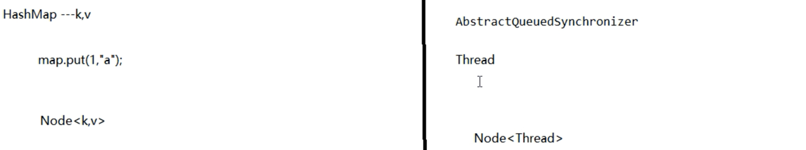

##### AQS内部体系结构
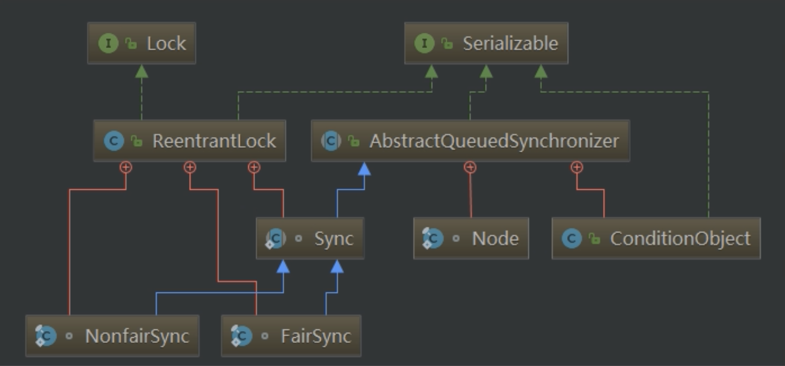

##### AQS官方解析
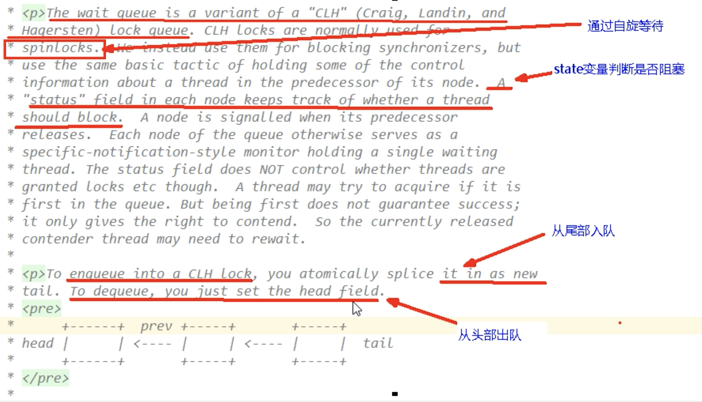

##### Node中一些重要的么句释义
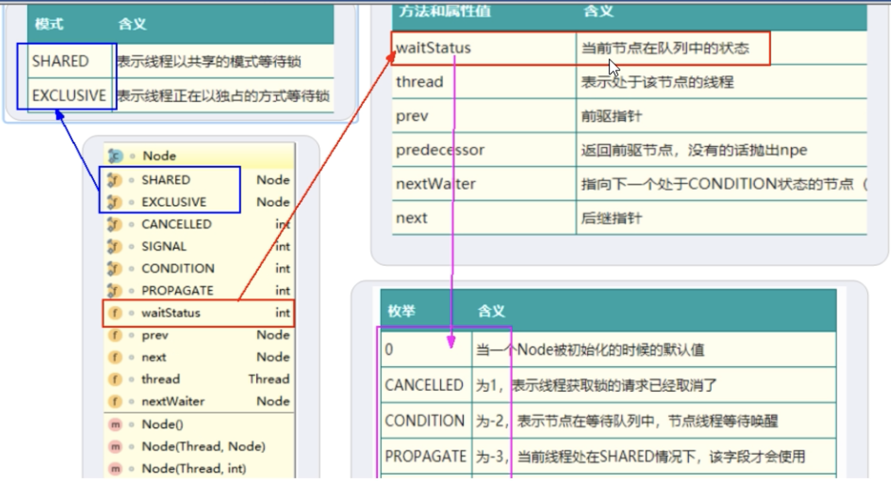

#### ReentrantLock原理
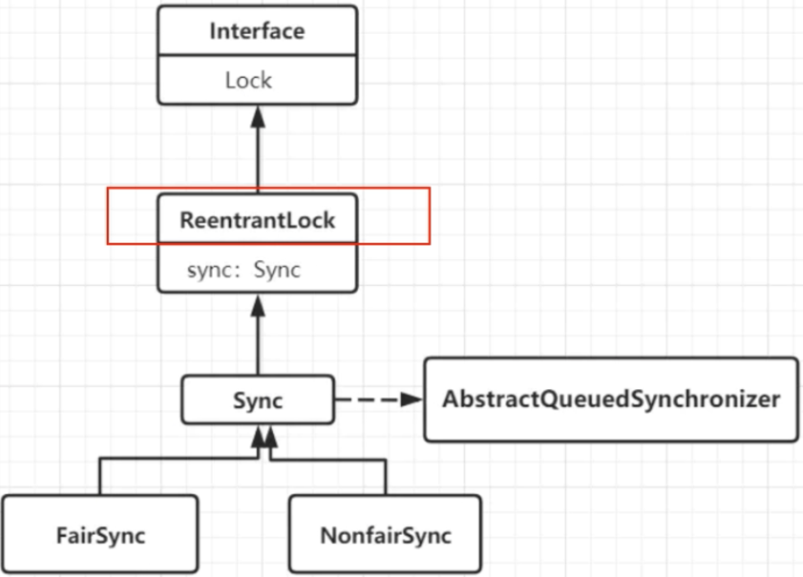
##### 公平锁和非公平锁差异
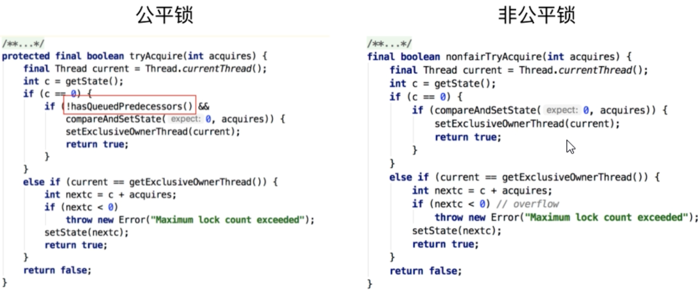
可以明显看出公平锁与非公平锁的lock()方法唯一的区别就在于公平锁在获取同步状态时多了一个限制条件：hasQueuedPredecessors()。hasQueuedPredecessors 是公平锁加锁时判断等待队列中是否存在有效节点的方法。

###### lock in ReentrantLock (NonfairSync)
```java
static final class NonfairSync extends Sync {
    private static final long serialVersionUID = 7316153563782823691L;

    /**
     * Performs lock.  Try immediate barge, backing up to normal
     * acquire on failure.
     */
    final void lock() {
        if (compareAndSetState(0, 1))
            setExclusiveOwnerThread(Thread.currentThread());
        else
            acquire(1);
    }
}
```

###### acquire in AbstractQueuedSynchronized
```java 
public final void acquire(int arg) {
    if (!tryAcquire(arg) &&
        acquireQueued(addWaiter(Node.EXCLUSIVE), arg))
        selfInterrupt();
}
```

###### tryAcquire in ReentrantLock (NonFairSync)
```java
protected final boolean tryAcquire(int acquires) {
    return nonfairTryAcquire(acquires);
}
```

###### nonfairTryAcquire in ReentrantLock (NonFairSync)
```java
final boolean nonfairTryAcquire(int acquires) {
    final Thread current = Thread.currentThread();
    int c = getState();
    if (c == 0) {
        if (compareAndSetState(0, acquires)) {
            setExclusiveOwnerThread(current);
            return true;
        }
    } 
    else if (current == getExclusiveOwnerThread()) {
        int nextc = c + acquires;
        if (nextc < 0) // overflow
            throw new Error("Maximum lock count exceeded");
        setState(nextc);
        return true;
    }
    return false;
}
```