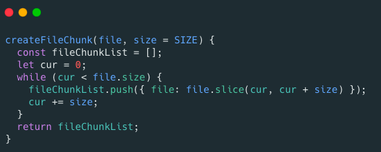

### 如何解决大文件上传问题？（分片上传）
使用分片上传主要有下面 2 点好处：
- 断点续传 ：上传文件中途暂停或失败（比如遇到网络问题）之后，不需要重新上传，只需要上传那些未成功上传的文件分片即可。所以，分片上传是断点续传的基础。
- 多线程上传 ：我们可以通过多线程同时对一个文件的多个文件分片进行上传，这样的话就大大加快的文件上传的速度。

#### 前端怎么生成文件分片呢？
前端可以通过 Blob.slice() 方法来对文件进行切割（File 对象是继承 Blob 对象的，因此 File 对象也有 slice() 方法）。
生成文件切片的示例代码如下：

#### 后端如何合并文件分片呢？
RandomAccessFile 类可以帮助我们合并文件分片，示例代码如下：

#### 何为秒传？  
秒传说的就是我们在上传某个文件的时候，首先根据文件的唯一标识判断一下服务端是否已经上传过该文件，如果上传过的话，直接就返回给用户文件上传成功即可。  
一般情况下，这个唯一标识都是通过对文件的名称、最后修改时间等信息取 MD5 值得到的，这个可以通过使用 spark-md5 这个库来生成。   
另外，还存在一种情况是我们要上传的文件已经上传了部分文件切片到服务端。这个时候，我们直接返回已上传的切片列表给前端即可。然后，前端再将剩余未上传的分片上传到服务端。
>需要注意的是：你不能根据文件名就决定文件是否已经上传到服务端，因为很可能存在文件名相同，但是，内容不同的情况。另外，体验更好的是文件内容不变，唯一标识就不应该改变。因此，我们可以根据文件的内容来计算 MD5 值。  

>缺少每片数据的一致性校验和最后合包的一致性校验

参考链接：https://www.yuque.com/snailclimb/mf2z3k/akmquq