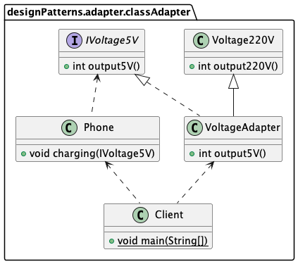
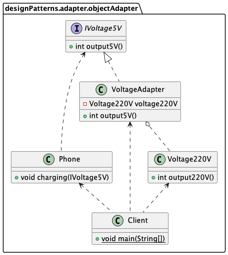
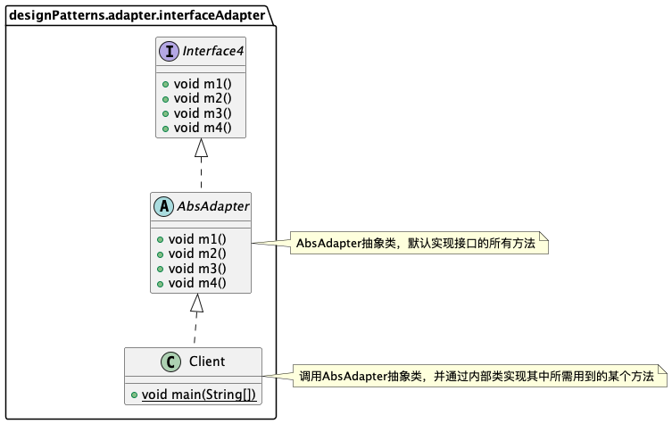

适配器模式主的目的是兼容性，让原本因接口不匹配不能一起工作的两个类可以协同工作。它可以分为三类：类适配器模式、对象适配器模式、接口适配器模式。

###类适配器

类适配器模式注意事项和细节: 
- Java 是单继承机制，所以类适配器需要继承 src 类这一点算是一个缺点, 因为这要求 dst 必须是接口，有一定局限性；
    >本例中VoltageAdapter是适配器类，src类是Voltage220V，dst是IVoltage
- src 类的方法在 Adapter 中都会暴露出来，也增加了使用的成本；
    >即Voltage220V的output220V方法需要在VoltageAdapter中暴露使用
- 由于其继承了 src 类，所以它可以根据需求重写 src 类的方法，使得 Adapter 的灵活性增强了。

###对象适配器
根据“合成复用原则”，在系统中尽量使用关联关系（聚合）来替代继承关系，可进一步通过对象适配器来实现。
  
对象适配器模式注意事项和细节：
- 对象适配器和类适配器其实算是同一种思想，只不过实现方式不同。根据合成复用原则，使用组合替代继承。所以`它解决了类适配器必须继承 src 的局限性问题，也不再要求 dst 必须是接口`。
- 使用成本更低，更灵活。

###接口适配器
接口适配器一些书籍称为缺省适配器模式(Default Adapter Pattern)。`适用于一个接口不想使用其所有的方法的情况`。  
>核心思路：当不需要全部实现接口提供的方法时，可先设计一个抽象类实现接口，并为该接口中每个方法提供一个默认实现（空方法），那么该抽象类的子类可有选择地覆盖父类的某些方法来实现需求。

   