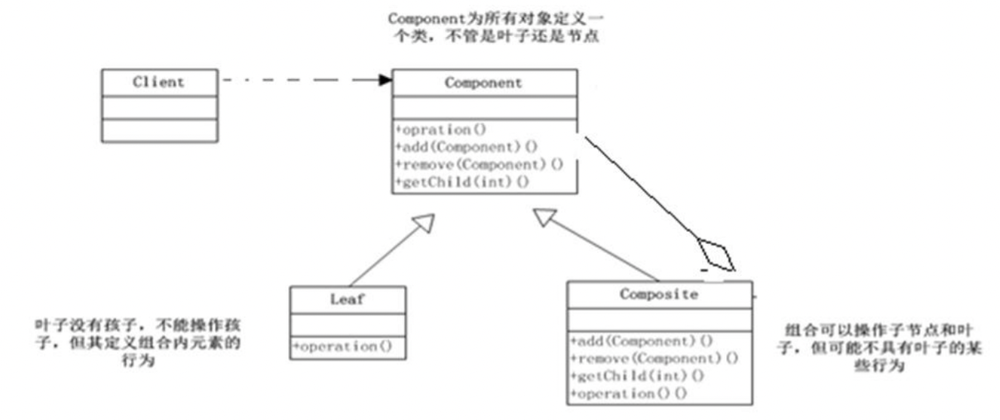
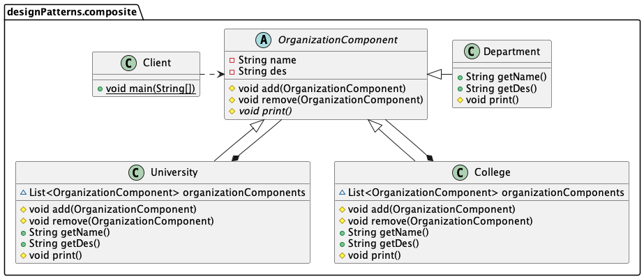
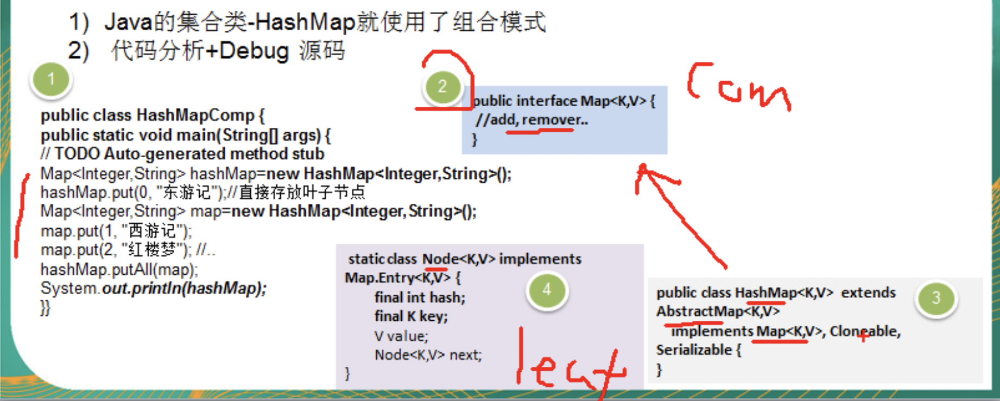
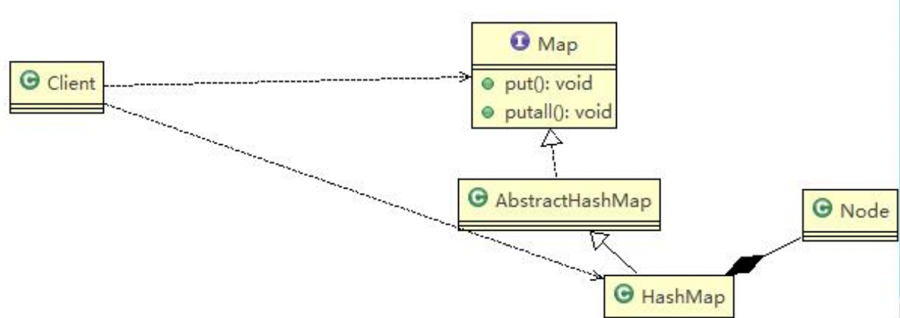

组合模式三要素：

- `Component`: 这是组合中对象声明接口，在适当情况下，实现所有类共有的接口默认行为，用于访问和管理 Component 子部件，Component 可以是抽象类或者接口。
- `Composite`: 非叶子节点，用于存储子部件，在 Component 接口中实现子部件的相关操作，比如增加、删除。
- `Leaf`: 在组合中表示叶子节点，叶子节点没有子节点。

---
对于需求，要在一个页面中展示出学校的院系组成，一个学校有多个学院，一个学院有多个系。便可按以下 UML 类图实现：

####Component 抽象组件类
```java
@Getter
@Setter
@AllArgsConstructor
public abstract class OrganizationComponent {
    private String name; // 名字
    private String des; // 说明

    protected void add(OrganizationComponent organizationComponent) {
        //默认实现
        throw new UnsupportedOperationException();
    }

    protected void remove(OrganizationComponent organizationComponent) {
        //默认实现
        throw new UnsupportedOperationException();
    }

    //方法print, 做成抽象的, 子类都需要实现
    protected abstract void print();
}
```

####Composite 非叶子节点
```java
public class University extends OrganizationComponent {
    List<OrganizationComponent> organizationComponents = new ArrayList<OrganizationComponent>();

    // 构造器
    public University(String name, String des) {
        super(name, des);
    }

    // 重写add
    @Override
    protected void add(OrganizationComponent organizationComponent) {
        organizationComponents.add(organizationComponent);
    }

    // 重写remove
    @Override
    protected void remove(OrganizationComponent organizationComponent) {
        organizationComponents.remove(organizationComponent);
    }

    // print方法，就是输出University 包含的学院
    @Override
    protected void print() {
        System.out.println("--------------" + getName() + "--------------");
        //遍历 organizationComponents
        for (OrganizationComponent organizationComponent : organizationComponents) {
            organizationComponent.print();
        }
    }
}
```

####Leaf 叶子节点
```java
public class Department extends OrganizationComponent {
    //没有集合

    public Department(String name, String des) {
        super(name, des);
    }

    //add , remove 就不用写了，因为他是叶子节点

    @Override
    protected void print() {
        System.out.println(getName());
    }
}
```

####客户端服务类
```java
public class Client {
    public static void main(String[] args) {
        //从大到小创建对象学校
        OrganizationComponent university = new University("清华大学", " 中国顶级大学 ");

        //创建学院
        OrganizationComponent computerCollege = new College("计算机学院", " 计算机学院 ");
        OrganizationComponent infoEngineerCollege = new College("信息工程学院", " 信息工程学院 ");

        //创建各个学院下面的系(专业)
        computerCollege.add(new Department("软件工程", " 软件工程不错 "));
        computerCollege.add(new Department("网络工程", " 网络工程不错 "));
        computerCollege.add(new Department("计算机科学与技术", " 计算机科学与技术是老牌的专业 "));

        infoEngineerCollege.add(new Department("通信工程", " 通信工程不好学 "));
        infoEngineerCollege.add(new Department("信息工程", " 信息工程好学 "));

        //将学院加入到学校
        university.add(computerCollege);
        university.add(infoEngineerCollege);

        //university.print();
        university.print();
    }
}
```

###组合模式在JDK集合的源码分析
- Component：Map
- Composite：HashMap
- Leaf：Node


其对应的UML图如下：


###注意点：
- 需要`遍历组织机构，或者处理的对象具有树形结构`时，非常适合使用组合模式。
- 要求较高的抽象性，如果`节点和叶子有很多差异性`的话，比如很多方法和属性都不一样，不适合使用组合模式