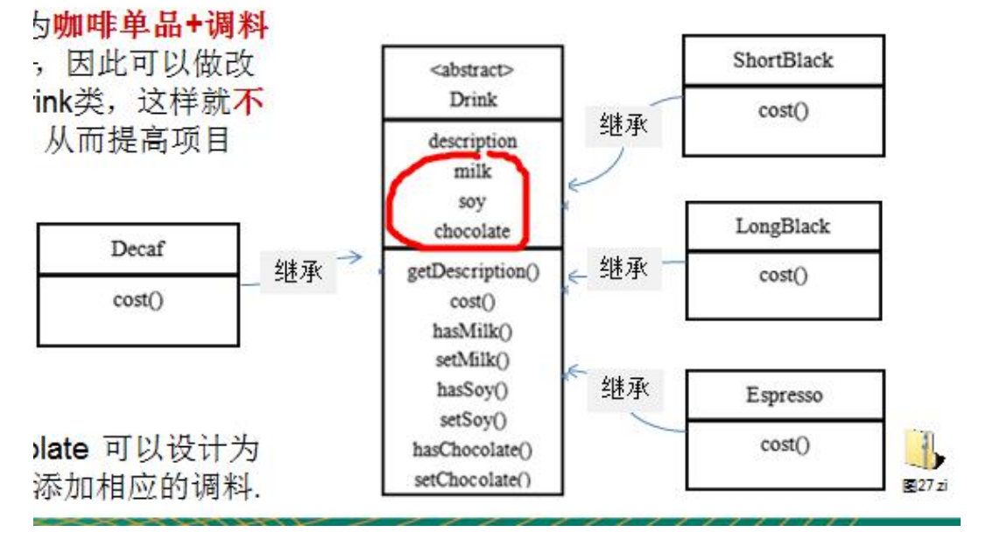
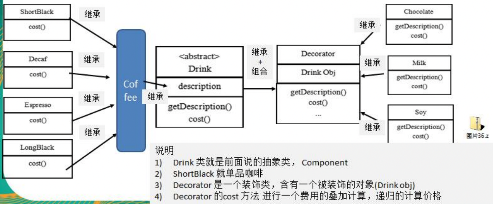
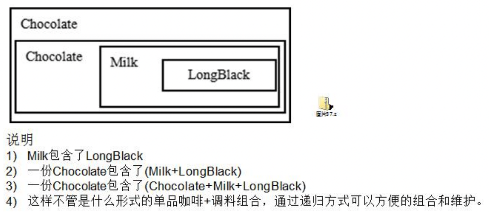
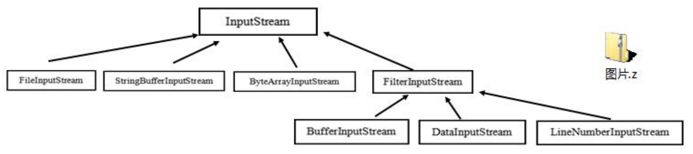

星巴克咖啡订单项目（咖啡馆）：
1) 咖啡种类/单品咖啡：Espresso(意大利浓咖啡)、ShortBlack(浓缩咖啡)、LongBlack(美式咖啡)、Decaf(无因咖啡)。 
2) 调料：Milk、Soy(豆浆)、Chocolate。
3) 要求在扩展新的咖啡种类时，具有良好的扩展性、改动方便、维护方便。
4) 使用 OO 的来计算不同种类咖啡的费用：客户可以点单品咖啡，也可以单品咖啡+调料组合。

###传统解决方案1

存在的弊端：容易引发`类爆炸`，每新增一种口味，需要与已存在的咖啡全部组合一遍；或每新增一种咖啡，需要与已存在的口味全部组合一遍。

###传统解决方案2

方案2将调料内置到 Drink 类，这样就不会造成类数量过多。但是在增加或者删除调料种类时，代码的维护量很大。

###装饰器模式

思考：个人感觉 Coffee 这一层非必需
#####具体被装饰子类，以美式咖啡为例
```java
public class LongBlackCoffee extends Coffee {
    public LongBlackCoffee() {
        setDes("longBlack 5.0");
        setPrice(5.0f);
    }
}
```

####被装饰父类
```java
public class Coffee extends Drink {
    @Override
    public float cost() {
        return super.getPrice();
    }
}
```

####被装饰抽象类
```java
@Getter
@Setter
public abstract class Drink {
    public String des;
    private float price = 0.0f;

    //计算费用的抽象方法
    public abstract float cost();
}
```

####装饰父类
```java
@AllArgsConstructor
public class Decorator extends Drink {
    private Drink obj;

    @Override
    public float cost() {
        // getPrice 自己价格
        return super.getPrice() + obj.cost();
    }

    @Override
    public String getDes() {
        // obj.getDes() 输出被装饰者的信息
        return des + " " + getPrice() + " && " + obj.getDes();
    }
}
```

####具体装饰子类，以巧克力调味品为例
```java
public class Chocolate extends Decorator {
    public Chocolate(Drink obj) {
        super(obj);
        setDes("巧克力");
        setPrice(3.0f); //调味品的价格
    }
}
```

装饰器模式下，最终的呈现样式：


###装饰者模式在 JDK 应用的源码分析

Java 的 IO 结构，FilterInputStream 就是一个装饰者。其中 
> InputStream 是抽象类，类似我们前面讲的 Drink  
> FileInputStream 是 InputStream 子类，类似我们前面的 LongBlack  
> FilterInputStream 是 InputStream 子类，类似我们前面 的 Decorator 装饰者
> DataInputStream 是 FilterInputStream 子类，具体的装饰者
> FilterInputStream 类有 protected volatile InputStream in，即含被装饰者