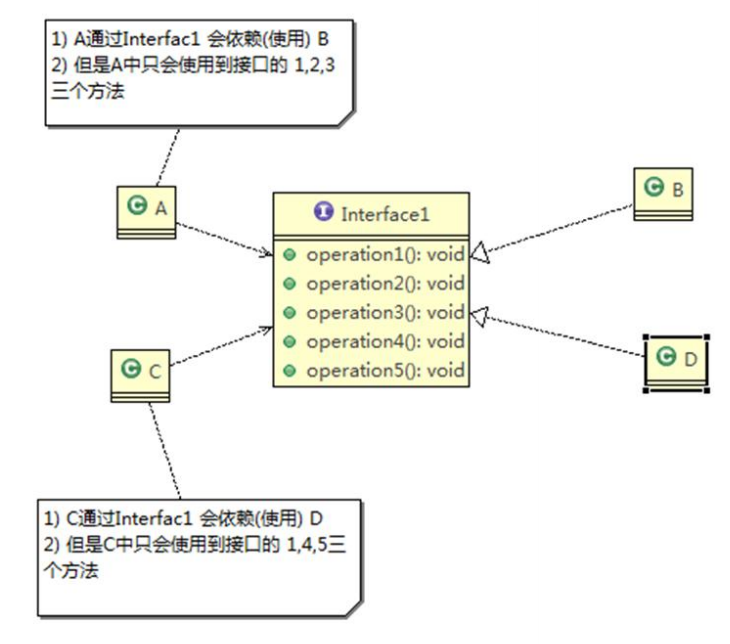
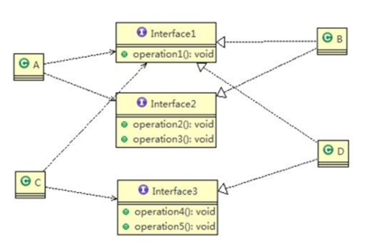

设计模式是为了让程序（软件），具有更好
- 重用性（即相同的代码，不用多次编写）
- 可读性（即编程规范性，便于其他程序员的阅读和理解）
- 可拓展性（即当增加新的功能时，非常的方便，亦可成为可维护性）
- 可靠性（即增加新的功能时，对原来的功能没有影响）
- 使程序呈现高内聚、低耦合

总体来说，设计模式分为三大类：
- 创建型模式：共5种：工厂方法模式、抽象工厂模式、单例模式、建造者模式、原型模式
- 结构型模式：共7种：适配器模式、装饰器模式、代理模式、桥接模式、外观模式、组合模式、享元模式
- 行为型模式：共11种：策略模式、模板方法模式、观察者模式、责任链模式、访问者模式、中介者模式、迭代器模式、命令模式、状态模式、备忘录模式、解释器模式

设计模式典型案例
- 建造者模式：Java中的StringBuilder

设计模式的七大原则
- 单一职责原则（lesson06~07）。比如Dao层类，分别只对各自对应的entity操作

    package com.atguigu.principle.singleresponsibility;
    public class SingleResponsibility1 {
        public static void main(String[] args) {
        // TODO Auto-generated method stub
        Vehicle vehicle = new Vehicle(); 
        vehicle.run("摩托车"); 
        vehicle.run("汽车");
        vehicle.run("飞机"); 
        } 
    }
方式1： 

    class Vehicle{ 
    public void run(String vehicle) { 
        System.out.println(vehicle + " 在公路上运行...."); 
        } 
    }

1. 在方式 1 的 run 方法中，违反了单一职责原则
2. 解决的方案非常的简单，根据交通工具运行方法不同，分解成不同类即可

方式2：

    package com.atguigu.principle.singleresponsibility; 
    public class SingleResponsibility2 { 
        public static void main(String[] args){ 
        // TODO Auto-generated method stub
        RoadVehicle roadVehicle = new RoadVehicle(); 
        roadVehicle.run("摩托车"); 
        roadVehicle.run("汽车"); 
        AirVehicle airVehicle = new AirVehicle(); airVehicle.run("飞机"); 
        } 
    }

    class RoadVehicle { 
        public void run(String vehicle) { 
            System.out.println(vehicle + "公路运行"); 
        } 
    }
    class AirVehicle {
        public void run(String vehicle) { 
            System.out.println(vehicle + "天空运行"); 
        }
    }
    class WaterVehicle { 
        public void run(String vehicle) { 
            System.out.println(vehicle + "水中运行"); 
        } 
    }
1. 遵守单一职责原则 
2. 但是这样做的改动很大，即将类分解，同时修改客户端
3. 改进：直接修改 Vehicle 类，改动的代码会比较少=>方案 3

方式3：

    package com.atguigu.principle.singleresponsibility; 
    public class SingleResponsibility3 { 
        public static void main(String[] args) { 
            // TODO Auto-generated method stub Vehicle2 vehicle2 = new Vehicle2(); 
            vehicle2.run("汽车"); 
            vehicle2.runWater("轮船"); 
            vehicle2.runAir("飞机"); 
        } 
    }

    class Vehicle2 { 
        public void run(String vehicle) { 
            //处理 System.out.println(vehicle + " 在公路上运行...."); 
        }
        public void runAir(String vehicle) { 
            System.out.println(vehicle + " 在天空上运行...."); 
        }
        public void runWater(String vehicle) { 
            System.out.println(vehicle + " 在水中行...."); 
        }
    }
1. 这种修改方法没有对原来的类做大的修改，只是增加方法 
2. 这里虽然没有在类这个级别上遵守单一职责原则，但是在方法级别上，仍然是遵守单一职责

- 接口隔离原则（lesson08~10）。一个类对另一个的类的依赖应该建立在最小的接口上

- 依赖倒置原则
- 里氏替换原则
- 开闭原则
- 迪米特法则
- 合成复用原则
  
