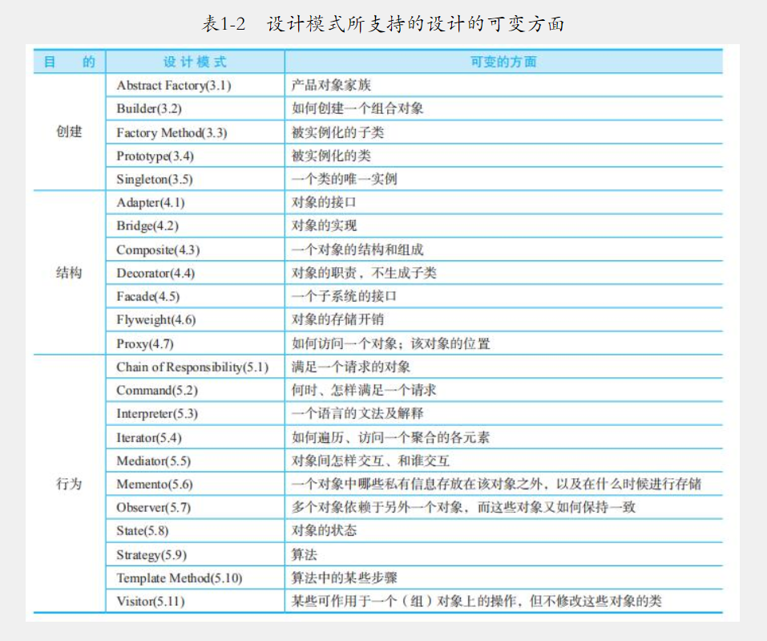

设计模式是为了让程序（软件），具有更好
- 重用性（即相同的代码，不用多次编写）
- 可读性（即编程规范性，便于其他程序员的阅读和理解）
- 可拓展性（即当增加新的功能时，非常的方便，亦可成为可维护性）
- 可靠性（即增加新的功能时，对原来的功能没有影响）
- 使程序呈现高内聚、低耦合

总体来说，设计模式分为三大类：
- 创建型模式（共5种）：单例模式、抽象工厂模式、原型模式、建造者模式、工厂模式。
- 结构型模式（共7种）：适配器模式、桥接模式、装饰模式、组合模式、外观模式、享元模式、代理模式。
- 行为型模式（共11种）：模版方法模式、命令模式、访问者模式、迭代器模式、观察者模式、中介者模式、备忘录模式、 解释器模式（Interpreter 模式）、状态模式、策略模式、职责链模式(责任链模式)。

设计模式典型案例
- 单例模式：
  - JDK 中的 java.lang.Runtime（饿汉式-静态内部类）
  - Hibernate 的 SessionFactory
- 简单工厂模式：JDK 中的 Calendar 类
- 原型模式：Spring 中原型 bean 的创建
- 建造者模式：JDK 中的 StringBuilder
- 适配器模式：
  - SpringMVC 中的 HandlerAdapter
  - InputStreamReader 适配 InputStream
- 桥接模式：jdbc 中 Driver 
- 模版方法模式：Spring IOC 容器初始化时运用了模板方法模式
- 职责链模式：SpringMVC 中的 HandlerExecutionChain 类

######设计模式类似逻辑：
- 工厂方法与模版方法
- 适配器模式与桥接模式

设计模式的七大原则
- 单一职责原则（Single Responsibility Principle）：比如Dao层类，分别只对各自对应的entity操作，而不对多个entity操作。
- 接口隔离原则（Interface Segregation Principle）：一个类对另一个的类的依赖应该建立在最小的接口上。
- 依赖倒置原则（Dependence Inversion Principle）：高层模块不应该依赖底层模块，二者都应该依赖其抽象。抽象不应该依赖细节，细节应该依赖抽象。
- 里氏替换原则（Liskov Substitution Principle）：子类中尽量不要重写父类的方法，通过聚合、组合、依赖来解决问题。
- 开闭原则（Open Closed Principle）：对扩展开放、对修改关闭。尽量通过扩展软件实体的行为来实现变化，而不是通过修改已有的代码来实现变化。
- 迪米特法则（Demeter Principle）：对自己依赖的类知道的越少越好。
- 合成复用原则（Composite Reuse Principle）：尽量使用合成/聚合的方式，而不是使用继承。  

总结：设计原则的核心思想
- 找出应用中可能需要变化之处，把它们独立出来，不要和那些不需要变化的代码混在一起。
- 针对接口编程，而不是针对实现编程。
- 为了交互对象之间的松耦合设计而努力。
  
