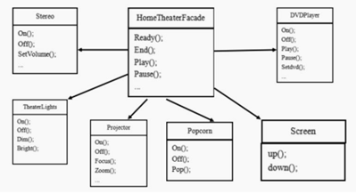
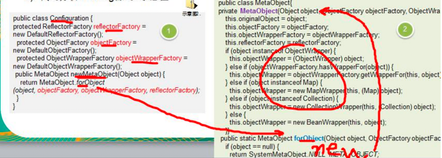
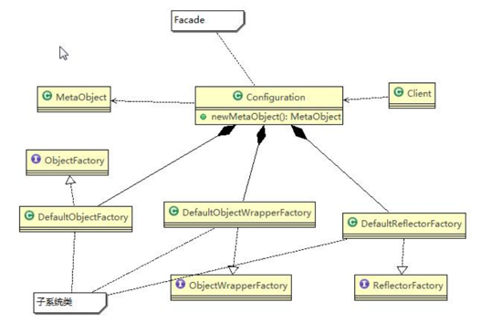

对于需求，组建一个家庭影院：  
DVD 播放器、投影仪、自动屏幕、环绕立体声、爆米花机,要求完成使用家庭影院的功能，其过程为：  
- 直接用遥控器，统筹各设备开关  
    >开爆米花机  
    放下屏幕  
    开投影仪  
    开音响  
    开 DVD  
    拿爆米花  
    调暗灯光
- 播放观影结束后，关闭各种设备

###传统解决方案

存在的问题：
> 1) 在 ClientTest 的 main 方法中，创建各个子系统的对象，并直接去调用子系统（对象）相关方法，会造成调用过程混乱，没有清晰的过程 
> 2) 不利于在 ClientTest 中，去维护对子系统的操作

###外观模式

###外观模式在 MyBatis 框架应用的源码分析 
MyBatis 中的 Configuration 去创建 MetaObject 对象，使用到外观模式
######源码

######角色类图

###注意事项及细节
- 通过合理的使用外观模式，可以帮我们更好的划分访问的层次。对外屏蔽了子系统的细节，降低了客户端对子系统使用的复杂性。
  
- 在维护一个遗留的大型系统时，可能`这个系统已经变得非常难以维护和扩展`，此时可以考虑为新系统开发一个` Facade 类`，来提供遗留系统的比较清晰简单的接口，让新系统与 Facade 类交互，提高复用性。 
- `不能过多的或者不合理的使用外观模式`。使用外观模式好，还是直接调用模块好，要以让系统有层次、利于维护为目的。