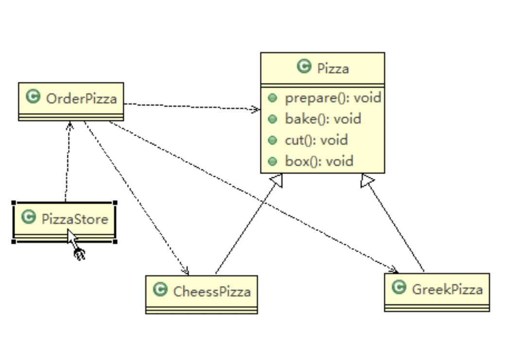
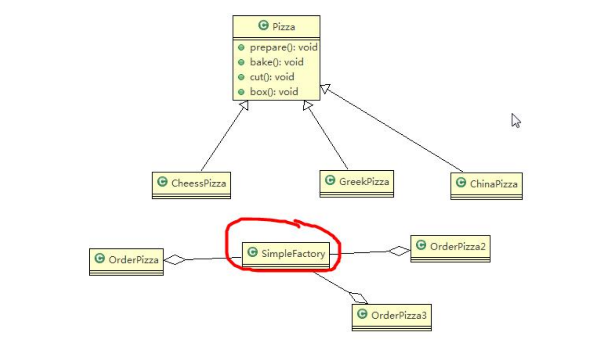
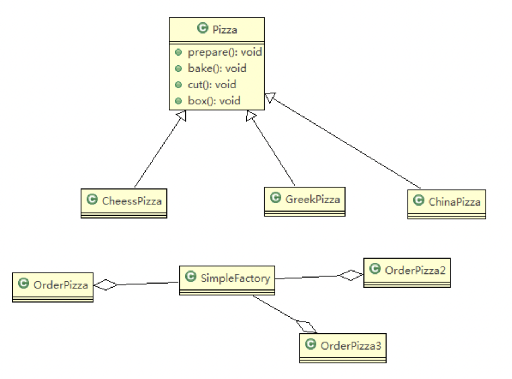
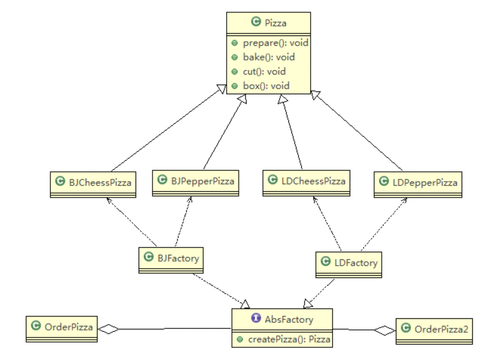

###传统设计方法


```java
public class OrderPizza {
    public OrderPizza() {
        Pizza pizza;
        String orderType; //订购 pizza 的类型
        do {
            orderType = getType(); //该函数不重要，此处略去实现细节
            if (orderType.equals("greek")) {
                pizza = new GreekPizza();
                pizza.setName(" 希腊披萨 ");
            } else if (orderType.equals("cheese")) {
                pizza = new CheesePizza();
                pizza.setName(" 奶酪披萨 ");
            } else if (orderType.equals("pepper")) {
                pizza = new PepperPizza();
                pizza.setName(" 胡椒披萨");
            } else {
                break;
            }
            
            //输出 pizza 制作过程
            pizza.prepare();
            pizza.bake();
            pizza.cut();
            pizza.box();
        } while (true);
    }
}
```
>总结：按传统方法设计点披萨系统，虽然内容直观、简单。但如果我们增加一个 Pizza 类，只要是订购 Pizza 的代码（即OrderPizza）都需要修改，需要继续添加else if。当 OrderPizza 的类有多个时，代码稳定性会受到较大影响。



```java
public class SimpleFactory {
    //根据 orderType 返回对应的 Pizza 对象
    public Pizza createPizza(String orderType) {
        Pizza pizza = null;
        System.out.println("使用简单工厂模式");
        if (orderType.equals("greek")) {
            pizza = new GreekPizza();
            pizza.setName(" 希腊披萨 ");
        } else if (orderType.equals("cheese")) {
            pizza = new CheesePizza();
            pizza.setName(" 奶酪披萨 ");
        } else if (orderType.equals("pepper")) {
            pizza = new PepperPizza();
            pizza.setName("胡椒披萨");
        }
        return pizza;
    }
}
```

```java
public class OrderPizza {
    //定义一个简单工厂对象
    SimpleFactory simpleFactory;
    Pizza pizza = null;

    public OrderPizza(SimpleFactory simpleFactory) {
        setFactory(simpleFactory);
    }

    public void setFactory(SimpleFactory simpleFactory) {
        String orderType = ""; //用户输入的
        this.simpleFactory = simpleFactory; //设置简单工厂对象
        do {
            orderType = getType();
            pizza = this.simpleFactory.createPizza(orderType);
            //输出 pizza
            if (pizza != null) { //订购成功
                pizza.prepare();
                pizza.bake();
                pizza.cut();
                pizza.box();
            } else {
                System.out.println(" 订购披萨失败 ");
                break;
            }
        } while (true);
    }
}
```
>总结：简单工厂设计模式相当于将创建对象的过程，单独提到一个工厂类中。后续如果扩充披萨类型，不会影响点披萨的过程类。

###工厂方法模式
考虑披萨项目新的需求：客户在点披萨时，可以点不同口味的披萨，比如北京的奶酪 pizza、北京的胡椒 pizza 或 者是伦敦的奶酪 pizza、伦敦的胡椒 pizza。
> 使用简单工厂模式，创建不同的简单工厂类，比如 BJPizzaSimpleFactory、LDPizzaSimpleFactory 等等.从当前这个案例来说，也是可以的，但是考虑到项目的规模，以及软件的可维护性、可扩展性并不是特别好。


```java
public abstract class OrderPizza {
    //定义一个抽象方法，createPizza , 让各个工厂子类自己实现
    abstract Pizza createPizza(String orderType);

    public OrderPizza() {
        Pizza pizza = null;
        String orderType; // 订购披萨的类型
        do {
            orderType = getType();
            pizza = createPizza(orderType); //抽象方法，由工厂子类完成

            //输出 pizza 制作过程
            pizza.prepare();
            pizza.bake();
            pizza.cut();
            pizza.box();
        } while (true);
    }
}
```

```java
public class BJOrderPizza extends OrderPizza {
    @Override
    Pizza createPizza(String orderType) {
        Pizza pizza = null;
        if (orderType.equals("cheese")) {
            pizza = new BJCheesePizza();
        } else if (orderType.equals("pepper")) {
            pizza = new BJPepperPizza();
        }
        return pizza;
    }
}
```

```java
public class LDOrderPizza extends OrderPizza {
    @Override
    Pizza createPizza(String orderType) {
        Pizza pizza = null;
        if (orderType.equals("cheese")) {
            pizza = new LDCheesePizza();
        } else if (orderType.equals("pepper")) {
            pizza = new LDPepperPizza();
        }
        return pizza;
    }
}
```
>总结：工厂方法模式，定义了一个创建对象的抽象方法，由子类决定要实例化的类。`工厂方法模式将对象的实例化推迟到子类`。本例中，将披萨项目的实例化功能抽象成抽象方法，在不同的口味点餐子类中具体实现。
> 个人感觉，与传统方法具有类似的缺点。

###抽象工厂方法

```java
public interface AbsFactory {
    //让下面的工厂子类来 具体实现
    public Pizza createPizza(String orderType);
}
```
```java
public class BJFactory implements AbsFactory {
    @Override
    public Pizza createPizza(String orderType) {
        System.out.println("~使用的是抽象工厂模式~");
        Pizza pizza = null;
        if(orderType.equals("cheese")) {
            pizza = new BJCheesePizza();
        } else if (orderType.equals("pepper")){
            pizza = new BJPepperPizza();
        }
        return pizza;
    }
}
```
```java
public class LDFactory implements AbsFactory {
    @Override
    public Pizza createPizza(String orderType) {
        System.out.println("~使用的是抽象工厂模式~");
        Pizza pizza = null;
        if (orderType.equals("cheese")) {
            pizza = new LDCheesePizza();
        } else if (orderType.equals("pepper")) {
            pizza = new LDPepperPizza();
        }
        return pizza;
    }
}
```
```java
public class OrderPizza {
    AbsFactory factory;

    public OrderPizza(AbsFactory factory) {
        setFactory(factory);
    }

    private void setFactory(AbsFactory factory) {
        Pizza pizza;
        String orderType = "";
        this.factory = factory;
        do {
            orderType = getType();
            // factory 可能是北京的工厂子类，也可能是伦敦的工厂子类
            pizza = factory.createPizza(orderType);
            if (pizza != null) { // 订购 ok
                pizza.prepare();
                pizza.bake();
                pizza.cut();
                pizza.box();
            } else {
                System.out.println("订购失败");
                break;
            }
        } while (true);
    }
}
```
>总结：抽象工厂模式可以将简单工厂模式和工厂方法模式进行整合。
> 将工厂抽象成两层，`AbsFactory(抽象工厂)`和 `具体实现的工厂子类`。程序员可以根据创建对象类型使用对应的工厂子类。这样将单个的简单工厂类变成了工厂簇，更利于代码的维护和扩展。