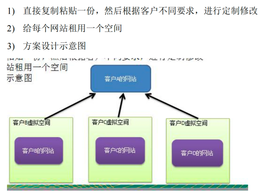
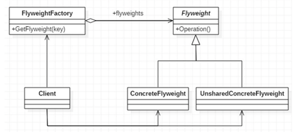
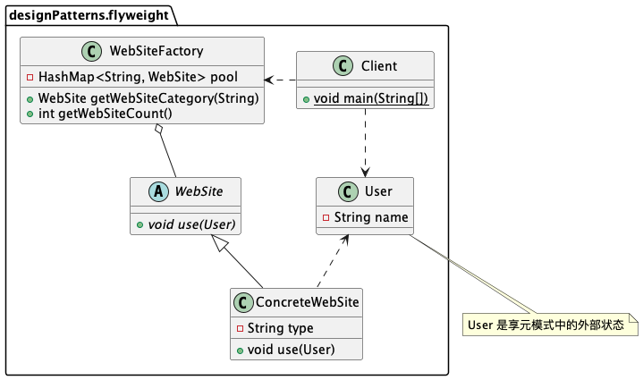
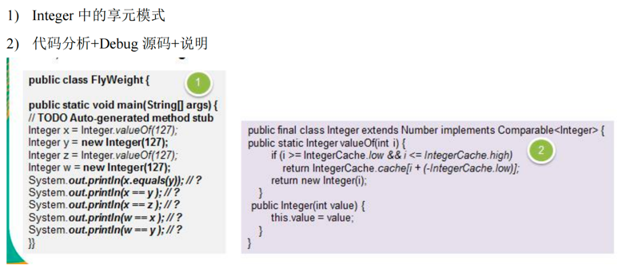

小型的外包项目，给客户 A 做一个产品展示网站，客户 A 的朋友感觉效果不错，也希望做这样的产品展示网站，但是要求都有些不同：
1) 有客户要求以新闻的形式发布 
2) 有客户人要求以博客的形式发布 
3) 有客户希望以微信公众号的形式发布

###传统解决方案

存在的问题： 
需要的网站结构相似度很高，而且都不是高访问量网站，如果分成多个虚拟空间来处理，相当于一个相同网站的实例对象很多，造成服务器的资源浪费

###享元模式

######模式角色与职责
- **FlyWeight** 是抽象的享元角色，他是产品的抽象类，同时定义出对象的外部状态和内部状态(后面介绍) 的接口或实现。 
- **ConcreteFlyWeight** 是具体的享元角色，是具体的产品类，实现抽象角色定义相关业务。
- **UnSharedConcreteFlyWeight** 是不可共享的角色，一般不会出现在享元工厂。 
- **FlyWeightFactory** 享元工厂类，用于构建一个池容器(集合)，同时提供从池中获取对象方法。
>例如：围棋理论上有 361 个空位可以放棋子，每盘棋都有可能有两三百个棋子对象产生，因为内存空间有限，一台服务器很难支持更多的玩家玩围棋游戏。  
如果用享元模式来处理棋子，那么棋子对象就可以减少到只有两个实例，这样就很好的解决了对象的开销问题。

######内部状态与外部状态
- **内部状态**指对象共享出来的信息，存储在享元对象内部且不会随环境的改变而改变。
- **外部状态**指对象得以依赖的一个标记，是随环境改变而改变的、不可共享的状态。
>围棋的颜色就是享元模式的内部状态，围棋的位置就是享元模式的外部状态。

###使用享元模式解决网站展现项目

#####享元抽象类
```java
public abstract class WebSite {
	public abstract void use(User user);
}
```

#####享元工厂类
```java
public class WebSiteFactory {
    private HashMap<String, WebSite> pool = new HashMap<>();

    //根据网站的类型，返回一个网站，如果没有就创建一个网站，并放入到池中并返回
    public WebSite getWebSiteCategory(String type) {
        if (!pool.containsKey(type)) {
            pool.put(type, new ConcreteWebSite(type));
        }
        return (WebSite) pool.get(type);
    }

    public int getWebSiteCount() {
        return pool.size();
    }
}
```

#####具体享元类
```java
@AllArgsConstructor
public class ConcreteWebSite extends WebSite {
	//共享的部分，内部状态
	private String type = "";

	@Override
	public void use(User user) {
		System.out.println("网站的发布形式为:" + type + " 在使用中 .. 使用者是" + user.getName());
	}
}
```

#####不可共享类
```java
@AllArgsConstructor
@Setter
@Getter
//不共享的部分，外部状态
public class User {
    private String name;
}
```

#####客户端服务类
```java
public class Client {
    public static void main(String[] args) {
        WebSiteFactory factory = new WebSiteFactory();

        // 客户tom要一个以新闻形式发布的网站
        WebSite webSite1 = factory.getWebSiteCategory("新闻");
        webSite1.use(new User("tom"));

        // 客户jack要一个以博客形式发布的网站
        WebSite webSite2 = factory.getWebSiteCategory("博客");
        webSite2.use(new User("jack"));

        // 客户smith要一个以博客形式发布的网站
        WebSite webSite3 = factory.getWebSiteCategory("博客");
        webSite3.use(new User("smith"));

        // 客户king要一个以博客形式发布的网站
        WebSite webSite4 = factory.getWebSiteCategory("博客");
        webSite4.use(new User("king"));

        System.out.println("网站的分类共=" + factory.getWebSiteCount());
    }
}
```

###享元模式在 JDK-Interger 的应用源码分析


###注意事项及细节
- 在享元模式这样理解，“享”就表示共享，“元”表示对象。
- 使用享元模式时，注意划分内部状态和外部状态，并且需要有一个工厂类加以控制。
- 享元模式提高了系统的复杂度。需要分离出内部状态和外部状态，而`外部状态具有固化特性，不应该随着内部状态的改变而改变`，这是我们使用享元模式需要注意的地方。