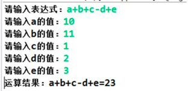
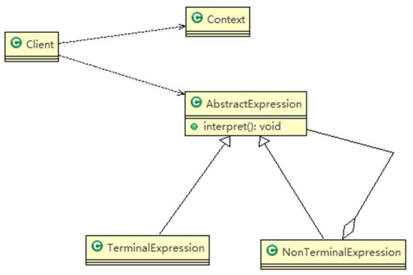
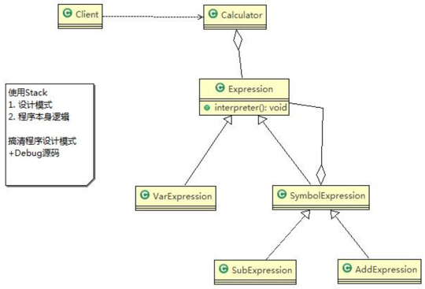
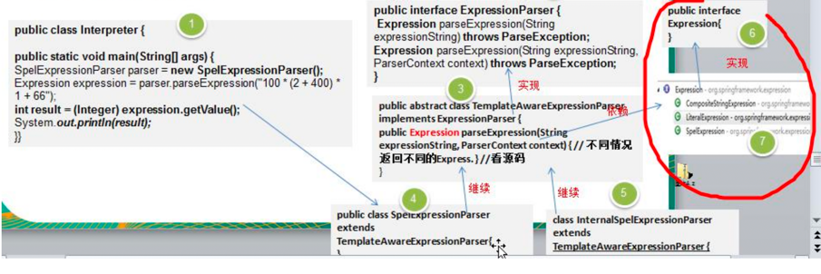

通过解释器模式来实现四则运算，如计算 a+b-c 的值，具体要求 
1) 先输入表达式的形式，比如 a+b+c-d+e, 要求表达式的字母不能重复 
2) 在分别输入 a ,b, c, d, e 的值 3) 最后求出结果：如图


###传统方案解决四则运算问题分析
1) 编写一个方法，接收表达式的形式，然后根据用户输入的数值进行解析，得到结果 
2) 但如果加入新的运算符，比如 * / ( 等等，不利于扩展，另外让一个方法来解析会造成程序结构混乱，不够清晰

###解释器模式原理

1) Context: 环境角色，含有解释器之外的全局信息
2) AbstractExpression: 抽象表达式，声明一个抽象的解释操作，这个方法为抽象语法树中所有的节点所共享 
3) TerminalExpression: 终结符表达式, 实现与文法中的终结符相关的解释操作 
4) NonTerminalExpression: 非终结符表达式，为文法中的非终结符实现解释操作

###解释器模式实现四则运算

#####抽象表达式类
```java
public abstract class Expression {
    public abstract int interpreter(HashMap<String, Integer> var);
}
```

#####符号表达式类
```java
@AllArgsConstructor
public class SymbolExpression extends Expression {
    protected Expression left;
    protected Expression right;

    //因为 SymbolExpression 是让其子类来实现，因此 interpreter 是一个默认实现
    @Override
    public int interpreter(HashMap<String, Integer> var) {
        return 0;
    }
}
```

#####加号表达式类（符号表达式子类）
```java
public class AddExpression extends SymbolExpression {
    public AddExpression(Expression left, Expression right) {
        super(left, right);
    }
    
    public int interpreter(HashMap<String, Integer> var) {
        return super.left.interpreter(var) + super.right.interpreter(var);
    }
}
```

#####值表达式类
```java
public class VarExpression extends Expression {
    private String key;

    @Override
    public int interpreter(HashMap<String, Integer> var) {
        return var.get(this.key);
    }
}
```

#####计算器类
```java
public class Calculator {
    private Expression expression;

    public Calculator(String expStr) {
        Stack<Expression> stack = new Stack<>(); //安排运算先后顺序
        char[] charArray = expStr.toCharArray(); //表达式拆分成字符数组，即[a, +, b]
        Expression left = null;
        Expression right = null;

        for (int i = 0; i < charArray.length; i++) {
            switch (charArray[i]) {
                case '+':
                    left = stack.pop(); 
                    right = new VarExpression(String.valueOf(charArray[++i]));
                    stack.push(new AddExpression(left, right)); 
                    break;
                case '-':
                    left = stack.pop();
                    right = new VarExpression(String.valueOf(charArray[++i]));
                    stack.push(new SubExpression(left, right));
                    break;
                default:
                    stack.push(new VarExpression(String.valueOf(charArray[i])));
                    break;
            }
        }
        this.expression = stack.pop();
    }

    public int run(HashMap<String, Integer> var) {
        return this.expression.interpreter(var);
    }
}
```

#####客户端服务类
```java
public class Client {
    public static void main(String[] args) throws IOException {
        String expStr = getExpStr(); 
        HashMap<String, Integer> var = getValue(expStr);
        Calculator calculator = new Calculator(expStr);
        System.out.println("运算结果：" + expStr + "=" + calculator.run(var));
    }

    // 获得表达式
    public static String getExpStr() throws IOException {
        System.out.print("请输入表达式：");
        return (new BufferedReader(new InputStreamReader(System.in))).readLine();
    }

    // 获得值映射
    public static HashMap<String, Integer> getValue(String expStr) throws IOException {
        HashMap<String, Integer> map = new HashMap<>();
        for (char ch : expStr.toCharArray()) {
            if (ch != '+' && ch != '-') {
                if (!map.containsKey(String.valueOf(ch))) {
                    System.out.print("请输入" + String.valueOf(ch) + "的值：");
                    String in = (new BufferedReader(new InputStreamReader(System.in))).readLine();
                    map.put(String.valueOf(ch), Integer.valueOf(in));
                }
            }
        }

        return map;
    }
}
```

###解释器模式在 Spring 框架应用的源码剖析 (SpelExpressionParser)


###解释器模式的注意事项和细节 
1) 当有一个语言需要解释执行，可将该语言中的句子表示为一个抽象语法树，就可以考虑使用解释器模式，让程序具有良好的扩展性
2) 使用解释器可能带来的问题：解释器模式会引起类膨胀、解释器模式采用递归调用方法，将会导致调试非常复杂、效率可能降低.

###应用场景：
编译器、运算表达式计算、正则表达式等 