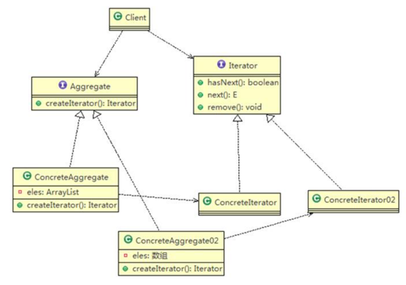
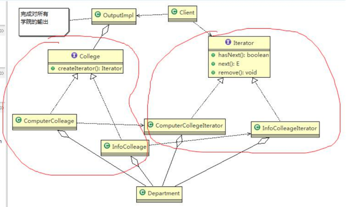
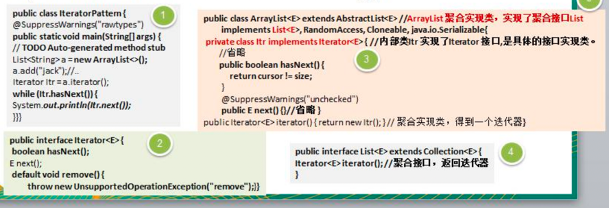
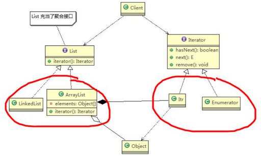

###迭代器模式

1) Iterator: 迭代器接口，是系统提供的，含有 hasNext、next、remove
2) ConcreteIterator: 具体的迭代器类，管理迭代
3) Aggregate: 统一的聚合接口，将客户端和具体聚合解耦
4) ConcreteAggregate: 具体的聚合持有对象集合，并提供一个方法，返回一个迭代器，该迭代器可以正确遍历集合

---
对于需求，要在一个页面中展示出学校的院系组成，一个学校有多个学院，一个学院有多个系。（同组合模式案例需求）

#####具体迭代器类
```java
public class ComputerCollegeIterator implements Iterator {
    Department[] departments; //计算机学院是以数组方式存放系
    int position = 0; //遍历的位置

    public ComputerCollegeIterator(Department[] departments) {
        this.departments = departments;
    }

    @Override
    public boolean hasNext() {
        if (position >= departments.length || departments[position] == null) {
            return false;
        } else {
            return true;
        }
    }

    @Override
    public Object next() {
        Department department = departments[position];
        position += 1;
        return department;
    }

    //空实现remove
    public void remove() {
    }
}
```

#####聚合接口
```java
public interface College {
    public String getName();

    //增加系的方法
    public void addDepartment(String name, String desc);

    //返回一个迭代器,遍历
    public Iterator createIterator();
}
```

#####具体聚合类
```java
public class ComputerCollege implements College {
    Department[] departments;
    int numOfDepartment = 0; //保存当前数组的对象个数

    public ComputerCollege() {
        departments = new Department[5];
        addDepartment("Java专业", " Java专业 ");
        addDepartment("PHP专业", " PHP专业 ");
        addDepartment("大数据专业", " 大数据专业 ");
    }

    @Override
    public String getName() {
        return "计算机学院";
    }

    @Override
    public void addDepartment(String name, String desc) {
        Department department = new Department(name, desc);
        departments[numOfDepartment] = department;
        numOfDepartment += 1;
    }

    @Override
    public Iterator createIterator() {
        return new ComputerCollegeIterator(departments);
    }
}
```

#####基础元素类
```java
@AllArgsConstructor
@Setter
@Getter
public class Department {
    private String name;
    private String desc;
}
```

#####遍历方法类
```java
public class OutPutImpl {
    List<College> collegeList;

    public OutPutImpl(List<College> collegeList) {
        this.collegeList = collegeList;
    }

    //遍历所有学院,然后调用printDepartment 输出各个学院的系
    public void printCollege() {
        //从collegeList 取出所有学院, Java 中的 List 已经实现Iterator
        Iterator<College> iterator = collegeList.iterator();
        while (iterator.hasNext()) {
            //取出一个学院
            College college = iterator.next();
            System.out.println("=== " + college.getName() + "=====");
            printDepartment(college.createIterator()); //得到对应迭代器
        }
    }

    //遍历当前学院下的所有系
    public void printDepartment(Iterator iterator) {
        while (iterator.hasNext()) {
            Department department = (Department) iterator.next();
            System.out.println(department.getName());
        }
    }
}
```

#####客户端服务类
```java
public class Client {
    public static void main(String[] args) {
        //创建学院集合
        List<College> collegeList = new ArrayList<College>();

        //添加学院
        ComputerCollege computerCollege = new ComputerCollege(); //计算机学院是以数组方式存放系
        collegeList.add(computerCollege);

        //遍历院系
        OutPutImpl outPutImpl = new OutPutImpl(collegeList);
        outPutImpl.printCollege();
    }
}
```

###迭代器模式在 JDK-ArrayList 集合应用的源码分析
迭代器模式实现不同集合(ArrayList, LinkedList)统一遍历问题


#####角色分析
- Iterator：接口库函数提供
- 具体迭代器类：ArrayList 内部类 Itr，实现了迭代器 Iterator  
- 聚合接口：List，其含有一个 iterator() 方法，返回一个迭代器对象 
- 具体聚合类：ArrayList，实现聚合接口 List 的子类，实现了 iterator()

###迭代器模式的注意事项和细节
当要展示一组相似对象，或者遍历一组相同对象时使用，适合使用迭代器模式。
#####优点 
>1) 提供一个统一的方法遍历对象，客户不用再考虑聚合的类型，使用一种方法就可以遍历对象了。 
>2) 隐藏了聚合的内部结构，客户端要遍历聚合的时候只能取到迭代器，而不会知道聚合的具体组成。 
>3) 提供了一种设计思想，就是一个类应该只有一个引起变化的原因（叫做单一责任原则）。在聚合类中，我们把迭代器分开，就是要把管理对象集合和遍历对象集合的责任分开，这样一来集合改变的话，只影响到聚合对象。 而如果遍历方式改变的话，只影响到了迭代器。

#####缺点
>1) 每个聚合对象都要一个迭代器，会生成多个迭代器不好管理类
