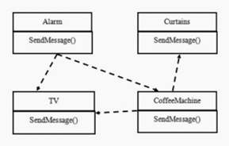
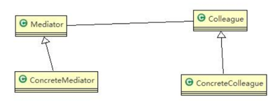
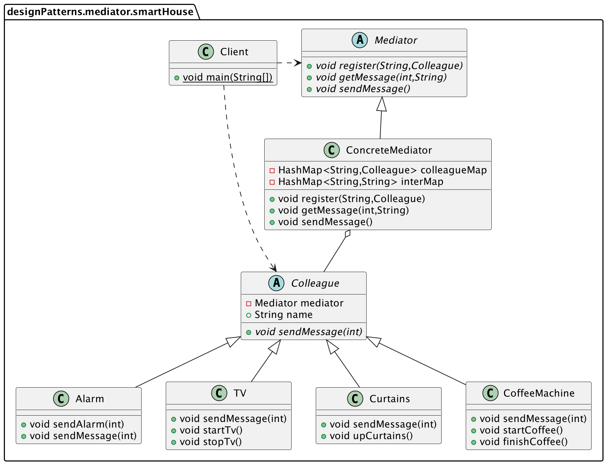

智能家庭项目： 
1) 智能家庭包括各种设备，如闹钟、咖啡机、电视机、窗帘等 
2) 主人要看电视时，各个设备可以协同工作，自动完成看电视的准备工作，比如流程为：闹铃响起->咖啡机开始做咖啡->窗帘自动落下->电视机开始播放

###传统解决方案

1) 当各电器对象有多种状态改变时，相互之间的调用关系会比较复杂 
2) 各个电器对象彼此联系，你中有我、我中有你，不利于松耦合
3) 各个电器对象之间所传递的消息（参数），容易混乱 
4) 当系统增加一个新的电器对象时，或者执行流程改变时，代码的可维护性、扩展性都不理想

###中介者模式
中介者模式（Mediator Pattern），用一个中介对象来封装一系列的对象交互。中介者使各个对象不需要显式地相互引用，从而使其耦合松散，而且可以独立地改变它们之间的交互。其原理图如下：

1) Mediator 是抽象中介者，定义了同事对象到中介者对象的接口
2) ConcreteMediator 具体的中介者对象, 实现抽象方法, 他需要知道所有的具体的同事类,即以一个集合来管理 HashMap,并接受某个同事对象消息，完成相应的任务
3) Colleague 是抽象同事类
4) ConcreteColleague 具体的同事类，会有很多，每个同事只知道自己的行为，而不了解其他同事类的行为（方法）， 但是他们都依赖中介者对象
>注：SpringMVC 模式，C（Controller 控制器）是 M（Model 模型）和 V（View 视图）的中介者，在前后端交互时起到了中间人的作用。

###使用中介者模式设计智能家居系统

#####抽象同事类
```java
@Getter
@AllArgsConstructor
public abstract class Colleague {
    private Mediator mediator;
    public String name;

    public abstract void sendMessage(int stateChange);
}
```

#####具体中介者类
```java
//具体的中介者类
public class ConcreteMediator extends Mediator {
    private final HashMap<String, Colleague> colleagueMap; //集合，放入所有的同事对象
    private final HashMap<String, String> interMap;

    public ConcreteMediator() {
        colleagueMap = new HashMap<String, Colleague>();
        interMap = new HashMap<String, String>();
    }

    @Override
    public void register(String colleagueName, Colleague colleague) {
        colleagueMap.put(colleagueName, colleague);
        if (colleague instanceof Alarm) {
            interMap.put("Alarm", colleagueName);
        } else if (colleague instanceof CoffeeMachine) {
            interMap.put("CoffeeMachine", colleagueName);
        } else if (colleague instanceof TV) {
            interMap.put("TV", colleagueName);
        } else if (colleague instanceof Curtains) {
            interMap.put("Curtains", colleagueName);
        }
    }

    //具体中介者的核心方法
    //1. 根据得到消息，完成对应任务
    //2. 中介者在这个方法，协调各个具体的同事对象，完成任务
    @Override
    public void getMessage(int stateChange, String colleagueName) {
        //处理闹钟发出的消息
        if (colleagueMap.get(colleagueName) instanceof Alarm) {
            if (stateChange == 0) {
                ((CoffeeMachine) (colleagueMap.get(interMap.get("CoffeeMachine")))).startCoffee();
                ((TV) (colleagueMap.get(interMap.get("TV")))).startTv();
            } else if (stateChange == 1) {
                ((TV) (colleagueMap.get(interMap.get("TV")))).stopTv();
            }
        } else if (colleagueMap.get(colleagueName) instanceof CoffeeMachine) {
            ((Curtains) (colleagueMap.get(interMap.get("Curtains")))).upCurtains();
        } else if (colleagueMap.get(colleagueName) instanceof TV) {
            //如果TV发出消息，这里处理...
        } else if (colleagueMap.get(colleagueName) instanceof Curtains) {
            //如果窗帘发出消息，这里处理...
        }
    }

    @Override
    public void sendMessage() {

    }
}
```

#####抽象同事类
```java
@Getter
@AllArgsConstructor
public abstract class Colleague {
    private Mediator mediator;
    public String name;

    public abstract void sendMessage(int stateChange);
}
```

#####具体同事类
```java
public class Alarm extends Colleague {
    //构造器
    public Alarm(Mediator mediator, String name) {
        super(mediator, name);
        //在创建Alarm时，将自己放入到ConcreteMediator对象中的HashMap集合
        mediator.register(name, this);
    }

    public void sendAlarm(int stateChange) {
        sendMessage(stateChange);
    }

    @Override
    public void sendMessage(int stateChange) {
        //调用的中介者对象的getMessage
        this.getMediator().getMessage(stateChange, this.name);
    }
}
```

#####客户端服务类
```java
public class Client {
    public static void main(String[] args) {
        //创建一个中介者对象
        Mediator mediator = new ConcreteMediator();

        //创建 Alarm、CoffeeMachine、Curtains、TV，并且加入到 ConcreteMediator 对象的 HashMap
        Alarm alarm = new Alarm(mediator, "alarm");
        CoffeeMachine coffeeMachine = new CoffeeMachine(mediator, "coffeeMachine");
        Curtains curtains = new Curtains(mediator, "curtains");
        TV tV = new TV(mediator, "TV");

        //让闹钟发出消息
        alarm.sendAlarm(0);
        coffeeMachine.finishCoffee();
        alarm.sendAlarm(1);
    }
}
```

###中介者模式的注意事项和细节
1) 多个类相互耦合，会形成网状结构, 使用中介者模式将网状结构分离为星型结构，进行解耦 
2) 减少类间依赖，降低了耦合，符合迪米特原则 
3) **中介者承担了较多的责任，一旦中介者出现了问题，整个系统就会受到影响**
4) 如果设计不当，中介者对象本身变得过于复杂，这点在实际使用时，要特别注意