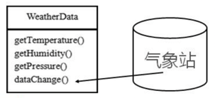
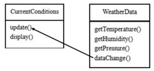
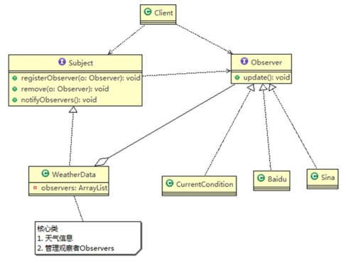
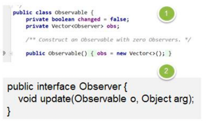

针对气象站观测需求：
1) 气象站可以将每天测量到的温度、湿度、气压等等以公告的形式发布出去(比如发布到自己的网站或第三方)。 
2) 需要设计开放型 API，便于其他第三方也能接入气象站获取数据。 
3) 提供温度、气压和湿度的接口。
4) 测量数据更新时，要能实时的通知给第三方。

###传统设计方案
#####方案1：气象站调用天气更新数据
  
#####方案2：天气更新数据推送给气象站  


###观察者模式设计方案
####观察者模式主要角色
- Subject：登记注册、移除和通知 
  - registerObserver 注册 
  - removeObserver 移除 
  - notifyObservers 通知所有的注册的用户(根据不同需求，可以是更新数据，让用户来取，也可能是实施推送， 看具体需求定)
- Observer：接收 Subject 数据

####使用观察者模式设计气象观测系统

#####观察者接口
```java
public interface Observer {
    public void update(float temperature, float pressure, float humidity);
}
```

#####具体观察者
```java
public class CurrentConditions implements Observer {
    // 温度，气压，湿度
    private float temperature;
    private float pressure;
    private float humidity;

    // 更新天气情况，是由 WeatherData 来调用
    public void update(float temperature, float pressure, float humidity) {
        this.temperature = temperature;
        this.pressure = pressure;
        this.humidity = humidity;
        display();
    }

    // 显示天气情况
    public void display() {
        System.out.println("***Today mTemperature: " + temperature + "***");
        System.out.println("***Today mPressure: " + pressure + "***");
        System.out.println("***Today mHumidity: " + humidity + "***");
    }
}
```

#####被观察者接口
```java
public interface Subject {
    public void registerObserver(Observer observer);
    public void removeObserver(Observer observer);
    public void notifyObservers();
}
```

#####具体被观察数据
```java
public class WeatherData implements Subject {
    private float temperature;
    private float pressure;
    private float humidity;
    private final ArrayList<Observer> observers; //观察者集合

    //接入观察者
    public WeatherData() {
        observers = new ArrayList<Observer>();
    }

    public void dataChange() {
        //调用接入方的 update
        notifyObservers();
    }

    //当数据有更新时，就调用 setData
    public void setData(float temperature, float pressure, float humidity) {
        this.temperature = temperature;
        this.pressure = pressure;
        this.humidity = humidity;
        //调用dataChange， 将最新的信息 推送给 接入方 currentConditions
        dataChange();
    }

    //注册一个观察者
    @Override
    public void registerObserver(Observer o) {
        observers.add(o);
    }

    //移除一个观察者
    @Override
    public void removeObserver(Observer o) {
        observers.remove(o);
    }

    //遍历所有的观察者，并通知
    @Override
    public void notifyObservers() {
        for (Observer observer : observers) {
            observer.update(this.temperature, this.pressure, this.humidity);
        }
    }
}
```

####观察者模式的好处
1) 观察者模式设计后，会以集合的方式来管理用户(Observer)，包括注册，移除和通知。 
2) 这样，我们增加观察者(这里可以理解成一个新的公告板)，就不需要去修改核心类 WeatherData 不会修改代码，遵守了 ocp 原则。

###观察者模式在 Jdk 应用的源码分析

- Observable 的作用和地位等价于前文提到的 Subject 
- Observable 是类，不是接口，类中已经实现了核心的方法，即管理 Observer 的方法 add、delete、notify 
- Observer 的作用和地位等价于我们前面讲过的 Observer, 有 update  
- Observable 和 Observer 的使用方法和前文提到的一样，只是 Observable 是类，通过继承来实现观察者模式