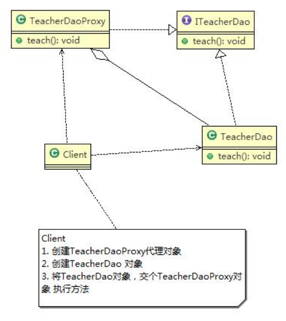
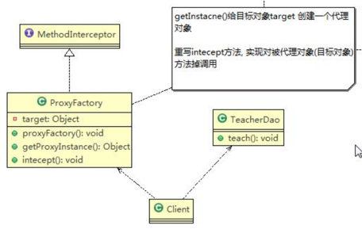

**代理模式**：为一个对象提供一个替身，以控制对这个对象的访问。即通过代理对象访问目标对象。这样做的好处是：可以在目标对象实现的基础上,增强额外的功能操作,即扩展目标对象的功能。  

-------------------
代理模式有不同的形式，主要分为三种：
- 静态代理 (代理对象与目标对象要实现相同的接口)
- 动态代理 (代理对象不需要实现接口，但目标对象要实现接口)
- Cglib 代理 (可以在内存动态的创建对象，而不需要实现接口，它属于`动态代理`的范畴) 

###静态代理

#####接口
```java
public interface ITeacherDao {
    void teach(); //授课的方法
}
```

#####被代理类
```java
public class TeacherDao implements ITeacherDao {
    public class TeacherDao implements ITeacherDao {
        @Override
        public void teach() {
            System.out.println("老师授课中...");
        }
    }
}
```

#####代理类
```java
@AllArgsConstructor
public class TeacherDaoProxy implements ITeacherDao {
    private ITeacherDao target; //目标对象，通过接口来聚合

    @Override
    public void teach() {
        System.out.println("开始静态代理");
        target.teach();
        System.out.println("完成静态代理");
    }
}
```

#####客户端服务类
```java
public class Client {
    public static void main(String[] args) {
        //创建目标对象(被代理对象)
        TeacherDao teacherDao = new TeacherDao();

        //创建代理对象, 同时将被代理对象传递给代理对象
        TeacherDaoProxy teacherDaoProxy = new TeacherDaoProxy(teacherDao);

        //通过代理对象，调用到被代理对象的方法
        //即：执行的是代理对象的方法，代理对象再去调用目标对象的方法
        teacherDaoProxy.teach();
    }
}
```

###动态代理

#####接口
```java
public interface ITeacherDao {
    void teach(); //授课方法
    void sayHello(String name);
}
```

#####被代理类
```java
public class TeacherDao implements ITeacherDao {
    @Override
    public void teach() {
        System.out.println("老师授课中...");
    }

    @Override
    public void sayHello(String name) {
        System.out.println("hello " + name);
    }
}
```

#####代理类
```java
@AllArgsConstructor
public class ProxyFactory {
    private Object target; //目标对象

    //给目标对象 生成一个代理对象
    public Object getProxyInstance() {
        //说明
		/*
		 *  public static Object newProxyInstance(ClassLoader loader,
                                          Class<?>[] interfaces,
                                          InvocationHandler h)
            //1. ClassLoader loader：指定当前目标对象使用的类加载器, 获取加载器的方法固定
            //2. Class<?>[] interfaces：目标对象实现的接口类型，使用泛型方法确认类型
            //3. InvocationHandler h：事情处理，执行目标对象的方法时，会触发事情处理器方法, 会把当前执行的目标对象方法作为参数传入
		 */
        return Proxy.newProxyInstance(target.getClass().getClassLoader(), target.getClass().getInterfaces(), new InvocationHandler() {
            @Override
            public Object invoke(Object proxy, Method method, Object[] args) throws Throwable {
                System.out.println("JDK代理开始");
                //反射机制调用目标对象的方法
                Object returnVal = method.invoke(target, args);
                System.out.println("JDK代理完成");
                return returnVal;
            }
        });
    }
}
```

#####客户端服务类
```java
public class Client {
    public static void main(String[] args) {
        //创建目标对象
        ITeacherDao target = new TeacherDao();

        //给目标对象，创建代理对象, 可以转成 ITeacherDao
        ITeacherDao proxyInstance = (ITeacherDao) new ProxyFactory(target).getProxyInstance();

        //proxyInstance=class com.sun.proxy.$Proxy0 内存中动态生成了代理对象
        System.out.println("proxyInstance=" + proxyInstance.getClass());

        //通过代理对象，调用目标对象的方法
        proxyInstance.teach();
        proxyInstance.sayHello("tom");
    }
}
```
###Cglib 代理

#####被代理类
```java
public class TeacherDao {
    public String teach() {
        System.out.println("老师授课中...(通过Cglib代理，不需要实现接口)");
        return "hello";
    }
}
```

#####代理类
```java
@AllArgsConstructor
public class ProxyFactory implements MethodInterceptor {
    private Object target; //目标对象

    public Object getProxyInstance() {
        //1. 创建一个工具类
        Enhancer enhancer = new Enhancer();
        //2. 设置父类
        enhancer.setSuperclass(target.getClass());
        //3. 设置回调函数
        enhancer.setCallback(this);
        //4. 创建子类对象，即代理对象
        return enhancer.create();
    }

    //重写 intercept 方法，会调用目标对象的方法
    @Override
    public Object intercept(Object arg0, Method method, Object[] args, MethodProxy arg3) throws Throwable {
        System.out.println("Cglib代理模式开始");
        Object returnVal = method.invoke(target, args);
        System.out.println("Cglib代理模式完成");
        return returnVal;
    }
}
```

#####客户端服务类
```java
public class Client {
    public static void main(String[] args) {
        //创建目标对象
        TeacherDao target = new TeacherDao();
        //获取到代理对象，并且将目标对象传递给代理对象
        TeacherDao proxyInstance = (TeacherDao) new ProxyFactory(target).getProxyInstance();

        //执行代理对象的方法，触发intercept 方法，从而实现对目标对象的调用
        String res = proxyInstance.teach();
        System.out.println("res=" + res);
    }
}
```

###代理模式的几种变体
1) 防火墙代理   
内网通过代理穿透防火墙，实现对公网的访问。 
2) 缓存代理  
比如：当请求图片文件等资源时，先到缓存代理取，如果取到资源则 ok,如果取不到资源，再到公网或者数据 库取，然后缓存。
3) 远程代理  
远程对象的本地代表，通过它可以把远程对象当本地对象来调用。远程代理通过网络和真正的远程对象沟通信 息。 
4) 同步代理  
主要使用在多线程编程中，完成多线程间同步工作