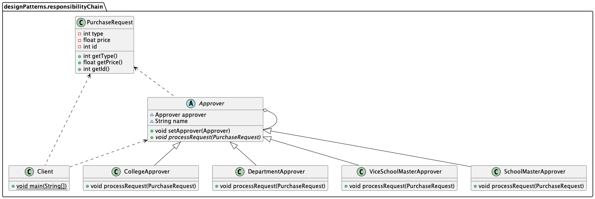

针对需求：学校 OA 系统的采购审批项目——采购教学器材 
1) 如果金额 小于等于 5000, 由教学主任审批 (0<=x<=5000)
2) 如果金额 小于等于 10000, 由院长审批 (5000<x<=10000) 
3) 如果金额 小于等于 30000, 由副校长审批 (10000<x<=30000) 
4) 如果金额 超过 30000 以上，有校长审批 (30000<x)
---
###传统方案
客户端这里会使用到分支判断 (比如switch) 来对不同的采购请求处理， 这样就存在如下问题   
>- 如果各个级别的人员审批金额发生变化，在客户端的也需要变化 
>- 客户端必须明确的知道，有多少个审批级别和访问  

这样对一个采购请求和审批人就存在强耦合关系，不利于代码的扩展和维护。因为，可以考虑使用`职责链模式`进行设计。

---
###职责链模式

######抽象审批人类
```java
public abstract class Approver { 
    Approver approver;
    String name;
    
    public Approver(String name) {
        this.name = name;
    }
    
    public void setApprover(Approver approver) {
        this.approver = approver;
    }

    //处理审批请求的方法，得到一个请求, 处理是子类完成，因此该方法做成抽象
    public abstract void processRequest(PurchaseRequest purchaseRequest);
}
```

######审批人实现子类，这里以DepartmentApprover为例
```java
public class DepartmentApprover extends Approver { 
    public DepartmentApprover(String name) {
        super(name);
    }
    
    @Override 
    public void processRequest(PurchaseRequest purchaseRequest) {
        if (purchaseRequest.getPrice() <= 5000) {
            System.out.println(" 请求编号 id= " + purchaseRequest.getId() + " 被 " + this.name + " 处理");
        } else {
            approver.processRequest(purchaseRequest);
        }
    }
}
```
######客户端调用类
```java
public class Client {
    public static void main(String[] args) {
        //创建一个请求
        PurchaseRequest purchaseRequest = new PurchaseRequest(1, 31000, 1);

        //创建相关的审批人
        DepartmentApprover departmentApprover = new DepartmentApprover("张主任");
        CollegeApprover collegeApprover = new CollegeApprover("李院长");
        ViceSchoolMasterApprover viceSchoolMasterApprover = new ViceSchoolMasterApprover("王副校");
        SchoolMasterApprover schoolMasterApprover = new SchoolMasterApprover("佟校长");

        //需要将各个审批级别的下一个设置好 (处理人构成环形)
        departmentApprover.setApprover(collegeApprover);
        collegeApprover.setApprover(viceSchoolMasterApprover);
        viceSchoolMasterApprover.setApprover(schoolMasterApprover);
        schoolMasterApprover.setApprover(departmentApprover);

        departmentApprover.processRequest(purchaseRequest);
        viceSchoolMasterApprover.processRequest(purchaseRequest);
    }
}
```
###注意：
- 审批流程要设置成`环形`的，若不设置成环形的则需要从`最低一级审批人`开始。
- 采用了类似递归的方式，性能会受到影响，特别是在链比较长的时候，因此需控制链中最大节点数量。
    >一般通过在 Handler 中设置一个最大节点数量，在setNext()方法中判断是否已经超过阀值，超过则不允许该链建立，避免出现超长链无意识地 破坏系统性能