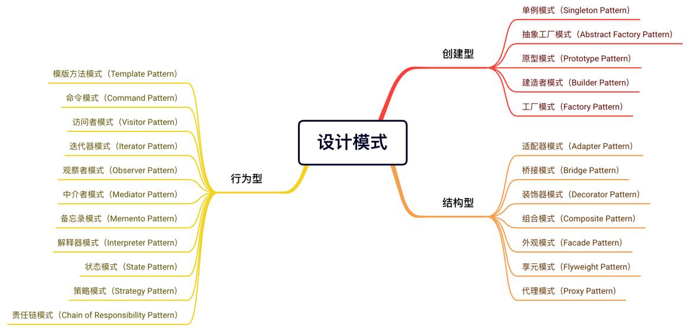
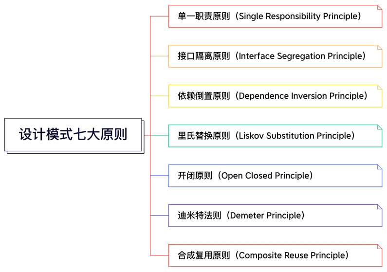

- 创建型模式（共5种）：单例模式、抽象工厂模式、原型模式、建造者模式、工厂模式。
- 结构型模式（共7种）：适配器模式、桥接模式、装饰模式、组合模式、外观模式、享元模式、代理模式。
- 行为型模式（共11种）：模版方法模式、命令模式、访问者模式、迭代器模式、观察者模式、中介者模式、备忘录模式、 解释器模式、状态模式、策略模式、责任链模式。

设计模式的七大原则
- 单一职责原则（Single Responsibility Principle）：比如Dao层类，分别只对各自对应的entity操作，而不对多个entity操作。
- 接口隔离原则（Interface Segregation Principle）：一个类对另一个的类的依赖应该建立在最小的接口上。
- 依赖倒置原则（Dependence Inversion Principle）：高层模块不应该依赖底层模块，二者都应该依赖其抽象。抽象不应该依赖细节，细节应该依赖抽象。
- 里氏替换原则（Liskov Substitution Principle）：子类中尽量不要重写父类的方法，通过聚合、组合、依赖来解决问题。
- 开闭原则（Open Closed Principle）：对扩展开放、对修改关闭。尽量通过扩展软件实体的行为来实现变化，而不是通过修改已有的代码来实现变化。
- 迪米特法则（Demeter Principle）：对自己依赖的类知道的越少越好。
- 合成复用原则（Composite Reuse Principle）：尽量使用合成/聚合的方式，而不是使用继承。  

###设计模式举例
创建型模式：建造者模式  
结构型模式：桥接模式  
行为型模式：策略模式

###学习交流
https://github.com/andyruohan/JavaApprentice.git