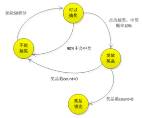
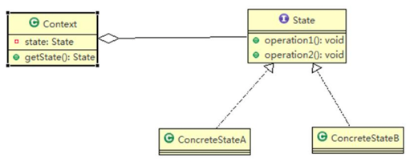
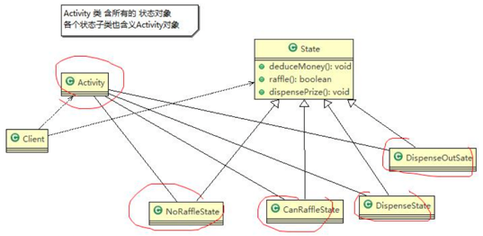

请编写程序完成 APP 抽奖活动 具体要求如下: 
1) 假如每参加一次这个活动要扣除用户 50 积分，中奖概率是 10% 
2) 奖品数量固定，抽完就不能抽奖 
3) 活动有四个状态：可以抽奖、不能抽奖、发放奖品和奖品领完 
4) 活动的四个状态转换关系图  


###状态模式原理

1) Context 类为环境角色, 用于维护 State 实例,这个实例定义当前状态 
2) State 是抽象状态角色,定义一个接口封装与 Context 的一个特点接口相关行为 
3) ConcreteState 具体的状态角色，每个子类实现一个与 Context 的一个状态相关行为

###状态模式实现抽奖活动

#####抽象状态类
```java
public abstract class State {
    public abstract void deductMoney();
    public abstract boolean raffle();
    public abstract void dispensePrize();
}
```

#####具体状态类
```java
@AllArgsConstructor
public class NoRaffleState extends State {
    // 初始化时传入活动引用，扣除积分后改变其状态
    RaffleActivity activity;

    // 当前状态可以扣积分，扣除后将状态设置成可以抽奖状态
    @Override
    public void deductMoney() {
        System.out.println("扣除50积分成功，您可以抽奖了");
        activity.setState(activity.getCanRaffleState());
    }

    @Override
    public boolean raffle() {
        System.out.println("扣了积分才能抽奖喔！");
        return false;
    }

    @Override
    public void dispensePrize() {
        System.out.println("不能发放奖品");
    }
}
```

#####抽奖活动类
```java
@Setter
@Getter
public class RaffleActivity {
    State state = null; //state 表示活动当前的状态
    int count = 0; //奖品数量

    //四个属性，表示四种状态
    State noRaffleState = new NoRaffleState(this);
    State canRaffleState = new CanRaffleState(this);
    State dispenseState = new DispenseState(this);
    State dispenseOutState = new DispenseOutState(this);

    //构造器
    //1. 初始化当前的状态为 noRaffleState（即不能抽奖的状态）
    //2. 初始化奖品的数量 
    public RaffleActivity(int count) {
        this.state = getNoRaffleState();
        this.count = count;
    }

    public void deductMoney() {
        state.deductMoney();
    }

    public void raffle() {
        if (state.raffle()) {
            state.dispensePrize();
        }
    }

    //每领取一次奖品，count--
    public int getPrizeCount() {
        int curCount = count;
        count--;
        return curCount;
    }
}
```

###客户端服务类
```java
public class Client {
    public static void main(String[] args) {
        RaffleActivity activity = new RaffleActivity(1);

        // 我们连续抽300次奖
        for (int i = 0; i < 30; i++) {
            System.out.println("--------第" + (i + 1) + "次抽奖----------");
            // 参加抽奖
            // 第一步点击扣除积分
            activity.deductMoney();

            // 第二步抽奖
            activity.raffle();
        }
    }
}
```

###状态模式的注意事项和细节 
####优点：
1) **可读性**很强，状态模式将每个状态的行为封装到对应的一个类中 
2) **便于维护**，将容易产生问题的 if-else 语句删除了
>如果把每个状态的行为都放到一个类中，每次调用方法时都要判断当前是什么状态，不但会产出很多 if-else 语句，而且容易出错
3) 符合**开闭原则**，容易增删状态

####缺点： 
每个状态都要一个对应的类，当状态过多时会产生很多类，加大维护难度 

###应用场景
当一个事件或者对象有很多种状态，状态之间会相互转换，对不同的状态要求有不同的行为的时候，可以考虑使用状态模式