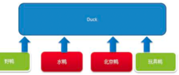
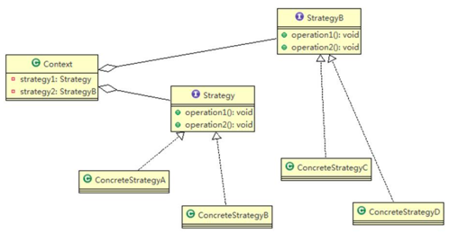
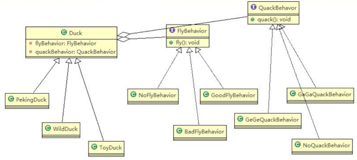
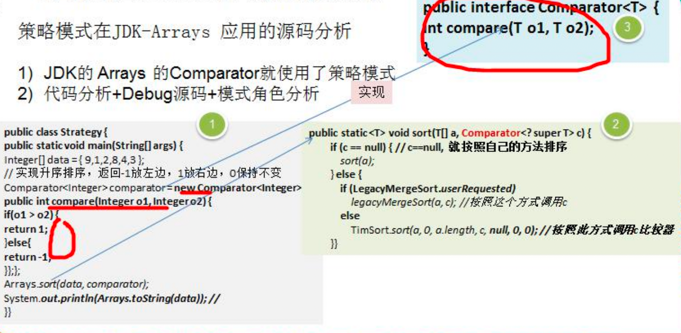

针对需求: 
1) 有各种鸭子，比如野鸭、北京鸭、野鸭等
2) 鸭子有各种行为，比如叫、飞行等
3) 显示鸭子的信息

###传统解决方案

缺点：
1) 各类鸭子都继承了 Duck 类，超类 fly 让所有子类都会飞了，这是不正确的 
2) 继承同时带来了溢出效应：对类的局部改动，尤其超类的局部改动，会影响其他部分
>为了改进 1 问题，我们可以通过覆盖 fly 方法来解决。但问题又来了，当出现一种鸭子与超类的行为完全不一样，就需要覆盖超类所有实现的方法

###策略模式

策略模式体现了几个设计原则：
1) 把变化的代码从不变的代码中分离出来；
2) 针对接口编程而不是具体类（定义了策略接口）；
3) 多用组合/聚合，少用继承（客户通过组合方式使用策略）。

###使用策略模式解决鸭子问题


#####抽象鸭子类
```java
public abstract class Duck {
    FlyBehavior flyBehavior; //飞行策略接口
    QuackBehavior quackBehavior; //鸭叫策略接口

    public abstract void display();

    public void quack() {
        System.out.println("鸭子嘎嘎叫");
    }

    public void swim() {
        System.out.println("鸭子会游泳");
    }

    public void fly() {
        if (flyBehavior != null) {
            flyBehavior.fly();
        }
    }
}
```

#####具体鸭子类
```java
public class WildDuck extends Duck {
    public WildDuck() {
        flyBehavior = new GoodFlyBehavior();
    }

    @Override
    public void display() {
        System.out.println("当前是野鸭");
    }
}
```

#####飞翔行为接口
```java
public interface FlyBehavior {
    void fly();
}
```

#####飞行策略1
```java
public class GoodFlyBehavior implements FlyBehavior {
    @Override
    public void fly() {
        System.out.println("飞翔技术高超");
    }
}
```

#####飞行策略2
```java
public class NoFlyBehavior implements FlyBehavior {
    @Override
    public void fly() {
        System.out.println("不会飞翔");
    }
}
```

#####客户端服务类
```java
public class Client {
    public static void main(String[] args) {
        Duck wildDuck = new WildDuck();
        wildDuck.display();
        wildDuck.fly();

        System.out.println("-----------");
        wildDuck.display();
        wildDuck.setFlyBehavior(new NoFlyBehavior()); //使用策略变更行为
        wildDuck.fly();
    }
}
```

###策略模式在 JDK-Arrays 应用的源码分析


###策略模式的注意事项和细节
1) 策略模式的关键是：分析项目中变化部分与不变部分 
2) 策略模式的核心思想是：多用组合/聚合 少用继承；用行为类组合，而不是行为的继承 
3) 体现了“对修改关闭，对扩展开放”原则，客户端增加行为不用修改原有代码，只要添加一种策略（或者行为） 即可，避免了使用多重转移语句（if..else if..else） 
4) 提供了可以替换继承关系的办法： 策略模式将算法封装在独立的 Strategy 类中使得你可以独立于其 Context 改变它，使它易于切换、易于理解、易于扩展 
5) 需要注意的是：每添加一个策略就要增加一个类，当策略过多是会导致类数目庞
