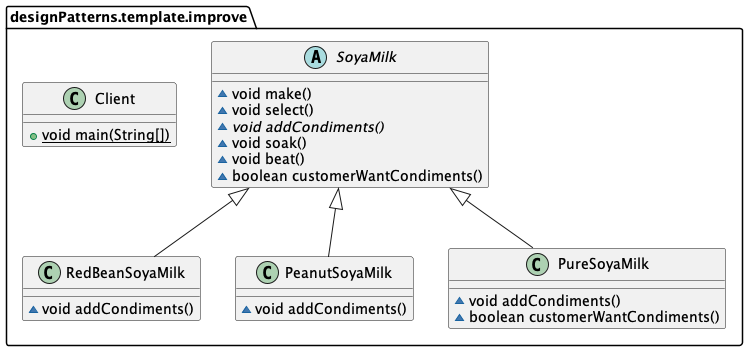

模版方法模式使用场景，比如酿制各类豆浆，制作工序相同、但辅料略有差异。
> 比如制作豆浆，包含 
> 1) 选材  
> 2) `加入配料` 
> 3) 浸泡
> 4) 打磨  

其中选材、浸泡、打磨几个工序是相同的，但不同类型的豆浆加入配料不同。



######抽象豆浆类
```java
public abstract class SoyaMilk {
    //此处模板方法做成final，不让子类去覆盖
    final void make() {
        select();
        if (customerWantCondiments()) {
            addCondiments();
        }
        soak();
        beat();
    }
    
    void select() { //选材
        System.out.println("第一步，选择好的新鲜黄豆");
    }

    //添加不同的配料，此处以子类来实现
    abstract void addCondiments();

    void soak() { //浸泡
        System.out.println("第三步，黄豆和配料开始浸泡，需要3小时");
    }

    void beat() { //打磨
        System.out.println("第四步，黄豆和配料放到豆浆机去打碎");
    }

    //钩子方法，决定是否需要添加配料
    boolean customerWantCondiments() {
        return true;
    }
}

```

######豆浆实现子类，这里以花生豆浆为例
```java
public class PeanutSoyaMilk extends SoyaMilk {
    @Override
    void addCondiments() {
        System.out.println("第二步，加入上好的花生 ");
    }
}
```

######客户端调用类
```java
public class Client {
    public static void main(String[] args) {
        System.out.println("----制作红豆豆浆----");
        SoyaMilk redBeanSoyaMilk = new RedBeanSoyaMilk();
        redBeanSoyaMilk.make();

        System.out.println("----制作花生豆浆----");
        SoyaMilk peanutSoyaMilk = new PeanutSoyaMilk();
        peanutSoyaMilk.make();

        System.out.println("----制作纯豆浆----");
        SoyaMilk pureSoyaMilk = new PureSoyaMilk();
        pureSoyaMilk.make();
    }
}
```
在模板方法模式的父类中，我们可以定义一个方法，它默认不做任何事，子类可以视情况要不要覆盖它，该方法称为`“钩子”`。
>- 本例中，通过子类实现不同的加配料抽象方法，制作出红豆、花生豆浆；
>- 通过钩子方法（默认不做任何加配料的事），制作出纯豆浆。