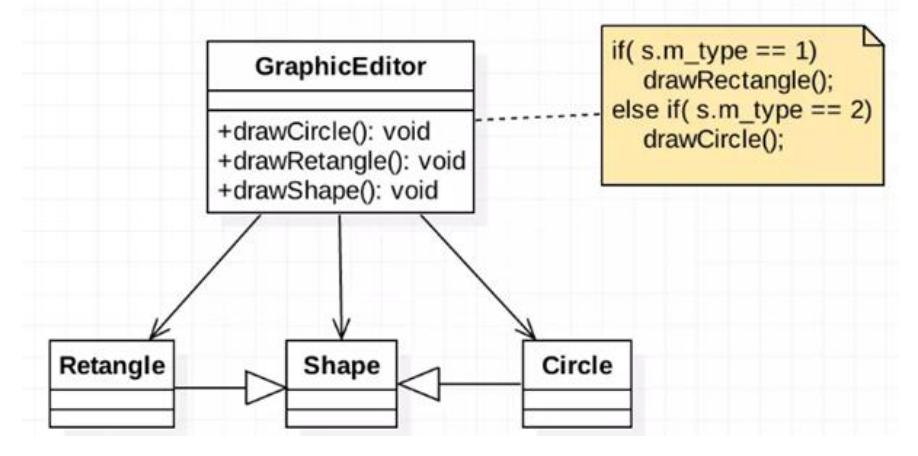

###这是一个用于绘图的工具类设计
    package com.atguigu.principle.ocp;
    class GraphicEditor {
        //接收 Shape 对象，然后根据 type，来绘制不同的图形
        public void drawShape(Shape s) {
            if (s.m_type == 1)
            drawRectangle(s);
            else if (s.m_type == 2)
            drawCircle(s);
        }

        //绘制矩形
        public void drawRectangle(Shape r) {
            System.out.println(" 绘制矩形 ");
        }

        //绘制圆形
        public void drawCircle(Shape r) {
            System.out.println(" 绘制圆形 ");
        }
    }

    //Shape类，基类
    class Shape {
        int m_type;
    }
    class Rectangle extends Shape {
        Rectangle() {
            super.m_type = 1;
        }
    }
    class Circle extends Shape {
        Circle() {
            super.m_type = 2;
        }
    }

    主函数
    public class Ocp {
        public static void main(String[] args) {
            GraphicEditor graphicEditor = new GraphicEditor();
            
            graphicEditor.drawShape(new Rectangle());
            graphicEditor.drawShape(new Circle());
        }
    }

当前设计违反了开闭原则，如需新增绘制三角形需要对已有代码进行修改

    class GraphicEditor {
        public void drawShape(Shape s) {
            ...
            else if (s.m_type == 3)
            drawTriangle(s);
            ...
        }

        ...
        //绘制三角形
        public void drawTriangle(Shape r) {
            System.out.println(" 绘制三角形 ");
        }
        ...

    //新增画三角形
    class Triangle extends Shape {
        Triangle() {
            super.m_type = 3; 
        }
    }

    //主函数
    public class Ocp {
        public static void main(String[] args) {
            GraphicEditor graphicEditor = new GraphicEditor();

            ...
            graphicEditor.drawShape(new Triangle());
        }
    }

遵循开闭原则，可将代码进行优化。
>优化思路：把创建` Shape 类做成抽象类`，并提供一个`抽象的 draw 方法`，让`子类去实现`即可，这样我们有新的图形种类时，只需要让新的图形类继承 Shape，并实现 draw 方法即可，`使用方的代码就不需要修改` -> 满足了开闭原则

    class GraphicEditor {
        //接收 Shape 对象，调用 draw 方法
        public void drawShape(Shape s) {
            s.draw();
        }
    }

    //Shape 类，基类
    abstract class Shape {
        int m_type;
        public abstract void draw();//抽象方法
    }

    class Rectangle extends Shape {
        Rectangle() {
            super.m_type = 1;
        }

        @Override
        public void draw() {
            // TODO Auto-generated method stub
            System.out.println(" 绘制矩形 ");
        }
    }

    class Circle extends Shape {
        Circle() {
            super.m_type = 2;
        }

        @Override
        public void draw() {
            // TODO Auto-generated method stub
            System.out.println(" 绘制圆形 ");
        }
    }

    //新增画三角形
    class Triangle extends Shape {
        Triangle() {
            super.m_type = 3;
        }

        @Override
        public void draw() {
            // TODO Auto-generated method stub
            System.out.println(" 绘制三角形 ");
        }
    }

    //新增一个图形
    class OtherGraphic extends Shape {
        OtherGraphic() {
            super.m_type = 4;
        }
        
        @Override
        public void draw() {
            // TODO Auto-generated method stub
            System.out.println(" 绘制其它图形 ");
        }
    }

    //主函数
    public class Ocp {
        public static void main(String[] args) {
            GraphicEditor graphicEditor = new GraphicEditor();
            graphicEditor.drawShape(new Rectangle());
            graphicEditor.drawShape(new Circle());
            graphicEditor.drawShape(new Triangle());
            graphicEditor.drawShape(new OtherGraphic());
        }
    }
从上例可以看出，遵循开闭原则后，无论是新增三角形绘制还是其他图形的绘制，均不会影响到原代码，做到了`对拓展开放、对修改关闭`。

###总结：
- 一个软件实体如类，模块和函数应该`对扩展开放(对提供方)，对修改关闭(对使用方)`。用抽象构建框架，用实 现扩展细节。 
- 当软件需要变化时，尽量`通过扩展软件`实体的行为来实现变化，而不是`通过修改`已有的代码来实现变化。 
- 编程中遵循其它原则，以及使用设计模式的目的就是遵循开闭原则。