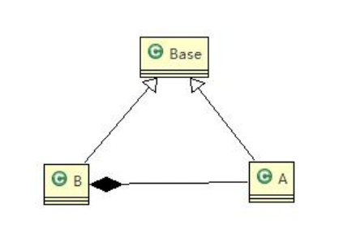

使用继承时，常容易出现的一个问题：子类无意间重写了父类的方法，但仍以为继续使用的是父类方法，如下例：
```java
package com.atguigu.principle.liskov;
public class Liskov {
    public static void main(String[] args) {
        // TODO Auto-generated method stub 
        A a = new A();
        System.out.println("11-3=" + a.func1(11, 3));
        System.out.println("1-8=" + a.func1(1, 8));
        System.out.println("-----------------------");
        B b = new B();
        System.out.println("11-3=" + b.func1(11, 3));//这里本意是求出 11-3 
        System.out.println("1-8=" + b.func1(1, 8));// 1-8 
        System.out.println("11+3+9=" + b.func2(11, 3));
    }
}

// A 类 
class A {
    // 返回两个数的差 
    public int func1(int num1, int num2) {
        return num1 - num2;
    }
}
// B 类继承了 A 
// 增加了一个新功能：完成两个数相加,然后和 9 求和 
class B extends A {
    //这里，重写了 A 类的方法, 可能是无意识 
    public int func1(int a, int b) {
        return a + b;
    }
    public int func2(int a, int b) {
        return func1(a, b) + 9;
    }
} 
```
我们发现原来运行正常的相减功能发生了错误。原因就是类 B 无意中重写了父类的方法，造成原有功能出现错误。在实际编程中，我们常常会通过重写父类的方法完成新的功能，这样写起来虽然简单，但整个继承体系的复用性会比较差，特别是运行多态比较频繁的时候。

为避免以上问题，可通过`里氏替换原则`对代码进行优化。通用的做法是：原来的父类和子类都继承一个更通俗的基类，原有的继承关系去掉，采用依赖、聚合、组合等关系代替。

```java
package com.atguigu.principle.liskov.improve;
public class Liskov {
    public static void main(String[] args) {
        // TODO Auto-generated method stub 
        A a = new A();
        System.out.println("11-3=" + a.func1(11, 3));
        System.out.println("1-8=" + a.func1(1, 8));
        System.out.println("-----------------------");
        B b = new B();
        
        //因为 B 类不再继承 A 类，因此调用者，不会再 func1 是求减法 
        //调用完成的功能就会很明确 
        System.out.println("11+3=" + b.func1(11, 3));//这里本意是求出 11+3
        System.out.println("1+8=" + b.func1(1, 8));// 1+8 
        System.out.println("11+3+9=" + b.func2(11, 3));
        
        //使用组合仍然可以使用到 A 类相关方法 
        System.out.println("11-3=" + b.func3(11, 3));// 这里本意是求出 11-3 
    }
}
//创建一个更加基础的基类 
class Base {
    //把更加基础的方法和成员写到 Base 类 
}
// A 类 
class A extends Base {
    // 返回两个数的差 
    public int func1(int num1, int num2) {
        return num1 - num2;
    }
}
// B 类继承了 A
// 增加了一个新功能：完成两个数相加,然后和 9 求和 
class B extends Base {
    //如果 B 需要使用 A 类的方法,使用组合关系 
    private A a = new A();
    //这里，重写了 A 类的方法, 可能是无意识 
    public int func1(int a, int b) {
        return a + b;
    }
    public int func2(int a, int b) {
        return func1(a, b) + 9;
    }
    //我们仍然想使用 A 的方法 
    public int func3(int a, int b) {
        return this.a.func1(a, b);
    }
}
```
总结：在使用继承时，遵循里氏替换原则，`在子类中尽量不要重写父类的方法`。里氏替换原则告诉我们，继承实际上让两个类耦合性增强了，在适当的情况下，可以通过`聚合、组合、依赖`来解决问题（换句话说，所有引用基类的地方必须能透明地使用其子类的对象。）。