# Docker 基础篇
## 为什么会出现 Docker
- 传统上，软件编码开发/测试结束后，所产出的成果即是程序或是能够编译执行的二进制字节码等。而为了让这些程序可以顺利执行，开发团队也得准备完整的部署文件，让维运团队得以部署应用程序，开发需要清楚的告诉运维部署团队，用的全部配置文件＋所有软件环境。不过即便如此，仍然常常发生部署失败的情况。
- Docker的出现使得Docker得以打破过去「程序即应用」的观念。通过过镜像(images)，将运作应用程式所需要的系统环境，由下而上打包，达到应用程式跨平台间的无缝接轨运作。

### 传统虚拟机与 Docker 容器对比
传统虚拟机：是`带环境安装`的一套解决方案，如 Win10 上安装 centOS ，资源占用多、冗余步骤多、启动慢。  
Docker容器：是在操作系统层面上实现虚拟化，直接复用本地主机的操作系統。与传统的虚拟机相比，Docker 优势体现为启动速度快、占用体积小。


VM 与 Docker 的直观对比图：


### Docker 为什么比虚拟机快
1) Docker 有着比虚拟机更少的抽象层  
由于 Docker 不需要 Hypervisor(管理程序) 实现硬件资源虚拟化，运行在 Docker 容器上的程序直接使用的都是实际物理机的硬件资源。因此在CPU、内存利用率上 Docker 将会在效率上有明显优势。  
2) Docker 利用的是宿主机的内核,而不需要加载操作系统 OS 内核  
当新建一个容器时，Docker 不需要和虚拟机一样重新加载一个操作系统内核。进而避免引寻、加载操作系统内核返回等比较费时费资源的过程，当新建一个虚拟机时，虚拟机软件需要加载 OS，返回新建过程是分钟级别的。而 Docker 由于直接利用宿主机的操作系统，则省略了返回过程，因此新建一个 Docker 容器只需要几秒钟。

虚拟机与 Docker 架构对比图


虚拟机与 Docker 性能对比


## Docker 能做什么
- 更快速的应用交付和部署
>传统的应用开发完成后，需要提供一堆安装程序和配置说明文档，安装部署后需根据配置文档进行繁杂的配置才能正常运行。 Docker 化之后只需要交付少量容器镜像文件，在正式生产环境加载镜像并运行即可，应用安装配置在镜像里己经内置好，大大节省部署配置和测试验证时间。

- 更便捷的升级和扩缩容
>随着微服务架构和 Docker 的发展，大量的应用会通过微服务方式架构，应用的开发构建将变成搭乐高积木一样，每个Docker容器水变成一块“积木”，应用的升级将变得非常容易。当现有的容器不足以支撑业务处理时，可通过镜像运行新的容器进行快速扩容，使应用系统的扩容从原先的天级变成分钟级甚至秒级。

- 更简单的系统运维
>应用容器化运行后，生产环境运行的应用可与开发、测试环境的应用高度一致，容器会将应用程序相关的环境和状态完全封装起来，不会因为底层基础架构和操作系统的不一致性给应用带来影响，产生新的BUG。当出现程序异常时，也可以通过测试环境的相同容器进行快速定位和修复。

- 更高效的计算资源利用
> Docker 是内核级虛拟化，其不像传统的虚拟化技术一样需要额外的管理程序支持，所以在一台物理机上可以运行很多个容器实例，可大大提升物理服务器的 CPU 和内存的利用率。
 
## Docker 的应用场景

Docker 借鉴了标准集装箱的概念。标准集装箱将货物运往世界各地，Docker 将这个模型运用到自己的设计中，唯一不同的是：集装箱运输货物，而 Docker 运输软件。

## Docker 官网及运行条件
Docker 官网：https://www.docker.com/  
Docker Hub 官网：https://hub.docker.com/  

Docker 必须部署在Linux内核的系统上。在 Window 系统上部署 Docker 的方法是先安装一个 Linux 虚拟机，在虚拟机中运行 Docker。  
> 目前，Centos 仅发行版本中的内核支持 Docker 。 Docker 运行在 Centos 7(64-bit) 上，要求系统为64位、Linux 系统内核版本为3.8以上。

uname命令可用于打印当前系统相关信息（内核版本号、硬件架构、主机名称和操作系统类型等）。
```
[ root@zzyy ~]# cat /etc/redhat- release
CentOS Linux release 7.4. 1708 ( Core)
[ root@Zzy¥ ~]#
[ root@zzyy ~]# uname - r
3. 10. 0- 693. el7. X86_64
[ root@zzyy ~]#
```

## Docker 三要素
- 镜像（image）
- 容器（container）
- 仓库（repository）

Docker 平台架构简易版


Docker 平台架构进阶版


### docker run 命令干了什么


## Docker 的安装
### 参考 Docker 官网
官方网址：https://docs.docker.com/engine/install/centos/
  

注意点：按官网下图中的配置由于在国外会访问卡顿，建议切换至国内的备份节点。


### Docker 镜像加速
阿里云官方网址：https://cr.console.aliyun.com/cn-hangzhou/instances/mirrors


### 测试安装
#### docker version


#### sudo docker run hello-world


## Docker 常用命令
### 帮助类启动命令
启动 docker: systemctl start docker
停止 docker: systemctl stop docker
重启 docker: systemctl restart docker
查看docker状态：systemctl status docker
开机启动：systemctl enable docker
查看 docker 概要信息： docker info
查看 docker 总体帮助文档：docker -help
查看 docker 命令帮助文档：docker 具体命令--help

### 镜像命令
查看本地镜像：docker images
按某个xxx镜像名字搜索：docker search
按某个xxx名字拉取镜像：docker pull
查看镜像/容器/数据卷所占的空间：docker system df
按某个xxx镜像名宇ID删除：docker rmi
>面试题：谈谈docker虛悬镜像是什么？

### 容器命令
#### 如何快速地寻求命令帮助
```
docker xxx --help
```
xxx为或有，如有可寻求具体命令的帮助。

运行docker --help后的结果：


运行docker xxx --help后的结果：


#### 新建+启动容器命令
```
docker run [OPTIONS] IMAGE [COMMAND] [ARG...]
```
OPTIONS说明（常用）：有些是一个减号，有些是两个减号
--name="容器新名字" 为容器指定一个名称；

-d：后台运行容器并返回容器ID，也即启动守护式容器（后台运行）；  
-i：以交互模式运行容器，通常与-t同时使用；  
-t：为容器重新分配一个伪输入终端，通常与-i同时使用； 

也即启动交互式容器（前台有伪终端，等待交互）；  
-P：随机端口映射，大写P  
-p：指定端口映射，小写p

**下载ubuntu实测：**


**启动ubuntu实测**  

参数说明：  
-i：交互式操作。  
-t：终端。  
centos：centos 镜像。  
/bin/bash：放在镜像名后的是命令，这里我们希望有个交互式 Shell，因此用的是/bin/bash。
要退出终端，直接输入 exit。

**使用镜像 ubuntu:latest 以后台模式启动一个容器**
```
docker run -d ubuntu  
```

<font color = 'red'>问题：然后docker ps -a 进行查看，会发现容器已经退出</font>  
原因：Docker容器后台运行，就必须有一个前台进程。容器运行的命令如果不是那些一直挂起的命令（比如运行top，tail），就是会自动退出的，这个是docker的机制问题。
>比如你的web容器，我们以 nginx 为例，正常情况下，我们配置启动服务只需要启动响应的 service 即可。例如 service nginx start 。但是这样做，nginx 为后台进程模式运行，就导致 docker 前台没有运行的应用，会立即自杀因为他觉得他没事可做了。所以最佳的解决方案是，将你要运行的程序以前台进程的形式运行，常见就是命令行模式，表示还有交互操作别中断。  

ps：实测 redis 可以后台启动


#### 列出当前容器命令
```
docker ps [OPTIONS]
```

OPTIONS说明（常用）：
-a：列出当前所有正在运行的容器+历史上运行过的。 
-l：显示最近创建的容器。
-n：显示最近n个创建的容器。
-q：静默模式，只显示容器编号。


#### 退出容器
- 方式1：run进去容器，exit 退出，容器停止

- 方式2：run进去容器，ctrl + p + q退出，容器不停止


#### 重新进入容器
- 方式1：docker exec -it 容器id，会开启新终端，exit 时容器不会退出 

- 方式2：attach attach 容器id，不会开启新终端，exit 时容器会退出


#### 重启容器  
docker restart 容器ID或者容器名  

#### 停止容器  
docker stop 容器ID或者容器名  

#### 强制停止容器  
```
docker kill 容器ID或容器名  
```

#### 删除已停止的容器
- rm 命令，删除正在运行的容器会报错
- rm + stop 命令，可正常删除


#### 一次性删除多个容器实例（禁止使用）
- 方式1：docker rm -f $(docker ps -a -q)


- 方式2：docker ps -a -q | xargs docker rm

    > 实际上试了下，两种方式都会报权限不足

#### 查看容器日志
```
docker log 容器id
```


#### 查看容器进程
```
docker top 容器id
```


#### 查看容器内部细节
``` 
docker inspect 容器id
```


#### cp命令
```
docker cp 容器id:容器内路径 目的主机路径
```


#### export命令
```
步骤一：docker export 容器id > 目的主机路径/文件名.tar
步骤二：cat 本地主机路径/文件名.tar | docker import - 镜像用户/镜像名:镜像版本号
```


### Docker 镜像的分层概念
#### UnionFS概念  
Docker的镜像实际上由一层一层的文件系统组成，这种层级的文件系统称为 UnionFS。  
**bootfs（boot file system）**：主要包含 bootloader 和 kernel， bootloader主要是引导加载 kernel，Linux 刚启动时会加载 bootfs 文件系统，在 Docker 镜像的最底层是引导文件系统 bootfs。这一层与我们典型的 Linux / Unix 系统是一样的，包含 boot 加载器和内核。当 boot 加载完成之后整个内核就都在内存中了，此时内存的使用权已由 bootfs 转交给内核，此时系统也会卸载 bootfs。  
**rootfs（root file system）**：在 bootfs 之上包含的就是典型 Linux 系统中的 /dev，/proc，/bin，/etc 等标准目录和文件。rootfs 就是各种不同的操作系统发行版，比如 Ubuntu，Centos 等等。


#### Docker 镜像分层原理
Docker 中的镜像分层，支持通过扩展现有镜像，创建新的镜像。类似 Java 继承于一个 Base 基础类，自己再按需扩展新镜像是从 base 镜像一层一层叠加生成的。每安装一个软件，就在现有镜像的基础上增加一层。


<font color = 'red'>Docker 镜像层都是只读的，容器层是可写的。</font>当容器启动时，一个新的可写层被加载到镜像的顶部。
这一层通常被称作"容器层"，"容器层"之下的都叫"镜像层"。


#### Docker 镜像分层加载的好处
镜像分层最大的一个好处就是共享资源，方便复制迁移，就是为了复用。
比如说有多个镜像都从相同的 base 镜像构建而来，那么 Docker Host 只需在磁盘上保存一份 base 镜像；
同时内存中也只需加载一份 base 镜像，就可以为所有容器服务了。而且镜像的每一层都可以被共享。

#### Docker 镜像 ubuntu 安装 vim 再打包镜像案例


## Docker 仓库操作
### 公网仓库
以阿里云仓库为例
#### 阿里云官方参考
官方网址：https://cr.console.aliyun.com/repository/cn-hangzhou/docker_ruohan/myubuntu/details  

参考步骤（由阿里云官网提供）：
1. 登录阿里云Docker Registry
   $ docker login --username=aliyun8972045200 registry.cn-hangzhou.aliyuncs.com
   用于登录的用户名为阿里云账号全名，密码为开通服务时设置的密码。
2. 从Registry中拉取镜像
   $ docker pull registry.cn-hangzhou.aliyuncs.com/docker_ruohan/myubuntu:[镜像版本号]
3. 将镜像推送到Registry
   $ docker login --username=aliyun8972045200 registry.cn-hangzhou.aliyuncs.com
   $ docker tag [ImageId] registry.cn-hangzhou.aliyuncs.com/docker_ruohan/myubuntu:[镜像版本号]
   $ docker push registry.cn-hangzhou.aliyuncs.com/docker_ruohan/myubuntu:[镜像版本号]
   请根据实际镜像信息替换示例中的[ImageId]和[镜像版本号]参数。

#### 实际操作
- 登录阿里云，push 本地镜像到仓库
```
[parallels@fedora /]$ sudo docker login --username=aliyun8972045200 registry.cn-hangzhou.aliyuncs.com
[sudo] password for parallels: 
Password: 
WARNING! Your password will be stored unencrypted in /root/.docker/config.json.
Configure a credential helper to remove this warning. See
https://docs.docker.com/engine/reference/commandline/login/#credentials-store

[parallels@fedora /]$ sudo docker images
REPOSITORY      TAG       IMAGE ID       CREATED             SIZE
myubuntu        5.3       c1ebca1d03c7   14 seconds ago      170MB
ruohan/ubunut   5.2       0041ee48fea6   About an hour ago   69.2MB
redis           latest    720b987633ae   10 days ago         158MB
ubuntu          latest    e343402cadef   5 weeks ago         69.2MB
hello-world     latest    b038788ddb22   6 months ago        9.14kB
redis           6.0.8     d4deb73856a2   3 years ago         98.5MB

[parallels@fedora /]$ sudo docker push registry.cn-hangzhou.aliyuncs.com/docker_ruohan/myubuntu:5.3
The push refers to repository [registry.cn-hangzhou.aliyuncs.com/docker_ruohan/myubuntu]
0b762ce269dc: Pushed 
2fdf3ee1d6db: Pushed 
5.3: digest: sha256:fc4e6f11455d438fd66b82b60a656d0474e20a0128b229d2c60691a42e097fc3 size: 741
```

- 删除本地镜像
```
[parallels@fedora /]$ sudo docker rmi -f c1ebca1d03c7
Untagged: myubuntu:5.3
Untagged: registry.cn-hangzhou.aliyuncs.com/docker_ruohan/myubuntu:5.3
Untagged: registry.cn-hangzhou.aliyuncs.com/docker_ruohan/myubuntu@sha256:fc4e6f11455d438fd66b82b60a656d0474e20a0128b229d2c60691a42e097fc3
Deleted: sha256:c1ebca1d03c75fbebae7a9088bc0ee276ddba57aa052cf388f9934a6b66fb070
Deleted: sha256:b9084b55cb6c8dcd2ea434ed5407a26c3cda2ea2557d9ee114140e224f4d5d5e

[parallels@fedora /]$ sudo docker images
REPOSITORY      TAG       IMAGE ID       CREATED        SIZE
ruohan/ubunut   5.2       0041ee48fea6   33 hours ago   69.2MB
redis           latest    720b987633ae   11 days ago    158MB
ubuntu          latest    e343402cadef   5 weeks ago    69.2MB
hello-world     latest    b038788ddb22   6 months ago   9.14kB
redis           6.0.8     d4deb73856a2   3 years ago    98.5MB
```

- 拉取远端镜像
```
[parallels@fedora /]$ sudo docker pull registry.cn-hangzhou.aliyuncs.com/docker_ruohan/myubuntu:5.3
5.3: Pulling from docker_ruohan/myubuntu
34802cd1c5b6: Already exists 
cabe602f099a: Pull complete 
Digest: sha256:fc4e6f11455d438fd66b82b60a656d0474e20a0128b229d2c60691a42e097fc3
Status: Downloaded newer image for registry.cn-hangzhou.aliyuncs.com/docker_ruohan/myubuntu:5.3
registry.cn-hangzhou.aliyuncs.com/docker_ruohan/myubuntu:5.3
```

### 搭建本地私有仓库
- 下载 Docker Registry


- 运行私有 Registry，相当于当地有个 Docker Hub 


1) 下载镜像Docker Registry  
```
[parallels@fedora /]$ sudo docker pull registry
Using default tag: latest
latest: Pulling from library/registry
579b34f0a95b: Pull complete 
e74bf0db6f91: Pull complete 
8c44f09e009f: Pull complete 
a7bb2b8c8a10: Pull complete 
ea51f02beeb1: Pull complete 
Digest: sha256:8a60daaa55ab0df4607c4d8625b96b97b06fd2e6ca8528275472963c4ae8afa0
Status: Downloaded newer image for registry:latest
docker.io/library/registry:latest
```
2) 运行私有库 Registry ，相当于本地有个私有 Docker hub  
```
[parallels@fedora /]$ sudo docker run -d -p 5000:5000 -v /ruohan/myregistry/:/tmp/registry --privileged=true registry
68df2163d1df7f1287198e7fad49df011baca7e1d052924af1f671d598435c49
```

3) 案例演示创建一个新镜像，ubuntu 安装 ifconfig 命令  
- 更新 apt-get
```
root@a4ddd4739e7d:/# apt-get update
Get:1 http://ports.ubuntu.com/ubuntu-ports jammy InRelease [270 kB]
Get:2 http://ports.ubuntu.com/ubuntu-ports jammy-updates InRelease [119 kB]
Get:3 http://ports.ubuntu.com/ubuntu-ports jammy-backports InRelease [109 kB]
Get:4 http://ports.ubuntu.com/ubuntu-ports jammy-security InRelease [110 kB]
Get:5 http://ports.ubuntu.com/ubuntu-ports jammy/main arm64 Packages [1758 kB]                                                                                                      
Get:6 http://ports.ubuntu.com/ubuntu-ports jammy/multiverse arm64 Packages [224 kB]                                                                                                 
Get:7 http://ports.ubuntu.com/ubuntu-ports jammy/universe arm64 Packages [17.2 MB]                                                                                                  
Get:8 http://ports.ubuntu.com/ubuntu-ports jammy/restricted arm64 Packages [24.2 kB]                                                                                                
Get:9 http://ports.ubuntu.com/ubuntu-ports jammy-updates/main arm64 Packages [1287 kB]                                                                                              
Get:10 http://ports.ubuntu.com/ubuntu-ports jammy-updates/multiverse arm64 Packages [27.9 kB]                                                                                       
Get:11 http://ports.ubuntu.com/ubuntu-ports jammy-updates/restricted arm64 Packages [928 kB]                                                                                        
Get:12 http://ports.ubuntu.com/ubuntu-ports jammy-updates/universe arm64 Packages [1175 kB]                                                                                         
Get:13 http://ports.ubuntu.com/ubuntu-ports jammy-backports/universe arm64 Packages [30.7 kB]                                                                                       
Get:14 http://ports.ubuntu.com/ubuntu-ports jammy-backports/main arm64 Packages [77.8 kB]                                                                                           
Get:15 http://ports.ubuntu.com/ubuntu-ports jammy-security/multiverse arm64 Packages [23.4 kB]                                                                                      
Get:16 http://ports.ubuntu.com/ubuntu-ports jammy-security/universe arm64 Packages [913 kB]                                                                                         
Get:17 http://ports.ubuntu.com/ubuntu-ports jammy-security/main arm64 Packages [1023 kB]                                                                                            
Get:18 http://ports.ubuntu.com/ubuntu-ports jammy-security/restricted arm64 Packages [920 kB]                                                                                       
Fetched 26.2 MB in 1min 5s (404 kB/s)                                                                                                                                               
Reading package lists... Done
```

- 安装 net-tools
``` 
root@a4ddd4739e7d:/# apt-get install net-tools
Reading package lists... Done
Building dependency tree... Done
Reading state information... Done
The following NEW packages will be installed:
  net-tools
0 upgraded, 1 newly installed, 0 to remove and 11 not upgraded.
Need to get 207 kB of archives.
After this operation, 774 kB of additional disk space will be used.
Get:1 http://ports.ubuntu.com/ubuntu-ports jammy/main arm64 net-tools arm64 1.60+git20181103.0eebece-1ubuntu5 [207 kB]
Fetched 207 kB in 7s (30.9 kB/s)                                                                                                                                                    
debconf: delaying package configuration, since apt-utils is not installed
Selecting previously unselected package net-tools.
(Reading database ... 4389 files and directories currently installed.)
Preparing to unpack .../net-tools_1.60+git20181103.0eebece-1ubuntu5_arm64.deb ...
Unpacking net-tools (1.60+git20181103.0eebece-1ubuntu5) ...
Setting up net-tools (1.60+git20181103.0eebece-1ubuntu5) ...
```

- 运行 ifconfig
``` 
root@a4ddd4739e7d:/# ifconfig
eth0: flags=4163<UP,BROADCAST,RUNNING,MULTICAST>  mtu 1500
        inet 172.17.0.5  netmask 255.255.0.0  broadcast 172.17.255.255
        ether 02:42:ac:11:00:05  txqueuelen 0  (Ethernet)
        RX packets 19139  bytes 27494413 (27.4 MB)
        RX errors 0  dropped 0  overruns 0  frame 0
        TX packets 3283  bytes 183685 (183.6 KB)
        TX errors 0  dropped 0 overruns 0  carrier 0  collisions 0

lo: flags=73<UP,LOOPBACK,RUNNING>  mtu 65536
        inet 127.0.0.1  netmask 255.0.0.0
        loop  txqueuelen 1000  (Local Loopback)
        RX packets 0  bytes 0 (0.0 B)
        RX errors 0  dropped 0  overruns 0  frame 0
        TX packets 0  bytes 0 (0.0 B)
        TX errors 0  dropped 0 overruns 0  carrier 0  collisions 0

```
- commit 添加了 ifconfig 命令的镜像
```
[parallels@fedora /]$ sudo docker ps
[sudo] password for parallels: 
CONTAINER ID   IMAGE          COMMAND                  CREATED          STATUS          PORTS                                       NAMES
a4ddd4739e7d   0041ee48fea6   "/bin/bash"              12 minutes ago   Up 12 minutes                                               relaxed_wozniak
68df2163d1df   registry       "/entrypoint.sh /etc…"   2 days ago       Up 2 days       0.0.0.0:5000->5000/tcp, :::5000->5000/tcp   intelligent_bartik
811f35090439   0041ee48fea6   "/bin/bash"              4 days ago       Up 4 days                                                   adoring_euler
b7e99dbbd009   redis:6.0.8    "docker-entrypoint.s…"   7 days ago       Up 7 days       6379/tcp                                    beautiful_faraday
[parallels@fedora /]$ sudo docker commit -m "add ifconfig command" -a="ruohan" a4ddd4739e7d myubuntu:5.2.1
sha256:0ea7afde4c27aadc76fd9c77c6c2594c271a7f8a6f08c1c86437d35f3fb416f9
[parallels@fedora /]$ sudo docker images
REPOSITORY                                                 TAG       IMAGE ID       CREATED              SIZE
myubuntu                                                   5.2.1     0ea7afde4c27   About a minute ago   113MB
registry.cn-hangzhou.aliyuncs.com/docker_ruohan/myubuntu   5.3       c1ebca1d03c7   4 days ago           170MB
```

4) curl验证私服库上有什么镜像
```
[parallels@fedora /]$ curl -XGET http://127.0.0.1:5000/v2/_catalog
{"repositories":[]}
[parallels@fedora /]$ sudo docker images
REPOSITORY                                                 TAG       IMAGE ID       CREATED        SIZE
127.0.0.1:5000/myubuntu                                    5.2.1     0ea7afde4c27   2 days ago     113MB
myubuntu                                                   5.2.1     0ea7afde4c27   2 days ago     113MB
registry.cn-hangzhou.aliyuncs.com/docker_ruohan/myubuntu   5.3       c1ebca1d03c7   6 days ago     170MB
```

5) 将新镜像myubuntu:5.2.1修改符合私服规范的Tag
```
[parallels@fedora /]$ sudo docker tag myubuntu:5.2.1 127.0.0.1:5000/myubuntu:5.2.1
```

6) 修改配置文件使之支持 http  
- 修改配置文件并重启 Docker  
   在 /etc/docker/daemon.json 文件中添加 "insecure-registries": ["127.0.0.1:5000"]  
   >注意 daemon.json 是一个json文件，添加键值对时，上一行的末尾需要加<font color = 'red'>","</font>。
```
[parallels@fedora /]$ sudo nano /etc/docker/daemon.json
[sudo] password for parallels: 
[parallels@fedora /]$ vi /etc/docker/daemon.json
[parallels@fedora /]$ sudo systemctl restart docker
```

- 查看 Docker 运行状态
```
[parallels@fedora /]$ sudo systemctl status docker
● docker.service - Docker Application Container Engine
     Loaded: loaded (/usr/lib/systemd/system/docker.service; disabled; vendor preset: disabled)
     Active: active (running) since Sun 2023-11-19 14:53:59 CST; 17s ago
TriggeredBy: ● docker.socket
       Docs: https://docs.docker.com
   Main PID: 377744 (dockerd)
      Tasks: 9
     Memory: 63.7M
        CPU: 188ms
     CGroup: /system.slice/docker.service
             └─ 377744 /usr/bin/dockerd -H fd:// --containerd=/run/containerd/containerd.sock

Nov 19 14:53:58 fedora dockerd[377744]: time="2023-11-19T14:53:58.995505987+08:00" level=info msg="Firewalld: docker zone already exists, returning"
Nov 19 14:53:59 fedora dockerd[377744]: time="2023-11-19T14:53:59.161297248+08:00" level=info msg="Firewalld: interface docker0 already part of docker zone, returning"
Nov 19 14:53:59 fedora dockerd[377744]: time="2023-11-19T14:53:59.170665986+08:00" level=info msg="Firewalld: interface docker0 already part of docker zone, returning"
Nov 19 14:53:59 fedora dockerd[377744]: time="2023-11-19T14:53:59.298859089+08:00" level=info msg="Default bridge (docker0) is assigned with an IP address 172.17.0.0/16. Daemon opt>
Nov 19 14:53:59 fedora dockerd[377744]: time="2023-11-19T14:53:59.373073693+08:00" level=info msg="Firewalld: interface docker0 already part of docker zone, returning"
Nov 19 14:53:59 fedora dockerd[377744]: time="2023-11-19T14:53:59.414271070+08:00" level=info msg="Loading containers: done."
Nov 19 14:53:59 fedora dockerd[377744]: time="2023-11-19T14:53:59.468112653+08:00" level=info msg="Docker daemon" commit=659604f graphdriver=overlay2 version=24.0.2
Nov 19 14:53:59 fedora dockerd[377744]: time="2023-11-19T14:53:59.468240945+08:00" level=info msg="Daemon has completed initialization"
Nov 19 14:53:59 fedora systemd[1]: Started docker.service - Docker Application Container Engine.
Nov 19 14:53:59 fedora dockerd[377744]: time="2023-11-19T14:53:59.488632924+08:00" level=info msg="API listen on /run/docker.sock"


```

7) push 推送到私服库
- 运行私服库
```
[parallels@fedora /]$ sudo docker run -d -p 5000:5000 -v /ruohan/myregistry/:/tmp/registry --privileged=true registry
d38255b24e34809c54bc67c58a51a02c1af5cf6ddb7adb9bd701c148799c6dbb
[parallels@fedora /]$ sudo docker ps
CONTAINER ID   IMAGE      COMMAND                  CREATED          STATUS          PORTS                                       NAMES
d38255b24e34   registry   "/entrypoint.sh /etc…"   14 seconds ago   Up 12 seconds   0.0.0.0:5000->5000/tcp, :::5000->5000/tcp   hungry_swirles
```

- 推送镜像
```
[parallels@fedora /]$ sudo docker push 127.0.0.1:5000/myubuntu:5.2.1
The push refers to repository [127.0.0.1:5000/myubuntu]
5901bdf1d801: Pushed 
2fdf3ee1d6db: Pushed 
5.2.1: digest: sha256:09ddb45962886a6b71d4b10787ff0644c1cf55dc325811fc69725b1eecc074d3 size: 741
```

8) curl验证私服库上有什么镜像
```
[parallels@fedora /]$ curl -XGET http://127.0.0.1:5000/v2/_catalog
{"repositories":["myubuntu"]}
```


9) pull到本地并运行
- 删除本地 myubuntu:5.2.1 相关镜像，以防干扰
```
[parallels@fedora /]$ sudo docker images
REPOSITORY                                                 TAG       IMAGE ID       CREATED        SIZE
127.0.0.1:5000/myubuntu                                    5.2.1     0ea7afde4c27   2 days ago     113MB
myubuntu                                                   5.2.1     0ea7afde4c27   2 days ago     113MB
registry.cn-hangzhou.aliyuncs.com/docker_ruohan/myubuntu   5.3       c1ebca1d03c7   6 days ago     170MB
[parallels@fedora /]$ sudo docker rmi -f 0ea7afde4c27
Untagged: 127.0.0.1:5000/myubuntu:5.2.1
Untagged: 127.0.0.1:5000/myubuntu@sha256:09ddb45962886a6b71d4b10787ff0644c1cf55dc325811fc69725b1eecc074d3
Untagged: myubuntu:5.2.1
Deleted: sha256:0ea7afde4c27aadc76fd9c77c6c2594c271a7f8a6f08c1c86437d35f3fb416f9
Deleted: sha256:74aba3bd834cd35b0ee2d6d1da5b55491124510791ef3ce04364625877f9ee53
[parallels@fedora /]$ sudo docker images
REPOSITORY                                                 TAG       IMAGE ID       CREATED        SIZE
registry.cn-hangzhou.aliyuncs.com/docker_ruohan/myubuntu   5.3       c1ebca1d03c7   6 days ago     170MB
```

- 拉取远端镜像
```
[parallels@fedora /]$ sudo docker pull 127.0.0.1:5000/myubuntu:5.2.1
5.2.1: Pulling from myubuntu
34802cd1c5b6: Already exists 
e8547d11e69d: Pull complete 
Digest: sha256:09ddb45962886a6b71d4b10787ff0644c1cf55dc325811fc69725b1eecc074d3
Status: Downloaded newer image for 127.0.0.1:5000/myubuntu:5.2.1
127.0.0.1:5000/myubuntu:5.2.1
[parallels@fedora /]$ sudo docker images
REPOSITORY                                                 TAG       IMAGE ID       CREATED        SIZE
127.0.0.1:5000/myubuntu                                    5.2.1     0ea7afde4c27   2 days ago     113MB
registry.cn-hangzhou.aliyuncs.com/docker_ruohan/myubuntu   5.3       c1ebca1d03c7   6 days ago     170MB
```

- 运行从远端拉取的镜像
```
[parallels@fedora /]$ sudo docker run -it 0ea7afde4c27 /bin/bash
root@8ac0e356840b:/# ifconfig
eth0: flags=4163<UP,BROADCAST,RUNNING,MULTICAST>  mtu 1500
        inet 172.17.0.3  netmask 255.255.0.0  broadcast 172.17.255.255
        ether 02:42:ac:11:00:03  txqueuelen 0  (Ethernet)
        RX packets 17  bytes 2107 (2.1 KB)
        RX errors 0  dropped 0  overruns 0  frame 0
        TX packets 0  bytes 0 (0.0 B)
        TX errors 0  dropped 0 overruns 0  carrier 0  collisions 0

lo: flags=73<UP,LOOPBACK,RUNNING>  mtu 65536
        inet 127.0.0.1  netmask 255.0.0.0
        loop  txqueuelen 1000  (Local Loopback)
        RX packets 0  bytes 0 (0.0 B)
        RX errors 0  dropped 0  overruns 0  frame 0
        TX packets 0  bytes 0 (0.0 B)
        TX errors 0  dropped 0 overruns 0  carrier 0  collisions 0
```

## Docker 容器数据卷
【容器出现坑的地方】Docker 挂载主机目录访问如果出现 cannot open directory.：Permission denied  
解决办法：在挂载目录后多加一个--privileged=true参数即可

容器数据卷的作用：**完成数据的持久化**，映射容器内数据备份到本地主机目录。它完全独立于容器的生存周期，因此Docker不会在容器删除时删除其挂我的数据卷。

命令模版：
```
docker run -it --privileged=true -v /宿主机绝对路径目录：/容器内目录镜像名
```

上文中的 docker run -d -p 5000:5000 -v /ruohan/myregistry/:/tmp/registry --privileged=true registry 即是使用该命令模版。

容器卷的特点：  
1) 数据卷可在容器之间共享或重用数据  
2) 卷中的更改可以直接实时生效  
3) 数据卷中的更改不会包含在镜像的更新中  
4) 数据卷的生命周期一直持续到没有容器使用它为止  

### 案例测试1：文件共享
- 建立主机到 Docker 的映射
```
[parallels@fedora /]$ sudo docker run -it --privileged=true -v /tmp/host_data:/tmp/docker_data --name=u1 ubuntu
root@95f4510866f5:/# pwd
/
root@95f4510866f5:/# cd /tmp/docker_data/
root@95f4510866f5:/tmp/docker_data# ls
```
此时在 Docker 中的 /tmp/docker_data/ 目录下的文件夹为空

- 在 Docker 中的 /tmp/docker_data/ 目录下创建 dockerin.txt 文件
```
root@95f4510866f5:/tmp/docker_data# touch dockerin.txt
root@95f4510866f5:/tmp/docker_data# ls
dockerin.txt
```
此时在主机中的 /tmp/host_data/ 目录下可以看到该文件
```
[parallels@fedora /]$ cd /tmp/host_data/
[parallels@fedora host_data]$ ls
dockerin.txt
```
同理，在主机中创建 hostin.txt 文件，在 Docker 中可以共享看到。
> Docker 容器停止，在主机中创建共享文件，在 Docker 容器重新启动后依旧可以看到。

### 检查挂载情况
检查命令
```
[parallels@fedora host_data]$ sudo docker inspect 容器id
```

实测命令
```
[parallels@fedora host_data]$ sudo docker ps
CONTAINER ID   IMAGE          COMMAND                  CREATED          STATUS          PORTS                                       NAMES
95f4510866f5   ubuntu         "/bin/bash"              10 minutes ago   Up 10 minutes                                               u1
8ac0e356840b   0ea7afde4c27   "/bin/bash"              2 days ago       Up 2 days                                                   hopeful_booth
d38255b24e34   registry       "/entrypoint.sh /etc…"   2 days ago       Up 2 days       0.0.0.0:5000->5000/tcp, :::5000->5000/tcp   hungry_swirles
[parallels@fedora host_data]$ sudo docker inspect 95f4510866f5

```

实测结果
```json
[
  //...
  
  {
    "Mounts": [
      {
        "Type": "bind",
        "Source": "/tmp/host_data",
        "Destination": "/tmp/docker_data",
        "Mode": "",
        "RW": true,
        "Propagation": "rprivate"
      }
    ]
  }
  
  //...
]
```


### 案例测试2：只读权限控制
- 创建只读映射
    ```
    [parallels@fedora host_data]$ suddocker run -it --privileged=true -v /mydocker/u:/tmp/u:ro --name u2 ubuntu
    ```

- 在主机创建文件，在 Docker 中可以同步看到  

  - 主机
  ```
  [parallels@fedora u]$ sudo touch a.txt
  [parallels@fedora u]$ ls
  a.txt
  ```
  - 命令
  ```
  root@2351f0701e06:/# cd tmp/u/
  root@2351f0701e06:/tmp/u# ls
  a.txt
  ```

- 在 Docker 创建文件会报失败
    ```
    root@2351f0701e06:/tmp/u# touch c.txt 
    touch: cannot touch 'c.txt': Read-only file system
    ```

### 案例测试3：容器卷之间的继承
- 容器 u1 下的共享目录
    ```
    [parallels@fedora host_data]$ sudo docker ps
    CONTAINER ID   IMAGE          COMMAND                  CREATED      STATUS      PORTS                                       NAMES
    95f4510866f5   ubuntu         "/bin/bash"              2 days ago   Up 2 days                                               u1
    [parallels@fedora host_data]$ sudo docker exec -it 95f4510866f5 /bin/bash
    root@95f4510866f5:/# cd /tmp/docker_data/
    root@95f4510866f5:/tmp/docker_data# ls
    dockerin.txt  hostin.txt 
    root@95f4510866f5:/tmp/docker_data# 
    ```

- 容器 u2 继承容器 u1 的共享目录
    ```
    [parallels@fedora u]$ sudo docker run -it --privileged=true --volumes-from=u1 --name=u2 ubuntu
    root@c5ec9b9b9d64:/# cd tmp/docker_data/
    root@c5ec9b9b9d64:/tmp/docker_data# ls
    dockerin.txt  hostin.txt
    ```
- 在容器 u2 中新建 u2.txt
    ```
    root@c5ec9b9b9d64:/tmp/docker_data# touch u2.txt
    root@c5ec9b9b9d64:/tmp/docker_data# 
    ```
- 在容器 u1 中可以看到
    ```
    root@95f4510866f5:/# cd /tmp/docker_data/
    root@95f4510866f5:/tmp/docker_data# ls
    dockerin.txt  hostin.txt  u2.txt
    ```
  > Note：u1 容器停止运行，u2 修改或新建了文本，u1 重启了仍可以共享过程文件

## Docker 上安装常用软件
### 安装tomcat
#### 最新版运行 tomcat
- 拉取并运行 tomcat
```
[parallels@fedora host_data]$ docker pull tomcat
Using default tag: latest
latest: Pulling from library/tomcat
94a23d3cb5be: Pull complete 
ac9d381bd1e9: Pull complete 
aa9c5b49b9db: Pull complete 
841dd868500b: Pull complete 
42dee876d816: Pull complete 
c4851c976ae9: Pull complete 
e80a0433b650: Pull complete 
e10afb8c99ce: Pull complete 
7870523e466f: Pull complete 
Digest: sha256:9dee185c3b161cdfede1f5e35e8b56ebc9de88ed3a79526939701f3537a52324
Status: Downloaded newer image for tomcat:latest
docker.io/library/tomcat:latest
[parallels@fedora host_data]$ sudo docker run -d -p 8080:8080 --name t1 tomcat
26057dc8d993c13aa4351deb616f1dd739b851764ab95840714fe33a945dd653
```
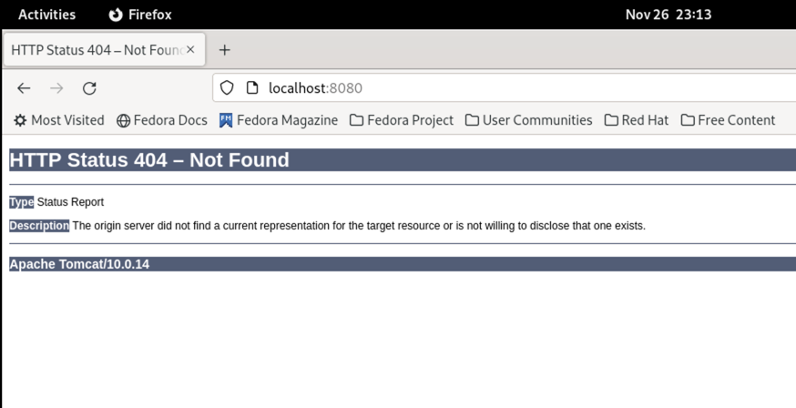

- exec 查看正在运行的 tomcat，发现 webapps 目录下为空
```
[parallels@fedora host_data]$ sudo docker ps
CONTAINER ID   IMAGE          COMMAND                  CREATED         STATUS         PORTS                                       NAMES
26057dc8d993   tomcat         "catalina.sh run"        3 minutes ago   Up 3 minutes   0.0.0.0:8080->8080/tcp, :::8080->8080/tcp   t1
[parallels@fedora host_data]$ sudo docker exec -it 26057dc8d993 /bin/bash
root@26057dc8d993:/usr/local/tomcat# ls -l
total 124
-rw-r--r--. 1 root root 18994 Dec  2  2021 BUILDING.txt
-rw-r--r--. 1 root root  6210 Dec  2  2021 CONTRIBUTING.md
-rw-r--r--. 1 root root 60269 Dec  2  2021 LICENSE
-rw-r--r--. 1 root root  2333 Dec  2  2021 NOTICE
-rw-r--r--. 1 root root  3378 Dec  2  2021 README.md
-rw-r--r--. 1 root root  6905 Dec  2  2021 RELEASE-NOTES
-rw-r--r--. 1 root root 16517 Dec  2  2021 RUNNING.txt
drwxr-xr-x. 1 root root   452 Dec 21  2021 bin
drwxr-xr-x. 1 root root    16 Nov 26 15:12 conf
drwxr-xr-x. 1 root root  1114 Dec 21  2021 lib
drwxrwxrwx. 1 root root   116 Nov 26 15:12 logs
drwxr-xr-x. 1 root root   210 Dec 21  2021 native-jni-lib
drwxrwxrwx. 1 root root    32 Dec 21  2021 temp
drwxr-xr-x. 1 root root     0 Dec 21  2021 webapps
drwxr-xr-x. 1 root root    70 Dec  2  2021 webapps.dist
drwxrwxrwx. 1 root root     0 Dec  2  2021 work
root@26057dc8d993:/usr/local/tomcat# cd webapps
root@26057dc8d993:/usr/local/tomcat/webapps# ls -l
total 0
```

- 删除webapps，并移动 webapps.dist 至 webapps
```
root@26057dc8d993:/usr/local/tomcat# rm -r webapps
root@26057dc8d993:/usr/local/tomcat# mv webapps.dist webapps
root@26057dc8d993:/usr/local/tomcat# ls -l
total 124
-rw-r--r--. 1 root root 18994 Dec  2  2021 BUILDING.txt
-rw-r--r--. 1 root root  6210 Dec  2  2021 CONTRIBUTING.md
-rw-r--r--. 1 root root 60269 Dec  2  2021 LICENSE
-rw-r--r--. 1 root root  2333 Dec  2  2021 NOTICE
-rw-r--r--. 1 root root  3378 Dec  2  2021 README.md
-rw-r--r--. 1 root root  6905 Dec  2  2021 RELEASE-NOTES
-rw-r--r--. 1 root root 16517 Dec  2  2021 RUNNING.txt
drwxr-xr-x. 1 root root   452 Dec 21  2021 bin
drwxr-xr-x. 1 root root    16 Nov 26 15:12 conf
drwxr-xr-x. 1 root root  1114 Dec 21  2021 lib
drwxrwxrwx. 1 root root   116 Nov 26 15:12 logs
drwxr-xr-x. 1 root root   210 Dec 21  2021 native-jni-lib
drwxrwxrwx. 1 root root    32 Dec 21  2021 temp
drwxr-xr-x. 1 root root    70 Dec  2  2021 webapps
drwxrwxrwx. 1 root root     0 Dec  2  2021 work
```
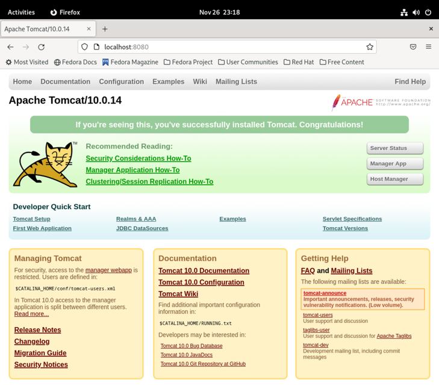

#### 低版本运行 tomcat
```
[parallels@fedora host_data]$ sudo docker pull billygoo/tomcat8-jdk8
[parallels@fedora host_data]$ sudo docker run -d -p 8080:8080 --name mytomcat8 billygoo/tomcat8-jdk8
```

### 安装 mysql
1) 拉取 mysql
    ```
    [parallels@fedora host_data]$ sudo docker pull mysql
    Using default tag: latest
    latest: Pulling from library/mysql
    latest: Pulling from library/mysql
    e39ec8f010eb: Pull complete 
    e2b7fadc33ec: Pull complete 
    9d193449aafd: Pull complete 
    6ea497c74b15: Pull complete 
    7778acbf55f3: Pull complete 
    a633e58f9669: Pull complete 
    edd3047f9b4b: Pull complete 
    70ae0c334fe1: Pull complete 
    b139fc79e81c: Pull complete 
    6956b492354c: Pull complete 
    Digest: sha256:1773f3c7aa9522f0014d0ad2bbdaf597ea3b1643c64c8ccc2123c64afd8b82b1
    Status: Downloaded newer image for mysql:latest
    docker.io/library/mysql:latest
    ```
   
2) 运行 mysql
    ```
    [parallels@fedora host_data]$ sudo docker run -p 3306:3306 -e MYSQL_ROOT_PASSWORD=123456 -d mysql
    8d721219096089462b5cdc74e434748755811e3b6d9d5cb193f487a1483c5b29
    ```
   注意：如果3306启动不起来，可以使用以下命令查看 Linux 是否本地已经有 mysql 在运行了
    ```
    ps -ef | grep mysql
    ```
   
3) 进入 mysql
    ```
    [parallels@fedora host_data]$ sudo docker ps
    CONTAINER ID   IMAGE          COMMAND                  CREATED              STATUS              PORTS                                                  NAMES
    8d7212190960   mysql          "docker-entrypoint.s…"   About a minute ago   Up About a minute   0.0.0.0:3306->3306/tcp, :::3306->3306/tcp, 33060/tcp   keen_banach
    [parallels@fedora host_data]$ sudo docker exec -it 8d7212190960 /bin/bash
    bash-4.4#
    ```
   
4) 输入账号、密码（密码为步骤2中的"123456"）
    ```
    bash-4.4# mysql -uroot -p
    Enter password:
    Welcome to the MySQL monitor.  Commands end with ; or \g.
    Your MySQL connection id is 8
    Server version: 8.2.0 MySQL Community Server - GPL
    
    Copyright (c) 2000, 2023, Oracle and/or its affiliates.
    
    Oracle is a registered trademark of Oracle Corporation and/or its
    affiliates. Other names may be trademarks of their respective
    owners.
    
    Type 'help;' or '\h' for help. Type '\c' to clear the current input statement.
    ```

5) 建库建表插入数据
    ```
    mysql> create database db01;
    Query OK, 1 row affected (0.04 sec)
    
    mysql> use db01;
    Database changed
    mysql> create table t1(id int, name varchar(20));
    Query OK, 0 rows affected (0.06 sec)
    
    mysql> insert into t1 values(1, 'z3');
    Query OK, 1 row affected (0.04 sec)
    
    mysql> select * from t1;
    +------+------+
    | id   | name |
    +------+------+
    |    1 | z3   |
    +------+------+
    1 row in set (0.01 sec)
    ```

#### 两个典型问题
##### 数据库字符集

```
mysql> show variables like 'character%';
+--------------------------+--------------------------------+
| Variable_name            | Value                          |
+--------------------------+--------------------------------+
| character_set_client     | latin1                         |
| character_set_connection | latin1                         |
| character_set_database   | utf8mb4                        |
| character_set_filesystem | binary                         |
| character_set_results    | latin1                         |
| character_set_server     | utf8mb4                        |
| character_set_system     | utf8mb3                        |
| character_sets_dir       | /usr/share/mysql-8.2/charsets/ |
+--------------------------+--------------------------------+
8 rows in set (0.04 sec)
```
<font color = 'red'>**通过挂载容器数据卷**</font>：
```
sudo docker run -d -p 3306:3306 --privileged=true \
  -v /zzyyuse/mysql/log:/var/log/mysql \
  -v /zzyyuse/mysql/data:/var/lib/mysql \
  -v /zzyyuse/mysql/conf:/etc/mysql/conf.d \
  -e MYSQL_ROOT_PASSWORD=123456 \
  --name mysql mysql   
```
在 Linux 主机 /zzyyuse/mysql/conf 目录下的 my.cnf 输入如下内容：
```
[client]
default_character_set = utf8
[mysqld]
collation_server = utf8_general_ci
character_set_server = utf8
```
再重启容器后
```
[parallels@fedora conf]$ sudo docker restart mysql
mysql
```
可以看到字符集已经改变
```
mysql> show variables like 'character%';
+--------------------------+--------------------------------+
| Variable_name            | Value                          |
+--------------------------+--------------------------------+
| character_set_client     | utf8mb3                        |
| character_set_connection | utf8mb3                        |
| character_set_database   | utf8mb3                        |
| character_set_filesystem | binary                         |
| character_set_results    | utf8mb3                        |
| character_set_server     | utf8mb3                        |
| character_set_system     | utf8mb3                        |
| character_sets_dir       | /usr/share/mysql-8.2/charsets/ |
+--------------------------+--------------------------------+
8 rows in set (0.02 sec)
```
>注意：不要相信应用软件显示的字符集，一定要以此处底层的字符集为准

##### 容器删除数据即消失
【非常重要】<font color = 'red'>**也是通过挂载容器数据卷，生产上必须挂载容器数据卷**</font>。容器删除后重新运行，数据还在。
```
sudo docker run -d -p 3306:3306 --privileged=true \
  -v /zzyyuse/mysql/log:/var/log/mysql \
  -v /zzyyuse/mysql/data:/var/lib/mysql \
  -v /zzyyuse/mysql/conf:/etc/mysql/conf.d \
  -e MYSQL_ROOT_PASSWORD=123456 \
  --name mysql mysql   
```

### 安装redis
1) 在宿主机新建目录
```
mkdir -p /app/redis
```

2) 在宿主机拷贝 redis.conf 文件
> 最好拷贝与 docker 相同版本的 redis.conf，实际测试时：宿主机用的 redis7.0.11 版本，docker 用的 redis6.0.8，因有些配置不支持导致容器启动不起来，最后注释掉才解决  
> 
> 苹果电脑使用 parallel desktop，可以直接在 fedora 的 home 文件夹下访问苹果电脑的文件


3) 修改 redis.conf 文件
- 开启 redis 验证（可选），即 requirepass + 密码
- 允许 redis 外地连接，需注释掉 bind 127.0.0.1，即 #bind 127.0.0.1
- 不启动 daemon，该配置会与 docker run 中的 -d 参数冲突，即 daemonize no
- 开启 redis 数据持久化（可选），即 appendonly yes

4) 运行 redis 6.0.8
```
sudo docker run -p 6379:6379 --name myr3 --privileged=true \
 -v /app/redis/redis.conf:/etc/redis/redis.conf \
 -v /app/redis/data:/data \
 -d redis:6.0.8 redis-server /etc/redis/redis.conf
```

5) 检查是否运行了挂载的配置
- 进入 redis-cli，运行 select 12，不会报错
- 更改 database 数，从默认值改为10
- 运行 redis-cli，运行 select 12，会报错

#### 安装中出现的问题
- redis.conf 配置文件使用 vim 打开，报只读保存不了
    ```添加 sudo
    sudo vim + 文件名
    ```

- 宿主机用的 redis.conf 是 7.0.11 版本，docker 用的 6.0.8  
  >最后使用了 docker logs + 容器名发现，因有些配置不支持导致容器启动不起来，注释掉才解决 

- 数据卷未挂载成功，重启数据就丢了  
  - 添加文件夹权限
    ```
    chmod +x 宿主机文件夹名
    chmod u+w 宿主机文件夹名
    ```
  - 添加 redis.conf 命令
    ```
    save 900 1
    ```

# Docker 高级篇
### mysql 主从复制
#### 主机配置
```
docker run -p 3307:3306 --name mysql-master \
-v /mydata/mysql-master/log:/var/log/mysql \
-v /mydata/mysql-master/data:/var/lib/mysql \
-v /mydata/mysql-master/conf:/etc/mysql/conf.d \
-e MYSQL_ROOT_PASSWORD=root \
-d mysql
```

安装时遇到的遇到两个问题：
1. Docker Hub 拉取的 mysql:5.7 镜像不支持您的系统架构（在这种情况下是 ARM64）
2. MySQL 8.2.0 使用粘贴的 MySQL 5.7 配置，Docker 日志显示 MySQL 报告了一些弃用的配置项，例如 --skip-host-cache、binlog_format 和 slave_skip_errors。这些配置项在 MySQL 的新版本中不再被支持或已被替换。

##### MySQL 5.7 配置
```lombok.config
[mysqld]
## 设置server_id，同一局域网中需要唯一
server_id=101

##指定不需要同步的数据库名称
binlog-ignore-db=mysql

## 开启二进制日志功能
log-bin=mall-mysql-bin

##设置二进制日志使用内存大小（事务）
binlog_cache_size=1M

#设置使用的二进制日志格式（mixed,statement,row）
binlog_format=mixed

##二进制日志过期清理时间。默认值为0，表示不自动清理。
expire_logs_days=7

## 跳过主从复制中遇到的所有错误或指定类型的错误，避免slave端复制中断。
##如：1062错误是指一些主键重复，1032错误是因为主从数据库数据不一致
slave_skip_errors=1062
```
本配置<font color = 'red'>**在 MySQL 8.2.0 中运行不起**</font>，关于 MySQL 8.2.0 的特定警告和错误:
- The syntax 'slave_skip_errors' is deprecated：使用 replica_skip_errors 替代。
- unknown variable 'expire_logs_days=7'：在 MySQL 8.0 及以后版本中，这个选项已被 binlog_expire_logs_seconds 替代。您需要将 expire_logs_days 更改为 binlog_expire_logs_seconds 并将天数转换为秒

##### MySQL 8.2.0 配置
```lombok.config
[mysqld]
## 设置server_id，同一局域网中需要唯一
server_id=101

## 指定不需要同步的数据库名称
binlog-ignore-db=mysql

## 开启二进制日志功能
log-bin=mall-mysql-bin

## 设置二进制日志使用内存大小（事务）
binlog_cache_size=1M

# 设置使用的二进制日志格式（mixed,statement,row）
binlog_format=mixed

## 二进制日志过期清理时间（以秒为单位）
binlog_expire_logs_seconds=604800

## 跳过主从复制中遇到的特定错误，避免副本端复制中断
replica_skip_errors=1062
```

解决配置问题后，使用了如下命令删除原容器，仍出现 Docker 无法正常运行。
```
sudo docker rm -f mysql-master
```

使用 ChatGPT 推荐命令完全清理原容器，最后 Docker 可正常运行 MySQL 了。
- 停止并删除容器：sudo docker stop mysql-master 和 sudo docker rm mysql-master。
- 清理或重命名旧数据目录：例如，sudo mv /mydata/mysql-master/data /mydata/mysql-master/data_backup。

#### 从机配置
1) 配置从机映射关系
```
docker run -p 3308:3306 --name mysql-slave \
-v /mydata/mysql-slave/log:/var/log/mysql \
-v /mydata/mysql-slave/data:/var/lib/mysql \
-v /mydata/mysql-slave/conf:/etc/mysql/conf.d \
-e MYSQL_ROOT_PASSWORD=root \
-d mysql
```

2) 添加从机mysql自定义配置
```
[mysqld]
# 设置server_id，确保在复制集群中唯一
server_id=102

# 开启二进制日志功能，为设置Slave作为其他数据库实例的Master时使用
log-bin=mall-mysql-slave1-bin

# 指定不需要同步的数据库名称
binlog-ignore-db=mysql

# 设置二进制日志使用内存大小
binlog_cache_size=1M

# 设置二进制日志格式
binlog_format=mixed

# 二进制日志文件的自动清理时间（以秒为单位）
# 例如，7天，转换为秒：7 * 24 * 60 * 60 = 604800秒
binlog_expire_logs_seconds=604800

# 用replica_skip_errors替代slave_skip_errors以避免弃用的警告
# 注意：跳过错误可能会导致数据不一致
# replica_skip_errors=1062

# relay_log配置中继日志
relay_log=mall-mysql-relay-bin

# 使用log_replica_updates替代log_slave_updates，避免弃用警告
log_replica_updates=1

# 将slave设置为只读
read_only=1
```

3) 获取主机节点访问信息
- 主机添加从机访问权限
```
CREATE USER 'slave'@'%' IDENTIFIED BY '123456';
GRANT REPLICATION SLAVE, REPLICATION CLIENT ON *.* TO 'slave'@'%';
```

- 查看主机主节点状态
```
mysql> show master status;
+-----------------------+----------+--------------+------------------+-------------------+
| File                  | Position | Binlog_Do_DB | Binlog_Ignore_DB | Executed_Gtid_Set |
+-----------------------+----------+--------------+------------------+-------------------+
| mall-mysql-bin.000003 |     1402 |              | mysql            |                   |
+-----------------------+----------+--------------+------------------+-------------------+
1 row in set, 1 warning (0.01 sec)

```

- 查看宿主机 ip，即 10.211.55.5
```
[parallels@fedora conf]$ ifconfig
docker0: flags=4163<UP,BROADCAST,RUNNING,MULTICAST>  mtu 1500
        ether 02:42:7e:86:2d:ae  txqueuelen 0  (Ethernet)
        RX packets 415  bytes 11620 (11.3 KiB)
        RX errors 0  dropped 0  overruns 0  frame 0
        TX packets 152192  bytes 14763322 (14.0 MiB)
        TX errors 0  dropped 0 overruns 0  carrier 0  collisions 0

enp0s5: flags=4163<UP,BROADCAST,RUNNING,MULTICAST>  mtu 1500
        inet 10.211.55.5  netmask 255.255.255.0  broadcast 10.211.55.255
        inet6 fe80::a693:c9f8:ce48:357c  prefixlen 64  scopeid 0x20<link>
        inet6 fdb2:2c26:f4e4:0:81d:a17c:1c77:9aed  prefixlen 64  scopeid 0x0<global>
        ether 00:1c:42:5e:6d:01  txqueuelen 1000  (Ethernet)
        RX packets 850635  bytes 855096179 (815.4 MiB)
        RX errors 0  dropped 0  overruns 0  frame 0
        TX packets 562802  bytes 47109741 (44.9 MiB)
        TX errors 0  dropped 0 overruns 0  carrier 0  collisions 0

lo: flags=73<UP,LOOPBACK,RUNNING>  mtu 65536
        inet 127.0.0.1  netmask 255.0.0.0
        inet6 ::1  prefixlen 128  scopeid 0x10<host>
        loop  txqueuelen 1000  (Local Loopback)
        RX packets 174308  bytes 12807288 (12.2 MiB)
        RX errors 0  dropped 0  overruns 0  frame 0
        TX packets 174308  bytes 12807288 (12.2 MiB)
        TX errors 0  dropped 0 overruns 0  carrier 0  collisions 0

veth448a4d4: flags=4163<UP,BROADCAST,RUNNING,MULTICAST>  mtu 1500
        inet6 fe80::5414:1eff:fe1e:3f1  prefixlen 64  scopeid 0x20<link>
        ether 56:14:1e:1e:03:f1  txqueuelen 0  (Ethernet)
        RX packets 34  bytes 1428 (1.3 KiB)
        RX errors 0  dropped 0  overruns 0  frame 0
        TX packets 47103  bytes 5027519 (4.7 MiB)
        TX errors 0  dropped 0 overruns 0  carrier 0  collisions 0

veth4ae283a: flags=4163<UP,BROADCAST,RUNNING,MULTICAST>  mtu 1500
        inet6 fe80::9426:b1ff:feb8:11ce  prefixlen 64  scopeid 0x20<link>
        ether 96:26:b1:b8:11:ce  txqueuelen 0  (Ethernet)
        RX packets 404  bytes 20360 (19.8 KiB)
        RX errors 0  dropped 0  overruns 0  frame 0
        TX packets 22717  bytes 2434355 (2.3 MiB)
        TX errors 0  dropped 0 overruns 0  carrier 0  collisions 0

```

4) 从机添加主机节点访问权限
- 进入从机
```
[parallels@fedora conf]$ sudo docker exec -it mysql-slave /bin/bash
bash-4.4# mysql -u root -p
Enter password: 
Welcome to the MySQL monitor.  Commands end with ; or \g.
Your MySQL connection id is 35
Server version: 8.2.0 MySQL Community Server - GPL

Copyright (c) 2000, 2023, Oracle and/or its affiliates.

Oracle is a registered trademark of Oracle Corporation and/or its
affiliates. Other names may be trademarks of their respective
owners.

Type 'help;' or '\h' for help. Type '\c' to clear the current input statement.
```

- 在从机中配置主节点访问
```
mysql> change master to master_host='10.211.55.5', master_user='slave', master_password='123456', master_port=3307, master_log_file='mall-mysql-bin.000003', master_log_pos=1402, master_connect_retry=30;
Query OK, 0 rows affected, 10 warnings (0.10 sec)
```

5) 启动从机从节点访问
```
mysql> start slave;
Query OK, 0 rows affected, 1 warning (0.07 sec)
```

存在问题：
```
mysql> show slave status \G
*************************** 1. row ***************************
Slave_IO_State:
Master_Host: 10.211.55.5
Master_User: slave
Master_Port: 3307
Connect_Retry: 30
Master_Log_File: mall-mysql-bin.000003
Read_Master_Log_Pos: 1402
Relay_Log_File: mall-mysql-relay-bin.000001
Relay_Log_Pos: 4
Relay_Master_Log_File: mall-mysql-bin.000001
Slave_IO_Running: No
Slave_SQL_Running: Yes
```
从机的 Slave_IO_Running 配置一直为 No

执行以下语句关闭防火墙后，telnet 可以成功了，但从机仍无法访问的主机
```
[parallels@fedora ~]$ systemctl stop firewalld
[parallels@fedora ~]$ telnet 10.211.55.5 3307
Trying 10.211.55.5...
Connected to 10.211.55.5.
```

期间还尝试了获取主机、从机的子网 ip：
```
[parallels@fedora conf]$ sudo docker inspect -f '{{range .NetworkSettings.Networks}}{{.IPAddress}}{{end}}' mysql-master
172.17.0.3
```

```
[parallels@fedora conf]$ sudo docker inspect -f '{{range .NetworkSettings.Networks}}{{.IPAddress}}{{end}}' mysql-slave 
172.17.0.2
```

以及检查了 docker 的桥接通信
```
[parallels@fedora conf]$ sudo docker network inspect bridge
[
    {
        "Name": "bridge",
        "Id": "c0ee94ff8bfdb469adae150aebe2b2833e65cddc31ee1c6355bff8d84a4d3b1a",
        "Created": "2023-12-06T22:19:25.184500703+08:00",
        "Scope": "local",
        "Driver": "bridge",
        "EnableIPv6": false,
        "IPAM": {
            "Driver": "default",
            "Options": null,
            "Config": [
                {
                    "Subnet": "172.17.0.0/16",
                    "Gateway": "172.17.0.1"
                }
            ]
        },
        "Internal": false,
        "Attachable": false,
        "Ingress": false,
        "ConfigFrom": {
            "Network": ""
        },
        "ConfigOnly": false,
        "Containers": {
            "406ad2bac33e06605ff37efe8bb25ff0ba86502a5cbab348d187ecb791cb4a1f": {
                "Name": "mysql-master",
                "EndpointID": "589f8ab6ec08008a45f220f10e22748f6d0ca2536b61c40252daa4c050178c7f",
                "MacAddress": "02:42:ac:11:00:03",
                "IPv4Address": "172.17.0.3/16",
                "IPv6Address": ""
            },
            "d8d7744dfde4c23cc66666b0fe7a7ca14614f45ee82e41b05b1a9daae35a7033": {
                "Name": "mysql-slave",
                "EndpointID": "b36544c3bbc32a12a36c7f4032ef128112506dd8a63a183d2ca9dd84ac94c0c4",
                "MacAddress": "02:42:ac:11:00:02",
                "IPv4Address": "172.17.0.2/16",
                "IPv6Address": ""
            }
        },
        "Options": {
            "com.docker.network.bridge.default_bridge": "true",
            "com.docker.network.bridge.enable_icc": "true",
            "com.docker.network.bridge.enable_ip_masquerade": "true",
            "com.docker.network.bridge.host_binding_ipv4": "0.0.0.0",
            "com.docker.network.bridge.name": "docker0",
            "com.docker.network.driver.mtu": "1500"
        },
        "Labels": {}
    }
]
```

但从机还是访问不到主机，注意是网络不通、不是 mysql 主从配置不通。
```
bash-4.4# mysql -h 10.211.55.5 -P 3307 -u slave -p
Enter password: 
ERROR 2003 (HY000): Can't connect to MySQL server on '10.211.55.5:3307' (113)
```

```
bash-4.4# mysql -h 172.17.0.3 -P 3307 -u root -p
Enter password: 
ERROR 2003 (HY000): Can't connect to MySQL server on '172.17.0.3:3307' (110)
```

```
bash-4.4# mysql -h mysql-master -P 3307 -u root -p
Enter password: 
ERROR 2005 (HY000): Unknown MySQL server host 'mysql-master' (-2)
```
尝试了在从机以上几种方式（以及更改端口为 3306、用户更改为 slave 均进行了不同组合尝试），直接访问 mysql 主机都不通。


### 分布式存储
典型面试题：1～2亿条数据需要缓存，请问如何设计这个存储案例
#### 哈希取余算法
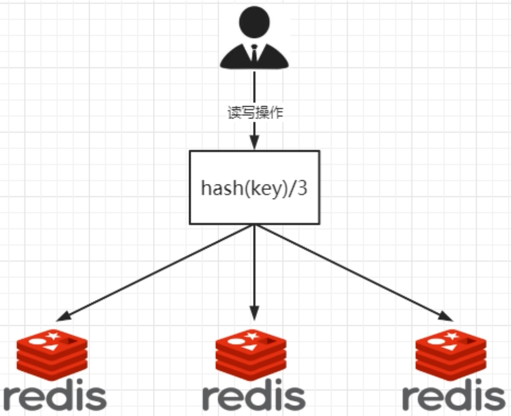  
2亿条记录就是2亿个键值对，不能单机存储，必须要分布式多机。假设有3台机器构成一个集群，用户每次读写操作都是根据公式：Hash(key) % n 个机器台数，计算出哈希值，用来决定数据映射到哪一个节点上。

- **优点**：简单粗暴，只需要预估好数据规划好节点，例如3台、8台、10台，就能保证一段时间的数据支撑。使用 Hash 算法让固定的一部分请求落到同一台服务器上，这样每台服务器固定处理一部分请求（并维护这些请求的信息），起到负载均衡+分而治之的作用。
- **缺点**：在服务器个数固定不变时没有问题，如果需要弹性扩容或故障停机的情况下，原来的取模公式就会发生变化：Hash(key) / 3 会变成 Hash(key) / ？。此时地址经过取余运算的结果将发生很大变化，根据公式获取的服务器也会变得不可控。

#### 一致性哈希算法
> 一致性哈希算法在1997年由麻省理工学院中提出的，设计目标是为了解决自然取余遗留的分布式缓存数据变动和映射问题  

##### 存储节点哈希映射  
将集群中各个 IP 节点映射到哈希环上的某一个位置。（哈希环区间为 0～2^32-1，0 和 2^31-1 首位相接）  
将各个服务器使用 Hash(key) 进行哈希，具体可以选择服务器的 IP 或主机名作为关键字进行哈希，这样每台机器就能确定其在哈希环上的位置。假如4个节点 NodeA、B、C、D，经过 IP 地址的哈希函数 Hash(ip) 计算，使用 IP 地址哈希后在环空间的位置如下：
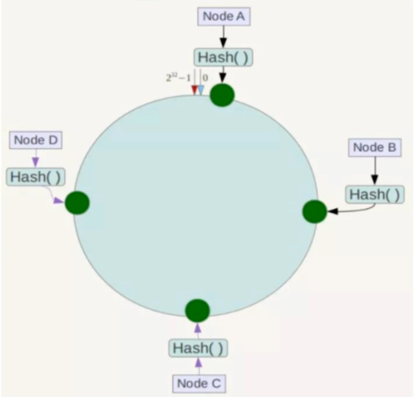

##### 存储信息哈希映射
4个节点 NodeA、B、C、D，经过 IP 地址的哈希函数 Hash(ip) 计算，使用 IP 地址哈希后在环空间的位置如下；
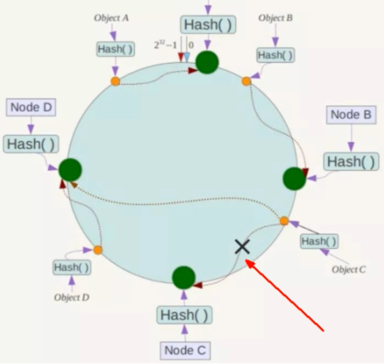

当我们需要存储一个 kv 键值对时，首先计算 Key 的 Hash值，Hash(key)，将这个 key 使用相同的函数 Hash 计算出哈希值并确定此数据在环上的位置，从此位置**沿环顺时针“行走”**，第一台遇到的服务器就是其应该定位到的服务器，并将该键值对存储在该节点上。    
如我们有 Object A、Object B、Object C、Object D 四个数据对象，经过哈希计算后，在环空间上的位置如下：根据一致性 Hash 算法，数据 A 会被定为到 Node A上，B 被定为到 Node B 上，C 被定为到 Node C 上，D 被定为到 Node D 上。

##### 优点
- **容错性**：假设 Node C 宕机，可以看到此时对象 A、B、D 不会受到影响，只有 C 对象被重定位到 Node D。一般的，在一致性Hash算法中，如果一台服务器不可用，则受影响的数据仅仅是此服务器到其环空间中前一台服务器（即沿着逆时针方向行走遇到的第一台服务器）之间数据，其它不会受到影响。简单说就是 C 挂了，受到影响的只是 B、C 之间的数据，并且这些数据会转移到 D 进行存储。
- **扩展性**：假如数据量增加了，需要增加一台节点 NodeX，X 的位置在 A 和 B 之间，那受到影响的也就是 A 到 X 之间的数据，重新把 A 到 X 的数据录入到 X 上即可，不会导致 Hash 取余全部数据重新洗牌。
  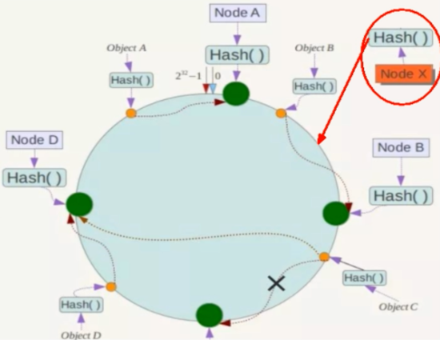

##### 缺点
**Hash 环的数据数据倾斜问题**  
一致性 Hash 算法在服务<font color = 'red'>节点太少</font>时，容易因为节点分布不均匀而造成<font color = 'red'>数据倾斜</font>（被缓存的对象大部分集中缓存在某一台服务器上）问题，例如系统中只有两台服务器：
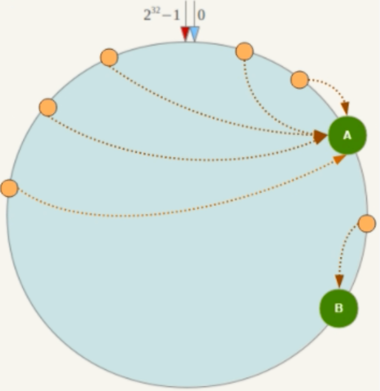

##### 总结
为了在节点数目发生改变时尽可能少的迁移数据，`一致性哈希算法`将所有的存储节点排列在收尾相接的 Hash 坏上，每个 key 在计算 Hash 后会顺时针找到临近的存储节点存放。 而当有节点加入或退出时仅影响该节点在 Hash 环上顺时针相邻的后续节点。  

优点：加入和删除节点只影响哈希环中顺时针方向的相邻的节点，对其他节点无影响。
缺点：数据的分布和节点的位置有关，因为这些节点不是均匀的分布在哈希环上的，所以数据在进行存储时达不到均匀分布的效果。

#### 哈希槽分区算法
##### 能干什么
解决<font color = 'red'>一致性哈希算法的数据倾斜</font>问题：在数据和节点之间又加入了一层，把这层称为哈希槽 (slot)，用于管理数据和节点之间的关系，现在就相当子节点上放的是槽，槽里放的是数据。


##### 多少个 hash 槽
一个集群只能有 16384 个槽，编号 0-16383（0-2^14-1）。这些槽会分配给集群中的所有主节点，分配策略没有要求。可以指定哪些编号的槽分配给哪个主节点，集群会记录节点和槽的对应关系。解决了节点和槽的关系后，接下来就需要对 key 求哈希值，然后对 16384 取余，余数是几 key 就落入对应的槽里。slot = CRC16(key) % 16384。以槽为单位移动数据，因为槽的数目是固定的，处理起来比较容易，这样数据移动问题就解决了。

##### 为什么 redis 集群的最大槽位数是 16384?
CRC16 算法产生的 hash 值有 16bit，该算法可以产生 2^16 = 65536 个值。换句话说值是分布在 0 ~ 65535 之间。那作者在做 mod 运算的时候，为什么不 mod 65536，而选择 mod 16384？  
参考 redis 之父 antirez 在 github 上的回复：https://github.com/redis/redis/issues/2576
```
The reason is:

Normal heartbeat packets carry the full configuration of a node, that can be replaced in an idempotent way with the old in order to update an old config. This means they contain the slots configuration for a node, in raw form, that uses 2k of space with16k slots, but would use a prohibitive 8k of space using 65k slots.
At the same time it is unlikely that Redis Cluster would scale to more than 1000 mater nodes because of other design tradeoffs.
So 16k was in the right range to ensure enough slots per master with a max of 1000 maters, but a small enough number to propagate the slot configuration as a raw bitmap easily. Note that in small clusters the bitmap would be hard to compress because when N is small the bitmap would have slots/N bits set that is a large percentage of bits set.
```
1) **如果槽位为 65536，发送心跳信息的消息头达 8k，发送的心跳包过于庞大。**    
在消息头中最占空间的是 myslots[CLUSTER_SLOTS/8] 。当槽位为 65536 时，这块的大小是：65536 - 8 - 1024 = 8kb。  
因为每秒钟，redis 节点需要发送一定数量的 ping 消息作为心跳包，如果槽位为 65536，这个 ping 消息的消息头太大了，浪费带宽。  
2) **redis 的集群主节点数量基本不可能超过 1000 个。**  
集群节点越多，心跳包的消息体内携带的数据越多。如果节点过 1000 个，也会导致网络拥堵。因此 redis 作者不建议 redis cluster 节点数量超过 1000 个。那么，对于节点数在 1000 以内的 redis cluster 集群，16384 个槽位够用了。没有必要拓展到 65536 个。  
3) **槽位越小，节点少的情况下，压缩比高，容易传输。**  
redis 主节点的配置信息中它所负责的哈希槽是通过一张 bitmap 的形式来保存的，在传输过程中会对 bitmap 进行压缩，但是如果 bitmap 的填充率 slots / N 很高的话（N 表示节点数），bitmap 的压缩率就很低。如果节点数很少，而哈希槽数量很多的话，bitmap 的压缩率就很低。  

##### 实际哈希槽分配案例
redis 集群中内置了16384 个哈希槽，redis 会根据节点数量大致均等的将哈希槽映射到不同的节点。当需要在 redis 集群中放置一个 key-value 时，redis 先对key 使用crc16 算法算出一个结果，然后把结果对 16384 求余数，这样每个 key 都会对应一个编号在 0 - 16383 之间的哈希槽，也就是映射到某个节点上。如下代码，key 之 A、B 在 Node2 ，key 之 C 落在 Node3 上。
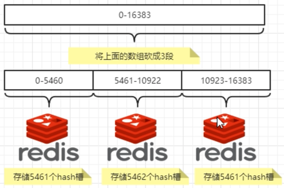
```java
@Test
public void test() {
    //import io.Lettuce.core.cluster.SlotHash;
    System.out.println(SlotHash.getSlot("A")); //6373
    System.out.println(SlotHash.getSlot("B")); //10374
    System.out.println(SlotHash.getSlot("c")); //14503
    System.out.println(SlotHash.getSlot("hello")); //866
}
```

### redis 主从集群配置
#### 新建六个容器实例
```
sudo docker run -d --name redis-node-1 --net host --privileged=true -v /data/redis/share/redis-node-1:/data redis:6.0.8 --cluster-enabled yes --appendonly yes --port 6381
sudo docker run -d --name redis-node-2 --net host --privileged=true -v /data/redis/share/redis-node-2:/data redis:6.0.8 --cluster-enabled yes --appendonly yes --port 6382
sudo docker run -d --name redis-node-3 --net host --privileged=true -v /data/redis/share/redis-node-3:/data redis:6.0.8 --cluster-enabled yes --appendonly yes --port 6383
sudo docker run -d --name redis-node-4 --net host --privileged=true -v /data/redis/share/redis-node-4:/data redis:6.0.8 --cluster-enabled yes --appendonly yes --port 6384
sudo docker run -d --name redis-node-5 --net host --privileged=true -v /data/redis/share/redis-node-5:/data redis:6.0.8 --cluster-enabled yes --appendonly yes --port 6385
sudo docker run -d --name redis-node-6 --net host --privileged=true -v /data/redis/share/redis-node-6:/data redis:6.0.8 --cluster-enabled yes --appendonly yes --port 6386
``` 

容器配置命令分解

| 命令                                      | 释义                   | 
|-----------------------------------------|----------------------|
| docker run                              | 创建并运行docker容器实例      |
| --name redis-node-6                     | 容器名字                 |
| --net host                              | 使用宿主机的IP和端口，默认       |
| --privileged=true                       | 获取宿主机root用户权限        |
| -v /data/redis/share/redis-node-6:/data | 容器卷，宿主机地址:docker内部地址 |
| redis:6.0.8                             | redis镜像和版本号          |
| --cluster-enabled yes                   | 开启redis集群            |
| --appendonly yes                        | 开启持久化                |
| --port 6386                             | redis端口号             |

#### 配置集群关系
查询六个容器 docker 运行信息
```
[parallels@fedora redis]$ sudo docker ps
CONTAINER ID   IMAGE         COMMAND                  CREATED         STATUS         PORTS                                                  NAMES
24093f7afa03   redis:6.0.8   "docker-entrypoint.s…"   7 seconds ago   Up 7 seconds                                                          redis-node-6
ff37d374992f   redis:6.0.8   "docker-entrypoint.s…"   8 seconds ago   Up 7 seconds                                                          redis-node-5
8183c3336978   redis:6.0.8   "docker-entrypoint.s…"   8 seconds ago   Up 8 seconds                                                          redis-node-4
0ea01e0ae3e4   redis:6.0.8   "docker-entrypoint.s…"   8 seconds ago   Up 8 seconds                                                          redis-node-3
0e4da58a8535   redis:6.0.8   "docker-entrypoint.s…"   9 seconds ago   Up 8 seconds                                                          redis-node-2
b2ebd3df86fb   redis:6.0.8   "docker-entrypoint.s…"   3 minutes ago   Up 3 minutes                                                          redis-node-1
[parallels@fedora redis]$ sudo docker exec -it b2ebd3df86fb /bin/bash
```

在 redis-node-1 为六台机器构建集群关系
```
[parallels@fedora redis]$ sudo docker exec -it b2ebd3df86fb /bin/bash
root@fedora:/data# redis-cli --cluster create 10.211.55.5:6381 10.211.55.5:6382 10.211.55.5:6383 10.211.55.5:6384 10.211.55.5:6385 10.211.55.5:6386 --cluster-replicas 1
>>> Performing hash slots allocation on 6 nodes...
Master[0] -> Slots 0 - 5460
Master[1] -> Slots 5461 - 10922
Master[2] -> Slots 10923 - 16383
Adding replica 10.211.55.5:6385 to 10.211.55.5:6381
Adding replica 10.211.55.5:6386 to 10.211.55.5:6382
Adding replica 10.211.55.5:6384 to 10.211.55.5:6383
>>> Trying to optimize slaves allocation for anti-affinity
[WARNING] Some slaves are in the same host as their master
M: 5b10489d5b91d1ff7f4904918af2ef4b01d63e00 10.211.55.5:6381
   slots:[0-5460] (5461 slots) master
M: 022df18f62985a5d79c491c15c67030751ce96c2 10.211.55.5:6382
   slots:[5461-10922] (5462 slots) master
M: 6e43f43ab3e3d8c7bda9660d26ea4a31939b0505 10.211.55.5:6383
   slots:[10923-16383] (5461 slots) master
S: 64b108b1a5cdd873db3dbd7d9856debb3c76dd2c 10.211.55.5:6384
   replicates 6e43f43ab3e3d8c7bda9660d26ea4a31939b0505
S: e02495ce8ec7c06b6e5dec9072ae7f3cb0f351f3 10.211.55.5:6385
   replicates 5b10489d5b91d1ff7f4904918af2ef4b01d63e00
S: 5f4f8ffb65fe4879b5f293787d500896d009b6bc 10.211.55.5:6386
   replicates 022df18f62985a5d79c491c15c67030751ce96c2
Can I set the above configuration? (type 'yes' to accept): yes
>>> Nodes configuration updated
>>> Assign a different config epoch to each node
>>> Sending CLUSTER MEET messages to join the cluster
Waiting for the cluster to join
..
>>> Performing Cluster Check (using node 10.211.55.5:6381)
M: 5b10489d5b91d1ff7f4904918af2ef4b01d63e00 10.211.55.5:6381
   slots:[0-5460] (5461 slots) master
   1 additional replica(s)
M: 6e43f43ab3e3d8c7bda9660d26ea4a31939b0505 10.211.55.5:6383
   slots:[10923-16383] (5461 slots) master
   1 additional replica(s)
M: 022df18f62985a5d79c491c15c67030751ce96c2 10.211.55.5:6382
   slots:[5461-10922] (5462 slots) master
   1 additional replica(s)
S: e02495ce8ec7c06b6e5dec9072ae7f3cb0f351f3 10.211.55.5:6385
   slots: (0 slots) slave
   replicates 5b10489d5b91d1ff7f4904918af2ef4b01d63e00
S: 5f4f8ffb65fe4879b5f293787d500896d009b6bc 10.211.55.5:6386
   slots: (0 slots) slave
   replicates 022df18f62985a5d79c491c15c67030751ce96c2
S: 64b108b1a5cdd873db3dbd7d9856debb3c76dd2c 10.211.55.5:6384
   slots: (0 slots) slave
   replicates 6e43f43ab3e3d8c7bda9660d26ea4a31939b0505
[OK] All nodes agree about slots configuration.
>>> Check for open slots...
>>> Check slots coverage...
[OK] All 16384 slots covered.
```

#### 查看集群信息
```
root@fedora:/data# redis-cli -p 6381
127.0.0.1:6381> cluster info
cluster_state:ok
cluster_slots_assigned:16384
cluster_slots_ok:16384
cluster_slots_pfail:0
cluster_slots_fail:0
cluster_known_nodes:6
cluster_size:3
cluster_current_epoch:6
cluster_my_epoch:1
cluster_stats_messages_ping_sent:134
cluster_stats_messages_pong_sent:139
cluster_stats_messages_sent:273
cluster_stats_messages_ping_received:134
cluster_stats_messages_pong_received:134
cluster_stats_messages_meet_received:5
cluster_stats_messages_received:273
```

```
127.0.0.1:6381> cluster nodes
6e43f43ab3e3d8c7bda9660d26ea4a31939b0505 10.211.55.5:6383@16383 master - 0 1706431568000 3 connected 10923-16383
022df18f62985a5d79c491c15c67030751ce96c2 10.211.55.5:6382@16382 master - 0 1706431568490 2 connected 5461-10922
e02495ce8ec7c06b6e5dec9072ae7f3cb0f351f3 10.211.55.5:6385@16385 slave 5b10489d5b91d1ff7f4904918af2ef4b01d63e00 0 1706431569501 1 connected
5b10489d5b91d1ff7f4904918af2ef4b01d63e00 10.211.55.5:6381@16381 myself,master - 0 1706431566000 1 connected 0-5460
5f4f8ffb65fe4879b5f293787d500896d009b6bc 10.211.55.5:6386@16386 slave 022df18f62985a5d79c491c15c67030751ce96c2 0 1706431567000 2 connected
64b108b1a5cdd873db3dbd7d9856debb3c76dd2c 10.211.55.5:6384@16384 slave 6e43f43ab3e3d8c7bda9660d26ea4a31939b0505 0 1706431568000 3 connected
```

M S  
1 5  
2 6  
3 4  

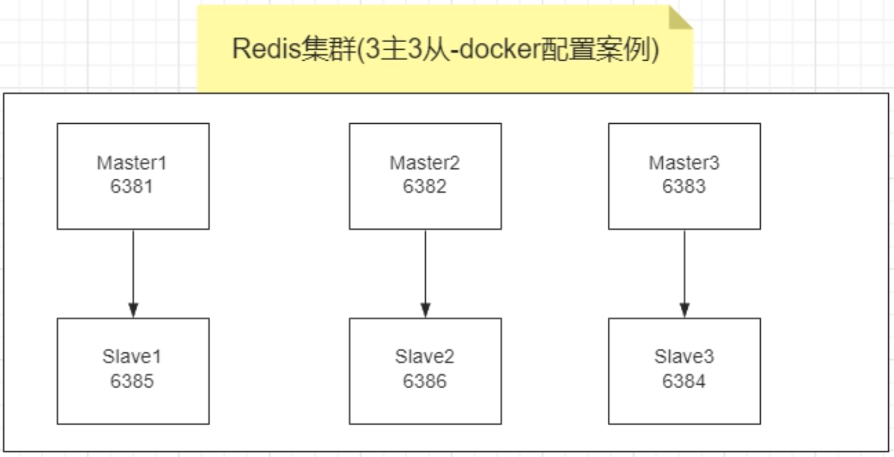

### redis 集群读写
#### 使用非集群命令（错误写法）
```
root@fedora:/data# redis-cli -p 6381
127.0.0.1:6381> keys *
(empty array)
127.0.0.1:6381> set k1 v1
(error) MOVED 12706 10.211.55.5:6383
127.0.0.1:6381> set k2 v2
OK
127.0.0.1:6381> set k3 v3
OK
127.0.0.1:6381> set k4 v4
(error) MOVED 8455 10.211.55.5:6382
```
set k1、k4 会出现 error，因为哈希槽不在本台服务器，无法切换到正确的机器。

#### 使用集群命令（正确写法）
```
redis-cli -p 6381 -c
```
即启动命令添加-c即可

```
root@fedora:/data# redis-cli -p 6381 -c
127.0.0.1:6381> flushall
OK
127.0.0.1:6381> set k1 v1
-> Redirected to slot [12706] located at 10.211.55.5:6383
OK
10.211.55.5:6383> set k2 v2
-> Redirected to slot [449] located at 10.211.55.5:6381
OK
10.211.55.5:6381> set k3 v3
OK
10.211.55.5:6381> set k4 v4
-> Redirected to slot [8455] located at 10.211.55.5:6382
OK
```
set k1、k2、k3、k4 均正常，且明确标记出计算的哈希槽点。

#### 查看集群信息
```
redis-cli -cluster check 集群ip:端口号
```

```
root@fedora:/data# redis-cli -cluster check 10.211.55.5:6381
Unrecognized option or bad number of args for: '-cluster'
root@fedora:/data# redis-cli --cluster check 10.211.55.5:6381
10.211.55.5:6381 (5b10489d...) -> 2 keys | 5461 slots | 1 slaves.
10.211.55.5:6383 (6e43f43a...) -> 1 keys | 5461 slots | 1 slaves.
10.211.55.5:6382 (022df18f...) -> 1 keys | 5462 slots | 1 slaves.
[OK] 4 keys in 3 masters.
0.00 keys per slot on average.
>>> Performing Cluster Check (using node 10.211.55.5:6381)
M: 5b10489d5b91d1ff7f4904918af2ef4b01d63e00 10.211.55.5:6381
   slots:[0-5460] (5461 slots) master
   1 additional replica(s)
M: 6e43f43ab3e3d8c7bda9660d26ea4a31939b0505 10.211.55.5:6383
   slots:[10923-16383] (5461 slots) master
   1 additional replica(s)
M: 022df18f62985a5d79c491c15c67030751ce96c2 10.211.55.5:6382
   slots:[5461-10922] (5462 slots) master
   1 additional replica(s)
S: e02495ce8ec7c06b6e5dec9072ae7f3cb0f351f3 10.211.55.5:6385
   slots: (0 slots) slave
   replicates 5b10489d5b91d1ff7f4904918af2ef4b01d63e00
S: 5f4f8ffb65fe4879b5f293787d500896d009b6bc 10.211.55.5:6386
   slots: (0 slots) slave
   replicates 022df18f62985a5d79c491c15c67030751ce96c2
S: 64b108b1a5cdd873db3dbd7d9856debb3c76dd2c 10.211.55.5:6384
   slots: (0 slots) slave
   replicates 6e43f43ab3e3d8c7bda9660d26ea4a31939b0505
[OK] All nodes agree about slots configuration.
>>> Check for open slots...
>>> Check slots coverage...
[OK] All 16384 slots covered.
```

#### 主从容错切换
1) 停止 redis-node-1 节点
```
[parallels@fedora redis]$ sudo docker stop redis-node-1
redis-node-1
```

2) 查看集群信息
```
[parallels@fedora redis]$ sudo docker exec -it redis-node-2 /bin/bash
root@fedora:/data# redis-cli -p 6382 -c
127.0.0.1:6382> cluster nodes
e02495ce8ec7c06b6e5dec9072ae7f3cb0f351f3 10.211.55.5:6385@16385 master - 0 1706971060179 7 connected 0-5460
6e43f43ab3e3d8c7bda9660d26ea4a31939b0505 10.211.55.5:6383@16383 master - 0 1706971058000 3 connected 10923-16383
5b10489d5b91d1ff7f4904918af2ef4b01d63e00 10.211.55.5:6381@16381 master,fail - 1706970997427 1706970994000 1 disconnected
64b108b1a5cdd873db3dbd7d9856debb3c76dd2c 10.211.55.5:6384@16384 slave 6e43f43ab3e3d8c7bda9660d26ea4a31939b0505 0 1706971059000 3 connected
022df18f62985a5d79c491c15c67030751ce96c2 10.211.55.5:6382@16382 myself,master - 0 1706971058000 2 connected 5461-10922
5f4f8ffb65fe4879b5f293787d500896d009b6bc 10.211.55.5:6386@16386 slave 022df18f62985a5d79c491c15c67030751ce96c2 0 1706971059183 2 connected
```
可以看到，redis-node-1 已经不再是主节点，主节点切换到 redis-node-1。

3) 查看是否可以，读取到之前存储的键值对信息
```
127.0.0.1:6382> get k1
-> Redirected to slot [12706] located at 10.211.55.5:6383
"v1"
10.211.55.5:6383> get k2
-> Redirected to slot [449] located at 10.211.55.5:6385
"v2"
10.211.55.5:6385> get k3
"v3"
10.211.55.5:6385> get k4
-> Redirected to slot [8455] located at 10.211.55.5:6382
"v4"
```
可以看到，由于 redis 主从复制的存在，仍可以读取到此前的存储信息。

4) 重新启动 redis-node-1 节点
```
[parallels@fedora ~]$ sudo docker start redis-node-1
redis-node-1
```

5) 查看集群信息
```
10.211.55.5:6382> cluster nodes
e02495ce8ec7c06b6e5dec9072ae7f3cb0f351f3 10.211.55.5:6385@16385 master - 0 1706971296393 7 connected 0-5460
6e43f43ab3e3d8c7bda9660d26ea4a31939b0505 10.211.55.5:6383@16383 master - 0 1706971295000 3 connected 10923-16383
5b10489d5b91d1ff7f4904918af2ef4b01d63e00 10.211.55.5:6381@16381 slave e02495ce8ec7c06b6e5dec9072ae7f3cb0f351f3 0 1706971295000 7 connected
64b108b1a5cdd873db3dbd7d9856debb3c76dd2c 10.211.55.5:6384@16384 slave 6e43f43ab3e3d8c7bda9660d26ea4a31939b0505 0 1706971295000 3 connected
022df18f62985a5d79c491c15c67030751ce96c2 10.211.55.5:6382@16382 myself,master - 0 1706971293000 2 connected 5461-10922
5f4f8ffb65fe4879b5f293787d500896d009b6bc 10.211.55.5:6386@16386 slave 022df18f62985a5d79c491c15c67030751ce96c2 0 1706971295385 2 connected
```
可以看到，redis-node-1 节点重启后不会再成为主节点，而是 redis-node-1 的从节点。

#### 主从扩容案例
1) 新建 redis-node-7、redis-node-8 两个节点
```
sudo docker run -d --name redis-node-7 --net host --privileged=true -v /data/redis/share/redis-node-7:/data redis:6.0.8 --cluster-enabled yes --appendonly yes --port 6387
sudo docker run -d --name redis-node-8 --net host --privileged=true -v /data/redis/share/redis-node-8:/data redis:6.0.8 --cluster-enabled yes --appendonly yes --port 6388
```

2) 新增 redis-node-7 作为 master 节点加入原集群
```
redis-cli --cluster add-node ip:新端口 ip:master节点端口
```
```
[parallels@fedora ~]$ sudo docker exec -it redis-node-7 /bin/bash
root@fedora:/data# redis-cli --cluster add-node 10.211.55.5:6387 10.211.55.5:6381
>>> Adding node 10.211.55.5:6387 to cluster 10.211.55.5:6381
>>> Performing Cluster Check (using node 10.211.55.5:6381)
S: 5b10489d5b91d1ff7f4904918af2ef4b01d63e00 10.211.55.5:6381
   slots: (0 slots) slave
   replicates e02495ce8ec7c06b6e5dec9072ae7f3cb0f351f3
S: 5f4f8ffb65fe4879b5f293787d500896d009b6bc 10.211.55.5:6386
   slots: (0 slots) slave
   replicates 022df18f62985a5d79c491c15c67030751ce96c2
M: 6e43f43ab3e3d8c7bda9660d26ea4a31939b0505 10.211.55.5:6383
   slots:[10923-16383] (5461 slots) master
   1 additional replica(s)
M: e02495ce8ec7c06b6e5dec9072ae7f3cb0f351f3 10.211.55.5:6385
   slots:[0-5460] (5461 slots) master
   1 additional replica(s)
S: 64b108b1a5cdd873db3dbd7d9856debb3c76dd2c 10.211.55.5:6384
   slots: (0 slots) slave
   replicates 6e43f43ab3e3d8c7bda9660d26ea4a31939b0505
M: 022df18f62985a5d79c491c15c67030751ce96c2 10.211.55.5:6382
   slots:[5461-10922] (5462 slots) master
   1 additional replica(s)
[OK] All nodes agree about slots configuration.
>>> Check for open slots...
>>> Check slots coverage...
[OK] All 16384 slots covered.
>>> Send CLUSTER MEET to node 10.211.55.5:6387 to make it join the cluster.
[OK] New node added correctly.
```

3) 检查集群状态
```
redis-cli --cluster check ip:任意集群端口
```
```
root@fedora:/data# redis-cli --cluster check 10.211.55.5:6381
10.211.55.5:6387 (11e3a3cd...) -> 0 keys | 0 slots | 0 slaves.
10.211.55.5:6383 (6e43f43a...) -> 1 keys | 5461 slots | 1 slaves.
10.211.55.5:6385 (e02495ce...) -> 2 keys | 5461 slots | 1 slaves.
10.211.55.5:6382 (022df18f...) -> 1 keys | 5462 slots | 1 slaves.
[OK] 4 keys in 4 masters.
0.00 keys per slot on average.
>>> Performing Cluster Check (using node 10.211.55.5:6381)
S: 5b10489d5b91d1ff7f4904918af2ef4b01d63e00 10.211.55.5:6381
   slots: (0 slots) slave
   replicates e02495ce8ec7c06b6e5dec9072ae7f3cb0f351f3
S: 5f4f8ffb65fe4879b5f293787d500896d009b6bc 10.211.55.5:6386
   slots: (0 slots) slave
   replicates 022df18f62985a5d79c491c15c67030751ce96c2
M: 11e3a3cd13fe68a29d24c7e6f258d4b37ae5ff88 10.211.55.5:6387
   slots: (0 slots) master
M: 6e43f43ab3e3d8c7bda9660d26ea4a31939b0505 10.211.55.5:6383
   slots:[10923-16383] (5461 slots) master
   1 additional replica(s)
M: e02495ce8ec7c06b6e5dec9072ae7f3cb0f351f3 10.211.55.5:6385
   slots:[0-5460] (5461 slots) master
   1 additional replica(s)
S: 64b108b1a5cdd873db3dbd7d9856debb3c76dd2c 10.211.55.5:6384
   slots: (0 slots) slave
   replicates 6e43f43ab3e3d8c7bda9660d26ea4a31939b0505
M: 022df18f62985a5d79c491c15c67030751ce96c2 10.211.55.5:6382
   slots:[5461-10922] (5462 slots) master
   1 additional replica(s)
[OK] All nodes agree about slots configuration.
>>> Check for open slots...
>>> Check slots coverage...
[OK] All 16384 slots covered.
```
可以看到 6387 已作为 master 节点加入集群，但其还未分配到槽号。

4) 重新分配槽号
   1) 输入分配命令
    ```
    redis-cli --cluster reshard ip:步骤2关联的节点端口
    ```
    ```
    root@fedora:/data# redis-cli --cluster reshard 10.211.55.5:6381
    >>> Performing Cluster Check (using node 10.211.55.5:6381)
    S: 5b10489d5b91d1ff7f4904918af2ef4b01d63e00 10.211.55.5:6381
       slots: (0 slots) slave
       replicates e02495ce8ec7c06b6e5dec9072ae7f3cb0f351f3
    S: 5f4f8ffb65fe4879b5f293787d500896d009b6bc 10.211.55.5:6386
       slots: (0 slots) slave
       replicates 022df18f62985a5d79c491c15c67030751ce96c2
    M: 11e3a3cd13fe68a29d24c7e6f258d4b37ae5ff88 10.211.55.5:6387
       slots: (0 slots) master
    M: 6e43f43ab3e3d8c7bda9660d26ea4a31939b0505 10.211.55.5:6383
       slots:[10923-16383] (5461 slots) master
       1 additional replica(s)
    M: e02495ce8ec7c06b6e5dec9072ae7f3cb0f351f3 10.211.55.5:6385
       slots:[0-5460] (5461 slots) master
       1 additional replica(s)
    S: 64b108b1a5cdd873db3dbd7d9856debb3c76dd2c 10.211.55.5:6384
       slots: (0 slots) slave
       replicates 6e43f43ab3e3d8c7bda9660d26ea4a31939b0505
    M: 022df18f62985a5d79c491c15c67030751ce96c2 10.211.55.5:6382
       slots:[5461-10922] (5462 slots) master
       1 additional replica(s)
    [OK] All nodes agree about slots configuration.
    >>> Check for open slots...
    >>> Check slots coverage...
    [OK] All 16384 slots covered.
    ```
   
   2) 平均分配槽位 (16386 / 4 = 4096)
   ```
   How many slots do you want to move (from 1 to 16384)? 4096
   What is the receiving node ID? 11e3a3cd13fe68a29d24c7e6f258d4b37ae5ff88

   ```
   
   3) 重新分配所有槽号
    ```
    Please enter all the source node IDs.
    Type 'all' to use all the nodes as source nodes for the hash slots.
    Type 'done' once you entered all the source nodes IDs.
    Source node #1: all
    
    Ready to move 4096 slots.
      Source nodes:
        M: 6e43f43ab3e3d8c7bda9660d26ea4a31939b0505 10.211.55.5:6383
           slots:[10923-16383] (5461 slots) master
           1 additional replica(s)
        M: e02495ce8ec7c06b6e5dec9072ae7f3cb0f351f3 10.211.55.5:6385
           slots:[0-5460] (5461 slots) master
           1 additional replica(s)
        M: 022df18f62985a5d79c491c15c67030751ce96c2 10.211.55.5:6382
           slots:[5461-10922] (5462 slots) master
           1 additional replica(s)
      Destination node:
        M: 11e3a3cd13fe68a29d24c7e6f258d4b37ae5ff88 10.211.55.5:6387
           slots: (0 slots) master
      Resharding plan:
        Moving slot 5461 from 022df18f62985a5d79c491c15c67030751ce96c2
        Moving slot 5462 from 022df18f62985a5d79c491c15c67030751ce96c2
        Moving slot 5463 from 022df18f62985a5d79c491c15c67030751ce96c2
        Moving slot 5464 from 022df18f62985a5d79c491c15c67030751ce96c2
        Moving slot 5465 from 022df18f62985a5d79c491c15c67030751ce96c2
        Moving slot 5466 from 022df18f62985a5d79c491c15c67030751ce96c2
        ...
    ```
   
   4) 执行分配
    ```
    Do you want to proceed with the proposed reshard plan (yes/no)? yes
    Moving slot 5461 from 10.211.55.5:6382 to 10.211.55.5:6387: 
    Moving slot 5462 from 10.211.55.5:6382 to 10.211.55.5:6387: 
    Moving slot 5463 from 10.211.55.5:6382 to 10.211.55.5:6387: 
    Moving slot 5464 from 10.211.55.5:6382 to 10.211.55.5:6387: 
    Moving slot 5465 from 10.211.55.5:6382 to 10.211.55.5:6387: 
    Moving slot 5466 from 10.211.55.5:6382 to 10.211.55.5:6387: 
    Moving slot 5467 from 10.211.55.5:6382 to 10.211.55.5:6387: 
    Moving slot 5468 from 10.211.55.5:6382 to 10.211.55.5:6387: 
    Moving slot 5469 from 10.211.55.5:6382 to 10.211.55.5:6387: 
    Moving slot 5470 from 10.211.55.5:6382 to 10.211.55.5:6387: 
    Moving slot 5471 from 10.211.55.5:6382 to 10.211.55.5:6387: 
    Moving slot 5472 from 10.211.55.5:6382 to 10.211.55.5:6387: 
    Moving slot 5473 from 10.211.55.5:6382 to 10.211.55.5:6387: 
    Moving slot 5474 from 10.211.55.5:6382 to 10.211.55.5:6387: 
    Moving slot 5475 from 10.211.55.5:6382 to 10.211.55.5:6387: 
    Moving slot 5476 from 10.211.55.5:6382 to 10.211.55.5:6387: 
    Moving slot 5477 from 10.211.55.5:6382 to 10.211.55.5:6387: 
    Moving slot 5478 from 10.211.55.5:6382 to 10.211.55.5:6387: 
    ...
    ```
   
5) 查看分配槽位分配结果
```
root@fedora:/data# redis-cli --cluster check 10.211.55.5:6381
10.211.55.5:6387 (11e3a3cd...) -> 1 keys | 4096 slots | 0 slaves.
10.211.55.5:6383 (6e43f43a...) -> 1 keys | 4096 slots | 1 slaves.
10.211.55.5:6385 (e02495ce...) -> 1 keys | 4096 slots | 1 slaves.
10.211.55.5:6382 (022df18f...) -> 1 keys | 4096 slots | 1 slaves.
[OK] 4 keys in 4 masters.
0.00 keys per slot on average.
>>> Performing Cluster Check (using node 10.211.55.5:6381)
S: 5b10489d5b91d1ff7f4904918af2ef4b01d63e00 10.211.55.5:6381
   slots: (0 slots) slave
   replicates e02495ce8ec7c06b6e5dec9072ae7f3cb0f351f3
S: 5f4f8ffb65fe4879b5f293787d500896d009b6bc 10.211.55.5:6386
   slots: (0 slots) slave
   replicates 022df18f62985a5d79c491c15c67030751ce96c2
M: 11e3a3cd13fe68a29d24c7e6f258d4b37ae5ff88 10.211.55.5:6387
   slots:[0-1364],[5461-6826],[10923-12287] (4096 slots) master
M: 6e43f43ab3e3d8c7bda9660d26ea4a31939b0505 10.211.55.5:6383
   slots:[12288-16383] (4096 slots) master
   1 additional replica(s)
M: e02495ce8ec7c06b6e5dec9072ae7f3cb0f351f3 10.211.55.5:6385
   slots:[1365-5460] (4096 slots) master
   1 additional replica(s)
S: 64b108b1a5cdd873db3dbd7d9856debb3c76dd2c 10.211.55.5:6384
   slots: (0 slots) slave
   replicates 6e43f43ab3e3d8c7bda9660d26ea4a31939b0505
M: 022df18f62985a5d79c491c15c67030751ce96c2 10.211.55.5:6382
   slots:[6827-10922] (4096 slots) master
   1 additional replica(s)
[OK] All nodes agree about slots configuration.
>>> Check for open slots...
>>> Check slots coverage...
[OK] All 16384 slots covered.
```
可以看到，6387 端口的槽位已经分配，为原来的三个主节点各匀出了一部分：[0-1364],[5461-6826],[10923-12287]。（此举主要减少重新分配成本消耗）

6. 配置 redis-node-8 为 redis-node-7 的从节点
```
redis-cli --cluster add-node ip:新从节点 ip:新主节点 --cluster-slave --cluster-master-id 新主节点的长实例号
```
```
root@fedora:/data# redis-cli --cluster add-node 10.211.55.5:6388 10.211.55.5:6387 --cluster-slave --cluster-master-id 11e3a3cd13fe68a29d24c7e6f258d4b37ae5ff88
>>> Adding node 10.211.55.5:6388 to cluster 10.211.55.5:6387
>>> Performing Cluster Check (using node 10.211.55.5:6387)
M: 11e3a3cd13fe68a29d24c7e6f258d4b37ae5ff88 10.211.55.5:6387
   slots:[0-1364],[5461-6826],[10923-12287] (4096 slots) master
S: 5f4f8ffb65fe4879b5f293787d500896d009b6bc 10.211.55.5:6386
   slots: (0 slots) slave
   replicates 022df18f62985a5d79c491c15c67030751ce96c2
S: 64b108b1a5cdd873db3dbd7d9856debb3c76dd2c 10.211.55.5:6384
   slots: (0 slots) slave
   replicates 6e43f43ab3e3d8c7bda9660d26ea4a31939b0505
M: e02495ce8ec7c06b6e5dec9072ae7f3cb0f351f3 10.211.55.5:6385
   slots:[1365-5460] (4096 slots) master
   1 additional replica(s)
S: 5b10489d5b91d1ff7f4904918af2ef4b01d63e00 10.211.55.5:6381
   slots: (0 slots) slave
   replicates e02495ce8ec7c06b6e5dec9072ae7f3cb0f351f3
M: 022df18f62985a5d79c491c15c67030751ce96c2 10.211.55.5:6382
   slots:[6827-10922] (4096 slots) master
   1 additional replica(s)
M: 6e43f43ab3e3d8c7bda9660d26ea4a31939b0505 10.211.55.5:6383
   slots:[12288-16383] (4096 slots) master
   1 additional replica(s)
[OK] All nodes agree about slots configuration.
>>> Check for open slots...
>>> Check slots coverage...
[OK] All 16384 slots covered.
>>> Send CLUSTER MEET to node 10.211.55.5:6388 to make it join the cluster.
Waiting for the cluster to join

>>> Configure node as replica of 10.211.55.5:6387.
[OK] New node added correctly.
```

7) 最后查看新加入的主从节点分配结果
```
root@fedora:/data# redis-cli --cluster check 10.211.55.5:6382
10.211.55.5:6382 (022df18f...) -> 1 keys | 4096 slots | 1 slaves.
10.211.55.5:6387 (11e3a3cd...) -> 1 keys | 4096 slots | 1 slaves.
10.211.55.5:6385 (e02495ce...) -> 1 keys | 4096 slots | 1 slaves.
10.211.55.5:6383 (6e43f43a...) -> 1 keys | 4096 slots | 1 slaves.
[OK] 4 keys in 4 masters.
0.00 keys per slot on average.
>>> Performing Cluster Check (using node 10.211.55.5:6382)
M: 022df18f62985a5d79c491c15c67030751ce96c2 10.211.55.5:6382
   slots:[6827-10922] (4096 slots) master
   1 additional replica(s)
M: 11e3a3cd13fe68a29d24c7e6f258d4b37ae5ff88 10.211.55.5:6387
   slots:[0-1364],[5461-6826],[10923-12287] (4096 slots) master
   1 additional replica(s)
M: e02495ce8ec7c06b6e5dec9072ae7f3cb0f351f3 10.211.55.5:6385
   slots:[1365-5460] (4096 slots) master
   1 additional replica(s)
M: 6e43f43ab3e3d8c7bda9660d26ea4a31939b0505 10.211.55.5:6383
   slots:[12288-16383] (4096 slots) master
   1 additional replica(s)
S: 896673c5d0c5b29c1c15de15619185d11cce874a 10.211.55.5:6388
   slots: (0 slots) slave
   replicates 11e3a3cd13fe68a29d24c7e6f258d4b37ae5ff88
S: 5b10489d5b91d1ff7f4904918af2ef4b01d63e00 10.211.55.5:6381
   slots: (0 slots) slave
   replicates e02495ce8ec7c06b6e5dec9072ae7f3cb0f351f3
S: 64b108b1a5cdd873db3dbd7d9856debb3c76dd2c 10.211.55.5:6384
   slots: (0 slots) slave
   replicates 6e43f43ab3e3d8c7bda9660d26ea4a31939b0505
S: 5f4f8ffb65fe4879b5f293787d500896d009b6bc 10.211.55.5:6386
   slots: (0 slots) slave
   replicates 022df18f62985a5d79c491c15c67030751ce96c2
[OK] All nodes agree about slots configuration.
>>> Check for open slots...
>>> Check slots coverage...
[OK] All 16384 slots covered.
```

#### 主从缩容案例
1) 删除从节点 redis-node-8
```
redis-cli --cluster del-node ip:port 节点id
```
```
root@fedora:/data# redis-cli --cluster del-node 10.211.55.5:6388 896673c5d0c5b29c1c15de15619185d11cce874a
>>> Removing node 896673c5d0c5b29c1c15de15619185d11cce874a from cluster 10.211.55.5:6388
>>> Sending CLUSTER FORGET messages to the cluster...
>>> Sending CLUSTER RESET SOFT to the deleted node.
```

2) 查看集群状态
```
root@fedora:/data# redis-cli --cluster del-node 10.211.55.5:6388 896673c5d0c5b29c1c15de15619185d11cce874a
>>> Removing node 896673c5d0c5b29c1c15de15619185d11cce874a from cluster 10.211.55.5:6388
>>> Sending CLUSTER FORGET messages to the cluster...
>>> Sending CLUSTER RESET SOFT to the deleted node.
root@fedora:/data# redis-cli --cluster check 10.211.55.5:6382
10.211.55.5:6382 (022df18f...) -> 1 keys | 4096 slots | 1 slaves.
10.211.55.5:6387 (11e3a3cd...) -> 1 keys | 4096 slots | 0 slaves.
10.211.55.5:6385 (e02495ce...) -> 1 keys | 4096 slots | 1 slaves.
10.211.55.5:6383 (6e43f43a...) -> 1 keys | 4096 slots | 1 slaves.
[OK] 4 keys in 4 masters.
0.00 keys per slot on average.
>>> Performing Cluster Check (using node 10.211.55.5:6382)
M: 022df18f62985a5d79c491c15c67030751ce96c2 10.211.55.5:6382
   slots:[6827-10922] (4096 slots) master
   1 additional replica(s)
M: 11e3a3cd13fe68a29d24c7e6f258d4b37ae5ff88 10.211.55.5:6387
   slots:[0-1364],[5461-6826],[10923-12287] (4096 slots) master
M: e02495ce8ec7c06b6e5dec9072ae7f3cb0f351f3 10.211.55.5:6385
   slots:[1365-5460] (4096 slots) master
   1 additional replica(s)
M: 6e43f43ab3e3d8c7bda9660d26ea4a31939b0505 10.211.55.5:6383
   slots:[12288-16383] (4096 slots) master
   1 additional replica(s)
S: 5b10489d5b91d1ff7f4904918af2ef4b01d63e00 10.211.55.5:6381
   slots: (0 slots) slave
   replicates e02495ce8ec7c06b6e5dec9072ae7f3cb0f351f3
S: 64b108b1a5cdd873db3dbd7d9856debb3c76dd2c 10.211.55.5:6384
   slots: (0 slots) slave
   replicates 6e43f43ab3e3d8c7bda9660d26ea4a31939b0505
S: 5f4f8ffb65fe4879b5f293787d500896d009b6bc 10.211.55.5:6386
   slots: (0 slots) slave
   replicates 022df18f62985a5d79c491c15c67030751ce96c2
[OK] All nodes agree about slots configuration.
>>> Check for open slots...
>>> Check slots coverage...
[OK] All 16384 slots covered.
```
可以看到，从节点 redis-node-8 已被删除。


3) 重新分配槽号
   1) 输入分配命令
    ```
    root@fedora:/data# redis-cli --cluster reshard 10.211.55.5:6381
    >>> Performing Cluster Check (using node 10.211.55.5:6381)
    S: 5b10489d5b91d1ff7f4904918af2ef4b01d63e00 10.211.55.5:6381
       slots: (0 slots) slave
       replicates e02495ce8ec7c06b6e5dec9072ae7f3cb0f351f3
    S: 5f4f8ffb65fe4879b5f293787d500896d009b6bc 10.211.55.5:6386
       slots: (0 slots) slave
       replicates 022df18f62985a5d79c491c15c67030751ce96c2
    M: 11e3a3cd13fe68a29d24c7e6f258d4b37ae5ff88 10.211.55.5:6387
       slots:[0-1364],[5461-6826],[10923-12287] (4096 slots) master
    M: 6e43f43ab3e3d8c7bda9660d26ea4a31939b0505 10.211.55.5:6383
       slots:[12288-16383] (4096 slots) master
       1 additional replica(s)
    M: e02495ce8ec7c06b6e5dec9072ae7f3cb0f351f3 10.211.55.5:6385
       slots:[1365-5460] (4096 slots) master
       1 additional replica(s)
    S: 64b108b1a5cdd873db3dbd7d9856debb3c76dd2c 10.211.55.5:6384
       slots: (0 slots) slave
       replicates 6e43f43ab3e3d8c7bda9660d26ea4a31939b0505
    M: 022df18f62985a5d79c491c15c67030751ce96c2 10.211.55.5:6382
       slots:[6827-10922] (4096 slots) master
       1 additional replica(s)
    [OK] All nodes agree about slots configuration.
    >>> Check for open slots...
    >>> Check slots coverage...
    [OK] All 16384 slots covered.
    ```

   2) 输入需要被分配的槽位数
    ```
    How many slots do you want to move (from 1 to 16384)? 4096
    ```
   
   3) 输入接收槽位的主节点（此处选择的是 redis-node-5 ）
    ```
    What is the receiving node ID? e02495ce8ec7c06b6e5dec9072ae7f3cb0f351f3
    ```

   4) 输入移除槽位的主节点（此处选择的是 redis-node-7）
    ```
    Please enter all the source node IDs.
      Type 'all' to use all the nodes as source nodes for the hash slots.
      Type 'done' once you entered all the source nodes IDs.
    Source node #1: 11e3a3cd13fe68a29d24c7e6f258d4b37ae5ff88
    Source node #2: done
    ```
   
   5) 执行移出操作
    ```
    Ready to move 4096 slots.
      Source nodes:
        M: 11e3a3cd13fe68a29d24c7e6f258d4b37ae5ff88 10.211.55.5:6387
           slots:[0-1364],[5461-6826],[10923-12287] (4096 slots) master
      Destination node:
        M: e02495ce8ec7c06b6e5dec9072ae7f3cb0f351f3 10.211.55.5:6385
           slots:[1365-5460] (4096 slots) master
           1 additional replica(s)
      Resharding plan:
        Moving slot 0 from 11e3a3cd13fe68a29d24c7e6f258d4b37ae5ff88
        Moving slot 1 from 11e3a3cd13fe68a29d24c7e6f258d4b37ae5ff88
        Moving slot 2 from 11e3a3cd13fe68a29d24c7e6f258d4b37ae5ff88
        Moving slot 3 from 11e3a3cd13fe68a29d24c7e6f258d4b37ae5ff88
        Moving slot 4 from 11e3a3cd13fe68a29d24c7e6f258d4b37ae5ff88
        Moving slot 5 from 11e3a3cd13fe68a29d24c7e6f258d4b37ae5ff88
        Moving slot 6 from 11e3a3cd13fe68a29d24c7e6f258d4b37ae5ff88
    ```
   
    6) 执行移入操作
    ```
    Do you want to proceed with the proposed reshard plan (yes/no)? yes
    Moving slot 0 from 10.211.55.5:6387 to 10.211.55.5:6385: 
    Moving slot 1 from 10.211.55.5:6387 to 10.211.55.5:6385: 
    Moving slot 2 from 10.211.55.5:6387 to 10.211.55.5:6385: 
    Moving slot 3 from 10.211.55.5:6387 to 10.211.55.5:6385: 
    Moving slot 4 from 10.211.55.5:6387 to 10.211.55.5:6385: 
    Moving slot 5 from 10.211.55.5:6387 to 10.211.55.5:6385: 
    Moving slot 6 from 10.211.55.5:6387 to 10.211.55.5:6385: 
    Moving slot 7 from 10.211.55.5:6387 to 10.211.55.5:6385: 
    Moving slot 8 from 10.211.55.5:6387 to 10.211.55.5:6385: 
    Moving slot 9 from 10.211.55.5:6387 to 10.211.55.5:6385: 
    ```
   
4) 查看集群状态
```
root@fedora:/data# redis-cli --cluster check 10.211.55.5:6382
10.211.55.5:6382 (022df18f...) -> 1 keys | 4096 slots | 1 slaves.
10.211.55.5:6387 (11e3a3cd...) -> 0 keys | 0 slots | 0 slaves.
10.211.55.5:6385 (e02495ce...) -> 2 keys | 8192 slots | 1 slaves.
10.211.55.5:6383 (6e43f43a...) -> 1 keys | 4096 slots | 1 slaves.
[OK] 4 keys in 4 masters.
0.00 keys per slot on average.
>>> Performing Cluster Check (using node 10.211.55.5:6382)
M: 022df18f62985a5d79c491c15c67030751ce96c2 10.211.55.5:6382
   slots:[6827-10922] (4096 slots) master
   1 additional replica(s)
M: 11e3a3cd13fe68a29d24c7e6f258d4b37ae5ff88 10.211.55.5:6387
   slots: (0 slots) master
M: e02495ce8ec7c06b6e5dec9072ae7f3cb0f351f3 10.211.55.5:6385
   slots:[0-6826],[10923-12287] (8192 slots) master
   1 additional replica(s)
M: 6e43f43ab3e3d8c7bda9660d26ea4a31939b0505 10.211.55.5:6383
   slots:[12288-16383] (4096 slots) master
   1 additional replica(s)
S: 5b10489d5b91d1ff7f4904918af2ef4b01d63e00 10.211.55.5:6381
   slots: (0 slots) slave
   replicates e02495ce8ec7c06b6e5dec9072ae7f3cb0f351f3
S: 64b108b1a5cdd873db3dbd7d9856debb3c76dd2c 10.211.55.5:6384
   slots: (0 slots) slave
   replicates 6e43f43ab3e3d8c7bda9660d26ea4a31939b0505
S: 5f4f8ffb65fe4879b5f293787d500896d009b6bc 10.211.55.5:6386
   slots: (0 slots) slave
   replicates 022df18f62985a5d79c491c15c67030751ce96c2
[OK] All nodes agree about slots configuration.
>>> Check for open slots...
>>> Check slots coverage...
[OK] All 16384 slots covered.
```
可以看到，6387 端口已经是 0 keys、0 slots、0 slaves 了。

5) 删除主节点 redis-node-7
```
root@fedora:/data# redis-cli --cluster del-node 10.211.55.5:6387 11e3a3cd13fe68a29d24c7e6f258d4b37ae5ff88
>>> Removing node 11e3a3cd13fe68a29d24c7e6f258d4b37ae5ff88 from cluster 10.211.55.5:6387
>>> Sending CLUSTER FORGET messages to the cluster...
>>> Sending CLUSTER RESET SOFT to the deleted node.
```

6) 查看集群状态
```
root@fedora:/data# redis-cli --cluster check 10.211.55.5:6382
10.211.55.5:6382 (022df18f...) -> 1 keys | 4096 slots | 1 slaves.
10.211.55.5:6385 (e02495ce...) -> 2 keys | 8192 slots | 1 slaves.
10.211.55.5:6383 (6e43f43a...) -> 1 keys | 4096 slots | 1 slaves.
[OK] 4 keys in 3 masters.
0.00 keys per slot on average.
>>> Performing Cluster Check (using node 10.211.55.5:6382)
M: 022df18f62985a5d79c491c15c67030751ce96c2 10.211.55.5:6382
   slots:[6827-10922] (4096 slots) master
   1 additional replica(s)
M: e02495ce8ec7c06b6e5dec9072ae7f3cb0f351f3 10.211.55.5:6385
   slots:[0-6826],[10923-12287] (8192 slots) master
   1 additional replica(s)
M: 6e43f43ab3e3d8c7bda9660d26ea4a31939b0505 10.211.55.5:6383
   slots:[12288-16383] (4096 slots) master
   1 additional replica(s)
S: 5b10489d5b91d1ff7f4904918af2ef4b01d63e00 10.211.55.5:6381
   slots: (0 slots) slave
   replicates e02495ce8ec7c06b6e5dec9072ae7f3cb0f351f3
S: 64b108b1a5cdd873db3dbd7d9856debb3c76dd2c 10.211.55.5:6384
   slots: (0 slots) slave
   replicates 6e43f43ab3e3d8c7bda9660d26ea4a31939b0505
S: 5f4f8ffb65fe4879b5f293787d500896d009b6bc 10.211.55.5:6386
   slots: (0 slots) slave
   replicates 022df18f62985a5d79c491c15c67030751ce96c2
[OK] All nodes agree about slots configuration.
>>> Check for open slots...
>>> Check slots coverage...
[OK] All 16384 slots covered.
```
可以看到，集群已经变为三主三从了。


### Dockerfile 配置命令
配置命令参考：https://docs.docker.com/engine/reference/builder/  
配置样例参考 https://github.com/docker-library/tomcat
- **FROM**：指明当前新镜像是基于哪个镜像的，第一条必须是 FROM。  
- **MAINTAINER**：镜像维护者的姓名和邮箱信息。  
- **RUN**：容器构建时需要运行的命令，即 docker build 时运行。
  - shell 格式
    ```shell
    RUN <命令行命令＞
    #＜命令行命令>等同于，在终端操作的 shell 命令。
    ```
    如 docker 精简版的fedora 没有 vim 命令。需要执行 run yum -y install vim，才能运行 vim 命令。
  - exec 格式：
    ```
    RUN [“可执行文件“，“参数1"，“参数2"]
    # 例如：
    # RUN ["-/test.php", "dev", "offline"] #11F RUN ./test.php dev offline
    ```
- **EXPOSE**：当前容器对外暴露出的端口。
- **WORKDIR**：指定在容器创建后，终端默认登录进来的工作目录。
- **USER**：指定该镜像以什么样的用户去执行，如果都不指定，默认是 root 。（实际项目一般不特殊指定）
- **ENV**：用来在构建镜像过程中设置环境变量。
- **COPY**：拷贝宿主机目录下的文件到镜像中。
- **ADD**：与 COPY 类似（相当于COPY + 解压），拷贝宿主机目录下的文件进镜像，<font color = 'red'>且会自动处理 URL 和解压 tar 压缩包</font>。
- **VOLUME**：容器数据卷，用于数据保存和持久化工作。
- **CMD**：指定容器启动后要运行的命令。  
  Dockerfile 中可以有多个 CMD 指令，但只有最后一个生效。<font color = 'red'>CMD 会被 docker run 之后的参数替换</font>。
  - 正常运行的样例
    ```
    docker run -it -p 8080:8080 tomcat
    ```
    
  - 添加 docker run 参数，未正常运行的样例
    ```
    docker run -it -p 8080:8080 tomcat /bin/bash
    ```
    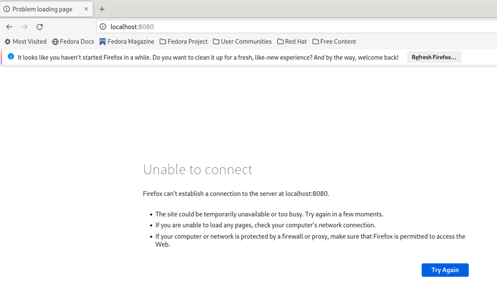
- **ENTRYPOINT**：与 CMD 类似，也是用来指定一个容器启动时要运行的命令。
  ENTRYPOINT 和 RUN 一起用，一般是 <font color = 'red'>变参</font> 才使用 CMD，这里的 CMD 等于是 ENTRYPOINT 的传参。  
  
  案例：假设已通过 Dockerfile 构建了 nginx:test镜像
    ```
    FROM nginx
    ENTRYPOINT ［"nginx"，"-c"］ #定参
    CMD ［"/etc/nginx/nginx.conf"］# 变参
    ```
  运行效果为: 

    | 是否传参 | 按照 dockerfile 编写执行 | 传参运行                           |
    |-----------|---------------------------|--------------------------------|
    | Docker命令 | `docker run nginx:test`   | `docker run nginx:test -c /etc/nginx/new.conf` |
    | 衍生出的实际命令 | `nginx -c /etc/nginx/nginx.conf` | `nginx -c /etc/nginx/new.conf` |
    
### Dockerfile 实际案例
精简版 centOS + vim + ifconfig + jdk8
JDK 镜像下载地址：https://mirrors.yangxingzhen.com/jdk/  
官网下载地址：https://www.oracle.com/java/technologies/downloads/#java8
  
```Dockerfile
FROM centos
MAINTAINER zzyy<zzyybs@126.com>

ENV MYPATH /usr/local
WORKDIR $MYPATH

#安装vim编辑器
RUN yum -y install vim
#安装ifconfig命令查看网络IP
RUN yum -y install net-tools
#安装java8及lib库
RUN yum -y install glibc.i686
RUN mkdir /usr/local/java
#ADD 是相对路径jar，把jdk-8u401-linux-x64.tar.gz添加到容器中，安装包必须要和Dockerfile文件在同一位置
ADD jdk-8u401-linux-x64.tar.gz /usr/local/java/
#配置java环境变量
ENV JAVA_HOME /usr/local/java/jdk1.8.0_401
ENV JRE_HOME $JAVA_HOME/jre
ENV CLASSPATH $JAVA_HOME/lib/dt.jar:$JAVA_HOME/lib/tools.jar:$JRE_HOME/lib:$CLASSPATH
ENV PATH $JAVA_HOME/bin:$PATH
EXPOSE 80
CMD echo $MYPATH
CMD echo "success------------ok"
CMD /bin/bash
```
  
安装时，出现以下两个问题：
1) 后缀名问题
```
[parallels@fedora myfile]$ sudo docker build -t centosjava8:1.5 .
[sudo] password for parallels: 
[+] Building 15.6s (11/11) FINISHED                                                                                                                                                  
 => [internal] load .dockerignore                                                                                                                                               0.0s
 => => transferring context: 2B                                                                                                                                                 0.0s
 => [internal] load build definition from Dockerfile                                                                                                                            0.0s
 => => transferring dockerfile: 830B                                                                                                                                            0.0s
 => [internal] load metadata for docker.io/library/centos:latest                                                                                                               15.4s
 => CANCELED [1/7] FROM docker.io/library/centos@sha256:a27fd8080b517143cbbbab9dfb7c8571c40d67d534bbdee55bd6c473f432b177                                                        0.1s
 => => resolve docker.io/library/centos@sha256:a27fd8080b517143cbbbab9dfb7c8571c40d67d534bbdee55bd6c473f432b177                                                                 0.1s
 => => sha256:a27fd8080b517143cbbbab9dfb7c8571c40d67d534bbdee55bd6c473f432b177 762B / 762B                                                                                      0.0s
 => => sha256:65a4aad1156d8a0679537cb78519a17eb7142e05a968b26a5361153006224fdc 529B / 529B                                                                                      0.0s
 => => sha256:e6a0117ec169eda93dc5ca978c6ac87580e36765a66097a6bfb6639a3bd4038a 2.16kB / 2.16kB                                                                                  0.0s
 => [internal] load build context                                                                                                                                               0.1s
 => => transferring context: 2B                                                                                                                                                 0.0s
 => CACHED [2/7] WORKDIR /usr/local                                                                                                                                             0.0s
 => CACHED [3/7] RUN yum -y install vim                                                                                                                                         0.0s
 => CACHED [4/7] RUN yum -y install net-tools                                                                                                                                   0.0s
 => CACHED [5/7] RUN yum -y install glibc.i686                                                                                                                                  0.0s
 => CACHED [6/7] RUN mkdir /usr/local/java                                                                                                                                      0.0s
 => ERROR [7/7] ADD jdk-8u401-linux-x64.tar.gz /usr/local/java/                                                                                                                 0.0s
------
 > [7/7] ADD jdk-8u401-linux-x64.tar.gz /usr/local/java/:
------
Dockerfile:15
--------------------
  13 |     RUN mkdir /usr/local/java
  14 |     #ADD 是相对路径jar，把jdk-8u401-linux-x64.tar.gz添加到容器中，安装包必须要和Dockerfile文件在同一位置
  15 | >>> ADD jdk-8u401-linux-x64.tar.gz /usr/local/java/
  16 |     #配置java环境变量
  17 |     ENV JAVA_HOME /usr/local/java/jdk1.8.0_401
--------------------
ERROR: failed to solve: failed to compute cache key: failed to calculate checksum of ref 0d1b90ee-b3b5-4502-a073-cddac63f87f5::98ls856gw8zi0ez0skn2yqmu8: "/jdk-8u401-linux-x64.tar.gz": not found
```
在 fedora 系统中下载 jdk-8u401-linux-x64.tar.gz 下来的文件全称为 jdk-8u401-linux-x64.tar，没有 .gz后缀。修改 Dockerfile 中的后缀名配置可解决。

2) 将问题1修改后，接着又出现了 No URLs in mirrorlist。<font color = 'red'>（该问题暂未解决）</font>
```
[parallels@fedora myfile]$ sudo docker build -t centosjava8:1.5 .
[+] Building 27.6s (7/11)                                                                                                                                                            
 => [internal] load build definition from Dockerfile                                                                                                                            0.1s
 => => transferring dockerfile: 827B                                                                                                                                            0.0s
 => [internal] load .dockerignore                                                                                                                                               0.0s
 => => transferring context: 2B                                                                                                                                                 0.0s
 => [internal] load metadata for docker.io/library/centos:latest                                                                                                               15.2s
 => [1/7] FROM docker.io/library/centos@sha256:a27fd8080b517143cbbbab9dfb7c8571c40d67d534bbdee55bd6c473f432b177                                                                 0.0s
 => [internal] load build context                                                                                                                                               0.0s
 => => transferring context: 106B                                                                                                                                               0.0s
 => CACHED [2/7] WORKDIR /usr/local                                                                                                                                             0.0s
 => ERROR [3/7] RUN yum -y install vim                                                                                                                                          7.9s
------                                                                                                                                                                               
 > [3/7] RUN yum -y install vim:
#0 7.813 CentOS Linux 8 - AppStream                      5.2  B/s |  38  B     00:07    
#0 7.821 Error: Failed to download metadata for repo 'appstream': Cannot prepare internal mirrorlist: No URLs in mirrorlist
------
Dockerfile:8
--------------------
   6 |     
   7 |     #安装vim编辑器
   8 | >>> RUN yum -y install vim
   9 |     #安装ifconfig命令查看网络IP
  10 |     RUN yum -y install net-tools
--------------------
ERROR: failed to solve: process "/bin/sh -c yum -y install vim" did not complete successfully: exit code: 1
```

仅运行以下 Dockerfile 配置是没有问题的：
```dockerfile
#期间以为是初始镜像的问题，此处将centos改为了fedora
FROM fedora
MAINTAINER zzyy<zzyybs@126.com>

ENV MYPATH /usr/local
WORKDIR $MYPATH

#ADD 是相对路径jar，把jdk-8u401-linux-x64.tar.gz添加到容器中，安装包必须要和Dockerfile文件在同一位置
ADD jdk-8u401-linux-x64.tar.gz /usr/local/java/
#配置java环境变量
ENV JAVA_HOME /usr/local/java/jdk1.8.0_401
ENV JRE_HOME $JAVA_HOME/jre
ENV CLASSPATH $JAVA_HOME/lib/dt.jar:$JAVA_HOME/lib/tools.jar:$JRE_HOME/lib:$CLASSPATH
ENV PATH $JAVA_HOME/bin:$PATH
EXPOSE 80
CMD echo $MYPATH
CMD echo "success------------ok"
CMD /bin/bash
```

运行结果如下：
```
[parallels@fedora myfile]$ sudo docker build -t fedorajava8:1.5 .
[+] Building 20.4s (9/9) FINISHED                                                                                                                                                    
 => [internal] load build definition from Dockerfile                                                                                                                            0.0s
 => => transferring dockerfile: 822B                                                                                                                                            0.0s
 => [internal] load .dockerignore                                                                                                                                               0.0s
 => => transferring context: 2B                                                                                                                                                 0.0s
 => [internal] load metadata for docker.io/library/fedora:latest                                                                                                               15.7s
 => [1/4] FROM docker.io/library/fedora@sha256:40ba585f0e25c096a08c30ab2f70ef3820b8ea5a4bdd16da0edbfc0a6952fa57                                                                 0.0s
 => [internal] load build context                                                                                                                                               0.1s
 => => transferring context: 106B                                                                                                                                               0.0s
 => CACHED [2/4] WORKDIR /usr/local                                                                                                                                             0.0s
 => [3/4] RUN mkdir /usr/local/java                                                                                                                                             0.8s
 => [4/4] ADD jdk-8u401-linux-x64.tar /usr/local/java/                                                                                                                          2.5s
 => exporting to image                                                                                                                                                          1.1s
 => => exporting layers                                                                                                                                                         1.1s
 => => writing image sha256:6dec0b25f3a2a8bdfce8e3fd6f1d5020fe90e09a654f69a1bcf022a05f5e2165                                                                                    0.0s
 => => naming to docker.io/library/fedorajava8:1.5                                                                                                                              0.0s
[parallels@fedora myfile]$ sudo docker images
REPOSITORY                                                 TAG       IMAGE ID       CREATED          SIZE
fedorajava8                                                1.5       6dec0b25f3a2   13 seconds ago   518MB
```


### 虚悬镜像  
随便指定一个简单的 Dockerfile：
```dockerfile
from ubuntu
CMD echo 'action is success'
```
  
直接执行 `docker build .`
```
[parallels@fedora temp]$ sudo docker build .
[+] Building 0.2s (5/5) FINISHED                                                                                                                                                     
 => [internal] load build definition from Dockerfile                                                                                                                            0.0s
 => => transferring dockerfile: 137B                                                                                                                                            0.0s
 => [internal] load .dockerignore                                                                                                                                               0.0s
 => => transferring context: 2B                                                                                                                                                 0.0s
 => [internal] load metadata for docker.io/library/ubuntu:latest                                                                                                                0.0s
 => CACHED [1/1] FROM docker.io/library/ubuntu                                                                                                                                  0.0s
 => exporting to image                                                                                                                                                          0.0s
 => => exporting layers                                                                                                                                                         0.0s
 => => writing image sha256:c9110309d91d0080f80f9cef1ed97dca48c8fe644796d37ecbffa4838c247c33                                                                                    0.0s
```

#### 虚悬镜像查看
使用`docker images`便会看到<font color = 'red'>虚悬镜像: repository 和 tag 均为 none。</font>
```
[parallels@fedora temp]$ sudo docker images
REPOSITORY                                                 TAG       IMAGE ID       CREATED        SIZE
<none>                                                     <none>    c9110309d91d   4 months ago   69.2MB
```

也可以通过`docker image ls -f dangling=true`命令查看：
```
[parallels@fedora temp]$ sudo docker image ls -f dangling=true
REPOSITORY   TAG       IMAGE ID       CREATED        SIZE
<none>       <none>    6d4e92947709   4 months ago   69.2MB
```

#### 虚悬镜像删除
使用`docker prune`可以删除久悬镜像
```
[parallels@fedora temp]$ sudo docker image prune
[sudo] password for parallels: 
WARNING! This will remove all dangling images.
Are you sure you want to continue? [y/N] y
Deleted Images:
deleted: sha256:6d4e92947709f532536c19aa2e2ab7834834b66bf15108e2c0770d4ab779e776
```

## Docker 微服务实战
### 打包 jar 包部署到云端
1) 打包 jar 包
2) 编写 Dockerfile 文件
```dockerfile
# 基础镜像使用java
FROM java:8
# 作者
MAINTAINER zzyy
# VOLUME 指定临时文件目录为/tmp，在主机/var/lib/docker目录下创建了一个临时文件并链接到容器的/tmp
VOLUME /tmp
# 将jar包添加到容器中并更名为zzyy_docker.jar
ADD docker_boot-O.0.1-SNAPSHOT.jar zzyy_docker.jar
# 运行jar包
RUN bash -c 'touch /zzyy_docker.jar'
# ENTRYPOINT 使用正常括号
ENTRYPOINT ["java", "-jar", "/zzyy_docker.jar"]
# 暴露6001端口作为微服务
EXPOSE 6001
```
3) 构建镜像
```
docker build -t zzyy_docker:1.6 
```
4) 运行镜像
```
docker run -d -p 6001:6001 zzyy_docker:1.6
```
5) 访问测试

## Docker 网络
### 查看网络的命令
linux 可以通过两个命令查看网络，一是 `ifconfig`，`另一个是 ip addr`：
```
[parallels@fedora myfile]$ ifconfig
docker0: flags=4099<UP,BROADCAST,MULTICAST>  mtu 1500
        ether 02:42:7e:86:2d:ae  txqueuelen 0  (Ethernet)
        RX packets 16184  bytes 703714 (687.2 KiB)
        RX errors 0  dropped 0  overruns 0  frame 0
        TX packets 186065  bytes 62583435 (59.6 MiB)
        TX errors 0  dropped 0 overruns 0  carrier 0  collisions 0

enp0s5: flags=4163<UP,BROADCAST,RUNNING,MULTICAST>  mtu 1500
        inet 10.211.55.5  netmask 255.255.255.0  broadcast 10.211.55.255
        inet6 fe80::a693:c9f8:ce48:357c  prefixlen 64  scopeid 0x20<link>
        inet6 fdb2:2c26:f4e4:0:81d:a17c:1c77:9aed  prefixlen 64  scopeid 0x0<global>
        ether 00:1c:42:5e:6d:01  txqueuelen 1000  (Ethernet)
        RX packets 1532177  bytes 1398081059 (1.3 GiB)
        RX errors 0  dropped 0  overruns 0  frame 0
        TX packets 993882  bytes 89297484 (85.1 MiB)
        TX errors 0  dropped 0 overruns 0  carrier 0  collisions 0

lo: flags=73<UP,LOOPBACK,RUNNING>  mtu 65536
        inet 127.0.0.1  netmask 255.0.0.0
        inet6 ::1  prefixlen 128  scopeid 0x10<host>
        loop  txqueuelen 1000  (Local Loopback)
        RX packets 1831592  bytes 1822918406 (1.6 GiB)
        RX errors 0  dropped 0  overruns 0  frame 0
        TX packets 1831592  bytes 1822918406 (1.6 GiB)
        TX errors 0  dropped 0 overruns 0  carrier 0  collisions 0
```


```
[parallels@fedora myfile]$ ip addr
1: lo: <LOOPBACK,UP,LOWER_UP> mtu 65536 qdisc noqueue state UNKNOWN group default qlen 1000
    link/loopback 00:00:00:00:00:00 brd 00:00:00:00:00:00
    inet 127.0.0.1/8 scope host lo
       valid_lft forever preferred_lft forever
    inet6 ::1/128 scope host 
       valid_lft forever preferred_lft forever
2: enp0s5: <BROADCAST,MULTICAST,UP,LOWER_UP> mtu 1500 qdisc fq_codel state UP group default qlen 1000
    link/ether 00:1c:42:5e:6d:01 brd ff:ff:ff:ff:ff:ff
    inet 10.211.55.5/24 brd 10.211.55.255 scope global dynamic noprefixroute enp0s5
       valid_lft 1469sec preferred_lft 1469sec
    inet6 fdb2:2c26:f4e4:0:81d:a17c:1c77:9aed/64 scope global dynamic noprefixroute 
       valid_lft 2591851sec preferred_lft 604651sec
    inet6 fe80::a693:c9f8:ce48:357c/64 scope link noprefixroute 
       valid_lft forever preferred_lft forever
3: docker0: <NO-CARRIER,BROADCAST,MULTICAST,UP> mtu 1500 qdisc noqueue state DOWN group default 
    link/ether 02:42:7e:86:2d:ae brd ff:ff:ff:ff:ff:ff
```
- docker0:
    - 描述： Docker创建的桥接网络。
    - 用途： 用于Docker容器之间的通信和与主机的通信。
- enp0s5:
    - 描述： 物理网卡（Ethernet Port 0, Slot 5）。
    - 用途： 连接到主机的物理网络，可能是通过以太网线连接到路由器或交换机的接口。
- lo:
    - 描述： Loopback接口。
    - 用途： 用于本地回环，即主机自己与自己通信。常用于本地测试和网络调试。

### Docker network 常用命令
Docker network 命令主要是为了：容器间的互联和通信以及端口映射，以及容器 IP 变动时候可以通过服务名直接网络道信而不受到影响。常用的命令如 `docker network ls`：
```
[parallels@fedora myfile]$ sudo docker network ls
[sudo] password for parallels: 
NETWORK ID     NAME      DRIVER    SCOPE
821f336e8907   bridge    bridge    local
95dbf0f8eb94   host      host      local
34500d06d37c   none      null      local
```

其他常见命令可通过 `docker network --hlep` 查看
```
[parallels@fedora myfile]$ sudo docker network --help

Usage:  docker network COMMAND

Manage networks

Commands:
  connect     Connect a container to a network
  create      Create a network
  disconnect  Disconnect a container from a network
  inspect     Display detailed information on one or more networks
  ls          List networks
  prune       Remove all unused networks
  rm          Remove one or more networks
```

### 网络模式
| 网络模式      | 简介                                                                |
|-----------|-------------------------------------------------------------------|
| bridge    | 为每一个容器分配、设置 IP 等，并将容器连接到一个 `docker0`。虚拟网桥，默认为该模式。                 | 
| host      | 容器将不会虚拟出自己的网卡，配置自己的 IP 等，而是使用宿主机的IP 和端口。                          |
| none<br/>(很少用) | 容器有独立的 Network namespace，但并没有对其进行任何网络设置，如分配 veth pair 和网桥连接，IP 等。 |
| container | 新创建的容器不会创建自己的网卡和配置自己的 IP ，而是和一个指定的容器共享 IP 、端口范围等。                 |

#### 桥接模式（交换机）
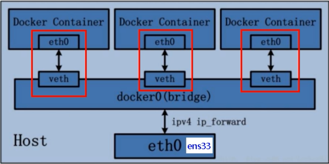
1) 以默认网络模式，新建两个 tomcat 容器实例
```
[parallels@fedora myfile]$ sudo docker run -d -p 8081:8080 --name tomcat81 tomcat
5f74bdd7c8eefc8d6dc28f742d1b3b58118cceeab925de3b8ee0e15de07e079a
[parallels@fedora myfile]$ sudo docker run -d -p 8082:8080 --name tomcat82 tomcat
519a749e605f0b81bfba65798d733bff40ed9c6a3fd9702044774b0e13237a0a
```

2) 检查宿主机网络
```
[parallels@fedora myfile]$ ip addr
1: lo: <LOOPBACK,UP,LOWER_UP> mtu 65536 qdisc noqueue state UNKNOWN group default qlen 1000
    link/loopback 00:00:00:00:00:00 brd 00:00:00:00:00:00
    inet 127.0.0.1/8 scope host lo
       valid_lft forever preferred_lft forever
    inet6 ::1/128 scope host 
       valid_lft forever preferred_lft forever
2: enp0s5: <BROADCAST,MULTICAST,UP,LOWER_UP> mtu 1500 qdisc fq_codel state UP group default qlen 1000
    link/ether 00:1c:42:5e:6d:01 brd ff:ff:ff:ff:ff:ff
    inet 10.211.55.5/24 brd 10.211.55.255 scope global dynamic noprefixroute enp0s5
       valid_lft 1179sec preferred_lft 1179sec
    inet6 fdb2:2c26:f4e4:0:81d:a17c:1c77:9aed/64 scope global dynamic noprefixroute 
       valid_lft 2591837sec preferred_lft 604637sec
    inet6 fe80::a693:c9f8:ce48:357c/64 scope link noprefixroute 
       valid_lft forever preferred_lft forever
3: docker0: <BROADCAST,MULTICAST,UP,LOWER_UP> mtu 1500 qdisc noqueue state UP group default 
    link/ether 02:42:7e:86:2d:ae brd ff:ff:ff:ff:ff:ff
    inet 172.17.0.1/16 brd 172.17.255.255 scope global docker0
       valid_lft forever preferred_lft forever
195: veth1817f72@if194: <BROADCAST,MULTICAST,UP,LOWER_UP> mtu 1500 qdisc noqueue master docker0 state UP group default 
    link/ether 72:69:8b:ba:f5:31 brd ff:ff:ff:ff:ff:ff link-netnsid 0
    inet6 fe80::7069:8bff:feba:f531/64 scope link 
       valid_lft forever preferred_lft forever
197: veth6cef2f6@if196: <BROADCAST,MULTICAST,UP,LOWER_UP> mtu 1500 qdisc noqueue master docker0 state UP group default 
    link/ether 4a:1d:ae:5c:7e:3f brd ff:ff:ff:ff:ff:ff link-netnsid 1
    inet6 fe80::481d:aeff:fe5c:7e3f/64 scope link 
       valid_lft forever preferred_lft forever
```

3) 进入 tomcat 实例内，检查网络情况
>如果 `ip addr` 不可运行，可以先执行以下语句安装：
>```
>apt-get update
>apt-get install iproute2
>```

``` tomcat81
root@5f74bdd7c8ee:/usr/local/tomcat# ip addr
1: lo: <LOOPBACK,UP,LOWER_UP> mtu 65536 qdisc noqueue state UNKNOWN group default qlen 1000
    link/loopback 00:00:00:00:00:00 brd 00:00:00:00:00:00
    inet 127.0.0.1/8 scope host lo
       valid_lft forever preferred_lft forever
194: eth0@if195: <BROADCAST,MULTICAST,UP,LOWER_UP> mtu 1500 qdisc noqueue state UP group default 
    link/ether 02:42:ac:11:00:02 brd ff:ff:ff:ff:ff:ff link-netnsid 0
    inet 172.17.0.2/16 brd 172.17.255.255 scope global eth0
       valid_lft forever preferred_lft forever
```
tomcat81:  
195: veth1817f72@if194  
194: eth0@if195

```
root@519a749e605f:/usr/local/tomcat# ip addr
1: lo: <LOOPBACK,UP,LOWER_UP> mtu 65536 qdisc noqueue state UNKNOWN group default qlen 1000
    link/loopback 00:00:00:00:00:00 brd 00:00:00:00:00:00
    inet 127.0.0.1/8 scope host lo
       valid_lft forever preferred_lft forever
196: eth0@if197: <BROADCAST,MULTICAST,UP,LOWER_UP> mtu 1500 qdisc noqueue state UP group default 
    link/ether 02:42:ac:11:00:03 brd ff:ff:ff:ff:ff:ff link-netnsid 0
    inet 172.17.0.3/16 brd 172.17.255.255 scope global eth0
       valid_lft forever preferred_lft forever
```
tomcat82:  
197: veth6cef2f6@if196  
196: eth0@if197

#### 主机模式
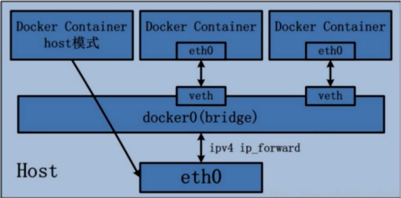
1) 以主机模式新建 tomcat 容器实例
使用主机模式，`无需指定端口`，如果指定了会报警告：
```
[parallels@fedora myfile]$ sudo docker run -d -p 8083:8080 --network host --name tomcat83 tomcat
WARNING: Published ports are discarded when using host network mode
36ecbbdaf4de11b00fa5281aa1137f87a43a2d1b93647f3ba7e75f939bb70b0c
```

直接按如下命令执行即可：
```
[parallels@fedora myfile]$ sudo docker run -d --network host --name tomcat83 tomcat
7e6bd2158b8dad2de604ebcd165653e2a92bc559192ab27049dc715293ff1288
```

2) 检查 tomcat83 实例
```
[parallels@fedora myfile]$ sudo docker inspect tomcat83 | tail -n 20
            "Networks": {
                "host": {
                    "IPAMConfig": null,
                    "Links": null,
                    "Aliases": null,
                    "NetworkID": "95dbf0f8eb94c79aed06308112a5f9e734814daec4f46be71858b809eb340ff0",
                    "EndpointID": "65e699ce8ead09119f0777f92c01d7bb6a7258e6209870c81660e4b2b59c8b62",
                    "Gateway": "",
                    "IPAddress": "",
                    "IPPrefixLen": 0,
                    "IPv6Gateway": "",
                    "GlobalIPv6Address": "",
                    "GlobalIPv6PrefixLen": 0,
                    "MacAddress": "",
                    "DriverOpts": null
                }
            }
        }
    }
]
```

3) 宿主机网络情况
```
[parallels@fedora myfile]$ ip addr
1: lo: <LOOPBACK,UP,LOWER_UP> mtu 65536 qdisc noqueue state UNKNOWN group default qlen 1000
    link/loopback 00:00:00:00:00:00 brd 00:00:00:00:00:00
    inet 127.0.0.1/8 scope host lo
       valid_lft forever preferred_lft forever
    inet6 ::1/128 scope host 
       valid_lft forever preferred_lft forever
2: enp0s5: <BROADCAST,MULTICAST,UP,LOWER_UP> mtu 1500 qdisc fq_codel state UP group default qlen 1000
    link/ether 00:1c:42:5e:6d:01 brd ff:ff:ff:ff:ff:ff
    inet 10.211.55.5/24 brd 10.211.55.255 scope global dynamic noprefixroute enp0s5
       valid_lft 1649sec preferred_lft 1649sec
    inet6 fdb2:2c26:f4e4:0:81d:a17c:1c77:9aed/64 scope global dynamic noprefixroute 
       valid_lft 2591661sec preferred_lft 604461sec
    inet6 fe80::a693:c9f8:ce48:357c/64 scope link noprefixroute 
       valid_lft forever preferred_lft forever
3: docker0: <BROADCAST,MULTICAST,UP,LOWER_UP> mtu 1500 qdisc noqueue state UP group default 
    link/ether 02:42:7e:86:2d:ae brd ff:ff:ff:ff:ff:ff
    inet 172.17.0.1/16 brd 172.17.255.255 scope global docker0
       valid_lft forever preferred_lft forever
195: veth1817f72@if194: <BROADCAST,MULTICAST,UP,LOWER_UP> mtu 1500 qdisc noqueue master docker0 state UP group default 
    link/ether 72:69:8b:ba:f5:31 brd ff:ff:ff:ff:ff:ff link-netnsid 0
    inet6 fe80::7069:8bff:feba:f531/64 scope link 
       valid_lft forever preferred_lft forever
197: veth6cef2f6@if196: <BROADCAST,MULTICAST,UP,LOWER_UP> mtu 1500 qdisc noqueue master docker0 state UP group default 
    link/ether 4a:1d:ae:5c:7e:3f brd ff:ff:ff:ff:ff:ff link-netnsid 1
    inet6 fe80::481d:aeff:fe5c:7e3f/64 scope link 
       valid_lft forever preferred_lft forever
```

3) 进入 tomcat83 容器，检查网络情况
```
root@fedora:/usr/local/tomcat# ip addr
1: lo: <LOOPBACK,UP,LOWER_UP> mtu 65536 qdisc noqueue state UNKNOWN group default qlen 1000
    link/loopback 00:00:00:00:00:00 brd 00:00:00:00:00:00
    inet 127.0.0.1/8 scope host lo
       valid_lft forever preferred_lft forever
    inet6 ::1/128 scope host 
       valid_lft forever preferred_lft forever
2: enp0s5: <BROADCAST,MULTICAST,UP,LOWER_UP> mtu 1500 qdisc fq_codel state UP group default qlen 1000
    link/ether 00:1c:42:5e:6d:01 brd ff:ff:ff:ff:ff:ff
    inet 10.211.55.5/24 brd 10.211.55.255 scope global dynamic noprefixroute enp0s5
       valid_lft 1041sec preferred_lft 1041sec
    inet6 fdb2:2c26:f4e4:0:81d:a17c:1c77:9aed/64 scope global dynamic noprefixroute 
       valid_lft 2591953sec preferred_lft 604753sec
    inet6 fe80::a693:c9f8:ce48:357c/64 scope link noprefixroute 
       valid_lft forever preferred_lft forever
3: docker0: <BROADCAST,MULTICAST,UP,LOWER_UP> mtu 1500 qdisc noqueue state UP group default 
    link/ether 02:42:7e:86:2d:ae brd ff:ff:ff:ff:ff:ff
    inet 172.17.0.1/16 brd 172.17.255.255 scope global docker0
       valid_lft forever preferred_lft forever
195: veth1817f72@if194: <BROADCAST,MULTICAST,UP,LOWER_UP> mtu 1500 qdisc noqueue master docker0 state UP group default 
    link/ether 72:69:8b:ba:f5:31 brd ff:ff:ff:ff:ff:ff link-netnsid 0
    inet6 fe80::7069:8bff:feba:f531/64 scope link 
       valid_lft forever preferred_lft forever
197: veth6cef2f6@if196: <BROADCAST,MULTICAST,UP,LOWER_UP> mtu 1500 qdisc noqueue master docker0 state UP group default 
    link/ether 4a:1d:ae:5c:7e:3f brd ff:ff:ff:ff:ff:ff link-netnsid 1
    inet6 fe80::481d:aeff:fe5c:7e3f/64 scope link 
       valid_lft forever preferred_lft forever
```
会发现与步骤2中的网络情况几乎一致。


#### none 模式
1) 以 none 模式新建容器实例
```
[parallels@fedora ~]$ sudo docker run -d -p 8084:8080 --network none --name tomcat84 tomcat
54d2768178a96fda26ef29fb37dba05b5e74dda1441732cf2a46d930b39f762e
```

2) 检查 tomcat84 容器实例
```
[parallels@fedora ~]$ sudo docker inspect tomcat84 | tail -n 20
            "Networks": {
                "none": {
                    "IPAMConfig": null,
                    "Links": null,
                    "Aliases": null,
                    "NetworkID": "34500d06d37c06d7bed42e55c0c4c00392fbfba9ce99abcb574170bc9f289630",
                    "EndpointID": "830c97ece5ce9e7496706aef787ef23097ee04c715e8f205320aede9cdc92216",
                    "Gateway": "",
                    "IPAddress": "",
                    "IPPrefixLen": 0,
                    "IPv6Gateway": "",
                    "GlobalIPv6Address": "",
                    "GlobalIPv6PrefixLen": 0,
                    "MacAddress": "",
                    "DriverOpts": null
                }
            }
        }
    }
]
```

3) 进入 tomcat84 容器内，检查网络情况
由于此次使用的简版 tomcat，自身没有带 ip addr 命令，且为 none 模式无法安装该命令。正常情况下，应为只能看到回环 lo 的虚拟网卡。类似于下面这种：
```
root@5f74bdd7c8ee:/usr/local/tomcat# ip addr
1: lo: <LOOPBACK,UP,LOWER_UP> mtu 65536 qdisc noqueue state UNKNOWN group default qlen 1000
    link/loopback 00:00:00:00:00:00 brd 00:00:00:00:00:00
    inet 127.0.0.1/8 scope host lo
       valid_lft forever preferred_lft forever
```

#### container 模式（共用一个吸管）
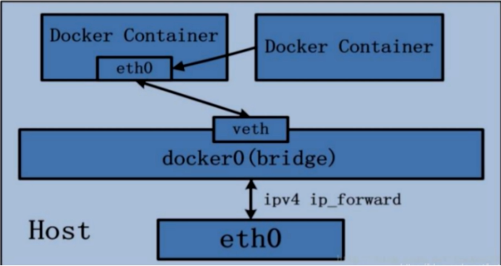

1) 以 container 模式，新建两个 tomcat 容器实例
```
[parallels@fedora ~]$ sudo docker run -d -p 8085:8080 --name tomcat85 tomcat
fc192fe3b819b9c5f60ef9c65c955b1fa0ef7c3e1c7d24fb0d9b134ea774fa5a
[parallels@fedora ~]$ sudo docker run -d -p 8086:8080 --network container:tomcat85 --name tomcat86 tomcat
docker: Error response from daemon: conflicting options: port publishing and the container type network mode.
```
两个实例共用 8080 网络端口，导致 tomcat86 启动失败。

2) 以 container 模式，新建两个 alpine 容器实例
> alpine 是一款以小巧、简单、安全著称的非商用 Linux 发行版。镜像不到 6M 的大小，特别适合容器打包。

```alpine1
[parallels@fedora ~]$ sudo docker run -it --name alpine1 alpine /bin/sh
/ # ip addr
1: lo: <LOOPBACK,UP,LOWER_UP> mtu 65536 qdisc noqueue state UNKNOWN qlen 1000
    link/loopback 00:00:00:00:00:00 brd 00:00:00:00:00:00
    inet 127.0.0.1/8 scope host lo
       valid_lft forever preferred_lft forever
202: eth0@if203: <BROADCAST,MULTICAST,UP,LOWER_UP,M-DOWN> mtu 1500 qdisc noqueue state UP 
    link/ether 02:42:ac:11:00:04 brd ff:ff:ff:ff:ff:ff
    inet 172.17.0.4/16 brd 172.17.255.255 scope global eth0
       valid_lft forever preferred_lft forever
```

```alpine2
[parallels@fedora myfile]$ sudo docker run -it --network container:alpine1 --name alpine2 alpine /bin/sh
/ # ip addr
1: lo: <LOOPBACK,UP,LOWER_UP> mtu 65536 qdisc noqueue state UNKNOWN qlen 1000
    link/loopback 00:00:00:00:00:00 brd 00:00:00:00:00:00
    inet 127.0.0.1/8 scope host lo
       valid_lft forever preferred_lft forever
202: eth0@if203: <BROADCAST,MULTICAST,UP,LOWER_UP,M-DOWN> mtu 1500 qdisc noqueue state UP 
    link/ether 02:42:ac:11:00:04 brd ff:ff:ff:ff:ff:ff
    inet 172.17.0.4/16 brd 172.17.255.255 scope global eth0
       valid_lft forever preferred_lft forever
```
可以看到，以 container 模式关联的两个容器实例的网络情况一摸一样。

3) 退出 alpine1，查看 alpine2 的网络情况
```alpine1
/ # exit
```

```alpine2
/ # ip addr
1: lo: <LOOPBACK,UP,LOWER_UP> mtu 65536 qdisc noqueue state UNKNOWN qlen 1000
    link/loopback 00:00:00:00:00:00 brd 00:00:00:00:00:00
    inet 127.0.0.1/8 scope host lo
       valid_lft forever preferred_lft forever
```
可以看到，alpine2 的网络只剩下 lo 了。
