## 为什么会出现 Docker
- 传统上，软件编码开发/测试结束后，所产出的成果即是程序或是能够编译执行的二进制字节码等。而为了让这些程序可以顺利执行，开发团队也得准备完整的部署文件，让维运团队得以部署应用程序，开发需要清楚的告诉运维部署团队，用的全部配置文件＋所有软件环境。不过即便如此，仍然常常发生部署失败的情况。
- Docker的出现使得Docker得以打破过去「程序即应用」的观念。通过过镜像(images)，将运作应用程式所需要的系统环境，由下而上打包，达到应用程式跨平台间的无缝接轨运作。

### 传统虚拟机与 Docker 容器对比
传统虚拟机：是`带环境安装`的一套解决方案，如 Win10 上安装 centOS ，资源占用多、冗余步骤多、启动慢。  
Docker容器：是在操作系统层面上实现虚拟化，直接复用本地主机的操作系統。与传统的虚拟机相比，Docker 优势体现为启动速度快、占用体积小。
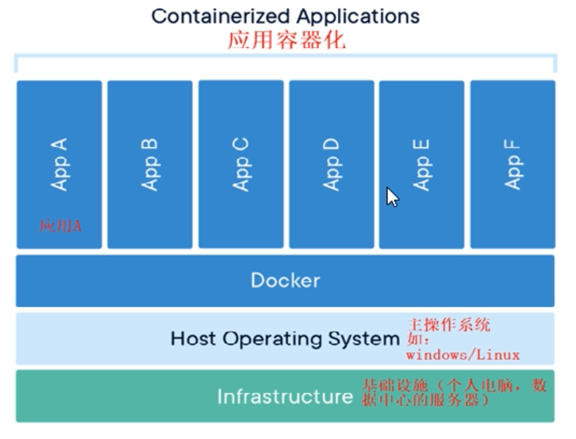

VM 与 Docker 的直观对比图：
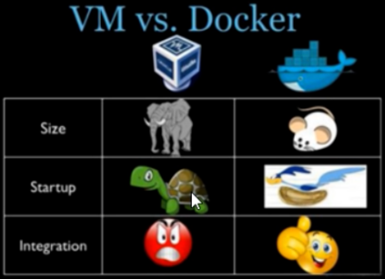

### Docker 为什么比虚拟机快
1) Docker 有着比虚拟机更少的抽象层  
由于 Docker 不需要 Hypervisor(管理程序) 实现硬件资源虚拟化，运行在 Docker 容器上的程序直接使用的都是实际物理机的硬件资源。因此在CPU、内存利用率上 Docker 将会在效率上有明显优势。  
2) Docker 利用的是宿主机的内核,而不需要加载操作系统 OS 内核  
当新建一个容器时，Docker 不需要和虚拟机一样重新加载一个操作系统内核。进而避免引寻、加载操作系统内核返回等比较费时费资源的过程，当新建一个虚拟机时，虚拟机软件需要加载 OS，返回新建过程是分钟级别的。而 Docker 由于直接利用宿主机的操作系统，则省略了返回过程，因此新建一个 Docker 容器只需要几秒钟。

虚拟机与 Docker 架构对比图
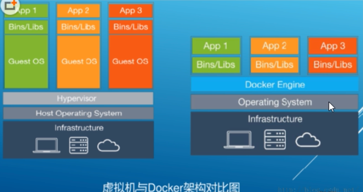

虚拟机与 Docker 性能对比
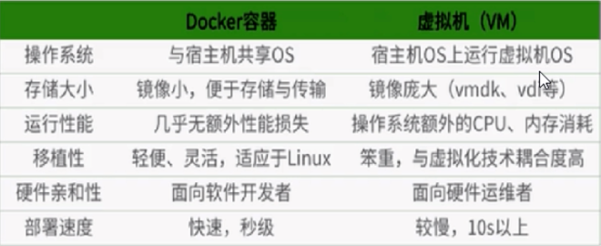

## Docker 能做什么
- 更快速的应用交付和部署
>传统的应用开发完成后，需要提供一堆安装程序和配置说明文档，安装部署后需根据配置文档进行繁杂的配置才能正常运行。 Docker 化之后只需要交付少量容器镜像文件，在正式生产环境加载镜像并运行即可，应用安装配置在镜像里己经内置好，大大节省部署配置和测试验证时间。

- 更便捷的升级和扩缩容
>随着微服务架构和 Docker 的发展，大量的应用会通过微服务方式架构，应用的开发构建将变成搭乐高积木一样，每个Docker容器水变成一块“积木”，应用的升级将变得非常容易。当现有的容器不足以支撑业务处理时，可通过镜像运行新的容器进行快速扩容，使应用系统的扩容从原先的天级变成分钟级甚至秒级。

- 更简单的系统运维
>应用容器化运行后，生产环境运行的应用可与开发、测试环境的应用高度一致，容器会将应用程序相关的环境和状态完全封装起来，不会因为底层基础架构和操作系统的不一致性给应用带来影响，产生新的BUG。当出现程序异常时，也可以通过测试环境的相同容器进行快速定位和修复。

- 更高效的计算资源利用
> Docker 是内核级虛拟化，其不像传统的虚拟化技术一样需要额外的管理程序支持，所以在一台物理机上可以运行很多个容器实例，可大大提升物理服务器的 CPU 和内存的利用率。
 
## Docker 的应用场景
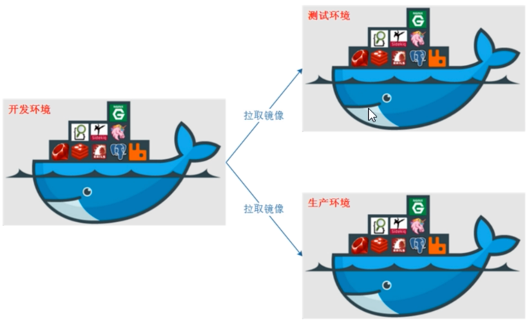
Docker 借鉴了标准集装箱的概念。标准集装箱将货物运往世界各地，Docker 将这个模型运用到自己的设计中，唯一不同的是：集装箱运输货物，而 Docker 运输软件。

## Docker 官网及运行条件
Docker 官网：https://www.docker.com/  
Docker Hub 官网：https://hub.docker.com/  

Docker 必须部署在Linux内核的系统上。在 Window 系统上部署 Docker 的方法是先安装一个 Linux 虚拟机，在虚拟机中运行 Docker。  
> 目前，Centos 仅发行版本中的内核支持 Docker 。 Docker 运行在 Centos 7(64-bit) 上，要求系统为64位、Linux 系统内核版本为3.8以上。

uname命令可用于打印当前系统相关信息（内核版本号、硬件架构、主机名称和操作系统类型等）。
```
[ root@zzyy ~]# cat /etc/redhat- release
CentOS Linux release 7.4. 1708 ( Core)
[ root@Zzy¥ ~]#
[ root@zzyy ~]# uname - r
3. 10. 0- 693. el7. X86_64
[ root@zzyy ~]#
```

## Docker 三要素
- 镜像（image）
- 容器（container）
- 仓库（repository）

Docker 平台架构简易版
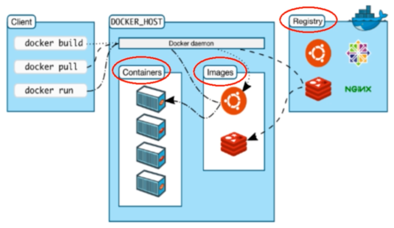

Docker 平台架构进阶版
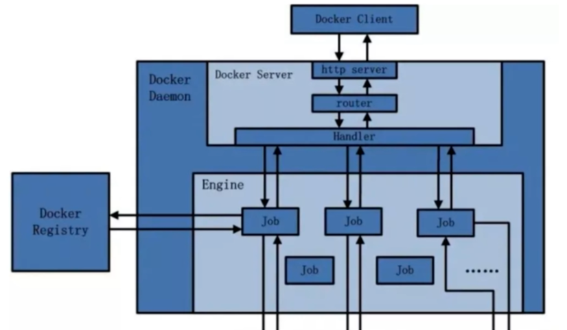
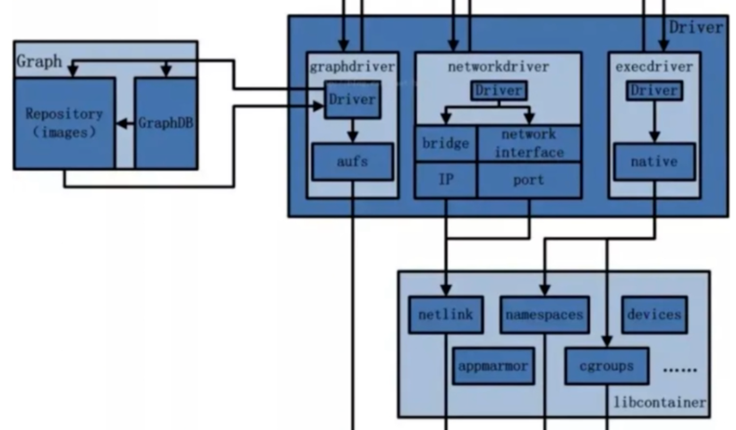


### docker run 命令干了什么
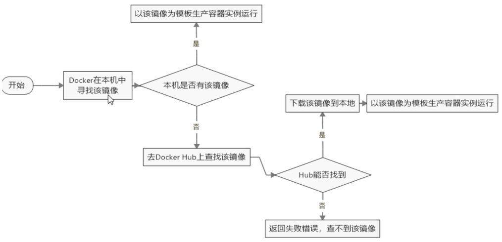

## Docker 的安装
### 参考 Docker 官网
官方网址：https://docs.docker.com/engine/install/centos/
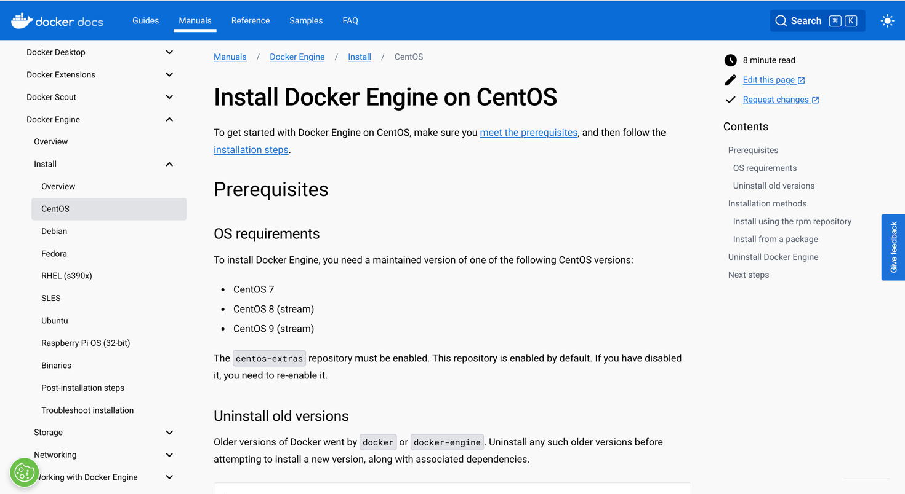  

注意点：按官网下图中的配置由于在国外会访问卡顿，建议切换至国内的备份节点。
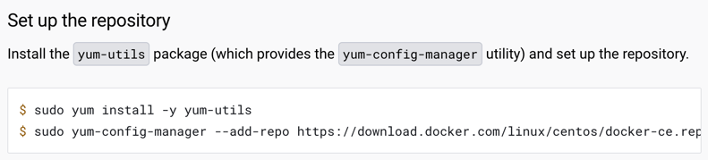

### Docker 镜像加速
阿里云官方网址：https://cr.console.aliyun.com/cn-hangzhou/instances/mirrors
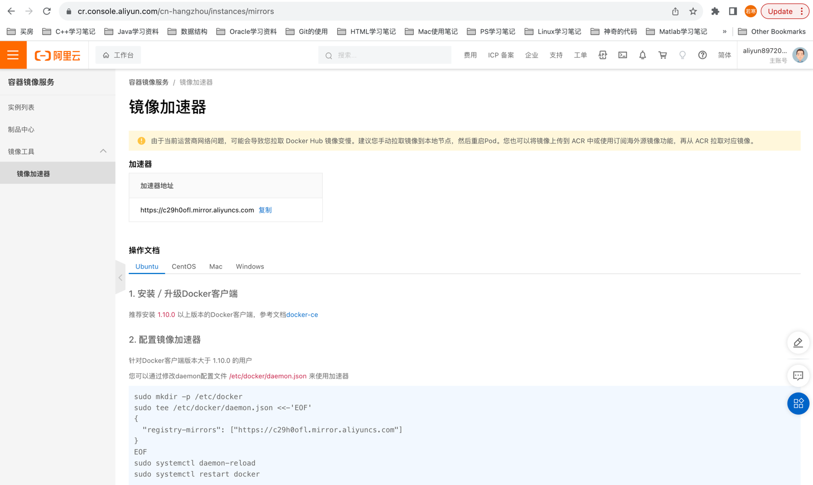

### 测试安装
#### docker version
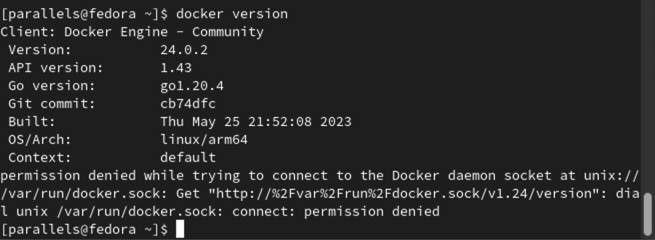

#### sudo docker run hello-world
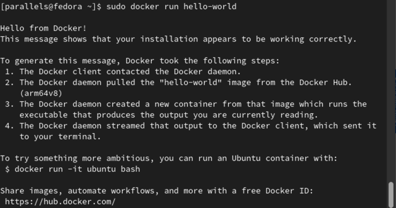

## Docker 常用命令
### 帮助类启动命令
启动 docker: systemctl start docker
停止 docker: systemctl stop docker
重启 docker: systemctl restart docker
查看docker状态：systemctl status docker
开机启动：systemctl enable docker
查看 docker 概要信息： docker info
查看 docker 总体帮助文档：docker -help
查看 docker 命令帮助文档：docker 具体命令--help

### 镜像命令
查看本地镜像：docker images
按某个xxx镜像名字搜索：docker search
按某个xxx名字拉取镜像：docker pull
查看镜像/容器/数据卷所占的空间：docker system df
按某个xxx镜像名宇ID删除：docker rmi
>面试题：谈谈docker虛悬镜像是什么？

### 容器命令
#### 如何快速地寻求命令帮助
```
docker xxx --help
```
xxx为或有，如有可寻求具体命令的帮助。

运行docker --help后的结果：
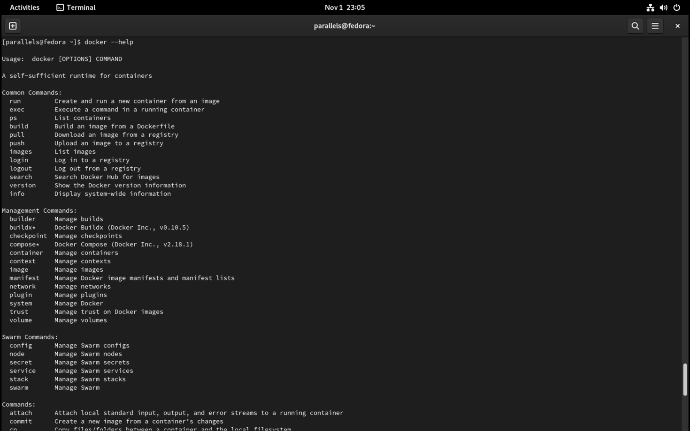

运行docker xxx --help后的结果：
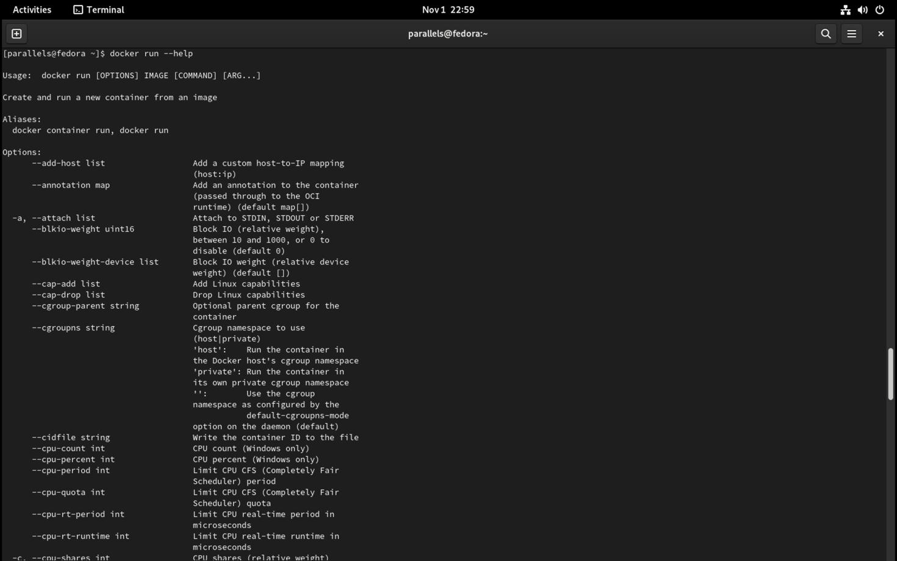

#### 新建+启动容器命令
```
docker run [OPTIONS] IMAGE [COMMAND] [ARG...]
```
OPTIONS说明（常用）：有些是一个减号，有些是两个减号
--name="容器新名字" 为容器指定一个名称；

-d：后台运行容器并返回容器ID，也即启动守护式容器（后台运行）；  
-i：以交互模式运行容器，通常与-t同时使用；  
-t：为容器重新分配一个伪输入终端，通常与-i同时使用； 

也即启动交互式容器（前台有伪终端，等待交互）；  
-P：随机端口映射，大写P  
-p：指定端口映射，小写p

**下载ubuntu实测：**


**启动ubuntu实测**  
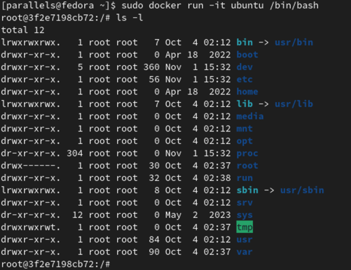
参数说明：  
-i：交互式操作。  
-t：终端。  
centos：centos 镜像。  
/bin/bash：放在镜像名后的是命令，这里我们希望有个交互式 Shell，因此用的是/bin/bash。
要退出终端，直接输入 exit。

**使用镜像 ubuntu:latest 以后台模式启动一个容器**
```
docker run -d ubuntu  
```
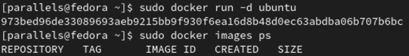
<font color = 'red'>问题：然后docker ps -a 进行查看，会发现容器已经退出</font>  
原因：Docker容器后台运行，就必须有一个前台进程。容器运行的命令如果不是那些一直挂起的命令（比如运行top，tail），就是会自动退出的，这个是docker的机制问题。
>比如你的web容器，我们以 nginx 为例，正常情况下，我们配置启动服务只需要启动响应的 service 即可。例如 service nginx start 。但是这样做，nginx 为后台进程模式运行，就导致 docker 前台没有运行的应用，会立即自杀因为他觉得他没事可做了。所以最佳的解决方案是，将你要运行的程序以前台进程的形式运行，常见就是命令行模式，表示还有交互操作别中断。  

ps：实测 redis 可以后台启动
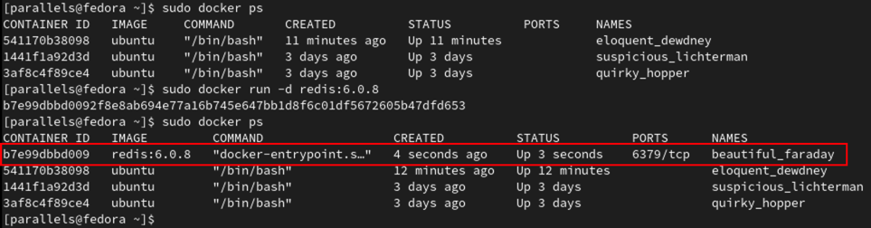

#### 列出当前容器命令
```
docker ps [OPTIONS]
```

OPTIONS说明（常用）：
-a：列出当前所有正在运行的容器+历史上运行过的。 
-l：显示最近创建的容器。
-n：显示最近n个创建的容器。
-q：静默模式，只显示容器编号。

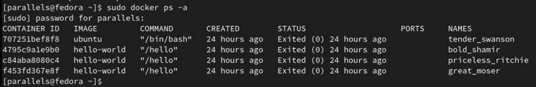

#### 退出容器
- 方式1：run进去容器，exit 退出，容器停止
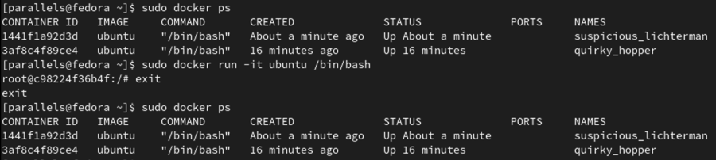
- 方式2：run进去容器，ctrl + p + q退出，容器不停止
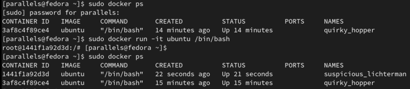

#### 重新进入容器
- 方式1：docker exec -it 容器id，会开启新终端，exit 时容器不会退出 
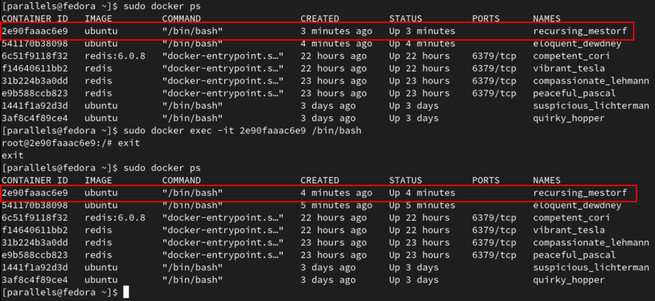
- 方式2：attach attach 容器id，不会开启新终端，exit 时容器会退出
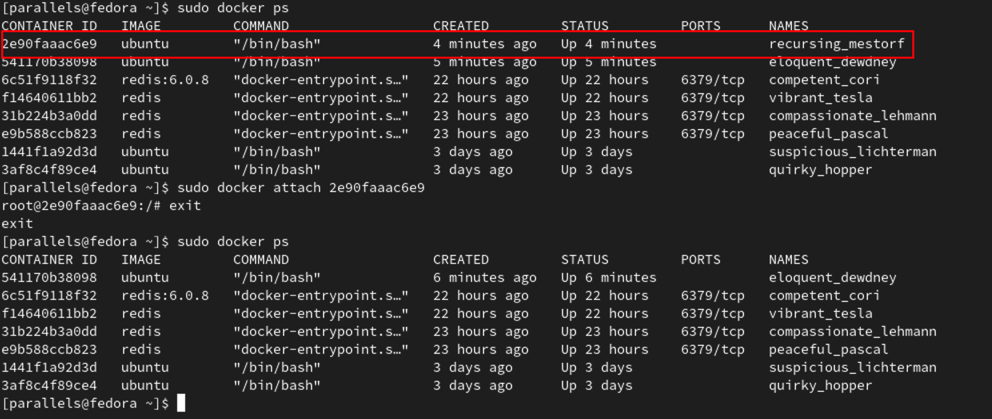

#### 重启容器  
docker restart 容器ID或者容器名  

#### 停止容器  
docker stop 容器ID或者容器名  

#### 强制停止容器  
```
docker kill 容器ID或容器名  
```

#### 删除已停止的容器
- rm 命令，删除正在运行的容器会报错
- rm + stop 命令，可正常删除
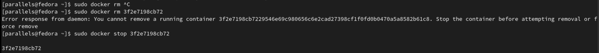

#### 一次性删除多个容器实例（禁止使用）
- 方式1：docker rm -f $(docker ps -a -q)
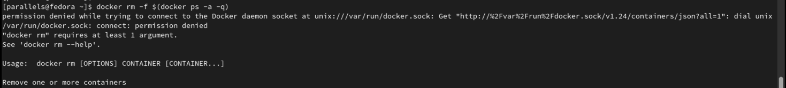

- 方式2：docker ps -a -q | xargs docker rm
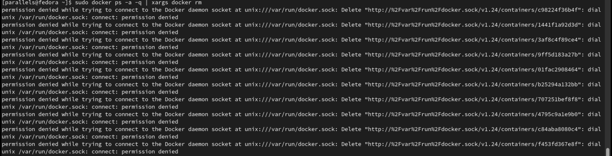
    > 实际上试了下，两种方式都会报权限不足

#### 查看容器日志
```
docker log 容器id
```
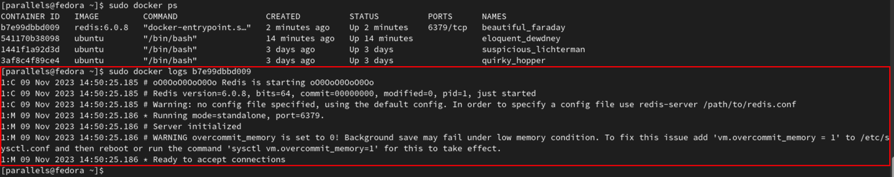

#### 查看容器进程
```
docker top 容器id
```
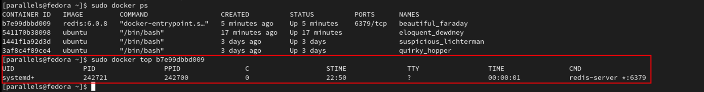

#### 查看容器内部细节
``` 
docker inspect 容器id
```
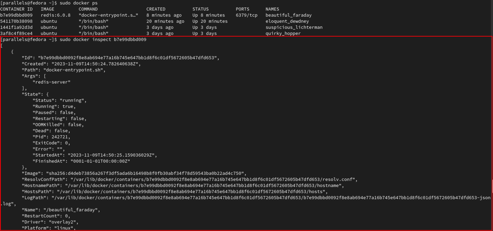

#### cp命令
```
docker cp 容器id:容器内路径 目的主机路径
```
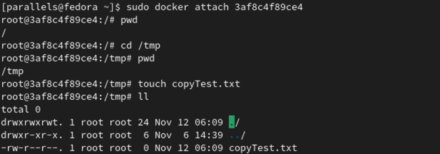
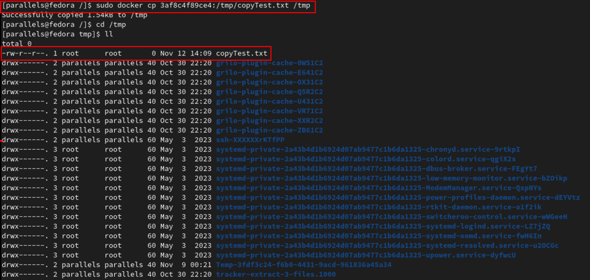

#### export命令
```
步骤一：docker export 容器id > 目的主机路径/文件名.tar
步骤二：cat 本地主机路径/文件名.tar | docker import - 镜像用户/镜像名:镜像版本号
```
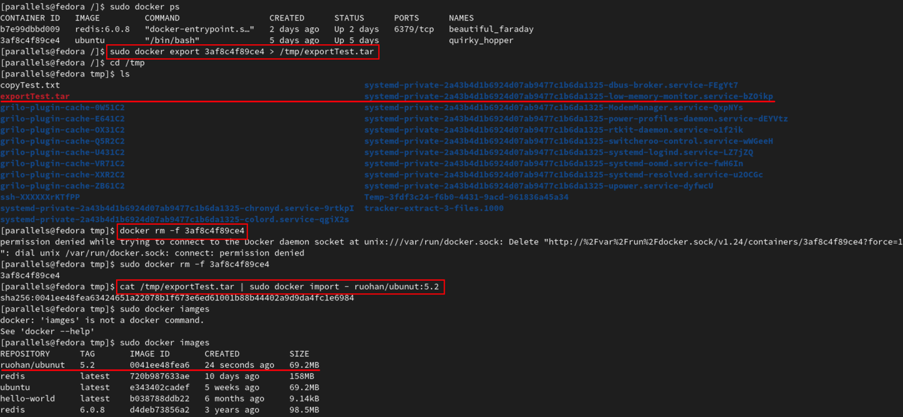

### Docker 镜像的分层概念
#### UnionFS概念  
Docker的镜像实际上由一层一层的文件系统组成，这种层级的文件系统称为 UnionFS。  
**bootfs（boot file system）**：主要包含 bootloader 和 kernel， bootloader主要是引导加载 kernel，Linux 刚启动时会加载 bootfs 文件系统，在 Docker 镜像的最底层是引导文件系统 bootfs。这一层与我们典型的 Linux / Unix 系统是一样的，包含 boot 加载器和内核。当 boot 加载完成之后整个内核就都在内存中了，此时内存的使用权已由 bootfs 转交给内核，此时系统也会卸载 bootfs。  
**rootfs（root file system）**：在 bootfs 之上包含的就是典型 Linux 系统中的 /dev，/proc，/bin，/etc 等标准目录和文件。rootfs 就是各种不同的操作系统发行版，比如 Ubuntu，Centos 等等。


#### Docker 镜像分层原理
Docker 中的镜像分层，支持通过扩展现有镜像，创建新的镜像。类似 Java 继承于一个 Base 基础类，自己再按需扩展新镜像是从 base 镜像一层一层叠加生成的。每安装一个软件，就在现有镜像的基础上增加一层。
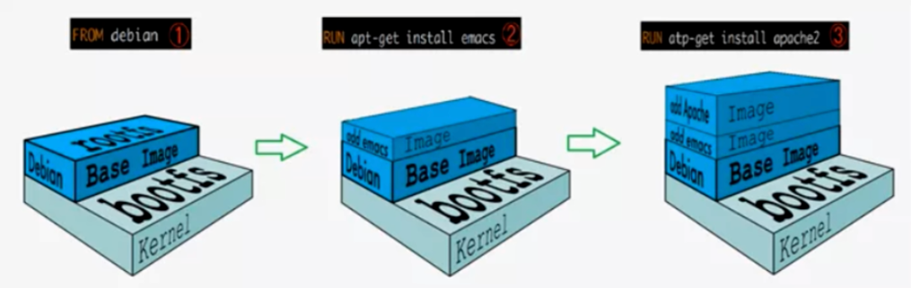

<font color = 'red'>Docker 镜像层都是只读的，容器层是可写的。</font>当容器启动时，一个新的可写层被加载到镜像的顶部。
这一层通常被称作"容器层"，"容器层"之下的都叫"镜像层"。


#### Docker 镜像分层加载的好处
镜像分层最大的一个好处就是共享资源，方便复制迁移，就是为了复用。
比如说有多个镜像都从相同的 base 镜像构建而来，那么 Docker Host 只需在磁盘上保存一份 base 镜像；
同时内存中也只需加载一份 base 镜像，就可以为所有容器服务了。而且镜像的每一层都可以被共享。

#### Docker 镜像 ubuntu 安装 vim 再打包镜像案例
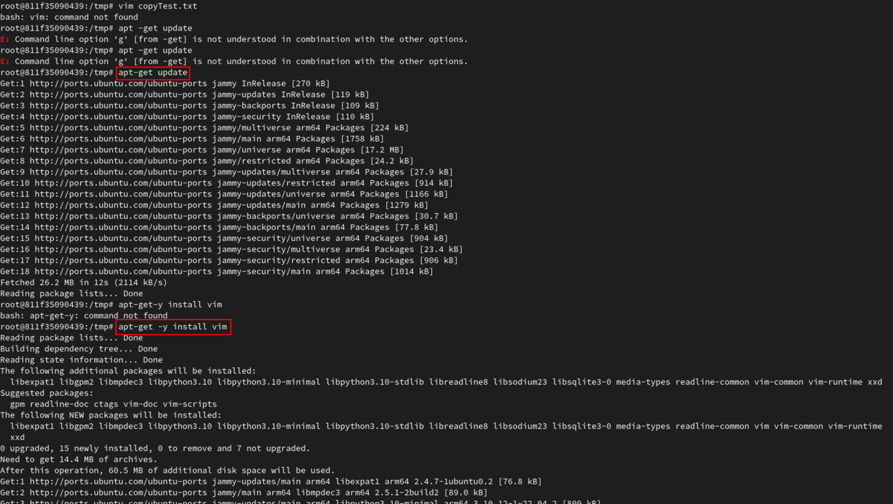
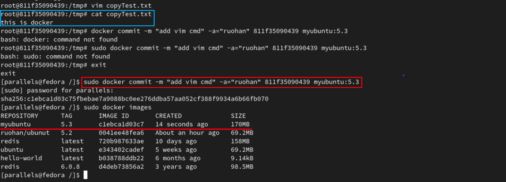

## Docker 仓库操作
### 公网仓库
以阿里云仓库为例
#### 阿里云官方参考
官方网址：https://cr.console.aliyun.com/repository/cn-hangzhou/docker_ruohan/myubuntu/details  

参考步骤（由阿里云官网提供）：
1. 登录阿里云Docker Registry
   $ docker login --username=aliyun8972045200 registry.cn-hangzhou.aliyuncs.com
   用于登录的用户名为阿里云账号全名，密码为开通服务时设置的密码。
2. 从Registry中拉取镜像
   $ docker pull registry.cn-hangzhou.aliyuncs.com/docker_ruohan/myubuntu:[镜像版本号]
3. 将镜像推送到Registry
   $ docker login --username=aliyun8972045200 registry.cn-hangzhou.aliyuncs.com
   $ docker tag [ImageId] registry.cn-hangzhou.aliyuncs.com/docker_ruohan/myubuntu:[镜像版本号]
   $ docker push registry.cn-hangzhou.aliyuncs.com/docker_ruohan/myubuntu:[镜像版本号]
   请根据实际镜像信息替换示例中的[ImageId]和[镜像版本号]参数。

#### 实际操作
- 登录阿里云，push 本地镜像到仓库
```
[parallels@fedora /]$ sudo docker login --username=aliyun8972045200 registry.cn-hangzhou.aliyuncs.com
[sudo] password for parallels: 
Password: 
WARNING! Your password will be stored unencrypted in /root/.docker/config.json.
Configure a credential helper to remove this warning. See
https://docs.docker.com/engine/reference/commandline/login/#credentials-store

[parallels@fedora /]$ sudo docker images
REPOSITORY      TAG       IMAGE ID       CREATED             SIZE
myubuntu        5.3       c1ebca1d03c7   14 seconds ago      170MB
ruohan/ubunut   5.2       0041ee48fea6   About an hour ago   69.2MB
redis           latest    720b987633ae   10 days ago         158MB
ubuntu          latest    e343402cadef   5 weeks ago         69.2MB
hello-world     latest    b038788ddb22   6 months ago        9.14kB
redis           6.0.8     d4deb73856a2   3 years ago         98.5MB

[parallels@fedora /]$ sudo docker push registry.cn-hangzhou.aliyuncs.com/docker_ruohan/myubuntu:5.3
The push refers to repository [registry.cn-hangzhou.aliyuncs.com/docker_ruohan/myubuntu]
0b762ce269dc: Pushed 
2fdf3ee1d6db: Pushed 
5.3: digest: sha256:fc4e6f11455d438fd66b82b60a656d0474e20a0128b229d2c60691a42e097fc3 size: 741
```

- 删除本地镜像
```
[parallels@fedora /]$ sudo docker rmi -f c1ebca1d03c7
Untagged: myubuntu:5.3
Untagged: registry.cn-hangzhou.aliyuncs.com/docker_ruohan/myubuntu:5.3
Untagged: registry.cn-hangzhou.aliyuncs.com/docker_ruohan/myubuntu@sha256:fc4e6f11455d438fd66b82b60a656d0474e20a0128b229d2c60691a42e097fc3
Deleted: sha256:c1ebca1d03c75fbebae7a9088bc0ee276ddba57aa052cf388f9934a6b66fb070
Deleted: sha256:b9084b55cb6c8dcd2ea434ed5407a26c3cda2ea2557d9ee114140e224f4d5d5e

[parallels@fedora /]$ sudo docker images
REPOSITORY      TAG       IMAGE ID       CREATED        SIZE
ruohan/ubunut   5.2       0041ee48fea6   33 hours ago   69.2MB
redis           latest    720b987633ae   11 days ago    158MB
ubuntu          latest    e343402cadef   5 weeks ago    69.2MB
hello-world     latest    b038788ddb22   6 months ago   9.14kB
redis           6.0.8     d4deb73856a2   3 years ago    98.5MB
```

- 拉取远端镜像
```
[parallels@fedora /]$ sudo docker pull registry.cn-hangzhou.aliyuncs.com/docker_ruohan/myubuntu:5.3
5.3: Pulling from docker_ruohan/myubuntu
34802cd1c5b6: Already exists 
cabe602f099a: Pull complete 
Digest: sha256:fc4e6f11455d438fd66b82b60a656d0474e20a0128b229d2c60691a42e097fc3
Status: Downloaded newer image for registry.cn-hangzhou.aliyuncs.com/docker_ruohan/myubuntu:5.3
registry.cn-hangzhou.aliyuncs.com/docker_ruohan/myubuntu:5.3
```

### 搭建本地私有仓库
- 下载 Docker Registry


- 运行私有 Registry，相当于当地有个 Docker Hub 


1) 下载镜像Docker Registry  
```
[parallels@fedora /]$ sudo docker pull registry
Using default tag: latest
latest: Pulling from library/registry
579b34f0a95b: Pull complete 
e74bf0db6f91: Pull complete 
8c44f09e009f: Pull complete 
a7bb2b8c8a10: Pull complete 
ea51f02beeb1: Pull complete 
Digest: sha256:8a60daaa55ab0df4607c4d8625b96b97b06fd2e6ca8528275472963c4ae8afa0
Status: Downloaded newer image for registry:latest
docker.io/library/registry:latest
```
2) 运行私有库Registry，相当于本地有个私有Docker hub  
```
[parallels@fedora /]$ sudo docker run -d -p 5000:5000 -v /ruohan/myregistry/:/tmp/registry --privileged=true registry
68df2163d1df7f1287198e7fad49df011baca7e1d052924af1f671d598435c49
```

3) 案例演示创建一个新镜像，ubuntu安装ifconfig命令  
- 更新 apt-get
```
root@a4ddd4739e7d:/# apt-get update
Get:1 http://ports.ubuntu.com/ubuntu-ports jammy InRelease [270 kB]
Get:2 http://ports.ubuntu.com/ubuntu-ports jammy-updates InRelease [119 kB]
Get:3 http://ports.ubuntu.com/ubuntu-ports jammy-backports InRelease [109 kB]
Get:4 http://ports.ubuntu.com/ubuntu-ports jammy-security InRelease [110 kB]
Get:5 http://ports.ubuntu.com/ubuntu-ports jammy/main arm64 Packages [1758 kB]                                                                                                      
Get:6 http://ports.ubuntu.com/ubuntu-ports jammy/multiverse arm64 Packages [224 kB]                                                                                                 
Get:7 http://ports.ubuntu.com/ubuntu-ports jammy/universe arm64 Packages [17.2 MB]                                                                                                  
Get:8 http://ports.ubuntu.com/ubuntu-ports jammy/restricted arm64 Packages [24.2 kB]                                                                                                
Get:9 http://ports.ubuntu.com/ubuntu-ports jammy-updates/main arm64 Packages [1287 kB]                                                                                              
Get:10 http://ports.ubuntu.com/ubuntu-ports jammy-updates/multiverse arm64 Packages [27.9 kB]                                                                                       
Get:11 http://ports.ubuntu.com/ubuntu-ports jammy-updates/restricted arm64 Packages [928 kB]                                                                                        
Get:12 http://ports.ubuntu.com/ubuntu-ports jammy-updates/universe arm64 Packages [1175 kB]                                                                                         
Get:13 http://ports.ubuntu.com/ubuntu-ports jammy-backports/universe arm64 Packages [30.7 kB]                                                                                       
Get:14 http://ports.ubuntu.com/ubuntu-ports jammy-backports/main arm64 Packages [77.8 kB]                                                                                           
Get:15 http://ports.ubuntu.com/ubuntu-ports jammy-security/multiverse arm64 Packages [23.4 kB]                                                                                      
Get:16 http://ports.ubuntu.com/ubuntu-ports jammy-security/universe arm64 Packages [913 kB]                                                                                         
Get:17 http://ports.ubuntu.com/ubuntu-ports jammy-security/main arm64 Packages [1023 kB]                                                                                            
Get:18 http://ports.ubuntu.com/ubuntu-ports jammy-security/restricted arm64 Packages [920 kB]                                                                                       
Fetched 26.2 MB in 1min 5s (404 kB/s)                                                                                                                                               
Reading package lists... Done
```

- 安装 net-tools
``` 
root@a4ddd4739e7d:/# apt-get install net-tools
Reading package lists... Done
Building dependency tree... Done
Reading state information... Done
The following NEW packages will be installed:
  net-tools
0 upgraded, 1 newly installed, 0 to remove and 11 not upgraded.
Need to get 207 kB of archives.
After this operation, 774 kB of additional disk space will be used.
Get:1 http://ports.ubuntu.com/ubuntu-ports jammy/main arm64 net-tools arm64 1.60+git20181103.0eebece-1ubuntu5 [207 kB]
Fetched 207 kB in 7s (30.9 kB/s)                                                                                                                                                    
debconf: delaying package configuration, since apt-utils is not installed
Selecting previously unselected package net-tools.
(Reading database ... 4389 files and directories currently installed.)
Preparing to unpack .../net-tools_1.60+git20181103.0eebece-1ubuntu5_arm64.deb ...
Unpacking net-tools (1.60+git20181103.0eebece-1ubuntu5) ...
Setting up net-tools (1.60+git20181103.0eebece-1ubuntu5) ...
```

- 运行 ifconfig
``` 
root@a4ddd4739e7d:/# ifconfig
eth0: flags=4163<UP,BROADCAST,RUNNING,MULTICAST>  mtu 1500
        inet 172.17.0.5  netmask 255.255.0.0  broadcast 172.17.255.255
        ether 02:42:ac:11:00:05  txqueuelen 0  (Ethernet)
        RX packets 19139  bytes 27494413 (27.4 MB)
        RX errors 0  dropped 0  overruns 0  frame 0
        TX packets 3283  bytes 183685 (183.6 KB)
        TX errors 0  dropped 0 overruns 0  carrier 0  collisions 0

lo: flags=73<UP,LOOPBACK,RUNNING>  mtu 65536
        inet 127.0.0.1  netmask 255.0.0.0
        loop  txqueuelen 1000  (Local Loopback)
        RX packets 0  bytes 0 (0.0 B)
        RX errors 0  dropped 0  overruns 0  frame 0
        TX packets 0  bytes 0 (0.0 B)
        TX errors 0  dropped 0 overruns 0  carrier 0  collisions 0

```
- commit 添加了 ifconfig 命令的镜像
```
[parallels@fedora /]$ sudo docker ps
[sudo] password for parallels: 
CONTAINER ID   IMAGE          COMMAND                  CREATED          STATUS          PORTS                                       NAMES
a4ddd4739e7d   0041ee48fea6   "/bin/bash"              12 minutes ago   Up 12 minutes                                               relaxed_wozniak
68df2163d1df   registry       "/entrypoint.sh /etc…"   2 days ago       Up 2 days       0.0.0.0:5000->5000/tcp, :::5000->5000/tcp   intelligent_bartik
811f35090439   0041ee48fea6   "/bin/bash"              4 days ago       Up 4 days                                                   adoring_euler
b7e99dbbd009   redis:6.0.8    "docker-entrypoint.s…"   7 days ago       Up 7 days       6379/tcp                                    beautiful_faraday
[parallels@fedora /]$ sudo docker commit -m "add ifconfig command" -a="ruohan" a4ddd4739e7d myubuntu:5.2.1
sha256:0ea7afde4c27aadc76fd9c77c6c2594c271a7f8a6f08c1c86437d35f3fb416f9
[parallels@fedora /]$ sudo docker images
REPOSITORY                                                 TAG       IMAGE ID       CREATED              SIZE
myubuntu                                                   5.2.1     0ea7afde4c27   About a minute ago   113MB
registry.cn-hangzhou.aliyuncs.com/docker_ruohan/myubuntu   5.3       c1ebca1d03c7   4 days ago           170MB
```

4) curl验证私服库上有什么镜像
```
[parallels@fedora /]$ curl -XGET http://127.0.0.1:5000/v2/_catalog
{"repositories":[]}
[parallels@fedora /]$ sudo docker images
REPOSITORY                                                 TAG       IMAGE ID       CREATED        SIZE
127.0.0.1:5000/myubuntu                                    5.2.1     0ea7afde4c27   2 days ago     113MB
myubuntu                                                   5.2.1     0ea7afde4c27   2 days ago     113MB
registry.cn-hangzhou.aliyuncs.com/docker_ruohan/myubuntu   5.3       c1ebca1d03c7   6 days ago     170MB
```

5) 将新镜像myubuntu:5.2.1修改符合私服规范的Tag
```
[parallels@fedora /]$ sudo docker tag myubuntu:5.2.1 127.0.0.1:5000/myubuntu:5.2.1
```

6) 修改配置文件使之支持 http  
- 修改配置文件并重启 Docker  
   在 /etc/docker/daemon.json 文件中添加 "insecure-registries": ["127.0.0.1:5000"]  
   >注意 daemon.json 是一个json文件，添加键值对时，上一行的末尾需要加<font color = 'red'>","</font>。
```
[parallels@fedora /]$ sudo nano /etc/docker/daemon.json
[sudo] password for parallels: 
[parallels@fedora /]$ vi /etc/docker/daemon.json
[parallels@fedora /]$ sudo systemctl restart docker
```

- 查看 Docker 运行状态
```
[parallels@fedora /]$ sudo systemctl status docker
● docker.service - Docker Application Container Engine
     Loaded: loaded (/usr/lib/systemd/system/docker.service; disabled; vendor preset: disabled)
     Active: active (running) since Sun 2023-11-19 14:53:59 CST; 17s ago
TriggeredBy: ● docker.socket
       Docs: https://docs.docker.com
   Main PID: 377744 (dockerd)
      Tasks: 9
     Memory: 63.7M
        CPU: 188ms
     CGroup: /system.slice/docker.service
             └─ 377744 /usr/bin/dockerd -H fd:// --containerd=/run/containerd/containerd.sock

Nov 19 14:53:58 fedora dockerd[377744]: time="2023-11-19T14:53:58.995505987+08:00" level=info msg="Firewalld: docker zone already exists, returning"
Nov 19 14:53:59 fedora dockerd[377744]: time="2023-11-19T14:53:59.161297248+08:00" level=info msg="Firewalld: interface docker0 already part of docker zone, returning"
Nov 19 14:53:59 fedora dockerd[377744]: time="2023-11-19T14:53:59.170665986+08:00" level=info msg="Firewalld: interface docker0 already part of docker zone, returning"
Nov 19 14:53:59 fedora dockerd[377744]: time="2023-11-19T14:53:59.298859089+08:00" level=info msg="Default bridge (docker0) is assigned with an IP address 172.17.0.0/16. Daemon opt>
Nov 19 14:53:59 fedora dockerd[377744]: time="2023-11-19T14:53:59.373073693+08:00" level=info msg="Firewalld: interface docker0 already part of docker zone, returning"
Nov 19 14:53:59 fedora dockerd[377744]: time="2023-11-19T14:53:59.414271070+08:00" level=info msg="Loading containers: done."
Nov 19 14:53:59 fedora dockerd[377744]: time="2023-11-19T14:53:59.468112653+08:00" level=info msg="Docker daemon" commit=659604f graphdriver=overlay2 version=24.0.2
Nov 19 14:53:59 fedora dockerd[377744]: time="2023-11-19T14:53:59.468240945+08:00" level=info msg="Daemon has completed initialization"
Nov 19 14:53:59 fedora systemd[1]: Started docker.service - Docker Application Container Engine.
Nov 19 14:53:59 fedora dockerd[377744]: time="2023-11-19T14:53:59.488632924+08:00" level=info msg="API listen on /run/docker.sock"


```

7) push 推送到私服库
- 运行私服库
```
[parallels@fedora /]$ sudo docker run -d -p 5000:5000 -v /ruohan/myregistry/:/tmp/registry --privileged=true registry
d38255b24e34809c54bc67c58a51a02c1af5cf6ddb7adb9bd701c148799c6dbb
[parallels@fedora /]$ sudo docker ps
CONTAINER ID   IMAGE      COMMAND                  CREATED          STATUS          PORTS                                       NAMES
d38255b24e34   registry   "/entrypoint.sh /etc…"   14 seconds ago   Up 12 seconds   0.0.0.0:5000->5000/tcp, :::5000->5000/tcp   hungry_swirles
```

- 推送镜像
```
[parallels@fedora /]$ sudo docker push 127.0.0.1:5000/myubuntu:5.2.1
The push refers to repository [127.0.0.1:5000/myubuntu]
5901bdf1d801: Pushed 
2fdf3ee1d6db: Pushed 
5.2.1: digest: sha256:09ddb45962886a6b71d4b10787ff0644c1cf55dc325811fc69725b1eecc074d3 size: 741
```

8) curl验证私服库上有什么镜像
```
[parallels@fedora /]$ curl -XGET http://127.0.0.1:5000/v2/_catalog
{"repositories":["myubuntu"]}
```


9) pull到本地并运行
- 删除本地 myubuntu:5.2.1 相关镜像，以防干扰
```
[parallels@fedora /]$ sudo docker images
REPOSITORY                                                 TAG       IMAGE ID       CREATED        SIZE
127.0.0.1:5000/myubuntu                                    5.2.1     0ea7afde4c27   2 days ago     113MB
myubuntu                                                   5.2.1     0ea7afde4c27   2 days ago     113MB
registry.cn-hangzhou.aliyuncs.com/docker_ruohan/myubuntu   5.3       c1ebca1d03c7   6 days ago     170MB
[parallels@fedora /]$ sudo docker rmi -f 0ea7afde4c27
Untagged: 127.0.0.1:5000/myubuntu:5.2.1
Untagged: 127.0.0.1:5000/myubuntu@sha256:09ddb45962886a6b71d4b10787ff0644c1cf55dc325811fc69725b1eecc074d3
Untagged: myubuntu:5.2.1
Deleted: sha256:0ea7afde4c27aadc76fd9c77c6c2594c271a7f8a6f08c1c86437d35f3fb416f9
Deleted: sha256:74aba3bd834cd35b0ee2d6d1da5b55491124510791ef3ce04364625877f9ee53
[parallels@fedora /]$ sudo docker images
REPOSITORY                                                 TAG       IMAGE ID       CREATED        SIZE
registry.cn-hangzhou.aliyuncs.com/docker_ruohan/myubuntu   5.3       c1ebca1d03c7   6 days ago     170MB
```

- 拉取远端镜像
```
[parallels@fedora /]$ sudo docker pull 127.0.0.1:5000/myubuntu:5.2.1
5.2.1: Pulling from myubuntu
34802cd1c5b6: Already exists 
e8547d11e69d: Pull complete 
Digest: sha256:09ddb45962886a6b71d4b10787ff0644c1cf55dc325811fc69725b1eecc074d3
Status: Downloaded newer image for 127.0.0.1:5000/myubuntu:5.2.1
127.0.0.1:5000/myubuntu:5.2.1
[parallels@fedora /]$ sudo docker images
REPOSITORY                                                 TAG       IMAGE ID       CREATED        SIZE
127.0.0.1:5000/myubuntu                                    5.2.1     0ea7afde4c27   2 days ago     113MB
registry.cn-hangzhou.aliyuncs.com/docker_ruohan/myubuntu   5.3       c1ebca1d03c7   6 days ago     170MB
```

- 运行从远端拉取的镜像
```
[parallels@fedora /]$ sudo docker run -it 0ea7afde4c27 /bin/bash
root@8ac0e356840b:/# ifconfig
eth0: flags=4163<UP,BROADCAST,RUNNING,MULTICAST>  mtu 1500
        inet 172.17.0.3  netmask 255.255.0.0  broadcast 172.17.255.255
        ether 02:42:ac:11:00:03  txqueuelen 0  (Ethernet)
        RX packets 17  bytes 2107 (2.1 KB)
        RX errors 0  dropped 0  overruns 0  frame 0
        TX packets 0  bytes 0 (0.0 B)
        TX errors 0  dropped 0 overruns 0  carrier 0  collisions 0

lo: flags=73<UP,LOOPBACK,RUNNING>  mtu 65536
        inet 127.0.0.1  netmask 255.0.0.0
        loop  txqueuelen 1000  (Local Loopback)
        RX packets 0  bytes 0 (0.0 B)
        RX errors 0  dropped 0  overruns 0  frame 0
        TX packets 0  bytes 0 (0.0 B)
        TX errors 0  dropped 0 overruns 0  carrier 0  collisions 0
```

## Docker 容器数据卷
【容器出现坑的地方】Docker 挂载主机目录访问如果出现 cannot open directory.：Permission denied  
解决办法：在挂载目录后多加一个--privileged=true参数即可

容器数据卷的作用：**完成数据的持久化**，映射容器内数据备份到本地主机目录。它完全独立于容器的生存周期，因此Docker不会在容器删除时删除其挂我的数据卷。

命令模版：
```
docker run -it --privileged=true -v /宿主机绝对路径目录：/容器内目录镜像名
```

上文中的 docker run -d -p 5000:5000 -v /ruohan/myregistry/:/tmp/registry --privileged=true registry 即是使用该命令模版。

容器卷的特点：  
1) 数据卷可在容器之间共享或重用数据  
2) 卷中的更改可以直接实时生效  
3) 数据卷中的更改不会包含在镜像的更新中  
4) 数据卷的生命周期一直持续到没有容器使用它为止  

### 案例测试1：文件共享
- 建立主机到 Docker 的映射
```
[parallels@fedora /]$ sudo docker run -it --privileged=true -v /tmp/host_data:/tmp/docker_data --name=u1 ubuntu
root@95f4510866f5:/# pwd
/
root@95f4510866f5:/# cd /tmp/docker_data/
root@95f4510866f5:/tmp/docker_data# ls
```
此时在 Docker 中的 /tmp/docker_data/ 目录下的文件夹为空

- 在 Docker 中的 /tmp/docker_data/ 目录下创建 dockerin.txt 文件
```
root@95f4510866f5:/tmp/docker_data# touch dockerin.txt
root@95f4510866f5:/tmp/docker_data# ls
dockerin.txt
```
此时在主机中的 /tmp/host_data/ 目录下可以看到该文件
```
[parallels@fedora /]$ cd /tmp/host_data/
[parallels@fedora host_data]$ ls
dockerin.txt
```
同理，在主机中创建 hostin.txt 文件，在 Docker 中可以共享看到。
> Docker 容器停止，在主机中创建共享文件，在 Docker 容器重新启动后依旧可以看到。

### 检查挂载情况
检查命令
```
[parallels@fedora host_data]$ sudo docker inspect 容器id
```

实测命令
```
[parallels@fedora host_data]$ sudo docker ps
CONTAINER ID   IMAGE          COMMAND                  CREATED          STATUS          PORTS                                       NAMES
95f4510866f5   ubuntu         "/bin/bash"              10 minutes ago   Up 10 minutes                                               u1
8ac0e356840b   0ea7afde4c27   "/bin/bash"              2 days ago       Up 2 days                                                   hopeful_booth
d38255b24e34   registry       "/entrypoint.sh /etc…"   2 days ago       Up 2 days       0.0.0.0:5000->5000/tcp, :::5000->5000/tcp   hungry_swirles
[parallels@fedora host_data]$ sudo docker inspect 95f4510866f5

```

实测结果
```json
[
  //...
  
  {
    "Mounts": [
      {
        "Type": "bind",
        "Source": "/tmp/host_data",
        "Destination": "/tmp/docker_data",
        "Mode": "",
        "RW": true,
        "Propagation": "rprivate"
      }
    ]
  }
  
  //...
]

```


### 案例测试2：只读权限控制
- 创建只读映射
    ```
    [parallels@fedora host_data]$ suddocker run -it --privileged=true -v /mydocker/u:/tmp/u:ro --name u2 ubuntu
    ```

- 在主机创建文件，在 Docker 中可以同步看到  

  - 主机
  ```
  [parallels@fedora u]$ sudo touch a.txt
  [parallels@fedora u]$ ls
  a.txt
  ```
  - 命令
  ```
  root@2351f0701e06:/# cd tmp/u/
  root@2351f0701e06:/tmp/u# ls
  a.txt
  ```

- 在 Docker 创建文件会报失败
    ```
    root@2351f0701e06:/tmp/u# touch c.txt 
    touch: cannot touch 'c.txt': Read-only file system
    ```

### 案例测试3：容器卷之间的继承
- 容器 u1 下的共享目录
    ```
    [parallels@fedora host_data]$ sudo docker ps
    CONTAINER ID   IMAGE          COMMAND                  CREATED      STATUS      PORTS                                       NAMES
    95f4510866f5   ubuntu         "/bin/bash"              2 days ago   Up 2 days                                               u1
    [parallels@fedora host_data]$ sudo docker exec -it 95f4510866f5 /bin/bash
    root@95f4510866f5:/# cd /tmp/docker_data/
    root@95f4510866f5:/tmp/docker_data# ls
    dockerin.txt  hostin.txt 
    root@95f4510866f5:/tmp/docker_data# 
    ```

- 容器 u2 继承容器 u1 的共享目录
    ```
    [parallels@fedora u]$ sudo docker run -it --privileged=true --volumes-from=u1 --name=u2 ubuntu
    root@c5ec9b9b9d64:/# cd tmp/docker_data/
    root@c5ec9b9b9d64:/tmp/docker_data# ls
    dockerin.txt  hostin.txt
    ```
- 在容器 u2 中新建 u2.txt
    ```
    root@c5ec9b9b9d64:/tmp/docker_data# touch u2.txt
    root@c5ec9b9b9d64:/tmp/docker_data# 
    ```
- 在容器 u1 中可以看到
    ```
    root@95f4510866f5:/# cd /tmp/docker_data/
    root@95f4510866f5:/tmp/docker_data# ls
    dockerin.txt  hostin.txt  u2.txt
    ```
  > Note：u1 容器停止运行，u2 修改或新建了文本，u1 重启了仍可以共享过程文件