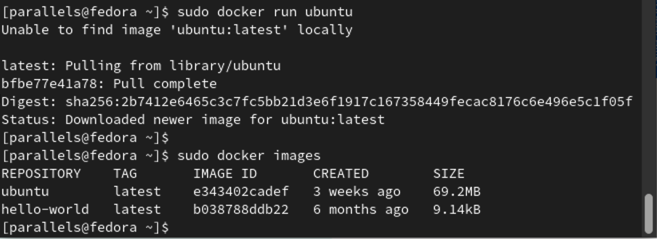

## 为什么会出现 Docker
- 传统上，软件编码开发/测试结束后，所产出的成果即是程序或是能够编译执行的二进制字节码等。而为了让这些程序可以顺利执行，开发团队也得准备完整的部署文件，让维运团队得以部署应用程序，开发需要清楚的告诉运维部署团队，用的全部配置文件＋所有软件环境。不过即便如此，仍然常常发生部署失败的情况。
- Docker的出现使得Docker得以打破过去「程序即应用」的观念。通过过镜像(images)，将运作应用程式所需要的系统环境，由下而上打包，达到应用程式跨平台间的无缝接轨运作。

### 传统虚拟机与 Docker 容器对比
传统虚拟机：是`带环境安装`的一套解决方案，如 Win10 上安装 centOS ，资源占用多、冗余步骤多、启动慢。  
Docker容器：是在操作系统层面上实现虚拟化，直接复用本地主机的操作系統。与传统的虚拟机相比，Docker 优势体现为启动速度快、占用体积小。


VM 与 Docker 的直观对比图：


### Docker 为什么比虚拟机快
1) Docker 有着比虚拟机更少的抽象层  
由于 Docker 不需要 Hypervisor(管理程序) 实现硬件资源虚拟化，运行在 Docker 容器上的程序直接使用的都是实际物理机的硬件资源。因此在CPU、内存利用率上 Docker 将会在效率上有明显优势。  
2) Docker 利用的是宿主机的内核,而不需要加载操作系统 OS 内核  
当新建一个容器时，Docker 不需要和虚拟机一样重新加载一个操作系统内核。进而避免引寻、加载操作系统内核返回等比较费时费资源的过程，当新建一个虚拟机时，虚拟机软件需要加载 OS，返回新建过程是分钟级别的。而 Docker 由于直接利用宿主机的操作系统，则省略了返回过程，因此新建一个 Docker 容器只需要几秒钟。

虚拟机与 Docker 架构对比图


虚拟机与 Docker 性能对比


## Docker 能做什么
- 更快速的应用交付和部署
>传统的应用开发完成后，需要提供一堆安装程序和配置说明文档，安装部署后需根据配置文档进行繁杂的配置才能正常运行。 Docker 化之后只需要交付少量容器镜像文件，在正式生产环境加载镜像并运行即可，应用安装配置在镜像里己经内置好，大大节省部署配置和测试验证时间。

- 更便捷的升级和扩缩容
>随着微服务架构和 Docker 的发展，大量的应用会通过微服务方式架构，应用的开发构建将变成搭乐高积木一样，每个Docker容器水变成一块“积木”，应用的升级将变得非常容易。当现有的容器不足以支撑业务处理时，可通过镜像运行新的容器进行快速扩容，使应用系统的扩容从原先的天级变成分钟级甚至秒级。

- 更简单的系统运维
>应用容器化运行后，生产环境运行的应用可与开发、测试环境的应用高度一致，容器会将应用程序相关的环境和状态完全封装起来，不会因为底层基础架构和操作系统的不一致性给应用带来影响，产生新的BUG。当出现程序异常时，也可以通过测试环境的相同容器进行快速定位和修复。

- 更高效的计算资源利用
> Docker 是内核级虛拟化，其不像传统的虚拟化技术一样需要额外的管理程序支持，所以在一台物理机上可以运行很多个容器实例，可大大提升物理服务器的 CPU 和内存的利用率。
 
## Docker 的应用场景

Docker 借鉴了标准集装箱的概念。标准集装箱将货物运往世界各地，Docker 将这个模型运用到自己的设计中，唯一不同的是：集装箱运输货物，而 Docker 运输软件。

## Docker 官网及运行条件
Docker 官网：https://www.docker.com/  
Docker Hub 官网：https://hub.docker.com/  

Docker 必须部署在Linux内核的系统上。在 Window 系统上部署 Docker 的方法是先安装一个 Linux 虚拟机，在虚拟机中运行 Docker。  
> 目前，Centos 仅发行版本中的内核支持 Docker 。 Docker 运行在 Centos 7(64-bit) 上，要求系统为64位、Linux 系统内核版本为3.8以上。

uname命令可用于打印当前系统相关信息（内核版本号、硬件架构、主机名称和操作系统类型等）。
```
[ root@zzyy ~]# cat /etc/redhat- release
CentOS Linux release 7.4. 1708 ( Core)
[ root@Zzy¥ ~]#
[ root@zzyy ~]# uname - r
3. 10. 0- 693. el7. X86_64
[ root@zzyy ~]#
```

## Docker 三要素
- 镜像（image）
- 容器（container）
- 仓库（repository）

Docker 平台架构简易版


Docker 平台架构进阶版


### docker run 命令干了什么


## Docker 的安装
### 参考 Docker 官网
官方网址：https://docs.docker.com/engine/install/centos/
  

注意点：按官网下图中的配置由于在国外会访问卡顿，建议切换至国内的备份节点。


### Docker 镜像加速
阿里云官方网址：https://cr.console.aliyun.com/cn-hangzhou/instances/mirrors


### 测试安装
#### docker version


#### sudo docker run hello-world


## Docker 常用命令
### 帮助类启动命令
启动 docker: systemctl start docker
停止 docker: systemctl stop docker
重启 docker: systemctl restart docker
查看docker状态：systemctl status docker
开机启动：systemctl enable docker
查看 docker 概要信息： docker info
查看 docker 总体帮助文档：docker -help
查看 docker 命令帮助文档：docker 具体命令--help

### 镜像命令
查看本地镜像：docker images
按某个xxx镜像名字搜索：docker search
按某个xxx名字拉取镜像：docker pull
查看镜像/容器/数据卷所占的空间：docker system df
按某个xxx镜像名宇ID删除：docker rmi
>面试题：谈谈docker虛悬镜像是什么？

### 容器命令
#### 如何快速地寻求命令帮助
```
docker xxx --help
```
xxx为或有，如有可寻求具体命令的帮助。

运行docker --help后的结果：


运行docker xxx --help后的结果：


#### 新建+启动容器命令
```
docker run [OPTIONS] IMAGE [COMMAND] [ARG...]
```
OPTIONS说明（常用）：有些是一个减号，有些是两个减号
--name="容器新名字" 为容器指定一个名称；

-d：后台运行容器并返回容器ID，也即启动守护式容器（后台运行）；  
-i：以交互模式运行容器，通常与-t同时使用；  
-t：为容器重新分配一个伪输入终端，通常与-i同时使用； 

也即启动交互式容器（前台有伪终端，等待交互）；  
-P：随机端口映射，大写P  
-p：指定端口映射，小写p

**下载ubuntu实测：**


**启动ubuntu实测**

参数说明：  
-i：交互式操作。  
-t：终端。  
centos：centos 镜像。  
/bin/bash：放在镜像名后的是命令，这里我们希望有个交互式 Shell，因此用的是/bin/bash。
要退出终端，直接输入 exit：

#### 列出当前容器命令
```
docker ps [OPTIONS]
```

OPTIONS说明（常用）：
-a：列出当前所有正在运行的容器+历史上运行过的
-l：显示最近创建的容器。
-n：显示最近n个创建的容器。
-q：静默模式，只显示容器编号。

