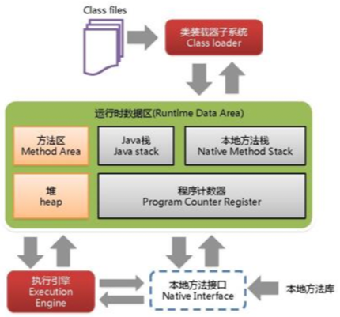

###JVM体系结构

JVM发生在<strong>heap堆区</strong>

###GC是什么（分代收集算法）
次数上频繁收集young区 Minor GC
次数上较少手机old区 Full GC
基本不动Perm区

###GC算法
1) 引用计数法（已被JVM淘汰）
   > 缺点：较难处理循环引用问题
2) 复制算法 Copying（年轻代使用的minorGC，采用的该算法）
   > 优点：不会产生内存碎片
   > 缺点：需要双倍空间  
3) 标记清除算法 Mark-Sweep（发生在老年代，一般由标记清除，或标记清除与标记整理混合实现）
   > 优点：不需要额外空间
   > 缺点：两次扫描耗时严重，会产生内存碎片   
4) 标记压缩 Mark- Compact（发生在老年代）
   > 优点：没有内存碎片
   > 缺点：需要移动对象的成本  

注：**3和4经常结合一起使用**，即标记-压缩-整理（Mark-Sweep-Compact）：多次进行标记删除后，会产生大量内存碎片，再使用标记压缩进行内存整理

