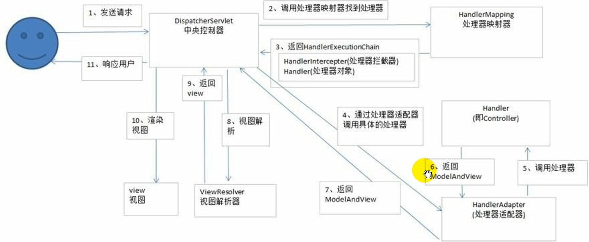

###Spring作用域之间的区别
可以通过scope属性来指定bean的作用域
- singleton：默认值。当IOC容器一创建就会创建bean的实例，而且是单例的，每次得到的都是同一个。
- prototype：原型的。当IOC容器一创建不再实例化该bean，每次调用getBean方法时再实例化该bean，而且每调一次创建一个对象。
- request：每次请求实例化一个bean。
- session：在一个会话中共享一个bean。

###Spring支持的常用数据库传播属性和事务隔离级别
事务的传播行为可以由传播属性指定。Spring定义了7种类传播行为。
 
|  传播属性   | 描述  |
|  ----  | ----  |
| REQUIRED  | 如果有事务在运行，当前的方法就在这个事务内运行，否则，就启动一个新的事务，并在自己的事务内运行 |
| REQUIRES_NEW  | 当前的方法必须启动新事务，并在它自己的事务内运行，如果有事务正在运行，应该将它挂起 |
| SUPPORTS | 如果有事务在运行，当前的方法就在这个事务内运行，否则它可以不运行在事务中
| NOT_SUPPORTED | 当前的方法不应该运行在事务中，如果有运行的事务，将它挂起
| MANDATORY | 当前的方法应该运行在事务内部，如果没有正在运行的事务，就抛出异常
| NEVER | 当前的方法不应该运行在事务中，如果有运行的事务，就抛出异常
| NESTED | 如果有事务在运行，当前的方法就应该在这个事务的嵌套事务内运行。否则，就启动一个新的事务，并在它自己的事务内运行
事务传播属性可以在@Transactional注解的propagation属性中定义。

各事务隔离级别解决并发问题的能力：

|  隔离级别   | 脏读  | 不可重复度 | 幻读 |
|  ----  | ----  | ---- | ---- |
| READ UNCOMMITTED  | 有 | 有 | 有 |
| READ COMMITTED  | 无 | 有 | 有 |
| REPEATABLE READ | 无 | 无 | 有 |
| SERIALIZABLE | 无 | 无 | 无 |

各种数据库产品对事务隔离级别的支持程度：

|  隔离级别   | Oracle  | MySQL |
|  ----  | ----  | ---- |
| READ UNCOMMITTED  | x | √ |
| READ COMMITTED  | √（默认） | √ | 
| REPEATABLE READ | x | √（默认） | 
| SERIALIZABLE | √ | √ | 
事务隔离级别可以在@Transactional注解的ioslation属性中定义。

###SpringMVC的工作流程

