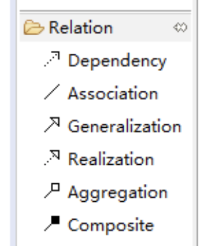

UML图示：
- 普通箭头线：依赖
- 三角形箭头线：继承
- 空心菱形箭头线：聚合
- 实心菱形箭头线：组合

###PlantUML: 
- Dependency(use-a): <..
- Association: -- or "N"<-->"N"
  - singleAssociation: -->"N" or "1"-->"N
- Generalization(is-a): <|--
- Realization: <|..
- Aggregation(has-a): o--
- Composite: *--

  

类之间默认采用两个破折号 -- 显示出垂直 方向的线. 要得到水平方向的可以像这样使用单破折号 (或者点):  
>@startuml  
教室 o- 学生  
教室 *-- 椅子  
@enduml  

你也可以通过改变倒置链接来改变方向
>@startuml  
学生 -o 教室
椅子 --* 教室
@enduml

