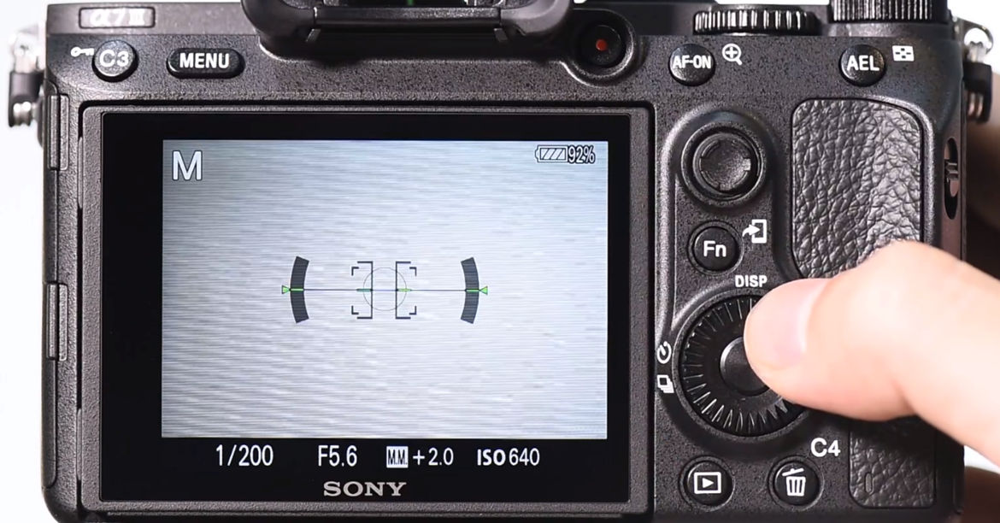
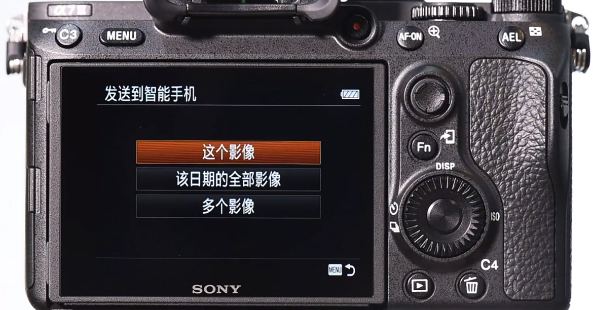

###相机按键
#### 【 DISP 键】
拍照模式（每按一下，切换一种操作界面）

照片模式
  

#### 【 Fn 键】
对于下图中两种图标的（如 Fn ），代表其在拍照模式和照片模式各有用途

拍照模式

照片模式

###相机档位
- A：光圈优先，适合拍摄人物/风景，突出主题
- S：快门优先，适合拍摄运动
  

光圈如果出现闪烁，代表调整的速度过快，只需减缓速度让光圈和快门匹配即可
