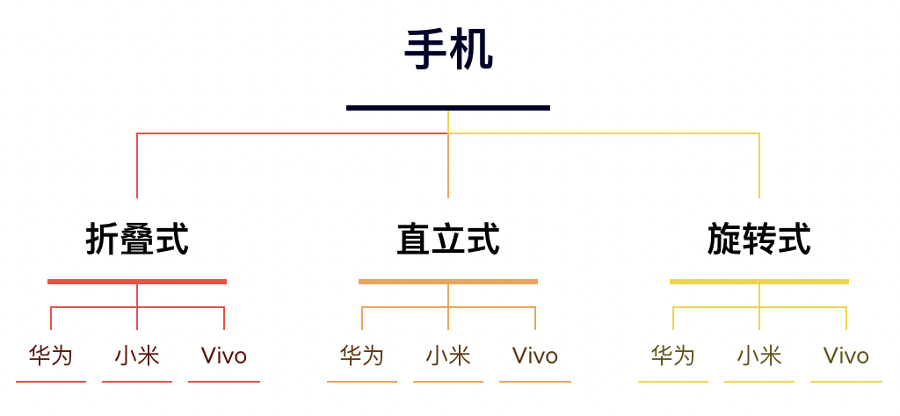
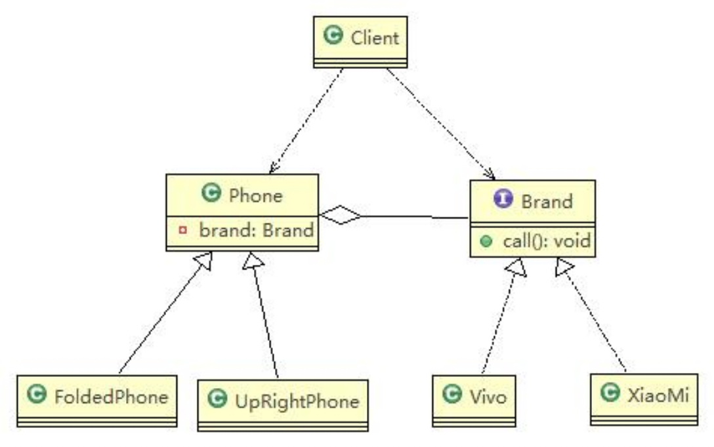

现有需求：对不同手机品牌及款式实现操作编程（比如开机、关机、上网等）


###传统方式解决

- `扩展性问题（类爆炸）`，如果我们再增加手机的样式（如翻盖手机），就需要增加各个品牌手机的类；同样如果我们增加 一个手机品牌，也要在各个手机样式类下增加。 
- `违反了单一职责原则`，当我们增加手机样式时，要同时增加所有品牌的手机，这样增加了代码维护成本。

###桥接模式解决

#####抽象手机类，聚合品牌接口
```java
public abstract class Phone {
   private Brand brand; //品牌

   public Phone(Brand brand) {
      super();
      this.brand = brand;
   }

   public void open() {
      this.brand.open();
   }

   public void close() {
      brand.close();
   }

   public void call() {
      brand.call();
   }
}
```

#####品牌接口
```java
public interface Brand {
   void open();
   void close();
   void call();
}
```

#####手机继承子类，这里折叠屏为例

```java
public class FoldedPhone extends Phone {
   public FoldedPhone(Brand brand) {
      super(brand);
   }

   public void open() {
      super.open();
      System.out.println(" 折叠样式手机 ");
   }

   public void close() {
      super.close();
      System.out.println(" 折叠样式手机 ");
   }

   public void call() {
      super.call();
      System.out.println(" 折叠样式手机 ");
   }
}
```

#####品牌实现子类，这里以小米为例
```java
public class XiaoMi implements Brand {
   @Override
   public void open() {
      System.out.println(" 小米手机开机 ");
   }

   @Override
   public void close() {
      System.out.println(" 小米手机关机 ");
   }

   @Override
   public void call() {
      System.out.println(" 小米手机打电话 ");
   }
}
```

#####客户端服务类
```java
public class Client {
   public static void main(String[] args) {
      //获取折叠式手机 (样式 + 品牌)
      Phone phone1 = new FoldedPhone(new XiaoMi());
      phone1.open();
      phone1.call();
      phone1.close();

      System.out.println("=======================");
      Phone phone2 = new FoldedPhone(new Vivo());
      phone2.open();
      phone2.call();
      phone2.close();
   }
}
```

###案例总结：
- 桥接模式替代多层继承方案，可以`减少子类的个数`。实现了`抽象和实现部分的分离`，这有助于系统进行分层设计，从而产生更好的结构化系统。
- 桥接模式要求正确识别出系统中两个独立变化的维度（抽象和实现），因此其使用范围有一定的局限性，即需要有这样的应用场景。

###jdbc中桥接模式样例
Jdbc 的 Driver 接口，如果从桥接模式来看，Driver 就是一个接口，下面可以有 MySQL 的 Driver，Oracle 的 Driver，这些就可以当做实现接口类：

其相对于上文中提到的桥接模式，客户端直接调用了 DriverManager类。省去了继承 DriverManager 的环节（类似于上文中的FoldedPhone继承Phone）。
note：这个是不是也可以看作适配器模式？？？

###常见的应用场景: 
1) JDBC 驱动程序 
2) 银行转账系统 
   1) 转账分类: 网上转账，柜台转账，AMT 转账 
   2) 转账用户类型：普通用户，银卡用户，金卡用户
3) 消息管理
   1) 消息类型：即时消息，延时消息 
   2) 消息分类：手机短信，邮件消息，QQ 消息