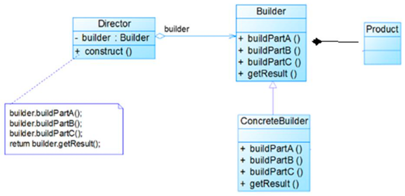
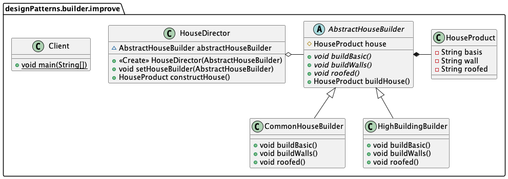

需求：
1) 建一所房子，建造的过程分为打桩、砌墙、封顶。
2) 房子有各种各样的，比如普通房子、高楼、别墅，各种房子的建造过程虽然一样，但是规格、要求不同.

###传统设计方案
  
优点：程序简单，易于实现  
缺点：将产品（即房子）和创建产品的过程（即建房子流程）封装在一起，程序的扩展和维护不好

###建造者模式

####建造者模式（又名生成器模式）的四个角色：
>- Product（产品角色）：一个具体的产品对象。
>- Builder（抽象建造者）：创建一个Product对象的各个部件的抽象接口。
>- ConcreteBuilder（具体建造者）：构建和装备各个部件的具体实现。
>- Director（指挥者）： 它主要是用于创建一个复杂的对象（一个使用Builder接口构建的对象）。其有两个作用，一是：隔离了客户与对象的生产过程，二是：负责控制产品对象的生产过程。

###使用建造者模式解决房屋建设问题

####抽象建造者
```java
public abstract class AbstractHouseBuilder {
    protected HouseProduct house = new HouseProduct();

    //抽象建造方法
    public abstract void buildBasic();
    public abstract void buildWalls();
    public abstract void roofed();

    //返回建造好的房子
    public HouseProduct buildHouse() {
        return house;
    }
}
```

####具体建造者
```java
public class CommonHouseBuilder extends AbstractHouseBuilder {
    @Override
    public void buildBasic() {
        System.out.println(" 普通房子打地基5米 ");
    }

    @Override
    public void buildWalls() {
        System.out.println(" 普通房子砌墙10cm ");
    }

    @Override
    public void roofed() {
        System.out.println(" 普通房子屋顶 ");
    }
}
```

####指挥者
```java
public class HouseDirector {
    AbstractHouseBuilder abstractHouseBuilder;

    //构造器传入 houseBuilder
    public HouseDirector(AbstractHouseBuilder abstractHouseBuilder) {
        this.abstractHouseBuilder = abstractHouseBuilder;
    }

    //通过 setter 传入 houseBuilder
    public void setHouseBuilder(AbstractHouseBuilder abstractHouseBuilder) {
        this.abstractHouseBuilder = abstractHouseBuilder;
    }

    //如何处理建造房子的流程，交给指挥者
    public HouseProduct constructHouse() {
        abstractHouseBuilder.buildBasic();
        abstractHouseBuilder.buildWalls();
        abstractHouseBuilder.roofed();
        return abstractHouseBuilder.buildHouse();
    }
}
```

####建造产品
```java
@Data
public class HouseProduct {
    private String basis;
    private String wall;
    private String roofed;
}
```

#####客户端服务类
```java
public class Client {
    public static void main(String[] args) {
        //盖普通房子
        CommonHouseBuilder commonHouse = new CommonHouseBuilder();
        HouseDirector houseDirector = new HouseDirector(commonHouse);
        HouseProduct house = houseDirector.constructHouse();

        System.out.println("-------------------------");

        //盖高楼
        HighBuildingBuilder highBuildingBuilder = new HighBuildingBuilder();
        houseDirector.setHouseBuilder(highBuildingBuilder);
        houseDirector.constructHouse();
    }
}
```

###StringBuilder源码角色分析：
- 抽象建造者：Appendable 
- 介于抽象建造者与具体建造者之间：AbstractStringBuilder
  >- 从它不能被实例化，仍是符合抽象建造者特性
  >- 从它实现了Appendable里的append方法，已经开始具备具体建造者的特性
- 介于具体建造者与指挥者之间：StringBuilder
  >- 它继承了AbstractStringBuilder：append方法具体实现过程已在AbstractStringBuilder实现。符合具体建造者的特性
  >- 它决定了产品的生产过程，符合指挥者的特性
  
（产生此种差异的原因：可能是StringBuilder早期版本编写时，还没有建造者模式的概念，因此部分设计存在差异）

总结：
- 使用建造者模式，客户端/使用者不必知道产品内部组成的细节，将产品本身与产品的创建过程解耦，使得相同的创建过程可以创建不同的产品对象（符合开闭原则）。
- 使用建造者模式，所创建的产品一般具有较多的共同点，其组成部分相似，`如果产品之间的差异性很大，则不适合使用建造者模式`，因此其使用范围受到一定的限制。

######注：原例中使用房屋的建造作为样例，私以为使用电脑的组装更为直观清晰。因为房屋的建造，指挥者打地基、砌墙、加盖屋顶动作顺序比较固定，而使用电脑的组装能更好地表现出建造者模式指挥者的作用。
