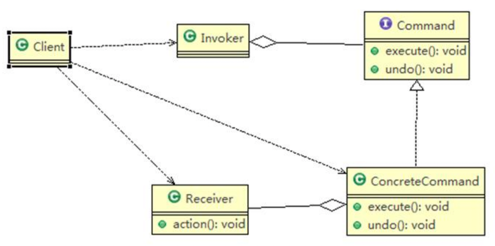
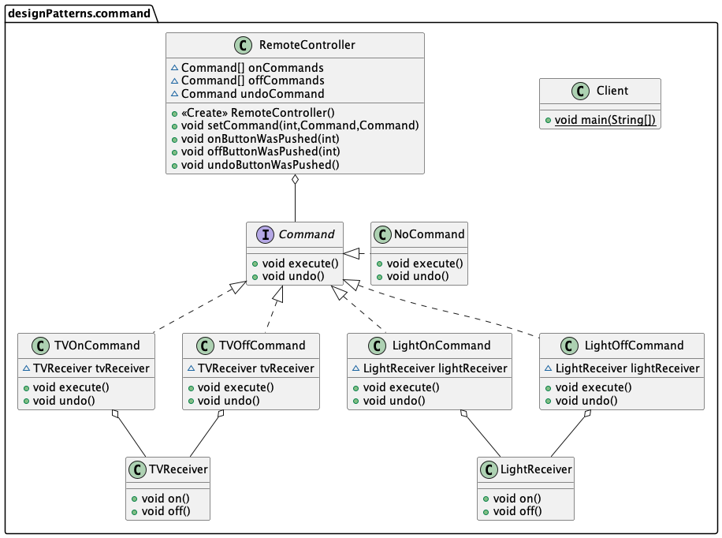
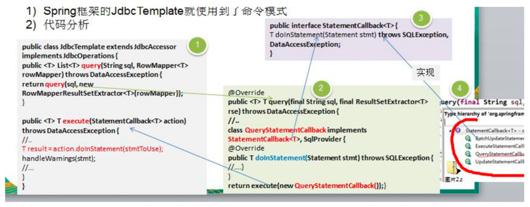
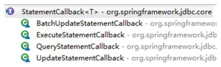

###命令模式
####命令模式原理图

1) Invoker: 调用者角色
2) Command: 命令角色，需要执行的所有命令都在这里，可以是接口或抽象类
3) Receiver: 接受者角色，知道如何实施和执行一个请求相关的操作
4) ConcreteCommand: 将一个接受者对象与一个动作绑定，调用接受者相应的操作，实现 execute

###需求实现举例

需求：我们买了一套智能家电，有照明灯、风扇、冰箱、洗衣机。这些智能家电来自不同的厂家，我们不想针对每一种家电都安装一个 App，分别控制，我们希望只要一个 app 就可以控制全部智能家电。
> 分析：要实现一个 app 控制所有智能家电的需要，则每个智能家电厂家都要提供一个统一的接口给 app 调用，这时就可以考虑使用命令模式。
> 1) 命令模式可将“动作的请求者”从“动作的执行者”对象中解耦出来。
> 2) 在我们的例子中，动作的请求者是手机 app，动作的执行者是每个厂商的一个家电产品。

命令模式（Command Pattern）：在软件设计中，我们经常需要向某些对象发送请求，但是并不知道请求的接收者是谁，也不知道被请求的操作是哪个， 我们只需在程序运行时指定具体的请求接收者即可。此时，可以使用命令模式来进行设计。

####App实现对家电控制UML图

#####命令接口
```java
public interface Command {
    public void execute();
    public void undo();
}
```

#####命令实现子类
```java
public class LightOnCommand implements Command {
    //聚合LightReceiver
    LightReceiver lightReceiver;

    @Override
    public void execute() {
        //调用接收者的方法
        lightReceiver.on();
    }

    @Override
    public void undo() {
        //调用接收者的方法
        lightReceiver.off();
    }
}
```

#####空命令类
```java
public class NoCommand implements Command {
    @Override
    public void execute() {
    }

    @Override
    public void undo() {
    }
}
```

#####命令接受者
```java
public class LightReceiver {
    public void on() {
        System.out.println(" 电灯打开了.. ");
    }

    public void off() {
        System.out.println(" 电灯关闭了.. ");
    }
}
```

#####命令调用者
```java
public class RemoteController {
    public class RemoteController {
        Command[] onCommands; // 开按钮的命令数组
        Command[] offCommands; // 关按钮的命令数组
        Command undoCommand; // 执行撤销的命令

        // 构造器，完成对遥控器按钮初始化（假设有五个按钮）
        public RemoteController() {
            onCommands = new Command[5];
            offCommands = new Command[5];

            for (int i = 0; i < 5; i++) {
                onCommands[i] = new NoCommand();
                offCommands[i] = new NoCommand();
            }
        }

        // 给我们的按钮设置你需要的命令
        public void setCommand(int no, Command onCommand, Command offCommand) {
            onCommands[no] = onCommand;
            offCommands[no] = offCommand;
        }

        public void onButtonWasPushed(int no) { 
            onCommands[no].execute();
            undoCommand = onCommands[no];
        }

        public void offButtonWasPushed(int no) { 
            offCommands[no].execute();
            undoCommand = offCommands[no];
        }

        public void undoButtonWasPushed() {
            undoCommand.undo();
        }
    }
}
```

#####客户端服务类
```java
public class Client {
    public static void main(String[] args) {
        //需要一个遥控器
        RemoteController remoteController = new RemoteController();

        System.out.println("=========使用遥控器操作电灯==========");
        LightReceiver lightReceiver = new LightReceiver(); //创建电灯的对象(接受者)
        LightOnCommand lightOnCommand = new LightOnCommand(lightReceiver);
        LightOffCommand lightOffCommand = new LightOffCommand(lightReceiver);

        //给我们的遥控器设置命令, 比如 no = 0 是电灯的开和关的操作
        remoteController.setCommand(0, lightOnCommand, lightOffCommand);
        remoteController.onButtonWasPushed(0);
        remoteController.offButtonWasPushed(0);
        remoteController.undoButtonWasPushed();
    }
}
```

###命令模式在 Spring 框架 JdbcTemplate 应用的源码分析

- 命令接口(Command)：StatementCallback 接口
- 命令实现者/命令接受者：匿名内部类 class QueryStatementCallback implements StatementCallback<T>，SqlProvider，实现了命令接口， 同时也充当命令接收者 
- 命令调用者：JdbcTemplate，其中 execute(StatementCallback<T> action) 方法中，调用 action.doInStatement 方法. 不同的实现 StatementCallback 接口的对象，对应不同的 doInStatemnt 实现逻辑 
- ######其他命令实现者：如下图


###命令模式的注意事项和细节
1) 容易设计一个命令队列。只要把命令对象放到列队，就可以多线程的执行命令 
2) 容易实现对请求的撤销和重做 
3) **命令模式不足：可能导致某些系统有过多的具体命令类**，增加了系统的复杂度，这点在在使用的时候要注意 
4) **空命令也是一种设计模式，它为我们省去了判空的操作**。在上面的实例中，如果没有用空命令，我们每按下一 个按键都要判空，这给我们编码带来一定的麻烦。 
5) 命令模式经典的应用场景：界面的一个按钮都是一条命令、模拟 CMD（DOS 命令）订单的撤销/恢复、触发- 反馈机制