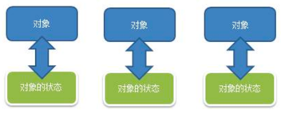
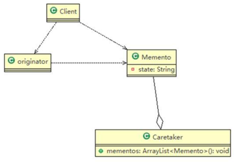
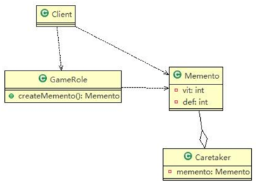

需求：游戏角色有攻击力和防御力，在大战 Boss 前保存自身的状态（攻击力和防御力），当大战 Boss 后攻击力和防御力下降，从备忘录对象恢复到大战前的状态

###传统解决方案


缺点：
1) 一个对象就对应一个保存对象状态的对象，这样当我们游戏的对象很多时，不利于管理、开销也很大.
2) 传统的方式是简单地做备份，new 出另外一个对象出来，再把需要备份的数据放到这个新对象，但这就暴露了对象内部的细节

###备忘录模式

- Originator：需要保存状态的类
- Memento：备忘录类，负责保存好记录（即 Originator 内部状态） 
- Caretaker：守护者类，负责保存多个备忘录对象，可使用集合管理、提高效率  

优点：
1) 给用户提供了一种可以恢复状态的机制，可以使用户能够比较方便地回到某个历史的状态
2) 实现了信息的封装，使得用户不需要关心状态的保存细节

###使用备忘录模式设计游戏角色恢复系统

#####需要保存状态的类
```java
@Getter
@Setter
public class GameRole {
    private int vit;
    private int def;

    //保存 GameRole 状态到 Memento 对象
    public Memento createMemento() {
        return new Memento(vit, def);
    }

    //从 Memento 对象，恢复 GameRole 的状态
    public void recoverGameRoleFromMemento(Memento memento) {
        this.vit = memento.getVit();
        this.def = memento.getDef();
    }

    //显示当前 GameRole 的状态
    public void display() {
        System.out.println("游戏角色当前的攻击力：" + this.vit + " 防御力：" + this.def);
    }
}
```

#####备忘录类
```java
@AllArgsConstructor
@Setter
@Getter
public class Memento {
    private int vit; //攻击力
    private int def; //防御力
}
```

#####守护者类
```java
@Getter
@Setter
public class Caretaker {
    //对单个 GameRole 保存一次状态
    private Memento memento;

    //对单个 GameRole 保存多次状态
    //private ArrayList<Memento> mementos;

    //对多个 GameRole 保存多个状态
    //private HashMap<String, ArrayList<Memento>> rolesMementos;
}
```

#####客户端服务类
```java
public class Client {

    public static void main(String[] args) {
        GameRole gameRole = new GameRole(); //创建游戏角色
        gameRole.setVit(100);
        gameRole.setDef(100);
        System.out.println("和boss大战前状态");
        gameRole.display();

        Caretaker caretaker = new Caretaker();
        caretaker.setMemento(gameRole.createMemento()); //把当前状态保存caretaker

        System.out.println("和boss大战！！！");
        gameRole.setDef(30);
        gameRole.setVit(30);
        gameRole.display();

        System.out.println("和boss大战后，使用备忘录对象恢复到战前");
        gameRole.recoverGameRoleFromMemento(caretaker.getMemento());
        gameRole.display();
    }
}
```

###备忘录模式的注意事项和细节
 
1) 如果类的成员变量过多，势必会占用比较大的资源，而且每一次保存都会消耗一定的内存, 这个需要注意 
2) 为了节约内存，备忘录模式可以和原型模式配合使用

#####适用的应用场景：
1) 后悔药。
2) 打游戏时的存档。 
3) Windows 里的 ctrl + z。 
4) IE 中的后退。 
5) 数据库的事务管理。
