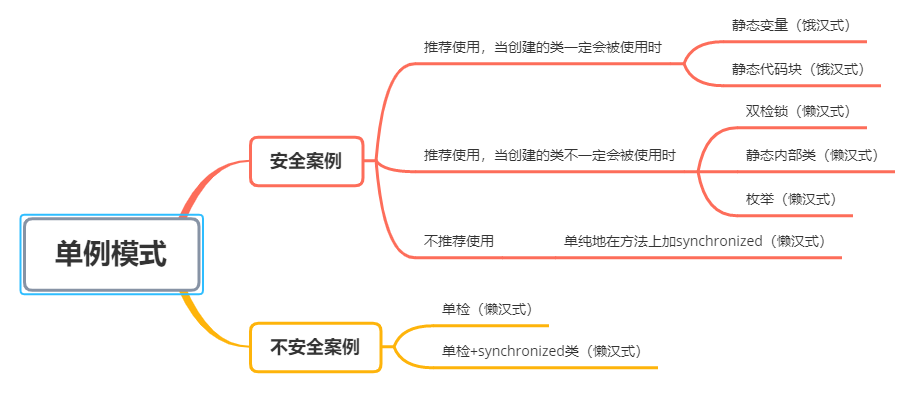

所谓类的单例设计模式， 就是`采取一定的方法保证在整个的软件系统中，对某个类只能存在一个对象实例`，并且该类只提供一个取得其对象实例的方法(静态方法)。构造单例模式的步骤如下：
1) 构造器私有化（防止外部new）。
2) 类的内部创建对象。
3) 向外暴露一个静态的公共方法 getInstance。  

它共有八种实现方式：其中懒汉式两种（静态变量、静态代码块），饿汉式六种（其中三种为不安全或推荐使用的，推荐使用的为：`双检锁`、`静态内部类`和`枚举`）。如下图所示：


这里再简要介绍下，安全案例中比较推荐的几种方式：
###静态变量或静态内部类（饿汉式）
```java
//静态内部类
class Singleton {
    private Singleton() {}
    private final static Singleton instance = new Singleton();

    public static Singleton getInstance() {
        return instance;
    }
}
```
```java
//静态代码块
class Singleton {
    private Singleton() {}
    private static Singleton instance;
    static { 
        instance = new Singleton();
    }
    public static Singleton getInstance() {
        return instance;
    }
}
```
- 优点：写法比较简单，就是在类装载的时候就完成实例化，避免了线程同步问题。
- 缺点：在类装载的时候就完成实例化，没有达到 Lazy Loading 的效果。如果从始至终从未使用过这个实例，则会造成内存的浪费。

###双检锁（懒汉式）
```java
class Singleton {
    private static volatile Singleton instance;
    private Singleton() {}

    public static synchronized Singleton getInstance() {
        if(instance == null) {
            synchronized (Singleton.class) {
                if(instance == null) {
                    instance = new Singleton();
                }
            }
        }
        return instance;
    }
}
```
相比于单纯地在方法上加synchronized：
- 线程安全、延迟加载、效率较高，多线程开发中常使用到。
- 推荐使用。

###静态内部类（懒汉式）
```java
class Singleton {
    private static volatile Singleton instance;
    private Singleton() {}

    private static class SingletonInstance {
        private static final Singleton INSTANCE = new Singleton();
    }

    public static synchronized Singleton getInstance() {
        return SingletonInstance.INSTANCE;
    }
}
```
利用了JVM两个特点：
- 外层类加载不会导致静态内部类加载，保证了懒加载。
- 当加载静态内部类时，才会实例化singleton对象。而在装载类的时候，`JVM底层保证了线程安全性`。
- 推荐使用。

###枚举（懒汉式）
```java
public class SingletonTest08 {
    public static void main(String[] args) {
        Singleton instance = Singleton.INSTANCE;
        Singleton instance2 = Singleton.INSTANCE;
        System.out.println(instance == instance2);
        System.out.println(instance.hashCode());
        System.out.println(instance2.hashCode());
        instance.sayOK();
    }
}
enum Singleton {
    INSTANCE; //属性
    public void sayOK() {
        System.out.println("ok~");
    }
}
```
- 借助JDK1.5中添加的枚举来实现单例模式。不仅能避免多线程同步问题，而且还能`防止反序列化`重新创建新的对象。
- 推荐使用（《Effective java》作者Josh Bloch提倡的方式）。