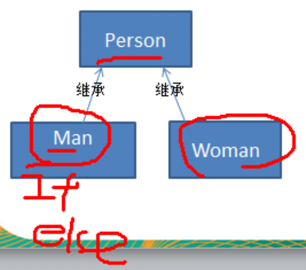
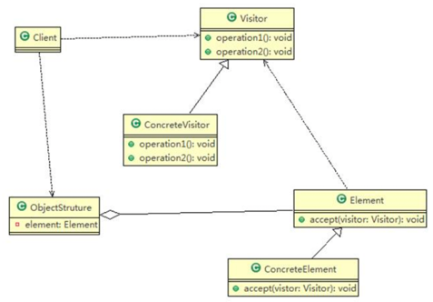

完成测评系统需求： 将观众分为男人和女人，对歌手进行测评，当看完某个歌手表演后，得到他们对该歌手不同的评价（评价有不同的种类，比如成功、失败等）


###传统设计方案
通过Man、Woman继承Person，然后添加if/else判断，给歌手做出评价
  
如果系统比较小，还OK。但当出现下列情况时，对代码改动较大，`违反了 ocp 原则`不利于维护：
1) 系统增加越来越多新的功能（比如增加待定功能）
2) 系统增加了新的人员类型（比如增加老人、小孩）

###访问者模式

1) Visitor：抽象访问者，为该对象结构中的 ConcreteElement 的每一个类声明一个 visit 操作 
2) ConcreteVisitor：具体访问者，实现每个有 Visitor 声明的操作，是每个操作实现的部分
3) ObjectStructure：可以提供一个高层的接口，用来允许访问者访问元素 
4) Element：抽象元素，定义一个 accept 方法，接收一个访问者对象 
5) ConcreteElement：具体元素，实现了 accept 方法

#####抽象访问者
```java
public abstract class Person {
    //提供一个方法，让访问者可以访问
    public abstract void accept(Action action);
}
```

#####具体访问者
```java
//说明
//1. 这里我们使用到了双分派, 即首先在客户端程序中，将具体行为作为参数传递Woman中(第一次分派)
//2. 然后Woman类调用"具体行为"中的方法getWomanResult, 同时将自己(this)作为参数传入(第二次分派)
public class Woman extends Person {
    @Override
    public void accept(Action action) {
        action.getWomanResult(this);
    }
}
```
上面提到了双分派，所谓`双分派是指不管类怎么变化，我们都能找到期望的方法运行`。双分派意味着得到执行的操作取决于请求的种类和两个接收者的类型。 

以上述实例为例，假设我们要添加一个 Wait 的状态类，考察 Man 类和 Woman 类的反应，由于使用了双分派，只需增加一个 Action 子类即可在客户端调用即可，不需要改动任何其他类的代码。

#####抽象元素
```java
public abstract class Action {
    public abstract void getManResult(Man man);
    public abstract void getWomanResult(Woman woman);
}
```

#####具体元素
```java
public class Success extends Action {
    @Override
    public void getManResult(Man man) {
        System.out.println(" 男人给的评价该歌手很成功!");
    }

    @Override
    public void getWomanResult(Woman woman) {
        System.out.println(" 女人给的评价该歌手很成功!");
    }
}
```

#####访问者数据结构
```java
public class ObjectStructure {
    private List<Person> persons = new LinkedList<>();

    //增加到list
    public void attach(Person person) {
        persons.add(person);
    }

    //从List移除
    public void detach(Person person) {
        persons.remove(person);
    }

    //显示测评情况
    public void display(Action action) {
        for (Person person : persons) {
            person.accept(action);
        }
    }
}
```

#####客户端服务类
```java
public class Client {
    public static void main(String[] args) {
        ObjectStructure objectStructure = new ObjectStructure();
        objectStructure.attach(new Man());
        objectStructure.attach(new Woman());

        System.out.println("========给的是成功的测评========");
        Success success = new Success();
        objectStructure.display(success);

        System.out.println("========给的是失败的测评========");
        Fail fail = new Fail();
        objectStructure.display(fail);

        System.out.println("========给的是待定的测评========");
        Wait wait = new Wait();
        objectStructure.display(wait);
    }
}
```

###访问者模式的注意事项和细节   
####优点
1) 访问者模式**符合单一职责原则**、让程序具有优秀的扩展性、灵活性非常高。
2) 访问者模式可以对功能进行统一，可以做报表、UI、拦截器与过滤器，适用于数据结构相对稳定的系统。

####缺点 
1) 具体元素对访问者公布细节，也就是说访问者关注了其他类的内部细节，这是**迪米特法则所不建议的**, 这样造成了具体元素变更比较困难。
2) **违背了依赖倒转原则**。访问者依赖的是具体元素，而不是抽象元素。

因此，如果一个系统有比较稳定的数据结构，又有经常变化的功能需求，那么访问者模式就是比较合适的。

