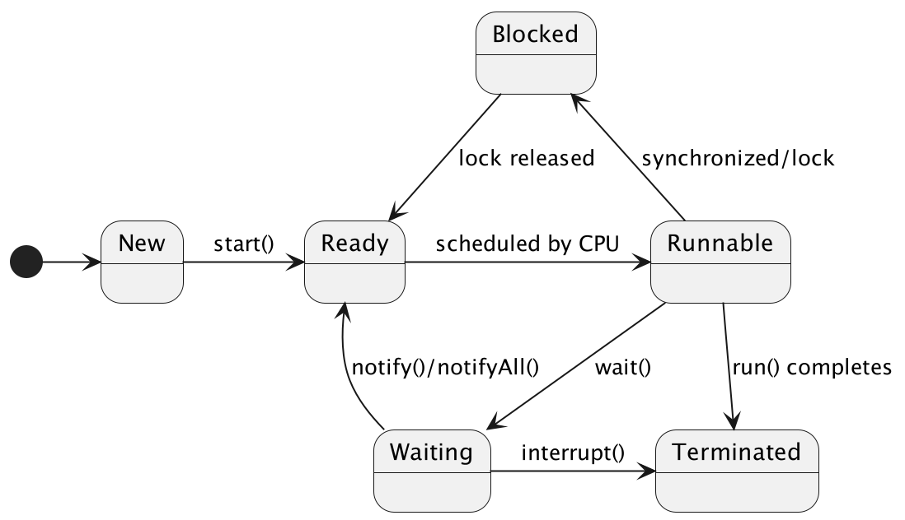

## 基础知识
1. Collection和Map是Java集合框架的两大根接口,它们都直接继承自Object类。
2. transient关键字：标记为transient的字段不会被序列化。
3. Java 中线程优先级的范围确实是 1 到 10，其中：
   Thread.MIN_PRIORITY 对应的常量值是 1（最低优先级）；
   Thread.MAX_PRIORITY 对应的常量值是 10（最高优先级）；
   默认优先级是 Thread.NORM_PRIORITY，值为 5。
4. 守护线程与普通线程对比

    | 对比维度       | 普通线程（用户线程）| 守护线程                     |
    |----------------|----------------------------------|------------------------------|
    | JVM 退出条件   | 所有用户线程结束才退出          | 仅用户线程结束就强制终止     |
    | 任务特性       | 执行关键、需完成的任务          | 执行辅助、可随时终止的任务   |
    | 设置时机       | 默认（无需设置）| 必须在 `start()` 前调用 `setDaemon(true)` |
    | 继承性         | 父线程为用户线程，子线程默认用户线程 | 父线程为守护线程，子线程默认守护线程 |

## 弱项模拟 
### 泛型
以下泛型代码编译时会报错的是？选项：
   
```java
A.
List<String> list = new ArrayList<>();
list.add("Java");
```

```java
B.
List<?> list = new ArrayList<String>();
list.add("Java"); // 报错行
```

```java
C.
public static <T> T getFirst(List<T> list) {
    return list.get(0);
}
```

```java
D.
List<Integer> list = Arrays.asList(1,2,3);
```
解析：选 B。List<?> 是无界通配符，仅支持读取（不能添加非 null 元素），故 add ("Java") 编译报错。

### 反射（高级：动态代理 + 枚举反射限制）
以下代码运行结果是？
```java
import java.lang.reflect.Constructor;
import java.lang.reflect.InvocationHandler;
import java.lang.reflect.Method;
import java.lang.reflect.Proxy;
import java.util.Arrays;

interface Service { void execute(); }
enum Status { RUNNING, STOPPED; }

public class ReflectionAdvanced {
    public static void main(String[] args) throws Exception {
        // 动态代理：代理Service接口
        Service proxy = (Service) Proxy.newProxyInstance(
            Service.class.getClassLoader(),
            new Class[]{Service.class},
            new InvocationHandler() {
                @Override
                public Object invoke(Object proxy, Method method, Object[] args) throws Throwable {
                    System.out.print("Proxy-");
                    return null;
                }
            }
        );
        proxy.execute(); // 语句1

        // 反射创建枚举实例
        Constructor<Status> ctor = Status.class.getDeclaredConstructor(String.class, int.class);
        ctor.setAccessible(true);
        Status custom = ctor.newInstance("CUSTOM", 2); // 语句2
    }
}
```
选项：  
A. 输出 “Proxy-”，并创建 Status.CUSTOM 实例.   
B. 输出 “Proxy-”，语句 2 抛出 IllegalArgumentException.   
C. 语句 1 抛出 ClassCastException，语句 2 执行成功.   
D. 语句 1 编译错误，语句 2 抛出 NoSuchMethodException.   

解析：选 B。  
 - 动态代理基于接口生成代理类，Proxy.newProxyInstance返回的代理对象可强转为 Service 接口，调用execute()会触发 InvocationHandler 的invoke方法，输出 “Proxy-”。
 - 枚举类的构造器由 JVM 隐式定义（参数为String name, int ordinal），但反射无法创建枚举实例：即使设置setAccessible(true)，Constructor.newInstance()会直接抛出IllegalArgumentException（JVM 强制限制）。


### Java 类加载与实例初始化
以下代码执行后，输出结果的顺序是？
```java
class Parent {
	// 父类静态代码块
	static {
		System.out.print("1-父类静态代码块 ");
	}

	// 父类普通代码块
	{
		System.out.print("2-父类普通代码块 ");
	}

	// 父类无参构造器
	public Parent() {
		System.out.print("3-父类构造函数 ");
	}
}

class Child extends Parent {
	// 子类静态代码块
	static {
		System.out.print("4-子类静态代码块 ");
	}

	// 子类普通代码块
	{
		System.out.print("5-子类普通代码块 ");
	}

	// 子类无参构造器
	public Child() {
		System.out.print("6-子类构造函数 ");
	}
}

public class InitOrderTest {
	public static void main(String[] args) {
		// 第一次创建子类实例
		new Child();
		// 第二次创建子类实例
		new Child();
	}
}
```
选项：  

A. 1 - 父类静态代码块 4 - 子类静态代码块 2 - 父类普通代码块 3 - 父类构造函数 5 - 子类普通代码块 6 - 子类构造函数 2 - 父类普通代码块 3 - 父类构造函数 5 - 子类普通代码块 6 - 子类构造函数.   
B. 1 - 父类静态代码块 2 - 父类普通代码块 3 - 父类构造函数 4 - 子类静态代码块 5 - 子类普通代码块 6 - 子类构造函数 2 - 父类普通代码块 3 - 父类构造函数 5 - 子类普通代码块 6 - 子类构造函数.   
C. 1 - 父类静态代码块 4 - 子类静态代码块 2 - 父类普通代码块 5 - 子类普通代码块 3 - 父类构造函数 6 - 子类构造函数 2 - 父类普通代码块 5 - 子类普通代码块 3 - 父类构造函数 6 - 子类构造函数.    
D. 1 - 父类静态代码块 4 - 子类静态代码块 3 - 父类构造函数 2 - 父类普通代码块 6 - 子类构造函数 5 - 子类普通代码块 2 - 父类普通代码块 3 - 父类构造函数 5 - 子类普通代码块 6 - 子类构造函数

解析:选 A。   

**Java 类加载与实例初始化的核心顺序遵循 “静态先行、父类优先” 的原则**，具体拆解如下：
1. 类加载阶段（静态代码块执行规则）
   类加载时静态代码块仅执行一次（无论创建多少实例），且先执行父类静态代码块，再执行子类静态代码块。
   本题中第一次创建Child实例时，JVM 先加载Parent类 → 执行1-父类静态代码块，再加载Child类 → 执行4-子类静态代码块；第二次创建Child实例时，类已加载完成，静态代码块不再执行。
2. 实例初始化阶段（普通代码块 + 构造函数执行规则）
   每次创建实例时，都会执行以下顺序：① 执行父类普通代码块 → ② 执行父类构造函数 → ③ 执行子类普通代码块 → ④ 执行子类构造函数。本质原因：子类构造器默认隐含super()（调用父类无参构造），而父类普通代码块会被编译器插入到父类构造器的最前端，因此顺序为：父类普通代码块 → 父类构造函数 → 子类普通代码块 → 子类构造函数。

### 方法抛出异常
```java
import java.io.IOException;

class Parent {
    public void test() throws IOException, NullPointerException {
        // 父类方法
    }
}

class Child extends Parent {
    @Override
    public void test() throws Exception, ArithmeticException { // ①
        throw new ArithmeticException(); // ②
    }

    public static void main(String[] args) {
        Parent p = new Child();
        try {
            p.test();
        } catch (IOException e) { // ③
            e.printStackTrace();
        }
    }
}
```
A. 编译通过，运行抛出 ArithmeticException     
B. ①行编译错误，子类重写方法抛出的异常范围不能大于父类    
C. ②行编译错误，未声明抛出 ArithmeticException    
D. ③行编译错误，catch 捕获的异常与实际抛出的不匹配

解析：B。
- 子类重写父类方法时，抛出的检查异常范围必须≤父类（运行时异常无此限制）；
- 父类 test () 抛出的检查异常是IOException（属于 Exception 的子类），子类①行抛出Exception（范围更大），违反重写规则，编译错误；
- 补充：ArithmeticException/NullPointerException 是运行时异常，父类 / 子类无需强制声明，因此②行无错；③行 catch 捕获 IOException（父类声明的检查异常），语法上无错，只是运行时不会触发。


### 集合问题
#### 集合操作
以下代码执行后，输出结果是？
```java
import java.util.ArrayList;
import java.util.List;

public class Test {
    public static void main(String[] args) {
        List<String> list = new ArrayList<>();
        list.add("A");
        list.add("B");
        list.add(1, "C");
        System.out.println(list);
    }
}
```
解析：B。  
ArrayList.add(int index, E element)会将元素插入到指定索引位置，原索引及之后的元素后移。此处add(1, "C")会把 “C” 插入到索引 1，原索引 1 的 “B” 后移，最终列表为[A, C, B]。

#### 并发修改
以下代码的输出是？
```java
List<Integer> list = new ArrayList<>(Arrays.asList(1, 2, 3, 4, 5));
for (int i = 0; i < list.size(); i++) {
    if (list.get(i) % 2 == 0) {
        list.remove(i);
    }
}
System.out.println(list);
```
A. [1, 2, 3, 4, 5]  
B. [1, 3, 5]  
C. [1, 3, 4, 5]  
D. 抛出ConcurrentModificationException     

解析：选B。

陷阱点：ConcurrentModificationException通常在使用迭代器（如Iterator或for-each）时修改集合结构时抛出。但本题使用的是索引遍历（for (int i = 0; ...)），直接通过索引操作列表，不会触发该异常。   
逻辑分析：   
初始列表：[1, 2, 3, 4, 5].  
i=0：元素1（奇数，不删除）.  
i=1：元素2（偶数，删除后列表变为[1, 3, 4, 5]，i递增到2.  
i=2：元素4（偶数，删除后列表变为[1, 3, 5]，i递增到3.  
i=3：此时list.size()为3，i=3不小于3，循环结束.  
最终列表：[1, 3, 5].  

错误点：原答案D（抛出异常）是错误的，因为索引遍历不会触发ConcurrentModificationException。

### 线程问题
#### 线程的生命周期 + 锁
以下代码执行后，线程 t1 最终处于什么状态？
```java
import java.util.concurrent.locks.ReentrantLock;

public class ThreadStateTest {
	private static ReentrantLock lock = new ReentrantLock();

	public static void main(String[] args) throws InterruptedException {
		Thread t1 = new Thread(() -> {
			lock.lock();
			try {
				synchronized (ThreadStateTest.class) {
					ThreadStateTest.class.wait(); // ①
				}
			} catch (InterruptedException e) {
				e.printStackTrace();
			} finally {
				lock.unlock(); // ②
			}
		});
		t1.start();
		Thread.sleep(1000); // 确保t1执行到①处
		System.out.println(t1.getState());
	}
}
```
A. BLOCKED（阻塞态）  
B. WAITING（等待态）   
C. TIMED_WAITING（超时等待态）   
D. RUNNABLE（运行态）

解析：B。  
- t1 先获取 ReentrantLock 锁，再进入 synchronized 代码块调用wait()，wait()会释放 synchronized 的锁，但不会释放 ReentrantLock 锁；
- 调用wait()后线程进入WAITING（等待态），需其他线程调用notify()/notifyAll()唤醒；
- 注意：getState()此时获取的是 WAITING，而非 BLOCKED（BLOCKED 是等待 synchronized 锁的状态）。

线程状态转换参考：


#### 线程的生命周期 + 锁
以下代码执行后，线程 t1 最终处于什么状态？
```java
import java.util.concurrent.locks.ReentrantLock;

public class ThreadStateTest {
    private static ReentrantLock lock = new ReentrantLock();

    public static void main(String[] args) throws InterruptedException {
        Thread t1 = new Thread(() -> {
            lock.lock();
            try {
                synchronized (ThreadStateTest.class) {
                    ThreadStateTest.class.wait(); // ①
                }
            } catch (InterruptedException e) {
                e.printStackTrace();
            } finally {
                lock.unlock(); // ②
            }
        });
        t1.start();
        Thread.sleep(1000); // 确保t1执行到①处
        System.out.println(t1.getState());
    }
}
```
A. BLOCKED（阻塞态）   
B. WAITING（等待态）    
C. TIMED_WAITING（超时等待态）   
D. RUNNABLE（运行态）    

解析：B。
- synchronized 锁竞争 → BLOCKED；
- JUC 锁（ReentrantLock）等待 → WAITING；
- 带超时的等待（sleep / 超时 wait）→ TIMED_WAITING。

注意，如果ReentrantLock更改为synchronized，则应选A。

#### 线程的生命周期 + interrupt
以下代码执行后，输出结果是？
```java
public class ThreadInterruptTest {
    public static void main(String[] args) throws InterruptedException {
        Thread t = new Thread(() -> {
            try {
                Thread.sleep(2000); // ①
            } catch (InterruptedException e) {
                System.out.println("线程被中断");
                return;
            }
            System.out.println("线程正常结束");
        });
        t.start();
        Thread.sleep(500);
        t.interrupt(); // ②
        System.out.println(t.isInterrupted()); // ③
    }
}
```
A. 先输出 “线程被中断”，后输出 false         
B. 先输出 false，后输出 “线程被中断”     
C. 输出 “线程正常结束” 和 true    
D. 输出 “线程被中断” 和 true      

解析：A。
- t.start () 后执行①行 sleep (2000)，主线程 sleep (500) 后执行②行 interrupt ()，中断 t 的 sleep，触发 InterruptedException，输出 “线程被中断”；
- InterruptedException 被捕获时，线程的中断标记会被清除，因此③行 isInterrupted () 返回 false；
- 执行顺序：t.interrupt () 触发异常 → 输出 “线程被中断” → ③行输出 false。

> Spring @Transactional 事务在 try-catch 异常后出现的问题，和线程中断标记被清除的场景核心逻辑高度相似。   
> @Transactional 事务的核心规则：
Spring 声明式事务默认仅在 “未被捕获的 RuntimeException/Error” 抛出时，才会触发事务回滚；**若异常被 try-catch 捕获且未手动处理，事务会认为 “执行成功”，最终触发提交而非回滚**。

#### 线程同步（高级：StampedLock+ABA 问题）
以下关于 StampedLock 与 AtomicStampedReference 的描述，正确的是？
```java
import java.util.concurrent.atomic.AtomicStampedReference;
import java.util.concurrent.locks.StampedLock;

public class SyncAdvanced {
    private int value = 100;
    private StampedLock lock = new StampedLock();
    private AtomicStampedReference<Integer> asr = new AtomicStampedReference<>(100, 0);

    // StampedLock乐观读
    public int optimisticRead() {
        long stamp = lock.tryOptimisticRead();
        int current = value;
        if (!lock.validate(stamp)) { // 乐观读验证
            stamp = lock.readLock();
            try {
                current = value;
            } finally {
                lock.unlockRead(stamp);
            }
        }
        return current;
    }

    // AtomicStampedReference解决ABA
    public boolean update() {
        int current = asr.getReference();
        int stamp = asr.getStamp();
        return asr.compareAndSet(current, current + 1, stamp, stamp + 1);
    }
}
```

选项：  
A. optimisticRead()中，若乐观读验证失败，会升级为悲观读锁，保证数据一致性.   
B. StampedLock的乐观读无需释放锁，因此性能远高于ReentrantReadWriteLock.  
C. AtomicStampedReference的compareAndSet仅比较引用值，未解决 ABA 问题.   
D. update()中，若其他线程将值从 100→101→100，compareAndSet仍会执行成功.

解析：选 A。
- StampedLock的乐观读逻辑：先尝试无锁读取（tryOptimisticRead），若验证（validate）发现数据被修改，则升级为悲观读锁重新读取，保证一致性。
- B 错误：乐观读虽无需释放锁，但验证失败会升级为悲观锁；且高竞争场景下，StampedLock性能不一定优于ReentrantReadWriteLock。
- C 错误：AtomicStampedReference同时比较引用值 + 版本戳，解决了 ABA 问题（普通AtomicReference仅比较引用值）。
- D 错误：若值从 100→101→100，版本戳会从 0→1→2，compareAndSet中旧戳（0）不匹配，执行失败。

#### 线程死锁问题
以下代码的执行结果是？

```java
public class Deadlock {
   private static final Object lock1 = new Object();
   private static final Object lock2 = new Object();

   public static void main(String[] args) {
      Thread t1 = new Thread(() -> {
         synchronized (lock1) {
            try {
               Thread.sleep(100);
            } catch (InterruptedException e) {
               e.printStackTrace();
            }
            synchronized (lock2) {
               System.out.println("t1 done");
            }
         }
      });

      Thread t2 = new Thread(() -> {
         synchronized (lock2) {
            try {
               Thread.sleep(100);
            } catch (InterruptedException e) {
               e.printStackTrace();
            }
            synchronized (lock1) {
               System.out.println("t2 done");
            }
         }
      });

      t1.start();
      t2.start();
   }
}
```

A. 输出 t1 done 和 t2 done     
B. 输出 t1 done   
C. 输出 t2 done    
D. 死锁，程序无法结束   

解析：选D。

#### 线程优先级 + 守护线程
以下代码执行结果描述正确的是？
```java
public class PriorityDaemonTest {
    public static void main(String[] args) {
        Thread t1 = new Thread(() -> {
            for (int i = 0; i < 1000; i++) {
                System.out.print(i + ",");
            }
        }, "t1");
        Thread t2 = new Thread(() -> {
            for (int i = 0; i < 1000; i++) {
                System.out.print(i + "#");
            }
        }, "t2");

        t1.setPriority(Thread.MAX_PRIORITY);
        t2.setPriority(Thread.MIN_PRIORITY);
        t1.setDaemon(true);
        t2.setDaemon(true);

        t1.start();
        t2.start();
        System.out.println("主线程结束");
    }
}
```
A. 一定先输出 “主线程结束”，后输出 t1/t2 的内容，且 t1 输出内容更多。    
B. 主线程结束后，t1/t2 立即终止，可能只输出部分数字甚至无数字。    
C. t2 优先级低，会等 t1 执行完才开始输出。   
D. 编译错误，守护线程不能设置优先级。

解析：B。
- 守护线程依赖主线程，主线程结束后 JVM 会立即终止所有守护线程，因此 t1/t2 可能只输出部分数字甚至无输出；
- 排除 A（主线程结束后守护线程立即终止，不会完整输出）、C（优先级是提示性的，无执行顺序保证）、D（守护线程可设置优先级，无编译错误）。

### IO问题
Java IO体系主要分为传统BIO、NIO（Non-blocking IO，非阻塞IO）、AIO（Asynchronous IO，异步IO）三类，其中NIO和AIO是对传统BIO的性能优化，其核心对比如下：

| 维度         | NIO                | AIO                |
|--------------|--------------------|--------------------|
| 核心模型     | 非阻塞+多路复用   | 异步非阻塞+回调    |
| 线程开销     | 需轮询，中等开销   | 无轮询，低开销     |
| 编程复杂度   | 中等（需处理Selector） | 较高（需设计回调逻辑） |
| 典型应用     | 高并发短连接（如Netty） | 大文件读写、慢速IO |


#### 1. NIO（Java 1.4引入）
NIO的核心是“非阻塞”+“多路复用”，基于**通道（Channel）** 和**缓冲区（Buffer）** 实现，而非BIO的流模型：
- **核心特性**：
   - 非阻塞：线程发起IO操作后，无需等待数据就绪/传输完成，可立即返回处理其他任务，通过轮询（如`Selector`）检查IO状态；
   - 多路复用：一个`Selector`线程可监听多个Channel的事件（连接、读、写），解决BIO“一连接一线程”的资源浪费问题；
   - 缓冲区导向：数据读写必须经过Buffer，支持双向操作（BIO流是单向的）。
- **工作流程**：线程注册Channel到Selector并指定监听事件→Selector轮询就绪事件→处理对应Channel的IO操作。
- **适用场景**：高并发、短连接场景（如服务器通信），典型框架如Netty基于NIO实现。

#### 2. AIO（Java 7引入，又称NIO.2）
AIO是“真正的异步IO”，基于“事件回调”模型，完全脱离线程阻塞/轮询：
- **核心特性**：
   - 异步非阻塞：线程发起IO操作后，直接返回，由操作系统完成数据准备和传输，完成后通过回调函数（`CompletionHandler`）通知线程处理结果；
   - 无需轮询：彻底摆脱NIO中Selector的轮询开销，操作系统主动通知；
   - 适用于大文件/慢速IO：如文件读写、网络通信中耗时较长的场景。
- **工作流程**：调用异步IO方法（如`AsynchronousFileChannel.read()`）并传入回调处理器→线程继续执行其他任务→操作系统完成IO后触发回调方法处理结果。
- **注意**：AIO在Windows系统基于IOCP实现，性能优异；Linux下依赖epoll模拟，高并发下优势不明显，因此实际开发中NIO使用更广泛。

> 总结：
> 1. NIO是“非阻塞+多路复用”，通过Selector管理多个Channel，解决BIO线程浪费问题，是高并发网络编程的主流选择；
> 2. AIO是“异步非阻塞”，由操作系统完成IO并回调通知，适合耗时较长的IO操作，但跨平台性能表现不一；
> 3. 核心区别：NIO需线程主动轮询IO状态，AIO完全由系统异步通知，编程复杂度更高但资源利用率更优。

#### 题目1：Java NIO 核心特性选择题
##### 题干
关于Java NIO（Non-blocking IO）的核心实现与特性，下列说法**错误**的是（）  
A. Selector是NIO多路复用的核心，一个Selector线程可监听多个Channel的IO事件，但仅支持监听OP_READ、OP_WRITE、OP_ACCEPT、OP_CONNECT四种事件   
B. NIO的Buffer是数据读写的核心载体，调用flip()方法后，Buffer的limit会设置为当前position，position重置为0，常用于写模式切读模式    
C. SocketChannel配置为非阻塞模式后，调用connect()方法会立即返回，此时需通过finishConnect()确认连接是否完成，未完成时不会阻塞线程    
D. 当Selector调用select(1000)返回0时，表示1000ms内无任何Channel就绪，且此时调用selectedKeys()会返回空集合，keys()也会返回空集合    

##### 答案
D

##### 详细解析
- **A正确**：Selector仅支持监听这四种核心事件，分别对应读、写、服务器接受连接、客户端发起连接，是NIO多路复用的基础；
- **B正确**：flip()是Buffer的核心方法，作用是“翻转”缓冲区，将写模式切换为读模式，limit标记可读数据的末尾，position标记读取起始位置；
- **C正确**：非阻塞模式下的connect()不会阻塞线程，即使连接未完成也会立即返回，需通过finishConnect()轮询确认连接状态；
- **D错误**：select(1000)返回0表示无就绪事件，但selectedKeys()返回空集合（无就绪Key），而keys()返回Selector中**所有注册的Key集合**（包含未就绪的），并非空集合，这是极易混淆的考点。

#### 题目2：Java AIO 核心特性选择题
##### 题干
关于Java AIO（Asynchronous IO，NIO.2）的异步文件操作，下列说法**正确**的是（）   
A. AsynchronousFileChannel的read()异步读取方法，若传入CompletionHandler回调，线程会阻塞直到读取完成，回调函数在调用线程中执行     
B. AIO的异步操作依赖操作系统底层支持：Windows下基于IOCP实现，Linux下基于epoll模拟，因此Linux下AIO性能优于NIO     
C. 使用AsynchronousFileChannel完成大文件分块复制时，需通过CountDownLatch等同步工具保证所有异步读写回调完成后再关闭通道，否则会导致数据丢失     
D. AIO的异步操作结果可通过Future获取，调用Future.get()会立即返回结果，无需等待异步操作完成     

##### 答案
C

##### 详细解析
- **A错误**：AIO的核心是“异步非阻塞”，传入CompletionHandler的read()方法会立即返回，线程不阻塞；回调函数由操作系统的IO线程执行，而非调用线程；
- **B错误**：Linux下AIO是基于epoll模拟实现，并非原生异步IO，高并发场景下性能反而不如NIO（多路复用），这也是实际开发中NIO使用更广泛的原因；
- **C正确**：AIO的读写操作是异步的，主线程可能在回调未完成时就执行关闭通道的逻辑，导致数据未写入完成，需通过CountDownLatch等工具等待所有回调执行完毕，保证数据完整性；
- **D错误**：Future.get()是阻塞方法，会等待异步操作完成后才返回结果；若想非阻塞获取结果，需先调用isDone()判断是否完成。

> 总结
> 1. NIO考点核心：Selector的key集合（selectedKeys() vs keys()）、Buffer的flip()/compact()等方法、非阻塞Channel的操作逻辑；
> 2. AIO考点核心：异步回调的执行机制、跨平台实现差异、异步操作的同步等待方式、Future的阻塞特性；
> 3. 两道题均针对NIO/AIO的易混淆核心点设计，能有效考察对IO模型底层逻辑的理解，而非仅记忆API用法。