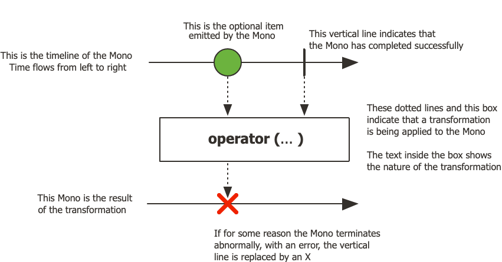
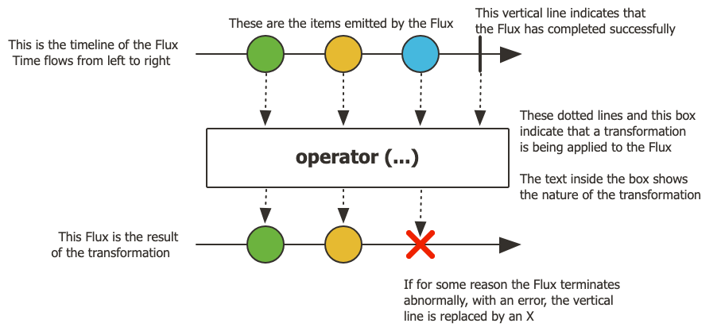

1.【数据库原理】以下是一个事务T4在更新记录R4时加S锁，并在事务结束前未升级为X锁的SQL代码示例：  
```sql
BEGIN TRANSACTION;  
SELECT * FROM table1 WHERE id = 4 FOR SHARE;  
UPDATE tablel SET some_column = some_value WHERE id = 4;  
COMMIT;  
```
以下哪种情况可能会在以上代码中导致死锁？  
A. 有一个会话T2在查询表table1中id为4的记录时也执行了SELECT ... FOR SHARE  
B. 有一个会话T2在修改表table2中id为4的记录时阻塞了该事务  
C. 有一个会话T2在修改表table1中id为5的记录时阻塞了该事务  
**D. 有一个会话T2在修改表table1中id为4的记录前也执行了SELECT ... FOR SHARE**
---
解析：
B选项。更新不同表，本身不构成同行锁冲突。即便更新同一行，在MySQL 8.4且无其他冲突时，持S锁的T4可越过T2等待中的X锁请求，升级、更新并提交，随后T2继续，不形成死锁。（MySQL 8.4锁冲突处理源码：https://github.com/mysql/mysql-server/blob/8.4/storage/innobase/lock/lock0lock.cc）

| 对比 | S锁：共享锁 | X锁：排他锁 |
|---|---|---|
| **目的** | 允许共同锁定读取，阻止别人修改 | 独占修改权，阻止别人取得S/X锁 |
| **常见操作** | `SELECT ... FOR SHARE` | `SELECT ... FOR UPDATE`、`UPDATE` |
| **另一个事务申请S锁** | 可以获得 | 需要等待 |
| **另一个事务申请X锁** | 需要等待 | 需要等待 |
| **升级** | 修改时需升级为X锁；其他事务持有的S/X锁会阻挡升级 | 已能修改，无需再升级 |

**死锁重点：两个事务都持有同一记录的S锁，再都申请X锁，就可能互相等待。**
*以上针对同一记录；普通SELECT通过MVCC（Multi-Version Concurrency Control）读旧版本，不一定被X锁挡住。*
---

2.【数据库】下面有关 ibatis 中的＃与＄的区别，描述错误的是？   
**A. ＄ 方式能够很大程度防止sql注入**  
B. ＃ 将传入的数据都当成一个字符串，会对自动传入的数据加一个双引号  
C. ＄ 将传入的数据直接显示生成在sql中  
D. ＄方式一般用于传入数据库对象，例如传入表名  

```
#：参数绑定，按类型处理参数。
$：直接文本替换，拼接不可信输入会产生注入风险。
```
---

3.【Kafka】下列关于 Kafka 的减少分区说法正确的是？  
A. 删除主题并不会对分区造成任何影响  
**B. 删除分区会导致数据不一致，消息乱序**  
C. 減少分区数量，只需要删除某个分区即可，不会对系统操作任何影响  
D. 减少分区等同于删除主题，两个功能实现的是同一种效果  

```
┌─────────────────────────────────────────────────────────────────────────┐
│                    Kafka 集群：3个Broker、2个Topic                       │
│                                                                         │
│  ┌─────────────────────┬─────────────────────┬─────────────────────┐    │
│  │      Broker 1       │      Broker 2       │      Broker 3       │    │
│  │                     │                     │                     │    │
│  ╞═════════════════════╪═════════════════════╪═════════════════════╡    │
│  │                 Topic：order-events（订单消息）                 │    │
│  ├─────────────────────┼─────────────────────┼─────────────────────┤    │
│  │ P0 [Leader]         │ P0 [Follower]       │ P1 [Follower]       │    │
│  │ P2 [Follower]       │ P1 [Leader]         │ P2 [Leader]         │    │
│  │                     │                     │                     │    │
│  ╞═════════════════════╪═════════════════════╪═════════════════════╡    │
│  │                Topic：payment-events（支付消息）                │    │
│  ├─────────────────────┼─────────────────────┼─────────────────────┤    │
│  │ P0 [Follower]       │ P1 [Leader]         │ P0 [Leader]         │    │
│  │                     │                     │ P1 [Follower]       │    │
│  │                     │                     │                     │    │
│  └─────────────────────┴─────────────────────┴─────────────────────┘    │
│                                                                         │
│  说明：                                                                 │
│  1. 竖向每一列是一个Broker，可承载多个Topic的分区副本。                  │
│  2. 横向每一带是一个Topic，展示其副本在各Broker上的分布。                │
│  3. P表示Partition（分区）；订单有3个分区，支付有2个分区。                │
│  4. 每个分区有2份副本：1个Leader、1个Follower，共10份副本。               │
│  5. 不同Topic的P0是不同分区；同一分区的Follower复制Leader日志。           │
│  6. Follower可能短暂落后，ISR不表示每一瞬间数据都完全相同。               │
│  7. 删除订单Topic，相当于清理订单这一横带的数据；                        │
│     三个Broker仍运行，支付Topic仍保留。                                 │
└─────────────────────────────────────────────────────────────────────────┘
```
---

4.【数据库】关于having子句说法正确的是？  
A. 其他答案均正确  
B. having是在一个结果返回之后起作用的  
**C. having是一个约束说明**  
D. having不能够使用聚合函数  
```
WHERE筛行 → GROUP BY分组 → HAVING筛组 → 返回最终结果
```
---

5.【Spring MVC】对于URL POST请求 http://domain/say/helloworld 的Mapping配置错误的是？  
A. @PostMapping("/say/helloworld")  
B. @PostMapping(value="/say/helloworld")  
**C. @RequestMapping("/say/helloworld", method = RequestMethod.POST)**  
D. @RequestMapping(value="/say/helloworld", method = RequestMethod.POST)  

6.【SQL】已知表结构
   people (pid, name, email, telephone, birthday) , member(mid, mname, email, mlevel)，eployee(eid, ename)，下列可查询出不重复人名称的语句是？  
A. 
```sql
select name from people
UNION ALL
select mname from member
UNION ALL
select ename from employee
```

B. 
```sql
select name from people
UNION ALL
select mname from member
UNION
select ename from employee
```

C. 
```sql
select name from people
UNION
select mname from member
UNION ALL
select ename from employee
```

**D.** 
```sql
select name from people
UNION
select mname from member
UNION
select ename from employee
```

解析：**`union` 会去重排序，`union all` 直接拼接无开销。**
但本题不严谨，D全部使用UNION可以去重，B也可以，最后一个UNION会对左侧已经合并的结果与employee结果整体去重。

---

7.【Spring Cloud】Feign默认提供的日志级别有哪些：
1. NONE：默认的，不显示任何日志；
2. BASIC：仅记录请求方法、URL、响应状态码及执行时间；
3. HEADERS：除了 BASIC 中定义的信息之外，还有请求和响应的头信息；
4. ERROR：会记录所以接口返回的错误信息  
A. 1.2.3.4  
B. 1.2.3  
C. 1,2,4  
D. 1,3.4


解析：
OpenFeign日志说明：https://docs.spring.io/spring-cloud-openfeign/reference/spring-cloud-openfeign.html#feign-logging   

The Logger.Level object that you may configure per client, tells Feign how much to log. Choices are:  
- NONE, No logging (DEFAULT).
- BASIC, Log only the request method and URL and the response status code and execution time.
- HEADERS, Log the basic information along with request and response headers.
- FULL, Log the headers, body, and metadata for both requests and responses.
---

8.【架构设计】假设我们想利用mysqI双主模式通过内置的自增索引为基础来实现一个全局唯一id生成服务，因此在一个分布式系统中设置一个专门数据库，记录当前的Maxld值，插入记录时来取这个MaxId，然后自增1后插入。这种方案可能会导致？  
A. 存在多点重复  
B. 存在多点瓶颈  
C. 存在单点重复  
D. 存在单点瓶颈  

解析：
题干把“双主自增”和“集中读取MaxId再加1”混在一起，实际上涉及不同风险。
- 两个主库使用相同自增规则，未配置不重叠的编号序列，可能产生重复ID，支持A。
- 所有请求都依赖集中取号数据库，可能产生性能瓶颈，支持题目可能想考的D。
- 如果真是业务代码先读MaxId再加1，没有原子控制，即便单库并发也可能重复。
  双主可通过不同的自增步长与偏移量划分编号序列，例如一个产生奇数、另一个产生偶数。
---

9.【Kafka】以下关于Kafka中Zookeeper的功能和特性描述，哪个是正确的？  
A. Zookeeper用于存储Kafka的消息数据  
B. Zookeeper用于执行Kafka集群间的数据同步  
C. Zookeeper负责处理Kafka消费者的网络连接  
D. **Zookeeper负责管理Kafka中的主题分区**  

| 工作              | 主要负责方 |
|-----------------|---|
| 存储消息            | Broker上的分区日志 |
| 分区副本复制          | Broker之间的Leader/Follower机制 |
| 元数据协调、控制器选举相关协调 | ZooKeeper与Kafka控制器 |
| 处理消费者拉取请求       | Broker |

---

10.【Mybatis】如何在项目中使用redis整合Mybatis缓存？  
A.
```sql
Mapper中配置添加二级缓存配置，对于增删改等更新数据库操作
<update id="activateCompany" parameterType="int" >
update sql ......
</update>
即可实现缓存
```
B. 在Mapper中添加二级缓存配置   
C. 开启缓存  
**D. 通过重写Cache类中的方法，将mybatis中默认的缓存空间映射到redis空间中**  

解析：整合Redis，就是接入一个实现，让MyBatis通过它读写Redis：
```
执行Mapper查询
       ↓
MyBatis尝试读取二级缓存
       ↓
自定义Cache实现 → 查询Redis
       │
       ├─ 命中：返回缓存结果
       │
       └─ 未命中：查询数据库
                    ↓
              按事务规则写入缓存
                    ↓
              Cache实现 → Redis
```
---

11.【架构设计】假设我们要设计扣减库存的操作，下列设计方案不合理的是？<br>
A. 数据库中扣减，成功后更新 Redis 缓存<br>
B. 把库存扣减从异步写转为同步写<br>
C. 先扣减 Redis 缓存，同步扣减数据库，如果失败则回滚 Redis 缓存<br>
D. 先扣减 Redis 缓存，同时向队列中发送一条扣减数据库库存的消息，异步进行数据库扣减，实现最终一致性。

解析：
A是一种可以采用的思路，但需要处理两个问题：
- 数据库成功、Redis更新失败，缓存可能仍是旧库存。
- 并发请求更新缓存时，旧结果可能覆盖新结果。

这些是需要补充解决的风险，并不意味着A这个方向本身必然不合理。
  同样：
- B“改成同步写”也可能是为了保证业务完成后再返回，并非天然错误。
- C需要处理补偿失败、重复补偿，以及数据库超时但实际成功。
- D需要保证消息可靠发送、重试和消费幂等。


因此，这道题缺少条件，不建议把某个选项硬背为错误。

---

12.【架构设计】Java 中 synchronized 和 lock 的相同点是？<br>
A. 可以知道有没有成功获取锁<br>
B. 可以让等待锁的线程响应中断<br>
**C. 可以保证原子性<br>**
D. 发生异常时，会自动释放线程占有的锁

| 选项 | 为什么不属于两者共同能力 |
|---|---|
| A：知道有没有成功获取锁 | Lock提供`tryLock()`；synchronized没有对应的尝试获取接口 |
| B：等待锁时响应中断 | Lock可使用`lockInterruptibly()`；synchronized的监视器锁等待不能这样中断 |
| D：异常时自动释放 | synchronized会自动释放；Lock通常需要在finally中手动unlock |
---

13.【数据库】电话号码表 t_phonebook 中含有100万条数据，其中号码字段PhoneNo上创建了唯一索引，且电话号码全部由数字组成，要统计号码头为321的电话号码的数量，下面写法执行速度最慢的是？  
**A. `select count(*) from t_phonebook where substr(phoneno, 1,3) = '321'`**  
B. `select count(*) from t_phonebook where phoneno >= '321' and phoneno < '321A'`  
C. 各选项的执行方式差异不大，性能基本一样  
D. `select count(*) from t_phonebook where phoneno like '321%'`


14.【Kafka】部署支持故障转移（允许1 台服务器宕机而不影响服务）的Kafka 集群，至少需要几台服务器？<br>
A. 1<br>
B. 4<br>
**C. 3<br>**
D. 2<br>

解析：

| 协调节点总数 | 维持多数派需要 | 宕机1个后 | 是否仍有多数派 |
|-------:|---:|---:|---|
|      1 | 1 | 0 | 否 |
|      2 | 2 | 1 | 否 |
|      3 | 2 | 2 | 是 |
|      4 | 3 | 3 | 是 |
3个是能够容忍1个协调节点故障的最小数量。 

Kafka官方也明确说明：3个KRaft控制器可容忍1个控制器故障。官方链接：https://kafka.apache.org/35/operations/kraft/
```
A majority of the controllers must be alive in order to maintain availability. With 3 controllers, the cluster can tolerate 1 controller failure; 
```
---

15.【SpringMVC】通过request对象获取以下用户提交的信息
```
GET /day06/response1?1339484005562 HTTP/1.1
Accept: */* .
Referer: http://localhost/day06/response/demo7/regist.html
Accept-Language: zh
Accept-Encoding: gzip, deflate
User-Agent: Mozilla/4.0|compatible; MSIE 6.0; Windows NT 5.1;
SV1; . NET CLR 2.0.50727)
Host: localhost
Connection: Keep-Alive
```
则以下语句返回什么？<br>
`System.out.println(request.getRequestURI());`<br>
A. `http://192.168.1.114/day06/response1/`<br>
**B. `/day06/response1`<br>**
C. `http://192.168.1.114/day06/response/demo7/regist.html`<br>
D. `/day06/response/demo7/regist.html`

解析：  
题目中有两个地址：
```
本次请求：
GET /day06/response1?1339484005562

来源页面：
Referer: http://localhost/day06/response/demo7/regist.html
```

因此：

| 获取方式 | 对应结果 |
|---|---|
| `request.getRequestURI()` | `/day06/response1` |
| `request.getQueryString()` | `1339484005562` |
| `request.getHeader("Referer")` | 来源页面的完整地址 |
----

16.【数据库原理】以下关于子查询，说法不正确的是？  
A. 从逻辑结果上看，所有使用JOIN关键字编写的连接查询，都可以通过使用子查询（如IN、EXISTS等）的方式重写以实现相同的查询目标  
B. FROM子句中使用派生表时需要指定一个表别名  
**C. 从逻辑结果上看，所有形式的子查询，都可以通过使用JOIN关键字编写的连接查询来等价替换**  
D. 当外部查询需要引用派生表中的计算列（例如函数或表达式结果）时，该计算列在子查询内部需要定义列别名

17.【SQL】有如下语句：  
`select a.id, b.id, a.name, b.name from a full outer join b where a.id is not null or b.id is null;`  
下列说法正确的是？  
A. 结果是两个表中不在交集的部分  
B. 其他说法都不对  
**C. 语法会报错**  
D. 结果是两个表的交集

内连接（INNER JOIN）只保留两表满足连接条件的匹配行。  
外连接（OUTER JOIN）会保留未匹配的行，缺失的一侧用NULL补齐。

| 类型 | 保留的行 |
|---|---|
| `LEFT JOIN` | 左表全部行，以及右表匹配行 |
| `RIGHT JOIN` | 右表全部行，以及左表匹配行 |
| `FULL OUTER JOIN` | 两表全部行，匹配的合并，不匹配的也保留 |

`LEFT JOIN`等同于`LEFT OUTER JOIN`，`RIGHT JOIN`同理。**OUTER JOIN是外连接的统称，不等于完整外连接FULL OUTER JOIN。** MySQL不直接支持FULL OUTER JOIN。

---

18.【SpringMVC】请分析拦截器源码中执行拦截请求的核心代码，描述错误的一项是？
```
public class HandlerExecutionChain {
    private final Object handler;
    private HandlerInterceptor[] interceptors;
    public void addInterceptor(HandlerInterceptor interceptor) {
        initInterceptorList().add(interceptor);
    }
    boolean applyPreHandle(HttpServletRequest request, HttpServletResponse response) throws Exception {
        HandlerInterceptor[] interceptors = getInterceptors();
        if (!ObjectUtils.isEmpty(interceptors)) {
            for (int i = 0; i < interceptors.length; i++) {
                HandlerInterceptor interceptor = interceptors[i];
                if (!interceptor.preHandle(request, response, this.handler)) {
                    triggerAfterCompletion(request, response, null);
                    return false;
                }
            }
        }
        return true;
    }
    void applyPostHandle(HttpServletRequest request, HttpServletResponse response, ModelAndView mv) throws Exception {
        HandlerInterceptor[] interceptors = getInterceptors();
        if (!ObjectUtils.isEmpty(interceptors)) {
            for (int i = interceptors.length - 1; i >= 0; i--) {
                HandlerInterceptor interceptor = interceptors[i];
                interceptor.postHandle(request, response, this.handler, mv);
            }
        }
    }
}
```  
A. 如果 preHandle 方法执行失败，则会执行 triggerAfterCompletion 方法  
B. 在真正执行 controller 的业务代码的前后，会分别执行 applyPreHandle 方法和 applyPostHandle 方法  
C. applyPreHandle 方法执行成功后，就会调用 applyPostHandle 方法  
**D. 拦截器是递归调用 applyPreHandle 方法来拦截客户端发送来的请求**

解析：
**C选项：表述不严谨**

> applyPreHandle执行成功后，就会调用applyPostHandle。

严格来说，**不一定**。例如：

```text
preHandle成功
→ Controller执行
→ Controller抛异常
→ 跳过postHandle，进入异常处理
```

`postHandle`在处理器正常执行完成后调用。因此，C如果理解成“必然调用”，确实错误。[Spring拦截器说明](https://docs.spring.io/spring-framework/docs/6.0.0/javadoc-api/org/springframework/web/servlet/HandlerInterceptor.html)

**D选项：明确错误**

> 拦截器是递归调用applyPreHandle方法来拦截请求。

题目代码使用的是**循环遍历**：

```java
for (int i = 0; i < interceptors.length; i++) {
    interceptor.preHandle(request, response, this.handler);
}
```

这里依次调用各个拦截器的`preHandle`，没有调用`applyPreHandle`自身，因此不是递归。

**结论：按单选题命题意图选D；严格分析，C也存在表述问题。**

---
延伸知识：

- **所属体系**：Filter基于Servlet规范，由Web容器调用；Interceptor基于Spring MVC，由Spring MVC调用，通常注册为Spring Bean，由IoC容器管理。Filter也可注册为Spring Bean以获得依赖注入；当它直接注册到Web容器时，其 `init`、`doFilter`、`destroy` 方法由Web容器调用，采用代理方式时生命周期管理可能不同。

- **执行顺序**：请求进入顺序为 Filter → DispatcherServlet → Interceptor → Controller。异常被Spring MVC成功处理后，Filter的普通后置逻辑可以继续执行；若异常向外传播，普通后置代码可能被跳过，但放在 `finally` 中的清理逻辑仍会执行。

- **回调机制**：在普通同步请求中，Interceptor可以类比为“进入、正常返回、最终收尾”三个阶段，但并非源码中每个Interceptor都对应一个 `try-finally`。以下按回调之间的关系说明，正常执行顺序仍是 preHandle → Controller → postHandle → afterCompletion：

  - `preHandle`：决定是否“进门”，返回 `true` 才继续执行后续Interceptor或Controller。
  - `afterCompletion`：请求处理完成后的收尾回调，仅对自身 `preHandle` 成功返回 `true` 的Interceptor执行。**回调执行不代表一定拿得到异常**：异常已被异常解析器成功处理，且后续处理正常时，`ex` 为 `null`。
  - `postHandle`：Controller正常返回后执行；Controller抛异常时跳过。

**以下为普通同步请求流程，假设preHandle返回true，且后续未发生新的异常：**

```text
正常流程：
Filter前置 → preHandle → Controller → postHandle → 视图渲染（如有）→ afterCompletion(ex=null) → Filter后置

异常被成功处理流程：
Filter前置 → preHandle → Controller报错 → @ControllerAdvice中匹配的异常处理方法 → afterCompletion(ex=null) → Filter后置

异常未被处理流程：
Filter前置 → preHandle → Controller报错 → afterCompletion(ex=异常) → 异常向Filter传播 → Filter的finally执行，普通后置代码跳过
```
---

19.【SpringBoot】使用下列哪段代码可以返回多个非阻塞响应？  
**A. `Flux<String> people = request.bodyToFlux(String.class);`**  
B. `String string = request.parseString(String.class);`  
C. `RestTemplate.readResponse((String) result);`  
D. `Mono<String> string = request.bodyToMono(String.class);`

Mono：[Mono 官方文档](https://projectreactor.io/docs/core/release/api/reactor/core/publisher/Mono.html#never())
```
emits at most one item via the onNext signal
```


---

Flux：[Flux 官方文档](https://projectreactor.io/docs/core/release/api/reactor/core/publisher/Flux.html)
```
emits 0 to N elements
```

---


20.【架构设计】假设结算页核心服务的下游是PC端结算页Web、手机App、微信入口等，上游是62个依赖服务接口。下列选项中针对上游的主要降级手段不合理的是？  
**A. 按照用户质量，将高风险用户、爬虫优先降级**  
B. 根据依赖的影响程度和范围进行降级  
C. 限流降级  
D. 按照上游系统等级，将低级别系统的资源给高级别系统使用

21.【Mybatis】关于MyBatis二级缓存说法错误的是？  
A. 二级缓存是 mapper 级别的缓存  
B. 二级缓存需要在 setting 全局参数中配置开启二级缓存  
**C. 开启二级缓存后，当一个 sqlSession 执行了一次 select 后，关闭此 session 后，重新执行 select 相同的查询，不会加快查询速度的执行**  
D. 二级缓存默认是没有开启的

```
一级缓存的作用是：让同一个 SqlSession 内的相同查询可以复用查询结果，避免重复访问数据库（默认 SESSION 作用域下）。  
二级缓存的作用是：让不同 SqlSession 可以复用同一 Mapper 命名空间下的查询缓存。
```
---

22.【架构设计】假设我们要对分布式SQL进行优化，下列方法无效的是？  
A. 避免关联字段分布倾斜  
B. 可以使用 union all 的情况下，不要使用 union  
**C. 两表 join 时，条件字段尽量放在 where 里面**  
D. 大表 join 小表时，可以考虑 map-side join

- 选项C，内连接（INNER JOIN）只保留两表满足连接条件的匹配行。对于 INNER JOIN，下面两种写法表达相同的查询：
  ```sql
  -- 写法1：关联条件放ON
  SELECT o.id, u.name
  FROM orders o
  INNER JOIN users u ON o.user_id = u.id
  WHERE u.status = 'active';
  ```
  
  ```sql
  -- 写法2：关联条件放WHERE
  SELECT o.id, u.name
  FROM orders o
  INNER JOIN users u ON 1 = 1
  WHERE o.user_id = u.id
  AND u.status = 'active';
  ```

  优化器可能将它们转换成相同的执行计划，不会因为条件写在WHERE里就必然更快。第二种写法也更难读。
- 选项D，Map-side join通常会将小表构建为内存中的哈希表，再扫描大表进行匹配。小表构建后的数据能放进内存是重要前提；并非所有连接类型都适用。 [Hive官方说明](https://hive.apache.org/docs/latest/language/languagemanual-joinoptimization/)：  
  Joins where one side fits in memory. In the new optimization:
  - that side is loaded into memory as a hash table
  - only the larger table needs to be scanned
  - fact tables have a smaller footprint in memory
---

23.【中间件】以下哪个选项不是 Redis 字符串类型内部编码？  
A. raw  
B. embstr  
C. int  
**D. zip**

解析：[Redis官方文档](https://redis.io/docs/latest/commands/object-encoding/)

Redis objects can be encoded in different ways:

- **Strings** can be encoded as:

  - **raw**, normal string encoding.
  - **int**, strings representing integers in a 64-bit signed interval, encoded in this way to save space.
  - **embstr**, an embedded string, which is an object where the internal simple dynamic string, sds, is an unmodifiable string allocated in the same chuck as the object itself. embstr can be strings with lengths up to the hardcoded limit of OBJ_ENCODING_EMBSTR_SIZE_LIMIT or 44 bytes.

---
- **Lists** can be encoded as:
  - **linkedlist**, simple list encoding. No longer used, an old list encoding.
  - **ziplist**, Redis <= 6.2, a space-efficient encoding used for small lists.
  - **listpack**, Redis >= 7.0, a space-efficient encoding used for small lists.
  - **quicklist**, encoded as linkedlist of ziplists or listpacks.


- **Sets** can be encoded as:

  - **hashtable**, normal set encoding.
  - **intset**, a special encoding used for small sets composed solely of integers.
  - **listpack**, Redis >= 7.2, a space-efficient encoding used for small sets.

- **Hashes** can be encoded as:

  - **zipmap**, no longer used, an old hash encoding.
  - **hashtable**, normal hash encoding.
  - **ziplist**, Redis <= 6.2, a space-efficient encoding used for small hashes.
  - **listpack**, Redis >= 7.0, a space-efficient encoding used for small hashes.

- **Sorted Sets** can be encoded as:
  - **skiplist**, normal sorted set encoding.
  - **ziplist**, Redis <= 6.2, a space-efficient encoding used for small sorted sets.
  - **listpack**, Redis >= 7.0, a space-efficient encoding used for small sorted sets.

**Streams** can be encoded as:

  - stream, encoded as a radix tree of listpacks.
All the specially encoded types are automatically converted to the general type once you perform an operation that makes it impossible for Redis to retain the space saving encoding.
---

24.【SQL】已知 SQL 表结构如下，以下哪个选项可以查询所有学生的所有课程的成绩以及平均成绩（按平均成绩从高到低显示）？
```
-- 学生表：存储学生基本信息
Student (id,     -- 学生编号（主键）
        s_name,  -- 学生姓名
        s_age,   -- 学生年龄
        s_sex)   -- 学生性别
-- 课程表：存储课程信息
Course (id,      -- 课程编号（主键）
        c_name,  -- 课程名称
        t_id)    -- 任课教师编号（外键，关联Teacher.id）
-- 教师表：存储教师信息
Teacher (id,     -- 教师编号（主键）
         t_name) -- 教师姓名
-- 成绩表：存储学生选课成绩（学生与课程的多对多关系）
SC (s_id,        -- 学生编号（外键，关联 Student.id）
    c_id,       -- 课程编号（外键，关联 Course.id）
    score)      -- 课程成绩
```  
A.
```
SELECT sc.s_id, sc.c_id, sc.score, t1.avgscore
FROM SC LEFT JOIN (
    SELECT sc.s_id, AVG(sc.score) AS avgscore
    FROM SC
    GROUP BY sc.s_id) AS t1
ORDER BY t1.avgscore DESC
```  
**B.**
```
SELECT sc.s_id, sc.c_id, sc.score, t1.avgscore
FROM SC LEFT JOIN (
    SELECT sc.s_id, AVG(sc.score) AS avgscore
    FROM SC
    GROUP BY sc.s_id) AS t1 ON sc.s_id = t1.s_id
ORDER BY t1.avgscore DESC
```  
C.
```
SELECT sc.s_id, sc.c_id, sc.score, t1.avgscore
FROM SC LEFT JOIN (
    SELECT sc.s_id, AVG(sc.score) AS avgscore
    FROM SC
    GROUP BY sc.s_id) AS t1 ON sc.s_id = t1.s_id
```  
D.
```
SELECT sc.s_id, sc.c_id, sc.score, t1.avgscore
FROM SC LEFT JOIN (
    SELECT sc.s_id, AVG(sc.score) AS avgscore
    FROM SC) AS t1 ON sc.s_id = t1.s_id
ORDER BY t1.avgscore DESC
```

25.【Spring Cloud】用Hystrix组件解决灾难性雪崩效应的方式说法错误的是？  
A. 熔断  
B. 隔离  
C. 降级  
**D. 重启服务**

[Hystrix官方机制说明](https://github.com/Netflix/Hystrix/wiki/How-it-Works)

---

26.【架构设计】假设我们要使用HDFS进行超大文件需求开发，默认的基本存储单位是64M数据块，如果需要每个数据块可分布在不同节点上，同时具有高可靠性，高可扩展性，高吞吐量等特性，其适合的任务是？  
A. 多次写入，少次读取  
B. 多次写入，多次读取  
**C. 一次写入，多次读取**  
D. 一次写入，少次读取


HDFS 全称是 Hadoop Distributed File System，中文是 Hadoop分布式文件系统（Hadoop是Apache旗下用于分布式存储和处理海量数据的开源框架。）。它把大文件拆成数据块，存储在多台服务器上，适合海量数据的存储与读取。
> [HDFS官方说明：Simple Coherency Model](https://hadoop.apache.org/docs/stable/hadoop-project-dist/hadoop-hdfs/HdfsDesign.html#Simple_Coherency_Model)
> HDFS applications need a write-once-read-many access model for files.

---
27.【SQL】假设在一个事务内读取表中的某一行数据，但是多次读取结果不相同。请问这种情况属于以下哪种？  
A. 脏读  
B. 可重复读  
C. 虚读  
**D. 不可重复读**

下面将**时间线、避免方式和隔离级别**放在一起。时间线均从上往下看，每个T1、T2各自处于一个事务中。

**① 脏读：读到了其他事务未提交的数据**

```text
事务 T1                          事务 T2
   │                                │
   │                         将余额100改成80
   │                            【未提交】
   │                                │
读取余额，得到80 ◀────────────────────┤
   │                                │
   │                             回滚修改
   │                           余额恢复100
   ▼                                ▼

结果：T1读到的80，是后来被撤销的数据。
```

**如何避免：**使用**读已提交（READ COMMITTED）或更高隔离级别**。

---

**② 不可重复读：同一行，前后读到的值不同**

```text
事务 T1                          事务 T2
   │                                │
读取余额，得到100                     │
   │                                │
   │                         将余额100改成80
   │                             【提交】
   │                                │
再次读取余额，得到80                  │
   ▼                                ▼

结果：同一个事务读取同一行，先是100，后是80。
```

**如何避免：**使用**可重复读（REPEATABLE READ）或更高隔离级别**；也可通过适当加锁阻止其他事务修改。

---

**③ 幻读／虚读／幻影读：同一条件，记录集合变了**

```text
事务 T1                          事务 T2
   │                                │
查询成绩≥60的学生                    │
得到：张三、李四                     │
   │                                │
   │                        新增王五，成绩90
   │                             【提交】
   │                                │
再次查询成绩≥60的学生                │
得到：张三、李四、王五                │
   ▼                                ▼

结果：查询条件没变，却多出一条符合条件的记录。
```

**如何避免：**使用**串行化（SERIALIZABLE）**。某些数据库在可重复读下，也能通过快照或范围锁避免特定场景中的幻读。

注意：**只锁住已有记录，不一定能阻止新增记录进入查询范围。**

---

**④ 丢失更新：两个事务修改，少算了一次**

```text
事务 T1                          事务 T2
   │                                │
读取库存，得到10                     │
   │                         读取库存，得到10
   │                                │
卖出1件，计算10－1＝9        卖出1件，计算10－1＝9
   │                                │
写入库存9，提交                      │
   │                                │
   │                        仍按旧值写入9，提交
   ▼                                ▼

结果：卖出了2件，库存却为9，正确结果应为8。
```

**如何避免：**

| 方法 | 做法 |
|---|---|
| 原子更新 | 直接执行 `UPDATE goods SET stock = stock - 1 WHERE id = 1 AND stock > 0`，并检查受影响行数 |
| 悲观锁 | 在同一事务中，先 `SELECT ... FOR UPDATE`，再计算、更新并提交 |
| 乐观锁 | 更新时校验版本号；发生冲突时重新读取并重试，或返回失败 |
| 串行化 | 将读取、计算、写回放在同一个串行化事务中，并处理冲突导致的事务失败 |

这里的问题来自**读取旧值后，将计算结果写回**，不等于原子的 `stock = stock - 1` 也会少减一次。

---

**隔离级别：由低到高**

**读未提交 → 读已提交 → 可重复读 → 串行化**

| 隔离级别 | 脏读 | 不可重复读 | 幻读 | 上述丢失更新 |
|---|---|---|---|---|
| **读未提交** READ UNCOMMITTED | 可能 | 可能 | 可能 | 可能 |
| **读已提交** READ COMMITTED | 避免 | 可能 | 可能 | 仍可能 |
| **可重复读** REPEATABLE READ | 避免 | 避免 | 标准允许，具体实现可能避免 | 取决于数据库实现与更新方式 |
| **串行化** SERIALIZABLE | 避免 | 避免 | 避免 | 读、计算、写回在同一事务内时，可避免 |

**记忆区别：脏读看“未提交”，不可重复读看“同一行”，幻读看“记录集合”，丢失更新看“修改被覆盖”。**

---

28.【架构设计】分布式系统的 CAP 定理，下列哪项是错误的？  
A. C 为数据一致性  
B. P 为服务对网络分区故障的容错性  
C. A 为服务可用性  
**D. 三个特性在特殊的分布式系统中都可以同时满足，大部分分布式系统最多同时满足 2 个**

| 字母 | 全称 | 含义 |
|---|---|---|
| C | Consistency | 一致性，CAP中通常指线性一致性 |
| A | Availability | 可用性，非故障节点收到的请求最终能够得到符合操作要求的响应 |
| P | Partition tolerance | 分区容错性，考虑节点间网络通信中断的情况 |

> [CAP原始论文](https://www.cs.princeton.edu/courses/archive/spr22/cos418/papers/cap.pdf):
> Theorem 1 It is impossible in the asynchronous network model to implement a read/write data object that guarantees the following properties: • Availability • Atomic consistency in all fair executions (including those in which messages are lost).
---

29.【SQL】关于驱动表与被驱动表，下列说法正确的是？  
A. 数据量小的表一定是驱动表  
**B. left join 的左边是驱动表**  
C. left join 的左边是被驱动表  
D. 数据量大的表一定是驱动表

在常见的嵌套循环连接模型中：
- 驱动表：先取出其中的记录。
- 被驱动表：根据驱动表的记录，到其中寻找匹配。   

**表的总行数不是决定驱动顺序的唯一因素，还要看过滤条件、索引和执行计划。**

30.【Spring Boot】有如下一段代码，连续4次调用executeAsync方法，最终程序输出的内容可能是？
```
@Configuration
@EnableAsync
public class ThreadPoolConfig {
    @Bean
    public TaskExecutor taskExecutor() {
        ThreadPoolTaskExecutor executor = new ThreadPoolTaskExecutor();
        // 设置核心线程数
        executor.setCorePoolSize(4);
        // 设置最大线程数
        executor.setMaxPoolSize(8);
        // 设置队列容量
        executor.setQueueCapacity(10);
        // 设置允许的空闲时间（秒）
        // executor.setKeepAliveSeconds(keepAlive);
        // 设置默认线程名称
        executor.setThreadNamePrefix("thread-");
        // 设置拒绝策略 rejection-policy：当pool已经达到max size的时候，如何处理新任务
        // CALLER_RUNS：不在新线程中执行任务，而是由调用者所在的线程来执行
        executor.setRejectedExecutionHandler(new ThreadPoolExecutor.CallerRunsPolicy());
        // 等待所有任务结束后再关闭线程池
        executor.setWaitForTasksToCompleteOnShutdown(true);
        return executor;
    }
}
@Service
public class AsyncService {
    @Async("taskExecutor")
    public void executeAsync() {
        try {
            System.out.println("当前运行的线程名称：" + Thread.currentThread().getName());
        } catch (Exception e) {
            e.printStackTrace();
        }
    }
}
```  
连续4次调用executeAsync方法，最终程序输出的内容可能是？  
A.
```
当前运行的线程名称：thread-1
当前运行的线程名称：thread-1
当前运行的线程名称：thread-2
当前运行的线程名称：thread-3
```  
**B.**
```
当前运行的线程名称：thread-1
当前运行的线程名称：thread-2
当前运行的线程名称：thread-3
当前运行的线程名称：thread-4
```  
C.
```
当前运行的线程名称：thread-1
当前运行的线程名称：thread-1
当前运行的线程名称：thread-2
当前运行的线程名称：thread-2
```  
D.
```
当前运行的线程名称：thread-1
当前运行的线程名称：thread-1
当前运行的线程名称：thread-1
当前运行的线程名称：thread-1
```

31.【SQL】下列属于使用 UNION 操作符需要注意的事项的是？  
A. 列也必须拥有相似的数据类型  
B. UNION 内部的 SELECT 语句必须拥有相同数量的列  
C. 每条 SELECT 语句中的列的顺序必须相同  
D. 其他三项都是

32.【架构设计】下列关于数据库读写分离的理解，错误的是？  
A. 数据库读写分离是将数据库分为主库和从库，一个主库用于写数据，多个从库用于读数据，主从库之间通过某种机制进行数据的同步，是一种常见的数据库架构  
B. 实现线性提升数据库的读性能，消除读写锁冲突从而提升数据库的写性能，那么就可以使用"分组架构"（读写分离架构）  
C. 读写分离是通过多个写库，分摊了数据库写的压力  
D. 读写分离是用来解决数据库的读性能瓶颈的

33.【Kafka】下列关于 Kafka 的 broker 描述错误的是？  
A. broker接收来自生产者的消息，为消息设置偏移量，并提交消息到磁盘保存  
B. 一个独立的kafka服务器被称为broker  
C. 单个broker只能充当一个角色，要么是生产者broker，要么是消费者broker，不能既是生产者broker又是消费者broker  
D. broker为消费者提供服务，对读取分区的请求作出响应，返回已经提交到磁盘上的消息

34.【中间件】在RabbitMQ消息队列中，保证消息可靠性的措施不包含下面哪个选项？  
A. 生产方确认Confirm  
B. 持久化  
C. 使用多个分区  
D. 消费方确认Ack

35.【Spring Cloud】下面的Spring Cloud Gateway的配置中，如果我们的请求路径是 /api/v2，当想优先匹配到 server_v2，应该怎么配置？  
A.
```
spring:
  cloud:
    gateway:
      default-filters:
        - AddRequestHeader=gateway-env, springcloud-gateway
      routes:
        - id: "server_v1"
          uri: "http://127.0.0.1:8001"
          predicates:
            - Path=/api/**
        - id: "server_v2"
          uri: "http://127.0.0.1:8002"
          predicates:
            - Path=/api/v2/**
```  
B.
```
spring:
  cloud:
    gateway:
      default-filters:
        - AddRequestHeader=gateway-env, springcloud-gateway
      routes:
        - id: "server_v2"
          uri: "http://127.0.0.1:8002"
          predicates:
            - Path=/api/v2,/api/v2/**
        - id: "server_v1"
          uri: "http://127.0.0.1:8001"
          predicates:
            - Path=/api/**
```  
C.
```
spring:
  cloud:
    gateway:
      default-filters:
        - AddRequestHeader=gateway-env, springcloud-gateway
      routes:
        - id: "server_v1"
          uri: "http://127.0.0.1:8001"
          predicates:
            - Path=/**
        - id: "server_v2"
          uri: "http://127.0.0.1:8002"
          predicates:
            - Path=/api/v2/**
```  
D.
```
spring:
  cloud:
    gateway:
      default-filters:
        - AddRequestHeader=gateway-env, springcloud-gateway
      routes:
        - id: "server_v1"
          uri: "http://127.0.0.1:8002"
          predicates:
            - Path=/api/v2/**
        - id: "server_v2"
          uri: "http://127.0.0.1:8001"
          predicates:
            - Path=/api/**
```

36.【Mybatis】关于Mybatis生命周期的类线程是否安全说法正确的是？
1. SessionFactory通常是在应用启动时创建好的且是单例模式创建，所以多个线程可同时使用同一个SessionFactory。
2. SqlSession对应着一次数据库会话。SqlSession实例不能被共享，也不是线程安全的。
3. 由于SqlSessionTemplate继承SqlSession，所以SqlSessionTemplate也不是线程安全的。

A. 1, 3  
B. 1, 2  
C. 1, 2, 3  
D. 2, 3

37.【Spring Cloud】微服务中，关于Sentinel的性能描述正确的是？
1. Sentinel提供了丰富的控制台界面，方便用户查看监控信息
2. Sentinel可以整合到Spring中，但无法和Dubbo整合
3. Sentinel提供系统负载保护

A. 1, 3  
B. 1, 2, 3  
C. 1, 2  
D. 2, 3

38.【Spring Cloud】Kubernetes 中 Pod 的重启策略不包括？  
A. Always  
B. Never  
C. OnFailure  
D. DaemonSet

39.【Spring Boot】Spring Security推荐下面哪种加密方式？  
A. bcrypt  
B. ldap  
C. md5  
D. md4

40.【架构设计】多租户体系下（高并发数据读操作）数据库设计一般采用？  
A. 垂直分库  
B. 水平分表  
C. 水平分库  
D. 垂直分表

41.【Kafka】以下关于Kafka分区数量描述错误的是？  
A. 每个broker包含有分区个数、可用的磁盘空间和网络带宽  
B. 单个broker对分区个数是有限制的，因为分区越多，占用的内存越多，完成首领选举需要的时间也越长  
C. 分区个数随着生产者和消费者的个数而自动增长  
D. 每个分区一般都会有一个消费者

42.【数据库原理】已知 student 表主键为 studentid，当前表中存在一条 studentid=101 的记录，且 100 未被占用。执行以下SQL语句：  
`update student set studentid=100 where studentid=101;`  
结果是？  
A. 更新了一条数据  
B. 既不提示错误，也不更新数据  
C. 错误提示：主键列不能更新  
D. 更新了十条数据

43.【Kafka】以下选项关于提升 Kafka 吞吐量的操作错误的是？  
A. 如果分区数很多，可以增加 buffer.memory 的值  
B. 采用多实例 consumer  
C. 适当增加 num.replica.fetchers  
D. 减小 linger.ms 的值

44.【架构设计】假设存在如下程序，执行后输出结果是？
```
class Test {
    private int data = 2;
    int result = 0;
    public void m() {
        result += data;
        System.out.println(result + " " + data);
    }
}
class ThreadExample extends Thread {
    private Test mv;
    public ThreadExample(Test mv) {
        this.mv = mv;
    }
    public void run() {
        synchronized (mv) {
            mv.m();
        }
    }
}
class ThreadTest {
    public static void main(String args[]) {
        Test mv = new Test();
        Thread t1 = new ThreadExample(mv);
        Thread t2 = new ThreadExample(mv);
        Thread t3 = new ThreadExample(mv);
        t1.start();
        t2.start();
        t3.start();
    }
}
```  
A.
```
4 4
4 4
6 6
```  
B.
```
2 2
4 2
6 2
```  
C.
```
2 4
2 4
2 4
```  
D.
```
0 2
2 4
4 6
```

45.【架构设计】架构设计中，关于业务的无状态性，下列描述错误的是？  
A. 多个模块（子系统）之间与对称性无关  
B. 请求提交到任何服务器，处理结果都是完全一样  
C. 系统不存储业务的上下文信息  
D. 仅根据每次请求携带数据进行相应的业务逻辑处理

46.【数据库】下列关于索引分区描述正确的是？  
A. 全局非分区索引：在分区表上创建的全局普通索引，索引没有被分区  
B. 局部分区索引：在分区表上创建的索引，在每个表分区上创建独立的索引，索引的分区范围与表一致（按照表分区对索引进行分区）  
C. 全局分区索引：在分区表或非分区表上创建的索引，索引单独指定分区的范围，与表的分区范围或是否分区无关  
D. 其他都是

47.【Spring Boot】在Spring Boot中，关于 @Transactional 的使用，下面说法错误的是？  
A. 将 @Transactional 放置在类级的声明中，会使得所有方法都有事务  
B. 使用了 @Transactional 的方法，被同一个类里面的方法调用，@Transactional 无效  
C. 在接口上声明 @Transactional 时，注解可能无效  
D. 使用了 @Transactional 的方法，可以是 public 或 protected

48.【Mybatis】在一套库存管理服务中，需要在用户下单后减少对应商品的库存数量。以下是 ProductService 类的部分代码，其中 `/* 代码缺失 */` 处需完成对 MyBatis SqlSession 的获取与提交事务等操作，并调用 ProductMapper 中的 updateStock 方法。要求在高并发场景下能够安全、准确地更新库存数据。请从下列四个选项中选出正确的代码填充：
```
public class ProductService {
    private SqlSessionFactory sqlSessionFactory;
    public ProductService(SqlSessionFactory sqlSessionFactory) {
        this.sqlSessionFactory = sqlSessionFactory;
    }
    public void reduceProductStock(Long productId, int quantity) {
        // 省略前置业务逻辑，例如校验库存、生成订单等
        /* 代码缺失 */
    }
}
```  
A.
```
SqlSession session = sqlSessionFactory.openSession();
ProductMapper mapper = session.getMapper(ProductMapper.class);
mapper.updateStock(productId, quantity);
// 缺少 commit() 或 rollback() 调用
session.close();
```  
B.
```
try (SqlSession session = sqlSessionFactory.openSession(true)) {
    ProductMapper mapper = session.getMapper(ProductMapper.class);
    mapper.updateStock(productId, quantity);
    // 无需显式提交，自动提交已开启
}
```  
C.
```
try (SqlSession session = sqlSessionFactory.openSession()) {
    ProductMapper mapper = session.getMapper(ProductMapper.class);
    mapper.updateStock(productId, quantity);
    session.commit();
}
```  
D.
```
try (SqlSession session = sqlSessionFactory.openSession()) {
    // 未获取任何 Mapper
    session.update("updateStock", new Object[]{productId, quantity});
    session.rollback();
}
```

49.【Spring Cloud】下列对于 LoadBalancer 描述正确的是？  
A. 全局只有一个 BlockingLoadBalancerClient，负责执行所有的负载均衡请求  
B. 其它三项均正确  
C. 每个微服务下有独自的 LoadBalancer，LoadBalancer 里面包含负载均衡的算法，根据算法从 ServiceInstanceListSupplier 返回的实例列表中选择一个实例返回  
D. BlockingLoadBalancerClient 从 LoadBalancerClientFactory 里加载对应微服务的负载均衡配置

50.【Mybatis】Mybatis默认采用哪种动态代理？  
A. ASM  
B. CGLIB  
C. JDK动态代理  
D. javassist