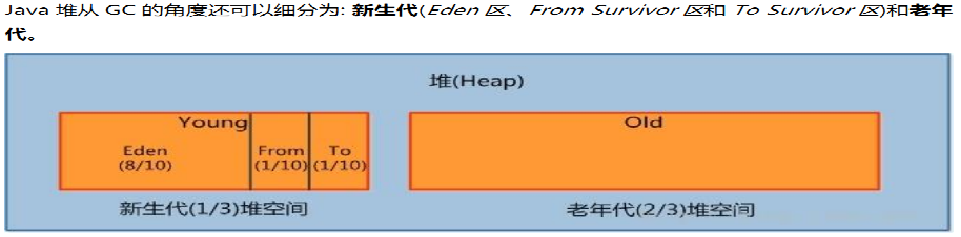
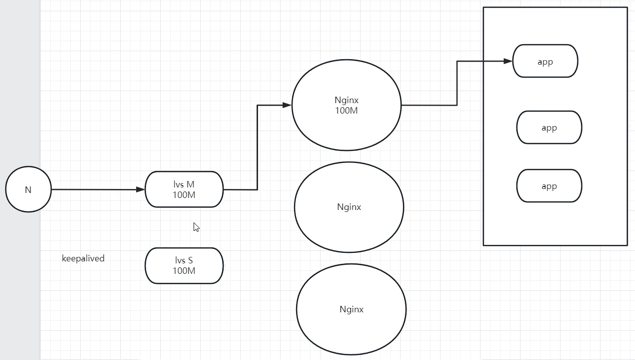

# Database
## 数据库索引的原理?创建索引的缺点是什么，什么情况索引失效?优化数据库的方法有哪些?

数据库索引的原理是通过创建一个额外的数据结构，该结构可以加速数据的检索。这个结构通常是一个树形结构，如B树或者B+树，它会按照索引列的值对数据进行排序，从而快速定位到符合查询条件的数据行。

创建索引的缺点包括：
1. **占用空间：** 索引需要额外的存储空间来维护索引结构。
2. **更新成本增加：** 索引的存在会导致插入、更新和删除操作的性能下降，因为除了更新数据表，还需要更新索引。
3. **可能引发锁竞争：** 在高并发的情况下，对数据库表进行更新操作可能会引发锁竞争，降低系统的并发性能。
    > 延伸：数据库管理系统通常使用MVCC，解决数据库中的并发控制问题。MVCC允许多个事务同时进行而不会互相阻塞，从而提高数据库的并发性能。

如何避免索引失效(可结合下文mysql最左前缀法则学习)
1. **避免在索引列上使用计算和函数**：直接使用列本身进行查询。
2. **避免在 LIKE 查询中使用前置通配符**：如可能，使用后置通配符。
3. **尽量避免不等于操作符**：如可能，使用其他逻辑重构查询条件。
    > (1) 不等于运算符（!= 或 <>）通常会导致索引失效，因为这种查询需要检查所有记录来确定哪些记录不符合条件。  
     (2) 使用 IS NOT NULL 可能导致索引失效，具体情况取决于数据和数据库版本。不过，IS NULL 通常是有效的。
4. **使用正确的数据类型**：确保查询中使用的值与列的数据类型一致。
5. **使用优化器提示**：如需确保使用索引，可以使用优化器提示（Hints）来强制优化器使用索引。
    >在某些情况下，数据库优化器会决定不使用索引，而是选择全表扫描或其他方法，因为优化器认为这样做的性能更好。


优化数据库的方法包括：
1. **硬件升级：** 通过升级硬件配置，如增加内存、优化磁盘性能等，提高数据库系统的整体性能。
2. **表结构设计优化**：表层面：减少联表查询，如通过添加冗余字段；字段层面：能使用varchar(20)就不要使用varchar(200)，避免大字段。
3. **合适的索引设计：** 根据实际查询需求设计合适的索引，避免创建过多或者不必要的索引。
4. **垂直与水平分库分表**：根据业务需求，将数据进行垂直切分（按业务模块划分数据库）或者水平切分（按数据行进行切分），提高数据库的并发处理能力和扩展性。
5. **优化sql语句：** 使用合适的sql语句，避免全表扫描或索引失效，提高运行效率。
    >(1) where优先等值匹配，范围匹配放在后面  
   > (2) where符合最左匹配原则，避免引起索引失效    
   > (3) 减少函数使用，避免引起索引失效  
   > (4) 减少多表关联查询、减少子查询、减少临时中间表
6. **事务优化**：注意数据库隔离级别（隔离级别越高，对读写性能影响越大），以及减少事务的使用，避免引起的额外开销。
   > 在事务优化时一定要注意锁的问题，如select for update等语句尽量少用
7. **缓存优化：** 使用缓存技术减少数据库访问次数，提高系统的响应速度。
8. **定期维护索引：** 定期对索引进行重新组织或者重建，以保证索引的有效性和性能。
9. **数据归档和清理（数据冷热存储）：** 定期清理和归档不再需要的数据，减少数据库表的数据量，提高查询效率。

## mysql 最左前缀法则示例
假设index(a,b,c)  

| Where语句                                                | 索引是否被使用                                                                                     |
|--------------------------------------------------------|---------------------------------------------------------------------------------------------|
| where a = 3                                            | 是，使用到 a                                                                                     |
| where a =  3 and b = 5                                 | 是，使用到 a、b                                                                                   |
| where a =  3 and b = 5 and c = 4                       | 是，使用到 a、b、c                                                                                 |
| where b =  3 或者 where b = 3 and c =  4 或者 where c =  4 | 否                                                                                           |
| where a =  3 and c = 5                                 | 使用到 a，但是 c 不可以，b 中间断了                                                                       |
| where a =  3 and b > 4 and c = 5                       | 使用到 a 和 b，c 不能用在范围之后，b断了                                                                    |
| where a is  null and b is not null                     | is null 支持索引，但是 is not null 不支持，所以 a 可以使用索引，但是 b 不一定能用上索引（该描述基于mysql 8.0，也可能不成立取决于具体数据库的版本） |
| where a  <> 3                                          | 不能使用索引                                                                                      |
| where  abs(a) =3                                       | 不能使用索引                                                                                      |
| where a =  3 and b like 'kk%' and c = 4                | 是，使用到 a、b、c                                                                                 |
| where a =  3 and b like '%kk' and c = 4                | 是，只用到 a                                                                                     |
| where a =  3 and b like '%kk%' and c = 4               | 是，只用到 a                                                                                     |
| where a =  3 and b like 'k%kk%' and c =  4             | 是，使用到 a、b、c                                                                                 |

可以结合字典排序来理解:
1) 如`where a =  3 and c = 5`，就类似于查找单词找`a%c`，由于中间这一段不知道是啥，因此只能根据索引找到`a`，剩余的只能通过全表扫描。
2) 如`where a =  3 and b > 4 and c = 5`，就类似查找单词，先根据索引找到字母为`a`的，然后根据索引找到字母大于`b`，但在大于`b`后再找字母为`c`的就很难找了，需要对`ac、ae、...、az`打头的单词逐个核对。
3) 如`where a  <> 3`，就类似于查找单词，除`a`打头的单词全部查找一遍。

### 如何分析 explain 语句
如下面的 explain 语句：
```
mysql> EXPLAIN SELECT * FROM emp where age = 33 and deptId = '2027' and name = 'rPZBJR';
+----+-------------+-------+------------+------+---------------------+---------------------+---------+-------------------+------+----------+-------+
| id | select_type | table | partitions | type | possible_keys       | key                 | key_len | ref               | rows | filtered | Extra |
+----+-------------+-------+------------+------+---------------------+---------------------+---------+-------------------+------+----------+-------+
|  1 | SIMPLE      | emp   | NULL       | ref  | idx_age_deptid_name | idx_age_deptid_name | 93      | const,const,const |    1 |   100.00 | NULL  |
+----+-------------+-------+------------+------+---------------------+---------------------+---------+-------------------+------+----------+-------+
1 row in set, 1 warning (0.01 sec)
```
每列代表的意义为：
- **id**: 查询中的每个操作步骤都有一个唯一的标识符，这里只有一个操作步骤，所以标识符为 1。
- **select_type**: SIMPLE 表示这是一个简单的 SELECT 查询，没有 UNION 或子查询等复杂的结构。
- **table**: 表示查询涉及的表名，这里是 emp 表。
- **partitions**: 如果查询涉及分区表，此列将显示相关分区信息。
- **type**: 这是非常重要的一列，表示了在表中找到行的方式。在这里，类型是 ref，表示查询使用了索引的“引用”（ref）访问方法。
- **possible_keys**: 这列显示了可能被查询使用的索引，这里可能使用的索引是 idx_age_deptid_name。
- **key**: 表示实际使用的索引，这里使用了索引 idx_age_deptid_name。
- **key_len**: 表示索引的长度，这里是 93 个字节。
- **ref**: 显示了在索引中使用的列和值，这里是 const,const,const，表示在索引中使用了常量值。
- **rows**: 表示 MySQL 估计查询需要检查的行数，这里是 1 行。
- **filtered**: 表示通过索引条件过滤的行的百分比，这里是 100.00%，表示索引条件过滤了 100% 的行。
- Extra: 提供了其他信息，这里为 NULL，表示没有额外的操作。
**综上所述**，查询使用了索引 idx_age_deptid_name，并且使用了索引的引用（ref）访问方法来检索数据，通过索引条件过滤了所有行，并且没有进行额外的排序操作。

其中，需要重点关注的列：
- **type**: 这列显示了在表中找到行的方式。常见的类型包括：
  - **ALL**: 表示全表扫描，即检索表中的所有行。
  - **index**: 表示全索引扫描，即扫描整个索引而不访问实际的数据行。
  - **range**: 表示使用索引进行范围扫描，即根据索引列上的范围条件来检索数据。
  - **ref**: 表示使用索引引用（ref）访问方法，通常与等值查询条件一起使用。
  - **const**: 表示使用索引常量（const）访问方法，通常与等值查询条件一起使用。
  - **eq_ref**: 表示连接查询中使用了索引唯一性的情况。
- **possible_keys**: 这列显示了可能被查询使用的索引。如果存在多个索引，这些索引中的一个或多个可能会被用于查询。
- **key**: 这列显示了实际被查询使用的索引。通常，你希望看到查询使用了一个合适的索引。
- **rows**: 这列表示 MySQL 估计查询需要检查的行数。较小的值表示较高的性能，因为查询需要检查的行越少，查询的执行速度越快。
- **filtered**: 这列表示通过索引条件过滤的行的百分比。通常情况下，你希望这个值越高越好，因为这表示索引条件过滤了更多的行，减少了查询的处理量。
- **Extra**: 这列提供了关于查询执行过程的额外信息。一些常见的值包括 "Using index"（表示查询使用了覆盖索引）、"Using where"（表示查询使用了 WHERE 子句中的条件）、"Using temporary"（表示查询需要使用临时表）、"Using filesort"（表示查询需要对结果进行排序）等。


### 案例实测
#### 无过滤不索引
1) 查看索引
```
mysql> SHOW INDEX FROM emp;
+-------+------------+---------------------+--------------+-------------+-----------+-------------+----------+--------+------+------------+---------+---------------+---------+------------+
| Table | Non_unique | Key_name            | Seq_in_index | Column_name | Collation | Cardinality | Sub_part | Packed | Null | Index_type | Comment | Index_comment | Visible | Expression |
+-------+------------+---------------------+--------------+-------------+-----------+-------------+----------+--------+------+------------+---------+---------------+---------+------------+
| emp   |          0 | PRIMARY             |            1 | id          | A         |      499086 |     NULL |   NULL |      | BTREE      |         |               | YES     | NULL       |
| emp   |          1 | idx_age_deptid_name |            1 | age         | A         |          20 |     NULL |   NULL | YES  | BTREE      |         |               | YES     | NULL       |
| emp   |          1 | idx_age_deptid_name |            2 | deptId      | A         |      188125 |     NULL |   NULL | YES  | BTREE      |         |               | YES     | NULL       |
| emp   |          1 | idx_age_deptid_name |            3 | name        | A         |      499086 |     NULL |   NULL | YES  | BTREE      |         |               | YES     | NULL       |
+-------+------------+---------------------+--------------+-------------+-----------+-------------+----------+--------+------+------------+---------+---------------+---------+------------+
4 rows in set (0.07 sec)
```
可以看到名为 idx_age_deptid_name 的组合索引：age + deptId + name。

2) 无过滤条件`(即无where)`执行 sql
```
mysql> EXPLAIN SELECT * FROM emp ORDER BY age,deptid;
+----+-------------+-------+------------+------+---------------+------+---------+------+--------+----------+----------------+
| id | select_type | table | partitions | type | possible_keys | key  | key_len | ref  | rows   | filtered | Extra          |
+----+-------------+-------+------------+------+---------------+------+---------+------+--------+----------+----------------+
|  1 | SIMPLE      | emp   | NULL       | ALL  | NULL          | NULL | NULL    | NULL | 499086 |   100.00 | Using filesort |
+----+-------------+-------+------------+------+---------------+------+---------+------+--------+----------+----------------+
1 row in set, 1 warning (0.01 sec)
```
Extra 栏使用了 `filesort`。

3) 有过滤条件`(即有where)`执行 sql
```
mysql> EXPLAIN SELECT * FROM emp where age > 1000 ORDER BY age,deptid;
+----+-------------+-------+------------+-------+---------------------+---------------------+---------+------+------+----------+-----------------------+
| id | select_type | table | partitions | type  | possible_keys       | key                 | key_len | ref  | rows | filtered | Extra                 |
+----+-------------+-------+------------+-------+---------------------+---------------------+---------+------+------+----------+-----------------------+
|  1 | SIMPLE      | emp   | NULL       | range | idx_age_deptid_name | idx_age_deptid_name | 5       | NULL |    1 |   100.00 | Using index condition |
+----+-------------+-------+------------+-------+---------------------+---------------------+---------+------+------+----------+-----------------------+
1 row in set, 1 warning (0.01 sec)
```
Extra 栏使用了 `index condition`。

## 数据库范式
使用地址和订单的例子来说明第一、第二和第三范式，以及去范式化的情况。

### 第一范式（1NF）

**定义**：所有字段都是原子性的，不可分割的。

#### 示例（未满足第一范式）

假设我们有一个订单表，其中地址信息是一个字段：

| 订单ID | 客户名 | 地址                            | 商品   | 数量 |
|--------|--------|---------------------------------|--------|------|
| 1      | 张三   | 北京市海淀区中关村南大街1号      | 手机   | 1    |
| 2      | 李四   | 上海市浦东新区世纪大道100号     | 电脑   | 2    |

这里的“地址”字段包含了多个信息（省、市、区、街道、门牌号），不满足第一范式。

#### 转换（满足第一范式）

将地址字段拆分为多个字段，每个字段包含一个原子值：

| 订单ID | 客户名 | 省份   | 城市   | 区      | 街道        | 门牌号 | 商品   | 数量 |
|--------|--------|--------|--------|---------|-------------|--------|--------|------|
| 1      | 张三   | 北京市 | 北京市 | 海淀区  | 中关村南大街 | 1号    | 手机   | 1    |
| 2      | 李四   | 上海市 | 上海市 | 浦东新区 | 世纪大道    | 100号  | 电脑   | 2    |

### 第二范式（2NF）

**定义**：在满足第一范式的基础上，表中的非主键字段必须完全依赖于主键，而不能只依赖于主键的一部分。

#### 示例（未满足第二范式）

假设我们有一个订单和客户信息的表：

| 订单ID | 客户ID | 客户名 | 省份   | 城市   | 区      | 街道        | 门牌号 | 商品   | 数量 |
|--------|--------|--------|--------|---------|-------------|--------|--------|------|---|
| 1      | 1001   | 张三   | 北京市 | 北京市 | 海淀区  | 中关村南大街 | 1号    | 手机   | 1    |
| 2      | 1002   | 李四   | 上海市 | 上海市 | 浦东新区 | 世纪大道    | 100号  | 电脑   | 2    |

**问题**：客户名和地址信息只依赖于客户ID，而不是完全依赖于订单ID，存在部分依赖。

#### 转换（满足第二范式）

将客户信息和订单信息拆分到不同的表中：

- 客户表：

  | 客户ID | 客户名 | 省份   | 城市   | 区      | 街道        | 门牌号 |
    |--------|--------|--------|--------|---------|-------------|--------|
  | 1001   | 张三   | 北京市 | 北京市 | 海淀区  | 中关村南大街 | 1号    |
  | 1002   | 李四   | 上海市 | 上海市 | 浦东新区 | 世纪大道    | 100号  |

- 订单表：

  | 订单ID | 客户ID | 商品   | 数量 |
    |--------|--------|--------|------|
  | 1      | 1001   | 手机   | 1    |
  | 2      | 1002   | 电脑   | 2    |

### 第三范式（3NF）

**定义**：在满足第二范式的基础上，表中的非主键字段必须直接依赖于主键，而不能依赖于其他非主键字段（消除传递依赖）。

#### 示例（未满足第三范式）

假设我们有一个包含客户、地址和订单信息的表：

| 订单ID | 客户ID | 客户名 | 省份   | 城市   | 区      | 街道        | 门牌号 | 商品   | 数量 |
|--------|--------|--------|--------|--------|---------|-------------|--------|--------|-----|
| 1      | 1001   | 张三   | 北京市 | 北京市 | 海淀区  | 中关村南大街 | 1号    | 手机   | 1   |
| 2      | 1002   | 李四   | 上海市 | 上海市 | 浦东新区 | 世纪大道    | 100号  | 电脑   | 2   |

**问题**：地址信息（省份、城市、区、街道、门牌号）依赖于客户ID，而不是直接依赖于订单ID，存在传递依赖。

#### 转换（满足第三范式）

将地址信息拆分到单独的表中：

- 客户表：

| 客户ID | 客户名 |
|--------|--------|
| 1001   | 张三   |
| 1002   | 李四   |

- 地址表：

  | 客户ID | 省份   | 城市   | 区      | 街道        | 门牌号 |
    |--------|--------|--------|---------|-------------|--------|
  | 1001   | 北京市 | 北京市 | 海淀区  | 中关村南大街 | 1号    |
  | 1002   | 上海市 | 上海市 | 浦东新区 | 世纪大道    | 100号  |

- 订单表：

  | 订单ID | 客户ID | 商品   | 数量 |
    |--------|--------|--------|------|
  | 1      | 1001   | 手机   | 1    |
  | 2      | 1002   | 电脑   | 2    |

### 去范式化

**定义**：为了提高查询性能或简化查询，故意引入冗余字段，即使这会违反规范化原则。

#### 示例（去范式化）

为了提高查询性能，我们可以将客户名和地址信息冗余到订单表中：

- 订单表（去范式化，增加冗余字段）：

  | 订单ID | 客户ID | 客户名 | 省份   | 城市   | 区      | 街道        | 门牌号 | 商品   | 数量 |
  |--------|--------|--------|--------|---------|-------------|--------|--------|------|---|
  | 1      | 1001   | 张三   | 北京市 | 北京市 | 海淀区  | 中关村南大街 | 1号    | 手机   | 1    |
  | 2      | 1002   | 李四   | 上海市 | 上海市 | 浦东新区 | 世纪大道    | 100号  | 电脑   | 2    |

### 去范式化的优劣势

**优势**：

1. **提高查询性能**：可以避免多表连接操作，直接在订单表中获取所需信息。
2. **简化查询**：查询变得更简单，因为所需的信息都可以直接从订单表中获取。

**劣势**：

1. **数据冗余**：由于订单表中包含冗余信息（客户名、地址信息），数据冗余增加，导致存储空间增加。
2. **数据一致性问题**：一旦客户或者地址信息发生变化，必须同步更新订单表中的冗余字段，否则可能导致数据不一致。

### 示例查询

**规范化查询**：

```sql
SELECT o.订单ID, c.客户名, a.省份, a.城市, a.区, a.街道, a.门牌号, o.商品, o.数量
FROM 订单表 o
JOIN 客户表 c ON o.客户ID = c.客户ID
JOIN 地址表 a ON c.客户ID = a.客户ID
WHERE o.订单ID = 1;
```

**去范式化查询**：

```sql
SELECT 订单ID, 客户名, 省份, 城市, 区, 街道, 门牌号, 商品, 数量
FROM 订单表
WHERE 订单ID = 1;
```

## mysql 中事务的实现原理
MySQL 使用了多种机制来实现事务，主要包括以下几个方面：

### 1. InnoDB 存储引擎
MySQL 的 InnoDB 存储引擎提供了对事务的支持。InnoDB 是 MySQL 默认的事务性存储引擎，并通过以下机制实现事务：

#### 1.1 重做日志（Redo Log）
- **目的**：确保事务的持久性（Durability）。
- **机制**：当事务提交时，所有修改都会记录到重做日志中。即使系统崩溃，通过重做日志也可以恢复未完成的事务。

#### 1.2 回滚日志（Undo Log）
- **目的**：实现事务的原子性（Atomicity）和隔离性（Isolation）。
- **机制**：在事务进行过程中，修改之前的数据会保存到回滚日志中。如果事务需要回滚，可以利用回滚日志恢复数据到之前的状态。

#### 1.3 两阶段提交（Two-Phase Commit）
- **目的**：保证重做日志和数据文件的一致性。
- **机制**：在提交事务时，分为两个阶段：
    - **准备阶段**：记录事务将要修改的数据到重做日志中，并标记为“准备提交”。
    - **提交阶段**：将重做日志中的数据写入数据文件，并标记为“已提交”。

### 2. 事务隔离级别
为了控制不同事务之间的干扰，MySQL 提供了四种隔离级别：
- **Read Uncommitted**：最低级别，允许读取未提交的数据，可能会导致脏读、不可重复读和幻读。
- **Read Committed**：只能读取已提交的数据，避免脏读，但可能会有不可重复读和幻读。
- **Repeatable Read**：默认级别，确保在一个事务内的多次读取一致，但可能会有幻读。InnoDB 通过间隙锁（Next-Key Locking）来防止幻读。
- **Serializable**：最高级别，通过强制事务顺序执行来避免脏读、不可重复读和幻读，代价是性能较低。

### 3. MVCC（多版本并发控制）
InnoDB 通过 MVCC 实现读写操作的并发控制，保证高并发情况下的性能和一致性。
- **机制**：每个事务都有一个版本号，通过版本链来管理数据的多个版本。读取操作会读取符合事务版本号的数据版本，写入操作则创建新的数据版本并将旧版本保存在回滚日志中。
> MVCC官网介绍：https://dev.mysql.com/doc/refman/5.7/en/innodb-multi-versioning.html

### 4. 锁机制
InnoDB 使用多种锁来实现并发控制：
- **行锁**：锁定行级别的数据。
- **间隙锁（Next-Key Lock）**：防止幻读，通过锁定索引之间的间隙。
- **意向锁**：在表级别上设置的锁，用来表示某种行锁将要加锁，便于协调行锁和表锁的冲突。

这些机制共同工作，确保 MySQL 中事务的原子性、一致性、隔离性和持久性。InnoDB 通过精心设计的数据结构和算法，实现了高效的事务处理和并发控制。

## 数据连接池

### 数据连接池的工作机制
#### 1. 预先创建数据库连接
- 在应用程序启动时，连接池会预先创建一定数量的数据库连接，这些连接会被放入连接池中备用。这样，当应用程序需要数据库连接时，可以直接从池中获取，而不需要新建连接，从而减少了连接建立的开销。

#### 2. 设置最小连接数和最大连接数
- 连接池配置通常包括最小连接数（min connections）和最大连接数（max connections）。最小连接数是连接池在任何时候都保持的最少连接数量，而最大连接数是连接池能创建的最大连接数量。
- 最小连接数确保了在系统负载较低时，连接池中仍然有一些可用的连接，避免频繁的连接创建和销毁。
- 最大连接数限制了同时打开的数据库连接数，防止数据库因过多连接而崩溃。

#### 3. 保持最小连接数
- 连接池会始终保持至少最小连接数的连接不断开，确保应用程序随时有可用连接。这些连接会与数据库保持连接状态，随时待命处理请求。

#### 4. 连接回收机制
- 对于超过最小连接数的连接，当它们长时间不被使用时，连接池会将其回收，即断开这些连接与数据库的连接，以节省资源。这通常是通过空闲时间阈值（idle timeout）来控制的。

#### 5. 通过连接池获得连接
- 所有向数据库发送请求的业务逻辑都必须通过连接池来获取数据库连接。当一个线程需要访问数据库时，它会向连接池请求一个连接。
- 如果连接池中有空闲连接，该连接会立即分配给请求的线程；否则，如果连接数未达到最大连接数，连接池会创建一个新的连接并分配给该线程。

#### 6. 队列等待
- 当所有连接都在使用中且连接池已达到最大连接数时，请求新的连接的线程将进入等待队列。只有当有连接被释放回连接池时，这些等待的线程才能获得连接。
- 这种机制通过限流控制了并发连接数，避免了数据库过载。

### 连接池与线程池的相似性
- 连接池与线程池的实现原理类似，都是通过预先创建资源、复用资源和控制资源的最大数量来提高系统性能和稳定性。
- 两者都需要处理资源的分配、回收和复用问题，确保在高并发情况下的高效运行。

### 数据库连接池的优点
1. **性能优化**：通过复用现有连接，减少了频繁创建和销毁连接的开销，提高了性能。
2. **资源管理**：通过配置最小和最大连接数，连接池能有效地管理和分配数据库连接资源，避免资源浪费和数据库过载。
3. **限流保护**：当连接池中的连接全部被占用时，新的请求会进入等待队列，从而限制了同时访问数据库的连接数，保护数据库不被过载。
4. **提高系统响应速度**：由于连接池中的连接已经建立好，获取连接的速度要远快于新建连接，从而减少了请求处理的延迟。

总结来说，数据库连接池通过预先创建连接、设置连接数限制、复用连接和回收闲置连接等机制，有效地提高了系统的性能和资源利用率，同时也提高了数据库的响应速度和稳定性。

# JVM
## JVM 内存模型中，为什么要区分新生代和年老代，对于新生代为什么又要区分 eden 区、survivor 区?
### 为什么要区分新生代和年老代核心要点
- 不同年龄代收集算法不同
- 对内存连续空间的处理不同（亦即垃圾碎片的处理）

### 新生代为什么又要区分 eden 区、survivor 区核心要点
- 为了更有效的区分哪些对象应该被复制到老年代

### 知识延伸
#### 新生代的流转过程

1) 新对象会被保存到 eden 区（开始是空的所以内存连续），eden 区满了会把有效对象复制到 s0（s0 也是空的所以也是连续空间） 
2) 清空 eden 区（再次写入时又是连续空间） 
3) s0 和 s1 在命名上互换，原来的 s1 等待写入（空的） 
4) eden区再次满了，重复上面步骤

#### 不同年代的代表算法
1) 新生代：复制算法，如半空间复制算法。
2) 老年代：标记-整理-清除算法，如 CMS（没有整理环节，有可能产生垃圾碎片）、G1 算法。

## JVM 原理

JVM（Java 虚拟机）运行时数据区域主要包含以下几部分：

1. **程序计数器（Program Counter Register）**：
    - 这是一个较小的内存空间，用于存储当前线程所执行的字节码的地址。每个线程都有一个独立的程序计数器，因此它是线程私有的。

2. **Java 虚拟机栈（JVM Stacks）**：
    - 每个线程都有一个独立的 Java 虚拟机栈。Java 虚拟机栈保存了一个线程的局部变量、操作数栈、动态链接和方法出口等信息。每调用一个方法，都会在栈中创建一个栈帧（Stack Frame）用于存储这些数据。

3. **本地方法栈（Native Method Stack）**：
    - 与 Java 虚拟机栈类似，本地方法栈为本地（Native）方法服务。本地方法栈存储了本地方法调用的信息。

4. **堆（Heap）**：
    - Java 堆是所有线程共享的一块内存区域，用于存储对象实例和数组。几乎所有的对象实例都在堆上分配。堆是垃圾收集器管理的主要区域，因此也称为 GC 堆（Garbage Collected Heap）。

5. **方法区（Method Area）**：
    - 方法区也是所有线程共享的内存区域，它用于存储已被虚拟机加载的类信息、常量、静态变量、即时编译器（JIT）编译后的代码等数据。方法区是 JVM 规范中的一个概念，具体实现可以有所不同。在 HotSpot 虚拟机中，方法区被称为永久代（Permanent Generation），而在 Java 8 及以后，永久代被移除了，替换为元空间（Metaspace）。

以上是 JVM 运行时数据区域的主要组成部分，各个部分在 JVM 的运行过程中扮演着不同的角色，协同工作以保证 Java 程序的执行。

### 图解说明
结合下图来说明 JVM 的工作原理和类加载过程：


1. **类加载器子系统（Class Loader System）**：
    - **功能**：从不同的源（如文件系统、网络）加载 `.class` 文件。
    - **工作过程**：将类文件加载到 JVM 的方法区中，进行解析、验证和初始化。
    - **图中表示**：图的顶部显示了类文件（Class files）通过类加载器子系统（Class loader）加载到 JVM 中。

2. **运行时数据区（Runtime Data Area）**：
    - **方法区（Method Area）**：
        - **功能**：存储已加载的类信息、常量池、字段和方法数据、方法字节码等。
        - **图中表示**：左上角标注为方法区（Method Area）。
    - **堆（Heap）**：
        - **功能**：存储所有的对象实例和数组。垃圾收集主要在堆中进行。
        - **图中表示**：左侧中部标注为堆（Heap）。
    - **Java栈（Java Stack）**：
        - **功能**：每个线程有一个独立的 Java 栈，存储方法调用的局部变量、操作数栈、中间结果等。
        - **图中表示**：中上部标注为 Java栈（Java stack）。
    - **程序计数器（Program Counter Register）**：
        - **功能**：每个线程都有一个程序计数器，指示当前线程执行的字节码指令地址。
        - **图中表示**：中部标注为程序计数器（Program Counter Register）。
    - **本地方法栈（Native Method Stack）**：
        - **功能**：为使用本地方法接口（JNI）调用的本地方法服务，存储本地方法调用的状态。
        - **图中表示**：右上角标注为本地方法栈（Native Method Stack）。

3. **执行引擎（Execution Engine）**：
    - **功能**：负责执行类加载器加载的字节码。包含解释器、即时编译器（JIT）和垃圾收集器。
    - **图中表示**：图的左下角标注为执行引擎（Execution Engine）。

4. **本地方法接口（Native Interface）**：
    - **功能**：允许 JVM 调用本地方法库中的函数。这些函数使用其他编程语言编写（如 C、C++）。
    - **图中表示**：图的右下角标注为本地方法接口（Native Interface），连接本地方法库（Native Method Libraries）。

### 类加载过程作用于图示何处

1. **类加载（Loading）**：
    - **图中表示**：从 Class files 通过类加载器子系统（Class Loader System）加载类文件。
    - **结果**：将类文件的字节码加载到方法区（Method Area）中。

2. **类链接（Linking）**：
    - **验证（Verification）**：确保字节码符合 JVM 规范，保证安全性。
        - **图中关联**：方法区中的类信息需要经过验证。
    - **准备（Preparation）**：为类的静态变量分配内存，并设置默认初始值。
        - **图中关联**：方法区存储静态变量的信息。
    - **解析（Resolution）**：将符号引用转换为直接引用，即将符号地址解析为实际内存地址。
        - **图中关联**：方法区存储的类、方法和字段的引用需要解析。

3. **类初始化（Initialization）**：
    - **图中表示**：由执行引擎（Execution Engine）执行类的初始化代码，包括静态变量赋值和静态代码块执行。
    - **结果**：类准备就绪，可以被实例化和使用。

### 类加载器与双亲委派机制
双亲委派机制主要作用在上图中的 **类加载器子系统(Class loader)** 部分。**双亲委派机制的作用**：
- 当一个类加载器（例如，应用类加载器）尝试加载一个类时，它首先会将加载请求委派给其父类加载器（例如，扩展类加载器）。如果父类加载器不能加载该类，再由当前类加载器进行加载。这一过程一直向上委派，直到到达顶层的启动类加载器。
- 这种机制保证了核心类库（如 `java.lang.Object`）始终由启动类加载器加载，从而确保了 Java 核心类库的安全性和唯一性。
> Java 虚拟机（JVM）使用魔数（Magic Number）来标识 class 文件的格式。Java class 文件的魔数为前四个字节，固定为：0xCAFEBABE，用来快速识别文件是否为有效的 Java class 文件。


### JVM 运行时如何处理类

1. **方法区管理类信息**：类加载器将类信息加载到方法区，执行引擎使用这些信息执行字节码。
2. **堆存储对象实例**：类的实例对象在堆中分配内存，方法区中的类模板用于创建这些实例。
3. **栈管理方法调用**：方法调用时，JVM 在 Java 栈中创建栈帧，存储方法的局部变量和操作数。
4. **程序计数器跟踪执行**：每个线程的程序计数器跟踪当前执行的字节码指令地址。
5. **本地方法栈与 JNI 交互**：通过本地方法栈和本地方法接口，JVM 可以调用非 Java 代码。

该图很好地展示了 JVM 的各个组件如何协同工作，以加载、链接和初始化类，并执行 Java 程序。

# Spring
## @Transactional
### @Transactional放在类上
当`methodB`中发生异常时，确保整个事务被回滚，包括`methodA`中的其他操作。下面是一个更新后的示例：

```java
@Service
@Transactional
public class UserService {

    @Autowired
    private UserRepository userRepository;

    public void methodA() {
        try {
            userRepository.save(new User("Alice"));
            methodB();
        } catch (Exception e) {
            e.printStackTrace();
        }
    }

    public void methodB() {
        userRepository.save(new User("John"));
    }
}
```

在这个示例中，如果`methodB`中的操作抛出异常，则会捕获异常并进行处理。整个事务将被回滚，包括`methodA`中的其他操作，比如userRepository.save(new User("Alice"));。

### @Transactional放在方法上
如果想在`methodA`和`methodB`中使用不同的事务，可以将`@Transactional`注解放在方法级别而不是类级别，并使用适当的事务传播行为。在Spring中，可以通过`propagation`属性来指定事务的传播行为。
```java
@Service
public class UserService {

    @Autowired
    private UserRepository userRepository;

    @Transactional
    public void methodA() {
        try {
            userRepository.save(new User("Alice"));
            // 在新的事务中调用methodB
            methodB();
        } catch (Exception e) {
            e.printStackTrace();
        }
    }

    @Transactional(propagation = Propagation.REQUIRES_NEW)
    public void methodB() {
        userRepository.save(new User("John"));
    }
}
```

在这个示例中，`methodA`和`methodB`都被注解为`@Transactional`，但是`methodB`的事务传播行为被设置为`REQUIRES_NEW`，这意味着它会在一个新的事务中执行，而不受调用者的事务影响。


### 异常传播
`methodB`默认传播机制是`Propagation.REQUIRED`，这意味着如果调用者有事务，`methodB`将加入调用者的事务；如果调用者没有事务，它将开启一个新的事务。
```java
import org.springframework.transaction.annotation.Transactional;

public class ExampleService {

    @Transactional
    public void methodA() {
        try {
            methodB();
        } catch (Exception e) {
            // 异常处理
        }
    }

    @Transactional
    public void methodB() {
        // 执行一些操作，可能会抛出异常
        throw new RuntimeException("Exception in methodB");
    }
}
```
上例中，当`methodB`中抛出异常时，它将导致`methodA`所在的事务回滚。

### 防止异常传播（在被调用的方法捕获异常）
如果在`methodB`中捕获了异常，而不是在`methodA`中捕获，那么事务的回滚行为将取决于异常是否被重新抛出。
```java
import org.springframework.transaction.annotation.Transactional;

public class ExampleService {

    @Transactional
    public void methodA() {
        try {
            methodB();
        } catch (Exception e) {
            // 异常处理
        }
    }

    @Transactional
    public void methodB() {
        try {
            // 执行一些操作，可能会抛出异常
            throw new RuntimeException("Exception in methodB");
        } catch (Exception e) {
            // 在methodB中捕获了异常但没有重新抛出
            // 可以做一些处理
        }
    }
}
```
上例中，`methodB`中捕获了异常，但没有重新抛出，`methodA`的事务仍然会继续进行，不会回滚。

### 防止异常传播（被调用的方法抛出异常，调用方手动完成事务）
如果`methodB`抛出了异常，而`methodA`捕获了这个异常，并且希望避免`methodA`的事务回滚，可以手动将事务标记为已完成，或者使用Spring的`TransactionAspectSupport`类来手动提交事务。
```java
import org.springframework.transaction.annotation.Transactional;
import org.springframework.transaction.interceptor.TransactionAspectSupport;

public class ExampleService {

    @Transactional
    public void methodA() {
        try {
            methodB();
        } catch (Exception e) {
            // 异常处理
            // 手动标记事务为已完成
            TransactionAspectSupport.currentTransactionStatus().setRollbackOnly();
        }
    }

    @Transactional
    public void methodB() {
        // 执行一些操作，可能会抛出异常
        throw new RuntimeException("Exception in methodB");
    }
}
```
在这个示例中，使用`TransactionAspectSupport`类手动将事务标记为已完成，这样就阻止了事务回滚。

## SpringBoot管理版本依赖
以SpringBoot基于Maven管理版本依赖为例，下面是基本工作原理：

1. **父级`pom.xml`文件**：Spring Boot项目通常会继承自Spring Boot提供的父级`pom.xml`文件。这个父级`pom.xml`文件定义了大多数常用库的版本号，比如Spring Framework、Spring Boot Starter等。通过继承这个父级`pom.xml`，你的项目可以继承父级中定义的依赖版本。

2. **Starter依赖项**：Spring Boot提供了一系列的"Starter"依赖项，这些依赖项通常以`spring-boot-starter-`为前缀，比如`spring-boot-starter-web`、`spring-boot-starter-data-jpa`等。当你在项目的`pom.xml`文件中添加这些Starter依赖项时，实际上是引入了一组预定义的依赖关系，这些依赖关系已经定义了特定功能的依赖库以及它们的版本号。

3. **依赖传递**：当添加了一个Starter依赖项时，它会自动引入一系列的传递性依赖，这些依赖通常是你项目所需的库和框架。这些传递性依赖也都是由Spring Boot的父级`pom.xml`文件中定义的版本管理的。

4. **版本冲突解决**：如果在项目中添加了一个依赖项，并且这个依赖项与Spring Boot的父级`pom.xml`中已定义的依赖版本发生冲突，Maven会自动解决这些冲突。通常情况下，它会选择与父级`pom.xml`中定义的版本兼容的最新版本，以确保整个项目的稳定性和兼容性。

总之，Spring Boot通过Maven的依赖管理机制，通过父级`pom.xml`文件中定义的版本号以及Starter依赖项，简化了依赖管理的过程，同时确保了项目中的库和框架的版本兼容性。

## SpringBoot如何实现自动装配
在Spring Boot中，自动装配（Auto-Configuration）是一种强大的功能，它使得开发人员能够快速构建Spring应用而无需手动配置大量的Bean。以下是实现Spring Boot自动装配的几个关键步骤和概念：

1. 启用自动装配
   Spring Boot项目通常包含一个主类，该类使用@SpringBootApplication注解来启动应用程序。这个注解实际上是一个组合注解，包括@Configuration、@EnableAutoConfiguration和@ComponentScan。
    ```java
    @SpringBootApplication
    public class Application {
        public static void main(String[] args) {
            SpringApplication.run(Application.class, args);
        }
    }
    ```
   

2. 自动装配注解  
    **@EnableAutoConfiguration**  
    `@EnableAutoConfiguration`注解告诉Spring Boot根据应用程序的依赖自动配置Spring应用程序上下文。例如，如果类路径下有HSQLDB数据库的依赖，Spring Boot会自动配置一个内存数据库连接。  
    >Spring Boot在启动时会扫描类路径下的所有 META-INF/spring.factories 文件，并从中读取自动配置类的信息。每个 spring.factories 文件都包含一个 org.springframework.boot.autoconfigure.EnableAutoConfiguration 属性，该属性列出了所有应该由Spring Boot自动配置的类。spring.factories 文件的加载过程： 
    >- 启动阶段：当Spring Boot应用启动时，@EnableAutoConfiguration 注解会触发 SpringFactoriesLoader 来加载所有在 META-INF/spring.factories 文件中列出的配置类。
    >- 类路径扫描：SpringFactoriesLoader 会扫描类路径中的所有 META-INF/spring.factories 文件。
    >- 自动配置加载：根据 spring.factories 文件中的配置，Spring Boot会加载并应用相应的自动配置类。

    **@ComponentScan**  
    `@ComponentScan`注解扫描`@Component`、`@Service`、`@Repository`和`@Controller`等注解的类，并注册为Spring Bean。  
   

3. 条件装配（Conditional Configuration）  
   **@Conditional**
   `@Conditional`注解允许在特定条件下进行Bean的创建。Spring Boot使用了许多`@Conditional`注解来实现自动装配。例如： 
   - `@ConditionalOnClass`：当类路径下存在某个类时进行装配。
   - `@ConditionalOnMissingBean`：当Spring上下文中没有定义某个特定Bean时进行装配。
   - `@ConditionalOnProperty`：当某个配置属性存在且满足特定条件时进行装配。
 

4. 创建自动配置类  
   创建一个自动配置类需要遵循以下步骤：  
   (1) 创建一个配置类，并使用@Configuration注解。  
   (2) 使用@Conditional注解来指定条件。  
   (3) 在类路径下创建一个文件META-INF/spring.factories，并在其中配置自动配置类。  
   例如，创建一个自定义的自动配置类：
    ```java
    @Configuration
    @ConditionalOnClass(MyService.class)
    public class MyServiceAutoConfiguration {
        @Bean
        @ConditionalOnMissingBean
        public MyService myService() {
            return new MyService();
        }
    }
    ```

5. 使用注解装配Bean
   Spring Boot提供了多种注解来简化Bean的装配：
   - @Autowired：用于自动注入依赖。
   - @Value：用于注入外部配置属性。
   - @Component、@Service、@Repository、@Controller：用于声明Spring管理的Bean。

6. 外部配置和属性注入
   Spring Boot允许通过application.properties或application.yml文件来进行外部配置。可以使用@Value注解注入这些属性。   
   例如，在application.properties文件中：
    ```yaml
    myapp.message=Hello, World!
    ```
   在Spring Bean中注入这个属性：
    ```java
    @Component
    public class MyBean {
        @Value("${myapp.message}")
        private String message;
    
        // getters and setters
    }
    ```
   
## Spring 的依赖注入
Spring 的依赖注入（Dependency Injection）通过配置而非代码来注入对象的依赖，从而提高代码的可维护性、可测试性和灵活性。在 Spring 中，依赖注入是通过 Inversion of Control（IoC）容器来实现的。IoC 容器管理对象的创建、配置和生命周期，自动将所需的依赖注入到对象中。
### 依赖注入的方法

Spring 提供了几种常用的方法来实现依赖注入：

1. **构造器注入（Constructor Injection）**
2. **Setter方法注入（Setter Injection）**
3. **字段注入（Field Injection）**

#### 1. 构造器注入（Constructor Injection）

构造器注入是通过类的构造器来注入依赖对象。这种方式可以确保依赖在对象创建时就已经设置好，且能很好地支持不可变对象。

**示例**:

  ```java
  @Component
  public class MyService {
      private final MyRepository repository;

      @Autowired
      public MyService(MyRepository repository) {
          this.repository = repository;
      }

      // 业务逻辑
  }
  ```
>在使用构造器注入时，@Autowired注解是可以省略的，前提是你只有一个构造器。这是因为从 Spring Framework 4.3 开始，如果一个类只有一个构造器，Spring 会自动使用这个构造器进行依赖注入，而不需要显式地使用 @Autowired 注解。

#### 2. Setter方法注入（Setter Injection）

Setter 方法注入是通过公共的 Setter 方法来注入依赖。这种方式适合依赖可以在对象创建后设置或更改的情况。

**示例**:

  ```java
  @Component
  public class MyService {
      private MyRepository repository;

      @Autowired
      public void setRepository(MyRepository repository) {
          this.repository = repository;
      }

      // 业务逻辑
  }
  ```

#### 3. 字段注入（Field Injection）

字段注入是直接在类的字段上使用注解来注入依赖。这种方式简单直接，但不利于单元测试，因为无法通过构造器或 Setter 方法来注入模拟对象。

**示例**：

  ```java
  @Component
  public class MyService {
      @Autowired
      private MyRepository repository;

      // 业务逻辑
  }
  ```

## Spring的AOP的使用情景有哪些?简述其实现原理
在 Spring 框架中，AOP（面向切面编程，Aspect-Oriented Programming）广泛应用于处理横切关注点。横切关注点是那些与业务逻辑无关的功能，但却在整个应用程序中多次出现，例如日志记录、事务管理、异常处理等。以下是一些常见的使用情景及其实现原理：

### 使用情景

1. **统一日志处理**
    - **场景**：在方法调用前后记录日志，追踪方法的执行情况、输入参数和输出结果。
    - **实现**：通过 AOP 在方法执行前（前置通知）、后（后置通知）和方法抛出异常时（异常通知）记录日志。

2. **统一异常处理**
    - **场景**：在应用程序中统一处理异常，捕获异常并记录错误日志，或者将异常转换为自定义的异常类型。
    - **实现**：使用 AOP 的异常通知（AfterThrowing Advice）捕获方法中的异常，并进行处理。

3. **访问限制（权限，限流等）**
    - **场景**：在特定方法调用前进行权限检查或限流，确保只有满足特定条件的请求才能执行方法。
    - **实现**：通过 AOP 的前置通知（Before Advice）在方法执行前进行权限检查或限流操作。

4. **事务处理**
    - **场景**：管理数据库事务，确保一组操作要么全部成功，要么全部失败。
    - **实现**：使用 AOP 的环绕通知（Around Advice）在方法执行前开启事务，在方法执行后提交事务，如果方法抛出异常则回滚事务。

5. **缓存管理**
    - **场景**：在方法调用前检查缓存，如果缓存中有结果则直接返回，否则执行方法并将结果缓存起来。
    - **实现**：通过 AOP 的前置通知和后置通知结合使用，在方法执行前检查缓存，在方法执行后更新缓存。

### 实现原理

AOP 的核心思想是通过代理模式为目标对象添加横切关注点。Spring AOP 主要有两种代理方式：JDK 动态代理和 CGLIB 代理。

1. **JDK 动态代理**
    - **适用范围**：<font color = 'red'>代理接口</font>。
    - **实现方式**：JDK 动态代理基于接口创建代理类，在调用代理对象的方法时，会通过反射机制将调用委托给实际的目标对象。
    - **优点**：无需第三方库，基于标准的 JDK 特性。
    - **缺点**：只能代理实现了接口的类。

2. **CGLIB 代理**
    - **适用范围**：<font color = 'red'>代理类</font>。
    - **实现方式**：CGLIB 代理基于继承创建代理类，生成目标类的子类，并在子类中拦截方法调用。
    - **优点**：无需目标类实现接口，可以代理具体类。
    - **缺点**：需要依赖第三方库，基于字节码操作，性能较低于 JDK 动态代理。

### AOP 的核心概念

1. **切面（Aspect）**：切面是模块化的关注点，通常是横切关注点，例如日志记录、事务管理等。切面由切入点和通知组成。
2. **通知（Advice）**：通知是切面中的具体操作，定义了在连接点上要执行的动作。通知类型包括前置通知、后置通知、异常通知、最终通知和环绕通知。
3. **切入点（Pointcut）**：切入点定义了通知应用的具体位置，例如某个方法或某些类上的方法。
4. **连接点（Joinpoint）**：连接点是程序执行过程中能够插入切面操作的具体位置，例如方法调用或异常抛出。
5. **织入（Weaving）**：织入是将切面应用到目标对象的过程，生成代理对象。织入可以在编译时、类加载时或运行时进行。

### 代码示例

```java
@Aspect
@Component
public class LoggingAspect {

    @Pointcut("execution(* com.example.service.*.*(..))")
    public void serviceMethods() {}

    @Before("serviceMethods()")
    public void logBefore(JoinPoint joinPoint) {
        System.out.println("Executing: " + joinPoint.getSignature().getName());
    }

    @AfterReturning(pointcut = "serviceMethods()", returning = "result")
    public void logAfter(JoinPoint joinPoint, Object result) {
        System.out.println("Executed: " + joinPoint.getSignature().getName() + " with result: " + result);
    }

    @AfterThrowing(pointcut = "serviceMethods()", throwing = "error")
    public void logException(JoinPoint joinPoint, Throwable error) {
        System.out.println("Exception in: " + joinPoint.getSignature().getName() + " with error: " + error);
    }
}
```

在这个例子中，`LoggingAspect` 切面定义了三个通知，分别在方法执行前、执行后和抛出异常时记录日志。`@Pointcut` 注解定义了切入点，匹配 `com.example.service` 包下的所有方法。

通过这种方式，Spring AOP 允许开发人员将横切关注点从业务逻辑中分离出来，使代码更加清晰、模块化和可维护。


### 总结

- **构造器注入**：推荐用于强制性依赖，保证对象的不可变性和依赖明确。
- **Setter 方法注入**：适用于可选依赖或需要在对象创建后修改依赖的情况。
- **字段注入**：适用于快速原型开发或简单场景，但不利于单元测试。

>最推荐**构造器注入**。关键原因如下：
  >1. **不可变性**：依赖在对象创建时初始化，保持对象不可变。
  >2. **依赖明确**：构造器参数清晰地展示依赖关系。
  >3. **空指针安全**：避免未初始化依赖导致的空指针异常。
  >4. **易于测试**：便于注入模拟对象（Mock）进行单元测试。

# Concurrent
## ReentrantLock的设计
`ReentrantLock` 是 Java 提供的一种可重入互斥锁，其内部实现依赖于 `AbstractQueuedSynchronizer`（AQS）和 CAS（Compare-And-Swap）操作。以下是 `ReentrantLock` 的设计关键点，包括 AQS 和 CAS 的介绍及其在 `ReentrantLock` 中的应用。

### 1. `ReentrantLock` 简介

`ReentrantLock` 是 `java.util.concurrent.locks` 包中的一个实现类，提供了比 `synchronized` 关键字更灵活的锁定操作。它支持公平锁和非公平锁两种模式。

### 2. AQS（AbstractQueuedSynchronizer）

`AbstractQueuedSynchronizer` 是一个框架，用于实现基于先进先出（FIFO）等待队列的阻塞锁和相关同步器（如信号量、事件等）。AQS 通过维护一个同步状态和一个等待队列来管理线程的访问。

#### AQS 的核心概念：

- **同步状态（state）**：一个整数表示锁的状态。值为 0 表示锁未被占用，大于 0 表示锁被占用。
- **FIFO 等待队列**：用来存放被阻塞的线程。
- **独占模式和共享模式**：AQS 可以支持独占锁（如 `ReentrantLock`）和共享锁（如 `CountDownLatch`）。

### 3. CAS（Compare-And-Swap）

CAS 是一种无锁的原子操作，通过比较并交换的方式实现变量的原子更新。CAS 操作会检查某个变量的当前值是否等于预期值，如果相等则更新为新值，否则什么都不做。

#### CAS 的核心步骤：

1. 读取变量的当前值。
2. 比较当前值与预期值。
3. 如果相等，则将当前值更新为新值。

### 4. `ReentrantLock` 的设计和实现

#### 4.1 锁的获取和释放

`ReentrantLock` 通过 AQS 来管理锁的获取和释放操作。

- **独占锁模式**：`ReentrantLock` 采用独占模式。只有一个线程可以占有锁，其他线程会被阻塞，进入 AQS 的等待队列。

- **重入**：同一个线程可以多次获取已经持有的锁，每次获取锁时都会增加锁的计数，释放锁时会减少计数，直到计数为 0 时真正释放锁。

#### 4.2 公平锁和非公平锁

`ReentrantLock` 提供了公平锁和非公平锁两种模式：

- **公平锁**：线程按照请求锁的顺序依次获得锁。
- **非公平锁**：线程可能会插队获得锁，有利于提高吞吐量。

通过传递 `boolean fair` 参数来选择锁的模式：

```java
public ReentrantLock() {
    sync = new NonfairSync();
}

public ReentrantLock(boolean fair) {
    sync = fair ? new FairSync() : new NonfairSync();
}
```

#### 4.3 `ReentrantLock` 的内部类 `Sync`

`ReentrantLock` 通过一个内部类 `Sync` 继承 AQS，并实现锁的获取和释放逻辑：

```java
abstract static class Sync extends AbstractQueuedSynchronizer {
    abstract void lock();

    final boolean nonfairTryAcquire(int acquires) {
        final Thread current = Thread.currentThread();
        int c = getState();
        if (c == 0) {
            if (compareAndSetState(0, acquires)) {
                setExclusiveOwnerThread(current);
                return true;
            }
        } else if (current == getExclusiveOwnerThread()) {
            int nextc = c + acquires;
            if (nextc < 0) // overflow
                throw new Error("Maximum lock count exceeded");
            setState(nextc);
            return true;
        }
        return false;
    }

    protected final boolean tryRelease(int releases) {
        int c = getState() - releases;
        if (Thread.currentThread() != getExclusiveOwnerThread())
            throw new IllegalMonitorStateException();
        boolean free = false;
        if (c == 0) {
            free = true;
            setExclusiveOwnerThread(null);
        }
        setState(c);
        return free;
    }

    protected final boolean isHeldExclusively() {
        // While we must in general read state before owner,
        // we don't need to do so to check if current thread is owner
        return getExclusiveOwnerThread() == Thread.currentThread();
    }

    final ConditionObject newCondition() {
        return new ConditionObject();
    }
}

static final class NonfairSync extends Sync {
    final void lock() {
        if (compareAndSetState(0, 1))
            setExclusiveOwnerThread(Thread.currentThread());
        else
            acquire(1);
    }

    protected final boolean tryAcquire(int acquires) {
        return nonfairTryAcquire(acquires);
    }
}

static final class FairSync extends Sync {
    final void lock() {
        acquire(1);
    }

    protected final boolean tryAcquire(int acquires) {
        final Thread current = Thread.currentThread();
        int c = getState();
        if (c == 0) {
            if (!hasQueuedPredecessors() &&
                compareAndSetState(0, acquires)) {
                setExclusiveOwnerThread(current);
                return true;
            }
        } else if (current == getExclusiveOwnerThread()) {
            int nextc = c + acquires;
            if (nextc < 0) // overflow
                throw new Error("Maximum lock count exceeded");
            setState(nextc);
            return true;
        }
        return false;
    }
}
```

### 5. 小结

- **AQS**：`ReentrantLock` 通过继承 AQS 实现了锁的机制，利用 AQS 提供的同步状态管理和等待队列功能，实现线程的排队和调度。
- **CAS**：通过 CAS 操作实现对同步状态的原子更新，确保线程安全。

`ReentrantLock` 提供了灵活且高效的锁机制，在实际开发中可以根据需求选择公平锁或非公平锁，以满足不同场景的性能要求。


## lock 和 tryLock
`ReentrantLock` 是 Java 提供的一种可重入锁，其主要方法包括 `lock` 和 `tryLock`。这两个方法都用于获取锁，但它们的行为有所不同，适用于不同的使用场景。

### `lock` 方法

`lock` 方法用于获取锁，如果锁不可用，则当前线程将被阻塞，直到锁变为可用。

```java
public void lock() {
    sync.lock();
}
```

#### 实现细节

1. **非公平锁**：
   `NonfairSync` 是 `ReentrantLock` 的非公平锁实现。在 `NonfairSync` 中，`lock` 方法首先尝试使用 CAS 操作直接获取锁，如果失败则调用 `acquire` 方法进入等待队列。

   ```java
   static final class NonfairSync extends Sync {
       final void lock() {
           if (compareAndSetState(0, 1))
               setExclusiveOwnerThread(Thread.currentThread());
           else
               acquire(1);
       }

       protected final boolean tryAcquire(int acquires) {
           return nonfairTryAcquire(acquires);
       }
   }
   ```

2. **公平锁**：
   `FairSync` 是 `ReentrantLock` 的公平锁实现。在 `FairSync` 中，`lock` 方法直接调用 `acquire` 方法，确保线程按照请求的顺序获取锁。

   ```java
   static final class FairSync extends Sync {
       final void lock() {
           acquire(1);
       }

       protected final boolean tryAcquire(int acquires) {
           final Thread current = Thread.currentThread();
           int c = getState();
           if (c == 0) {
               if (!hasQueuedPredecessors() &&
                   compareAndSetState(0, acquires)) {
                   setExclusiveOwnerThread(current);
                   return true;
               }
           } else if (current == getExclusiveOwnerThread()) {
               int nextc = c + acquires;
               if (nextc < 0) // overflow
                   throw new Error("Maximum lock count exceeded");
               setState(nextc);
               return true;
           }
           return false;
       }
   }
   ```

### `tryLock` 方法

`tryLock` 方法用于尝试获取锁，如果锁不可用则立即返回 `false`，不会阻塞当前线程。这对于需要非阻塞行为的场景非常有用。

```java
public boolean tryLock() {
    return sync.tryAcquire(1);
}
```

#### 实现细节

1. **非公平锁**：
   `NonfairSync` 和 `FairSync` 都会调用 `tryAcquire` 方法，该方法会尝试使用 CAS 操作获取锁，如果成功则返回 `true`，否则返回 `false`。

   ```java
   static final class NonfairSync extends Sync {
       protected final boolean tryAcquire(int acquires) {
           return nonfairTryAcquire(acquires);
       }

       final boolean nonfairTryAcquire(int acquires) {
           final Thread current = Thread.currentThread();
           int c = getState();
           if (c == 0) {
               if (compareAndSetState(0, acquires)) {
                   setExclusiveOwnerThread(current);
                   return true;
               }
           } else if (current == getExclusiveOwnerThread()) {
               int nextc = c + acquires;
               if (nextc < 0) // overflow
                   throw new Error("Maximum lock count exceeded");
               setState(nextc);
               return true;
           }
           return false;
       }
   }

   static final class FairSync extends Sync {
       protected final boolean tryAcquire(int acquires) {
           final Thread current = Thread.currentThread();
           int c = getState();
           if (c == 0) {
               if (!hasQueuedPredecessors() &&
                   compareAndSetState(0, acquires)) {
                   setExclusiveOwnerThread(current);
                   return true;
               }
           } else if (current == getExclusiveOwnerThread()) {
               int nextc = c + acquires;
               if (nextc < 0) // overflow
                   throw new Error("Maximum lock count exceeded");
               setState(nextc);
               return true;
           }
           return false;
       }
   }
   ```

2. **带超时的 `tryLock`**：
   另外，`ReentrantLock` 还提供了带超时时间的 `tryLock` 方法，允许线程在指定时间内尝试获取锁，如果超时则返回 `false`。

   ```java
   public boolean tryLock(long timeout, TimeUnit unit) throws InterruptedException {
       return sync.tryAcquireNanos(1, unit.toNanos(timeout));
   }
   ```

### 总结

- **`lock` 方法**：阻塞当前线程，直到获取到锁。适用于需要确保获取锁的场景。
- **`tryLock` 方法**：尝试获取锁，立即返回结果，不会阻塞。适用于需要非阻塞操作的场景。

这两种方法各有优劣，可以根据具体需求选择合适的锁获取方式。

   
## 编写一个基于线程安全的懒加载单例模式
原视频有误，只使用了双检锁，实际应双检锁配合volatile
```java
public class SingleInstance{

    // 使用 volatile 禁止 new 对象时进行指令重排
    // new 对象，有三条指令完成
    // 1 JVM为对象分配一块内存M在堆区
    // 2 在内存M上为对象进行初始化
    // 3 将内存M的地址复制给instance变量
    private volatile static SingleInstance instance;

    private SingleInstance(){
        if(instance != null){
            throw new RuntimeException("single instance existed");
        }
    }

    public SingaleInstance getInstance(){
        // 减少锁竞争，避免过多的线程进入同步队列，进入 blocking 状态
        if(instance == null){
            // 此处 synchronized 可以保证原子性和可见性
            // 而有序性，指的是保证线程串行进入 synchronized代码块内
            // 所以，此有序性无法保证 synchronized 代码块内部的有序性
            synchronized(SingleInstance.class){
                // 避免重复创建对象
                if(instance == null){
                    instance = new SingleInstance();
                }
            }
        }
        return instance;
    }    
}
```

## 编写一个简单的会导致死锁的程序
```java
/**
 * @author andy_ruohan
 * @description 一个简单的导致死锁的程序
 * @date 2024/7/6 17:39
 */
public class DeadLockDemo {
	static Object lockA = new Object();
	static Object lockB = new Object();
	public static void main(String[] args) {
		new Thread(new Runnable() {
			@Override
			public void run() {
				System.out.println(Thread.currentThread() + " 尝试获取锁A");
				synchronized (lockA){
					System.out.println(Thread.currentThread() + " 获取到了锁A");
					try {
						Thread.sleep(100);
					} catch (InterruptedException e) {
						throw new RuntimeException(e);
					}
					System.out.println(Thread.currentThread() + " 尝试获取锁B");
					synchronized (lockB){
						System.out.println(Thread.currentThread() + " 获取到了锁B");
					}
				}
			}
		}).start();

		new Thread(new Runnable() {
			@Override
			public void run() {
				System.out.println(Thread.currentThread() + " 尝试获取锁B");
				synchronized (lockB){
					System.out.println(Thread.currentThread() + " 获取到了锁B");
					try {
						Thread.sleep(100);
					} catch (InterruptedException e) {
						throw new RuntimeException(e);
					}
					System.out.println(Thread.currentThread() + " 尝试获取锁A");
					synchronized (lockA){
						System.out.println(Thread.currentThread() + " 获取到了锁A");
					}
				}
			}
		}).start();
	}
}
```

## 对于高并发、高可用问题的常用处理方式

处理高并发和高可用问题是分布式系统设计中的关键挑战。以下是一些常用的方法和技术，帮助确保系统能够在高并发情况下高效运行，同时保持高可用性。

### 对于高并发（High Concurrency）

1. **寻找瓶颈**：
    - 通过性能监控和分析工具（如Prometheus、Grafana、New Relic等）识别系统中的瓶颈。
    - 优化数据库查询、网络带宽、CPU、内存等资源的使用。

2. **分治思想，业务拆分，流程拆分**：
    - 将复杂的业务流程拆分成多个独立的小服务或模块（微服务架构）。
    - 每个服务专注于特定的功能，减少耦合，提升扩展性。

3. **扩容**：
    - **垂直扩容（Scale-Up）**：增加单个服务器的硬件资源，如增加CPU、内存等。
    - **水平扩容（Scale-Out）**：增加服务器的数量，通过负载均衡分配流量。

4. **限流**：
    - 使用令牌桶、漏桶算法等限流算法控制请求速率。
    - 保护系统免受突发流量冲击，保证关键服务的稳定性。

5. **分流，CDN缓存**：
    - 使用CDN（内容分发网络）将静态资源缓存到离用户更近的节点，减少服务器压力。
    - 对动态请求进行分流处理，将不同类型的请求分发到不同的服务器集群。
    > CDN: Content Delivery Network
6. **流量清洗（WAF）**：
    - 使用WAF（Web应用防火墙）过滤恶意流量，防止DDoS攻击、SQL注入等常见攻击。
    - 确保只有合法流量进入系统，提升系统安全性和稳定性。
    > WAF: Web Application Firewall
7. **多级缓存设计**：
    - **客户端缓存**：将静态资源、API响应等缓存到客户端（浏览器缓存、移动设备缓存）。
    - **后端缓存**：在服务器端使用Redis、Memcached等缓存数据库查询结果、计算结果等。
    - **应用层缓存**：使用本地缓存、分布式缓存提升应用性能。

8. **日志溯源**：
    - 记录详细的日志信息，包括请求时间、响应时间、用户信息等。
    - 使用ELK（Elasticsearch, Logstash, Kibana）等日志分析工具进行实时监控和故障排查。

9. **资源隔离**：
    - 通过容器化技术（如Docker、Kubernetes）实现资源隔离，防止单个服务的问题影响整个系统。
    - 使用虚拟机、物理机隔离关键资源，保证关键服务的独立性。

10. **弹性扩缩容**：
    - 使用云服务（如AWS、Azure、Google Cloud）提供的自动扩展功能，根据流量自动调整服务器数量。
    - 实现按需扩容，避免资源浪费，同时保证高峰期的服务能力。

11. **降级处理**：
    - **前端降级**：在前端展示简化的界面或默认数据，确保用户体验不受影响。
    - **后端降级**：关闭非核心功能，优先保证核心功能的正常运行。
    - **兜底数据**：在后端服务出现问题时，返回默认数据或缓存数据，保证系统的可用性。

通过以上方法，可以有效应对高并发和高可用性挑战，确保系统在高流量环境下仍能稳定、高效地运行。

### 对于高并发（High Availability）
#### 1. 容器化管理 HA

容器化管理高可用性（HA）涉及确保应用程序和服务在面对故障或负载增加时仍能正常运行。以下是一些实现容器化管理 HA 的关键技术和方法：

**Kubernetes**
- **自动化调度和管理**：Kubernetes 可以自动调度容器到不同的节点上，确保负载均衡，并在节点出现故障时自动重新调度容器。
- **Pod 副本控制**：通过设置 ReplicaSet 或 Deployment，可以确保每个应用程序运行多个副本，增加容错能力。
- **服务发现和负载均衡**：Kubernetes 内置服务发现机制和负载均衡，可以自动将流量分配到健康的 Pod 上。
- **持久化存储**：使用 Persistent Volume（PV）和 Persistent Volume Claim（PVC）可以确保数据持久性，即使 Pod 重启或迁移，数据仍然可用。
- **健康检查**：定义 liveness 和 readiness 探针，可以自动检测和恢复不健康的容器。

**Docker Swarm**
- **服务编排**：Docker Swarm 提供了服务编排和集群管理功能，支持多节点部署和容错。
- **服务发现和负载均衡**：Swarm 内置服务发现和负载均衡功能，可以自动将流量路由到健康的容器实例。

#### 2. Keepalived

Keepalived 是一个用于提供高可用性和负载均衡的开源工具，通常用于配合 LVS（Linux Virtual Server）实现虚拟 IP（VIP）的故障切换和负载均衡。以下是 Keepalived 的一些关键特性和用法：

**虚拟 IP 故障切换**
- **VRRP（Virtual Router Redundancy Protocol）**：Keepalived 使用 VRRP 协议来实现虚拟 IP 的主备切换，确保当主服务器（Master）故障时，备份服务器（Backup）能够接管 VIP，继续提供服务。

**健康检查**
- **自定义脚本**：可以配置 Keepalived 使用自定义脚本进行健康检查，检测后端服务器或服务的状态，自动将不健康的实例从负载均衡池中移除。

通过结合容器化管理 HA 和 Keepalived，可以实现更高的系统可用性和容错能力，确保在各种故障场景下服务的连续性和稳定性。

#### 3. 典型高可用框架
下图示显示了使用Keepalived实现高可用性的典型架构。以下是对该图的详细解释：



#### 图示说明

**N**：网络入口点或前端负载均衡器，处理所有外部请求。  
**LVS M（Master）**：主LVS服务器，负责将流量分发到多个Nginx实例。  
**LVS S（Slave）**：备LVS服务器，当主服务器故障时，通过Keepalived接管流量。  
**Nginx**：反向代理服务器，将请求进一步转发到后端的应用程序服务器。  
**App**：后端应用程序服务器，实际处理业务逻辑和请求。

该图准确展示了使用Keepalived、LVS和Nginx实现高可用性的架构。Keepalived负责LVS的主备切换，确保在单点故障时服务仍然可用。LVS将流量分发到多个Nginx实例，Nginx再将请求转发到后端应用程序服务器。通过这种方式，整个系统实现了高可用性和负载均衡。
> LVS 允许下游的 Nginx 直接将请求结果返回给客户端，这种配置称为 Direct Server Return (DSR) 或 Direct Routing 模式。在 DSR 模式下，LVS 只负责将请求转发给后端服务器，但后端服务器会直接将响应返回给客户端，而不是通过 LVS。
>
> DSR 模式的优点  
> 高效：由于响应数据不需要通过 LVS 进行中转，减轻了 LVS 的负载，提高了整体系统的性能。  
> 降低延迟：减少了数据传输的中间步骤，降低了响应时间。


# Linux
## 常用的 Linux 命令

1. **文件和目录管理**：
    - `find`：查找文件和目录。
      ```sh
      find /path/to/search -name filename
      ```
    - `rm`：删除文件。
      ```sh
      rm filename
      rm -r directory  # 递归删除目录
      ```
    - `rmdir`：删除空目录。
      ```sh
      rmdir directory
      ```
    - `mv`：移动或重命名文件和目录。
      ```sh
      mv source destination
      ```
    - `cp`：复制文件和目录。
      ```sh
      cp source destination
      cp -r source_directory destination_directory  # 递归复制目录
      ```
    - `cat`：显示文件内容。
      ```sh
      cat filename
      ```
    - `pwd`：显示当前工作目录。
      ```sh
      pwd
      ```
    - `chmod`：更改文件或目录的权限。
      ```sh
      chmod 755 filename
      chmod -R 755 directory  # 递归更改目录权限
      ```

2. **进程管理**：
    - `kill`：终止进程。
      ```sh
      kill PID
      kill -9 PID  # 强制终止进程
      ```
    - `ps`：显示当前进程信息。
      ```sh
      ps aux
      ```
    - `top`：动态显示进程信息。
      ```sh
      top
      ```

3. **网络管理**：
    - `ping`：测试网络连通性。
      ```sh
      ping hostname_or_ip
      ```
    - `ifconfig`：显示或配置网络接口。
      ```sh
      ifconfig
      ```
    - `netstat`：显示网络连接、路由表和接口统计信息。
      ```sh
      netstat -tuln
      ```
    - `ssh`：通过 SSH 连接到远程服务器。
      ```sh
      ssh user@hostname_or_ip
      ```
    - `scp`：通过 SSH 进行文件拷贝。
      ```sh
      scp source_file user@hostname_or_ip:/path/to/destination
      ```

4. **文本处理**：
    - `grep`：在文件中搜索文本模式。
      ```sh
      grep 'pattern' filename
      grep -r 'pattern' directory  # 递归搜索目录
      ```
    - `echo`：输出字符串。
      ```sh
      echo "Hello, World!"
      ```
    - `tail`：查看文件末尾内容。
      ```sh
      tail filename
      tail -f filename  # 动态查看文件追加内容
      ```

5. **系统资源监控**：
    - `mpstat`：显示各个 CPU 的统计信息。
      ```sh
      mpstat
      ```
    - `free`：显示内存使用情况。
      ```sh
      free -m
      ```
    - `df`：显示文件系统磁盘空间使用情况。
      ```sh
      df -h
      ```

这些命令涵盖了文件和目录管理、进程管理、网络管理、文本处理和系统资源监控等方面，是日常使用 Linux 系统时非常有用的工具。


# Other
## Integer和int 的区别
### 关键点
1. **堆栈存储基础数据类型与对象**：
    - `int` 是基本数据类型，直接存储数值在栈上。
    - `Integer` 是 `int` 的包装类，存储在堆中，通过引用指向实际对象。

2. **值比对的时候注意java的自动拆箱**：
    - 自动拆箱是指Java自动将 `Integer` 对象转换为 `int` 基本类型。
    - 在进行值比较时，如果涉及 `Integer` 和 `int` 的混合比较，Java会自动进行拆箱操作，从而可能会影响结果。
    ```java
    Integer a = new Integer(5);
    int b = 5;
    if (a == b) {
        // 这里的 a 会被自动拆箱为 int 类型，然后进行值比较
        System.out.println("a 和 b 相等");
    }
    ```

3. **Integer 值大小在 -128 到 127 之内使用 IntegerCache**：
    - 为了优化性能，Java引入了 `IntegerCache`。对于范围在 -128 到 127 之间的整数，`Integer` 使用缓存来重用对象。
    - 当 `Integer` 值在这个范围内时，不会创建新的对象，而是从缓存中返回现有的对象。
    ```java
    Integer a = 127;
    Integer b = 127;
    if (a == b) {
        // a 和 b 指向同一个缓存对象
        System.out.println("a 和 b 引用相等");
    }
    
    Integer c = 128;
    Integer d = 128;
    if (c != d) {
        // c 和 d 指向不同的对象，因为 128 不在缓存范围内
        System.out.println("c 和 d 引用不相等");
    }
    ```

## 远程调用 RPC(Remote Procedure Call) 有哪几种
远程调用RPC有几种常见的实现方式，包括：
1) **基于HTTP协议的RESTful API**：使用HTTP请求和响应进行通信，常见于Web服务和RESTful API。
2) **基于TCP/IP的Socket编程**：直接通过套接字进行数据传输，可以实现自定义的远程调用协议。
3) **基于SOAP（Simple Object Access Protocol）的Web服务**：使用XML作为消息格式，在Web服务中较为常见，但已逐渐被RESTful API替代。
4) **基于消息队列（Message Queue）的RPC**：通过消息队列实现异步通信，例如使用AMQP（Advanced Message Queuing Protocol）或者其他消息队列系统。
5) **基于Dubbo**：Dubbo是阿里巴巴开源的基于Java的RPC框架，提供高性能、透明化的远程方法调用，支持多种协议、集群容错、负载均衡等特性，广泛用于企业级分布式应用开发。
6) **基于WebFlux和Spring Data Reactive**：利用WebFlux构建响应式的Web服务，同时结合Spring Data Reactive处理数据存取，实现异步响应式的RPC调用。

## 远程调用需要注意哪些问题？
需要注意以下问题：
1. **接口文档**: 编写清晰的接口文档以便于维护和团队协作。
2. **统一化的报文结构**: 确保输入和输出的数据格式统一，便于处理和解析。
3. **标准化的服务状态码**: 使用统一的状态码标识请求结果，方便客户端处理。
4. **统一化请求日志记录及异常记录**: 记录请求日志和异常信息以便追踪和排查问题。
5. **全局异常处理**: 捕获并处理服务异常，保证系统稳定运行。
6. **快速失败**: 当请求延迟过高时，及时返回失败结果，避免长时间等待。
7. **重试机制**: 在请求失败时进行重试，提高请求成功率。
8. **服务列表和重试次数控制**: 在请求失败时切换服务列表并控制重试次数，避免无限重试。
9. **事务处理**: 在需要保证数据一致性的场景下使用事务，确保操作要么全部成功，要么全部失败。
10. **分布式事务处理**: 在分布式系统中，确保跨服务的事务操作要么全部成功，要么全部失败。
    >如TCC(Try-Confirm-Cancel)
11. **分布式锁**: 处理并发修改数据时使用分布式锁保证数据一致性。
12. **数据一致性**: 在并发修改数据时，使用合适的策略保证数据的一致性，例如分布式锁或乐观锁。

