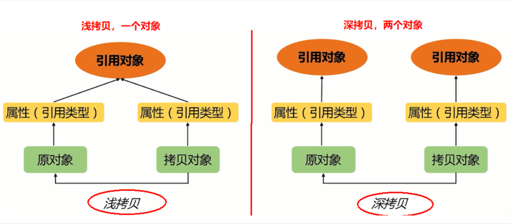

### 服务可用性几个9是什么意思

>互联网大厂一般为4个9。

### Arrays.asList不支持add
#### 问题现象
```java
/*
 * @author andy_ruohan
 * @description Arrays不支持add
 * @date 2024/8/3 15:18
 */
public class ArraysBugDemo
{
	public static void main(String[] args)
	{
		List<Integer> list = Arrays.asList(1,2);
		list.add(3);
		list.forEach(System.out::println);
	}
}
```
上述代码运行结果为：
```
Exception in thread "main" java.lang.UnsupportedOperationException
	at java.util.AbstractList.add(AbstractList.java:148)
	at java.util.AbstractList.add(AbstractList.java:108)
	at test.Arrays_BugDemo.main(Arrays_BugDemo.java:16)
```

#### 问题根因
原因为Arrays.asList方法的回参虽然是ArrayList，但却是Arrays的一个内部类，而非真正的ArrayList。二者之所以都能给List变量赋值，是因为它们都继承自AbstractList，而Arrays的内部类ArrayList并没有实现add方法，故会抛出UnsupportedOperationException。


#### 解决方法
```java
List<Integer> list = new ArrayList<>(Arrays.asList(1,2));
```

### 遍历集合时禁止使用集合的remove方法
#### 问题现象
```java
/**
 * @author andy_ruohan
 * @description 遍历集合时禁止使用list.remove
 * @date 2024/8/3 16:26
 */
public class IteratorRemoveDemo {
	public static void main(String[] args) {
		List<Integer> list = new ArrayList<>();
		list.add(11);
		list.add(12);
		list.add(13);
		list.add(14);
		list.add(15);

		Iterator<Integer> iterator = list.iterator();
		while(iterator.hasNext()) {
			Integer value = iterator.next();
			if(value == 12) {
				list.remove(value);
			}
		}

		list.forEach(System.out::println);
	}
}
```
上述代码运行结果为：
```
Exception in thread "main" java.util.ConcurrentModificationException
	at java.util.ArrayList$Itr.checkForComodification(ArrayList.java:911)
	at java.util.ArrayList$Itr.next(ArrayList.java:861)
	at test.IteratorRemoveDemo.main(IteratorRemoveDemo.java:25)
```

#### 问题根因
1) 第一次遇到 value == 12 时，通过 list.remove(value) 直接修改了集合。这导致集合的 modCount 被改变，而迭代器的 expectedModCount 没有相应更新。
2) 在下一次循环中，当 iterator.next() 被调用时，迭代器会检查当前的 modCount 是否与 expectedModCount 一致。此时会检测到二者不一致，并抛出 ConcurrentModificationException。
```java 
        public E next() {
            checkForComodification();
            int i = cursor;
            if (i >= size)
                throw new NoSuchElementException();
            Object[] elementData = ArrayList.this.elementData;
            if (i >= elementData.length)
                throw new ConcurrentModificationException();
            cursor = i + 1;
            return (E) elementData[lastRet = i];
        }
```

```java
        final void checkForComodification() {
            if (modCount != expectedModCount)
                throw new ConcurrentModificationException();
        }
```


#### 解决方法
不使用 list.remove(value) ，使用迭代器的 iterator.remove()。
```java
       if (value.equals(12)) {
	        // 使用 Iterator 的 remove 方法
	        iterator.remove();
       }
```

### Hash 冲突
#### 写一下 Hash 冲突的代码案例
```java
/**
 * @author andy_ruohan
 * @description Hash冲突两种模拟case
 * @date 2024/8/7 22:22
 */
public class HashConflictDemo {
	public static void main(String[] args) {
		hashConflictCase1();
		hashConflictCase2();
	}

	private static void hashConflictCase1() {
        // 不会产生hash冲突
		System.out.println("AA".hashCode());
		System.out.println("BB".hashCode());
		System.out.println();

		// 以下是一些典型的hash冲突案例
		System.out.println("Aa".hashCode());
		System.out.println("BB".hashCode());
		System.out.println();
		System.out.println("柳柴".hashCode());
		System.out.println("柴柕".hashCode());
	}

	private static void hashConflictCase2() {
		// 以下是通过重复new产生hash冲突案例
		HashSet<Integer> hashSet = new HashSet<>();
		for (int i = 1; i <= 15 * 10000; i++) {
			int bookHashCode = new Object().hashCode();
			if (!hashSet.contains(bookHashCode)) {
				hashSet.add(bookHashCode);
			} else {
				System.out.println("发生了hash冲突，在第:" + i + "次，值是：" + bookHashCode);
			}
		}
		System.out.println(hashSet.size());
	}
}
```

case1 输出结果：
```
2080
2112

2112
2112

851553
851553
```

case2 输出结果：
```java
发生了hash冲突，在第:105673次，值是：2134400190
发生了hash冲突，在第:111120次，值是：651156501
发生了hash冲突，在第:121781次，值是：1867750575
发生了hash冲突，在第:145304次，值是：2038112324
发生了hash冲突，在第:146237次，值是：1164664992
149995
```


#### 为什么会产生 Hash 冲突
在 `HashSet<String>` 中，如果元素值为 `"Aa"` 和 `"BB"`，它们的哈希码确实相同。Java 的 `String` 类 `hashCode()` 方法的实现导致这两个字符串具有相同的哈希值。这是因为 `String` 的 `hashCode()` 方法的实现是基于字符串中字符的序列和位置计算的，具体公式如下：

```
hashCode = s[0]*31^(n-1) + s[1]*31^(n-2) + ... + s[n-1]
```

对于字符串 `"Aa"` 和 `"BB"`，计算结果如下：

- `"Aa"` 的哈希码为：
  ```
  'A' * 31^1 + 'a' * 31^0
  = 65 * 31 + 97
  = 2015 + 97
  = 2112
  ```

- `"BB"` 的哈希码为：
  ```
  'B' * 31^1 + 'B' * 31^0
  = 66 * 31 + 66
  = 2046 + 66
  = 2112
  ```

可以看到，它们的哈希码都为 `2112`，因此它们在 `HashSet` 中会发生哈希冲突。

#### 哈希冲突处理过程
在 `HashSet<String>` 集合中存储的对象出现哈希冲突时，Java 会通过链地址法（即分离链接法）来处理这些冲突。下面详细解释在 `HashSet<String>` 中哈希冲突的处理过程：

1. **计算哈希码**：
   当你向 `HashSet` 中添加一个字符串（如 `Aa`）时，`HashSet` 会调用该字符串的 `hashCode()` 方法计算哈希码。

2. **定位桶（bucket）**：
   通过哈希码确定该整数应放置的桶的位置。如果两个整数的哈希码相同，它们将被放置到同一个桶中。

3. **处理冲突**：
    - **链地址法**：`HashSet` 使用链地址法处理冲突。如果两个或多个整数的哈希码相同，它们将被放在同一个桶中，但以链表或树的形式存储。
        - 当桶中的元素数量较少时，使用链表存储冲突的对象。
        - 当桶中的元素数量超过一定阈值时（默认为8），链表会转换为红黑树，以提高查找性能。

4. **检查相等性**：
   即使两个整数的哈希码相同，`HashSet` 仍会使用 `equals()` 方法来检查它们是否真正相等。如果 `equals()` 方法返回 `true`，`HashSet` 会认为这两个整数是重复的，不会再次添加。如果 `equals()` 方法返回 `false`，则认为它们是不同的对象，添加到同一个桶的链表或树中。

以下是示例代码，展示在 `HashSet<String>` 中处理这种哈希冲突的过程：
```java
import java.util.HashSet;
import java.util.Set;

public class HashSetExample {
    public static void main(String[] args) {
        Set<String> set = new HashSet<>();

        // 添加字符串 "Aa" 和 "BB"
        set.add("Aa");
        set.add("BB");

        // 打印集合，查看两个字符串是否都被添加
        System.out.println(set);

        // 添加重复的字符串 "Aa"
        set.add("Aa");

        // 打印集合，查看是否有重复元素
        System.out.println(set);
    }
}
```
输出结果：

```
[Aa, BB]
[Aa, BB]
```

### 整型包装类型 Integer
#### Integer的构造方法在java9后过时
```java
    // 构造方法在 java9 以后不推荐
    Integer i1 = new Integer(1200);
    Integer i2 = Integer.valueOf(1200);
```


#### 使用 Integer 对象比较的一些坑
```java
/**
 * @author andy_ruohan
 * @description Integer 对象比较的一些坑
 * @date 2024/8/8 23:31
 */
public class IntegerBugDemo {
	public static void main(String[] args) {
		// Integer 对象比较
		Integer a = Integer.valueOf(600);
		Integer b = Integer.valueOf(600);
		int c = 600;
		System.out.println(a == b);
		System.out.println(a.equals(b));
		System.out.println(a == c);

		System.out.println("===================");

		Integer x = Integer.valueOf(99);
		Integer y = Integer.valueOf(99);
		System.out.println(x == y);
		System.out.println(x.equals(y));
	}
}
```
以上代码输出结果为：
```java
false
true
true
===================
true
true
```
原因可参考源码，或下面的《阿里巴巴开发手册》摘录的内容：
```java
【强制】所有整型包装类对象之间值的比较，全部使用 equals 方法比较。
说明：对于 Integer var = ? 在-128 至 127 之间的赋值，Integer 对象是在 IntegerCache.cache 产生，
会复用已有对象，这个区间内的 Integer 值可以直接使用==进行判断，但是这个区间之外的所有数据，都
会在堆上产生，并不会复用已有对象，这是一个大坑，推荐使用 equals 方法进行判断。
```

## BigDecimal 的一些坑
### 1. 使用 BigDecimal(double) 存在精度损失风险
当使用float/double这些浮点数据时，会丢失精度String/int则不会，BigDecimal(double) 存在精度损失风险
```java
【强制】禁止使用构造方法 BigDecimal(double)的方式把 double 值转化为 BigDecimal 对象。
说明：BigDecimal(double)存在精度损失风险，在精确计算或值比较的场景中可能会导致业务逻辑异常。
如：BigDecimal g = new BigDecimal(0.1f); 实际的存储值为：0.10000000149
正例：优先推荐入参为 String 的构造方法，或使用 BigDecimal 的 valueOf 方法，此方法内部其实执行了
Double 的 toString，而 Double 的 toString 按 double 的实际能表达的精度对尾数进行了截断。
 BigDecimal recommend1 = new BigDecimal("0.1");
 BigDecimal recommend2 = BigDecimal.valueOf(0.1);
```

### 2. BigDemcial 的等值比较应使用 compareTo()
equals() 方法会比较值和精度，(1.0) 与 (1.00) 返回结果为 false，而 compareTo() 则会忽略精度。
```java
【强制】浮点数之间的等值判断，基本数据类型不能用==来比较，包装数据类型不能用 equals 来判断。
说明：浮点数采用“尾数+阶码”的编码方式，类似于科学计数法的“有效数字+指数”的表示方式。二进制无法精确表示大部分的十进制小数，具体原理参考《码出高效》。
反例：
float a = 1.0f - 0.9f;
float b = 0.9f - 0.8f;
if (a == b) {
 // 预期进入此代码快，执行其它业务逻辑
 // 但事实上 a==b 的结果为 false
}
Float x = Float.valueOf(a);
Float y = Float.valueOf(b);
if (x.equals(y)) {
 // 预期进入此代码快，执行其它业务逻辑
 // 但事实上 equals 的结果为 false
}
正例：
(1) 指定一个误差范围，两个浮点数的差值在此范围之内，则认为是相等的。
float a = 1.0f - 0.9f;
float b = 0.9f - 0.8f;
float diff = 1e-6f;
if (Math.abs(a - b) < diff) {
 System.out.println("true");
}
(2) 使用 BigDecimal 来定义值，再进行浮点数的运算操作。
BigDecimal a = new BigDecimal("1.0");
BigDecimal b = new BigDecimal("0.9");
BigDecimal c = new BigDecimal("0.8");
BigDecimal x = a.subtract(b);
BigDecimal y = b.subtract(c);
if (x.equals(y)) {
 System.out.println("true");
}
```

### 3. 除法商的结果需要指定精度
```java
    private static void m3() {
	    BigDecimal amount1 = new BigDecimal("2.0");
	    BigDecimal amount2 = new BigDecimal("3.0");
	    System.out.println(amount1.divide(amount2)); //Non-terminating decimal expansion; no exact representable decimal result.
    }
```
直接除，会报下面的错误：
```
Exception in thread "main" java.lang.ArithmeticException: Non-terminating decimal expansion; no exact representable decimal result.
	at java.math.BigDecimal.divide(BigDecimal.java:1707)
	at test.BigDecimalBugDemo.m3(BigDecimalBugDemo.java:67)
	at test.BigDecimalBugDemo.main(BigDecimalBugDemo.java:25)
```
应加上精度处理，如下模式也就是我们常说的我们的“四舍五入”：
```java
        System.out.println(amount1.divide(amount2, 2, RoundingMode.HALF_UP)); 
```


### 4. 科学计数法的使用问题
```java
	private static void m4() {
		BigDecimal amount1 = BigDecimal.valueOf(1234567890123456789.3141592631415926);
		//输出结果使用了科学计数法: 1.23456789012345677E+18
		System.out.println(amount1);
		//输出结果使用了科学计数法: 1.23456789012345677E+18
		System.out.println(amount1.toString());
		//输出结果未使用科学计数法
		System.out.println(amount1.toPlainString());
		
		System.out.println();
		BigDecimal amount2 = new BigDecimal("1234567890123456789.3141592631415926");
	    //输出结果未使用科学计数法
		System.out.println(amount2);
	    //输出结果未使用科学计数法
		System.out.println(amount2.toString());
	    //输出结果未使用科学计数法
		System.out.println(amount2.toPlainString());
	}
```
上例的输出结果为：
```
1.23456789012345677E+18
1.23456789012345677E+18
1234567890123456770

1234567890123456789.3141592631415926
1234567890123456789.3141592631415926
1234567890123456789.3141592631415926
```

## List 去重的几种方法
以下是你提供的代码中去除List重复元素的几种方法，并对其优化空间进行分析：

### 1. for循环遍历判断是否含有，没有就新增到`newList`里
```java
private static void m1() {
    // 原始列表
    List<Integer> initList = Arrays.asList(70,70,-1,5,3,3,4,4,4,4,99);
    List<Integer> srcList = new ArrayList<>(initList);
    List<Integer> newList = new ArrayList<>();

    for (int i = 0; i < srcList.size(); i++) {
        if(!newList.contains(srcList.get(i))) {
            newList.add(srcList.get(i));
        }
    }
    System.out.println(newList);
    System.out.println();
}
```
**优化空间：**
- **时间复杂度：** 该方法时间复杂度为O(n²)，因为每次调用`contains`方法都需要遍历`newList`。
- **优化建议：** 可以使用一个`HashSet`来保存已经遇到的元素，并检查`srcList`的元素是否在`HashSet`中。如果不在则添加到`newList`和`HashSet`中，这样可以将时间复杂度降低到O(n)。

### 2. 结合`HashSet`或`LinkedHashSet`去重
```java
private static void m2() {
    List<Integer> srcList = Arrays.asList(70,70,-1,5,3,3,4,4,4,4,99);
    List<Integer> newList = new ArrayList<>(new HashSet<>(srcList));
    newList.forEach((s) -> System.out.print(s+" "));
    System.out.println();
    System.out.println();

    newList = new ArrayList<>(new LinkedHashSet<>(srcList));
    newList.forEach((s) -> System.out.print(s+" "));
    System.out.println();
    System.out.println();
}
```
**优化空间：**
- **时间复杂度：** 使用`HashSet`和`LinkedHashSet`的时间复杂度是O(n)，已经是最优的解决方案之一。
- **优化建议：** `HashSet`会丢失原列表的顺序，而`LinkedHashSet`保留顺序。代码已经考虑到两者的差异，除非特别需要控制内存占用或者提高特定场景的性能，否则不需要进一步优化。

### 3. 结合 Stream 流式计算
```java
private static void m3() {
    List<Integer> initList = Arrays.asList(70,70,-1,5,3,3,4,4,4,4,99);
    List<Integer> srcList = new ArrayList<>(initList);
    List<Integer> newList = null;

    newList = srcList.stream().distinct().collect(Collectors.toList());

    newList.forEach((s) -> System.out.print(s+", "));
}
```
**优化空间：**
- **时间复杂度：** 该方法在内部使用了`LinkedHashSet`，时间复杂度为O(n)。
- **优化建议：** 这个方法非常简洁，且在多核处理器上可能具有更好的性能（由于Stream的并行特性）。如果需要优化性能，可以尝试使用`parallelStream()`，但在小规模数据集上并行处理可能得不偿失。

### 4. 循环坐标去除重复
```java
private static void m4() {
    List<Integer> initList = Arrays.asList(70,70,-1,5,3,3,4,4,4,4,99);
    List<Integer> srcList = new ArrayList<>(initList);
    List<Integer> newList = new ArrayList<>(initList);

    for (Integer element : srcList) {
        if(newList.indexOf(element) != newList.lastIndexOf(element)) {
            newList.remove(newList.lastIndexOf(element));
        }
    }
    newList.forEach((s) -> System.out.print(s+", "));
    System.out.println();
    System.out.println();
}
```
**优化空间：**
- **时间复杂度：** 该方法的时间复杂度接近O(n²)，因为`indexOf`和`lastIndexOf`都是O(n)操作。
- **优化建议：** 可以优化为通过`HashSet`记录已经遇到的元素，并在遍历过程中检查重复项，而不是使用`indexOf`和`lastIndexOf`。

### 5. 双 for 循环对比
```java
private static void m5() {
    List<Integer> initList = Arrays.asList(70,70,-1,5,3,3,4,4,4,4,99);
    List<Integer> srcList = new ArrayList<>(initList);
    List<Integer> newList = new ArrayList<>(initList);

    for (int i = 0; i < newList.size()-1; i++) {
        for (int j = newList.size()-1; j > i ; j--) {
            if(newList.get(j).equals(newList.get(i))){
                newList.remove(j);
            }
        }
    }
    newList.forEach((s) -> System.out.print(s+" "));
    System.out.println();
    System.out.println();
}
```
**优化空间：**
- **时间复杂度：** 该方法的时间复杂度为O(n²)。
- **优化建议：** 可以使用类似于`m1`方法中的`HashSet`来记录已经遇到的元素，避免使用双重循环，减少时间复杂度。

### 总结
总体来说，`m2`（使用`HashSet`或`LinkedHashSet`）和`m3`（Stream流式计算）是最优的解决方案。对于其他方法，可以通过使用`HashSet`来降低时间复杂度。

## == 和 equals
### 代码示例
```java
/**
 * @author andy_ruohan
 * @description
 * @date 2024/8/18 13:57
 *   == 和 equals
 *  1 比较范围
 *    1.1 == 既可以比较基本类型也可以比较引用类型
 *    1.2 equals只能比较引用类型，equals(Object obj)
 *  2 比较规则
 *    equals比较规则，看是否被重写过
 *    2.1 没有被重写，出厂默认就是==
 *    2.2 如果被重写，具体看实现方法
 */
public class EqualsDemo {
	public static void main(String[] args) {
		String s1 = new String("abc");
		String s2 = new String("abc");
		System.out.println(s1 == s2);
		System.out.println(s1.equals(s2));
		Set<String> set01 = new HashSet<>();
		set01.add(s1);
		set01.add(s2);
		System.out.println(set01.size());
		System.out.println(s1.hashCode() + "\t" + s2.hashCode());
		System.out.println("================================");

		Person p1 = new Person("abc");
		Person p2 = new Person("abc");
		System.out.println(p1 == p2);
		System.out.println(p1.equals(p2));
		Set<Person> set02 = new HashSet<>();
		set02.add(p1);
		set02.add(p2);
		System.out.println(set02.size());
		System.out.println(p1.hashCode() + "\t" + p2.hashCode());
		System.out.println("================================");
		System.out.println();
	}

	@AllArgsConstructor
	static class Person {
		private String name;
	}
}
```
上述代码运行结果为：
```
false
true
1
96354	96354
================================
false
false
2
758529971	2104457164
================================
```

### 原因分析
1. 当你不重写equals和hashCode方法时，Java会使用Object类的默认实现，导致比较的是对象的引用，而不是内容。
2. 对于String类，它重写了equals和hashCode方法，使得它可以正确地比较字符串的内容，并且在集合中不会出现重复元素（如果内容相同）。
3. 自定义类（如Person）如果想要在集合中正确判断相等性，通常需要重写equals和hashCode方法。

## 深拷贝和浅拷贝

**浅拷贝**复制对象时只复制对象的引用，副本与原对象共享相同的子对象，对于基本数据类型和不可变对象，浅拷贝会创建它们的副本。而**深拷贝**则复制对象及其所有嵌套的子对象，副本与原对象完全独立。

## Debug
### stream 断点
断点到 stream 流上，并点击`Trace Current Stream Chain`：


点击左下角的 flat mode 即可得到下图：


### Reset frame
悔棋

### Force Return
运行到当前这一步强制返回，不往后再执行

### Breakpoint 的四种类别
- Line Breakpoint，断点到某行上
- Method Breakpoint，断点打到接口方法上，凡是该方法的实现都会被断点
- Field Breakpoint，断点打到属性上，凡事该属性值发生改变都会被断点
- Exception Breakpoint，断点到异常那行，监测异常前那一刻的状态

## 单元测试
【强制】好的单元测试必须遵守 AIR 原则。  
说明：单元测试在线上运行时，感觉像空气（AIR）一样并不存在，但在测试质量的保障上，却是非常关键的。好的单元测试宏观上来说，具有自动化、独立性、可重复执行的特点。  
- A：Automatic（自动化）
- I：Independent（独立性）
- R：Repeatable（可重复）  

【强制】单元测试应该是全自动执行的，并且非交互式的。测试用例通常是被定期执行的，执行过程必须完全自动化才有意义。输出结果需要人工检查的测试不是一个好的单元测试。单元测试中不准使用 System.out 来进行人肉验证，必须使用 assert 来验证。

# JUC
## ThreadLocal
### ThreadLocal 的 api


### ThreadLocal 与线程池

```java
public class ThreadLocalDemo2 {
	public static void main(String[] args) {
		MyData myData = new MyData();
		//模拟一个银行有3个办理业务的受理窗口
		ExecutorService threadPool = Executors.newFixedThreadPool(3);

		try {
			//10个顾客(请求线程),池子里面有3个受理线程，负责处理业务
			for (int i = 1; i <= 10; i++) {
				int finalI = i;
				threadPool.submit(() -> {
					try {
						Integer beforeInt = myData.threadLocalField.get();
						myData.add();
						Integer afterInt = myData.threadLocalField.get();
						System.out.println(Thread.currentThread().getName() + "\t" + "工作窗口\t " +
							"受理第： " + finalI + "个顾客业务" +
							"\t beforeInt: " + beforeInt + "\t afterInt： " + afterInt);
					} finally {
						//myData.threadLocalField.remove();
					}
				});
			}
		} catch (Exception e) {
			e.printStackTrace();
		} finally {
			threadPool.shutdown();
		}
	}
}

//资源类
class MyData {
	ThreadLocal<Integer> threadLocalField = ThreadLocal.withInitial(() -> 0);
	public void add() {
		threadLocalField.set(1 + threadLocalField.get());
	}
}
```

未注释 finally 里的`myData.threadLocalField.remove();`运行结果为：
```
pool-1-thread-3	工作窗口	 受理第： 3个顾客业务	 beforeInt: 0	 afterInt： 1
pool-1-thread-1	工作窗口	 受理第： 1个顾客业务	 beforeInt: 0	 afterInt： 1
pool-1-thread-3	工作窗口	 受理第： 4个顾客业务	 beforeInt: 0	 afterInt： 1
pool-1-thread-3	工作窗口	 受理第： 6个顾客业务	 beforeInt: 0	 afterInt： 1
pool-1-thread-2	工作窗口	 受理第： 2个顾客业务	 beforeInt: 0	 afterInt： 1
pool-1-thread-1	工作窗口	 受理第： 5个顾客业务	 beforeInt: 0	 afterInt： 1
pool-1-thread-2	工作窗口	 受理第： 8个顾客业务	 beforeInt: 0	 afterInt： 1
pool-1-thread-2	工作窗口	 受理第： 10个顾客业务	 beforeInt: 0	 afterInt： 1
pool-1-thread-3	工作窗口	 受理第： 7个顾客业务	 beforeInt: 0	 afterInt： 1
pool-1-thread-1	工作窗口	 受理第： 9个顾客业务	 beforeInt: 0	 afterInt： 1
```

注释 finally 里的`myData.threadLocalField.remove();`运行结果为：
```
pool-1-thread-1	工作窗口	 受理第： 1个顾客业务	 beforeInt: 0	 afterInt： 1
pool-1-thread-2	工作窗口	 受理第： 2个顾客业务	 beforeInt: 0	 afterInt： 1
pool-1-thread-3	工作窗口	 受理第： 4个顾客业务	 beforeInt: 1	 afterInt： 2
pool-1-thread-3	工作窗口	 受理第： 5个顾客业务	 beforeInt: 2	 afterInt： 3
pool-1-thread-3	工作窗口	 受理第： 6个顾客业务	 beforeInt: 3	 afterInt： 4
pool-1-thread-3	工作窗口	 受理第： 7个顾客业务	 beforeInt: 4	 afterInt： 5
pool-1-thread-2	工作窗口	 受理第： 8个顾客业务	 beforeInt: 1	 afterInt： 2
pool-1-thread-3	工作窗口	 受理第： 9个顾客业务	 beforeInt: 5	 afterInt： 6
pool-1-thread-2	工作窗口	 受理第： 10个顾客业务	 beforeInt: 2	 afterInt： 3
```
<font color = 'red'>同一线程工作窗口的业务会相互影响。</font>

### ThreadLocal 在父子线程中的使用
```java
/**
 * @author andy_ruohan
 * @description Demonstrating ThreadLocal, InheritableThreadLocal, and TransmittableThreadLocal
 * @date 2024/9/25 21:57
 */
@Slf4j
public class ThreadLocalDemoV3 {
	public static void main(String[] args) {
		//demonstrateThreadLocalUsage();
		//demonstrateThreadLocalIsolation();
		//demonstrateInheritableThreadLocalPropagation();
		//demonstrateInheritableThreadLocalWithThreadPool();
		//demonstrateTransmittableThreadLocalWithThreadPool();
	}

	private static void demonstrateThreadLocalUsage() {
		ThreadLocal<String> threadLocal = ThreadLocal.withInitial(() -> null);
		threadLocal.set(Thread.currentThread().getName() + "-Java");
		log.info("Main thread sets value to: {}", threadLocal.get());

		new Thread(() -> {
			log.info("Thread1 retrieves before setting: {}", threadLocal.get());
			threadLocal.set(Thread.currentThread().getName() + "-Vue");
			log.info("Thread1 retrieves after setting: {}", threadLocal.get());
		}, "Thread1").start();

		sleepSeconds(1);

		new Thread(() -> {
			log.info("Thread2 retrieves before setting: {}", threadLocal.get());
			threadLocal.set(Thread.currentThread().getName() + "-Flink");
			log.info("Thread2 retrieves after setting: {}", threadLocal.get());
		}, "Thread2").start();

		CompletableFuture.supplyAsync(() -> {
			log.info("CompletableFuture thread retrieves before setting: {}", threadLocal.get());
			threadLocal.set(Thread.currentThread().getName() + "-MySQL");
			log.info("CompletableFuture thread retrieves after setting: {}", threadLocal.get());
			return null;
		});

		sleepMilliseconds(500);
	}

	private static void demonstrateThreadLocalIsolation() {
		ThreadLocal<String> threadLocal = ThreadLocal.withInitial(() -> null);
		threadLocal.set(Thread.currentThread().getName() + "-Java");
		log.info("Main thread sets value to: {}", threadLocal.get());

		new Thread(() -> log.info("Thread1 attempts to retrieve: {}", threadLocal.get()), "Thread1").start();
	}

	private static void demonstrateInheritableThreadLocalPropagation() {
		InheritableThreadLocal<String> inheritableThreadLocal = new InheritableThreadLocal<>();
		inheritableThreadLocal.set(Thread.currentThread().getName() + "-Java");
		log.info("Main thread sets value to: {}", inheritableThreadLocal.get());

		new Thread(() -> log.info("Thread1 retrieves: {}", inheritableThreadLocal.get()), "Thread1").start();
		new Thread(() -> log.info("Thread2 retrieves: {}", inheritableThreadLocal.get()), "Thread2").start();
		new Thread(() -> log.info("Thread3 retrieves: {}", inheritableThreadLocal.get()), "Thread3").start();
	}

	private static void demonstrateInheritableThreadLocalWithThreadPool() {
		InheritableThreadLocal<String> inheritableThreadLocal = new InheritableThreadLocal<>();
		inheritableThreadLocal.set(Thread.currentThread().getName() + "-Java");
		log.info("Main thread sets value to: {}", inheritableThreadLocal.get());

		ExecutorService threadPool = Executors.newFixedThreadPool(1);
		threadPool.execute(() -> {
			log.info("Thread pool first retrieval: {}", inheritableThreadLocal.get());
		});

		sleepSeconds(1);

		inheritableThreadLocal.set(Thread.currentThread().getName() + "-Vue");
		log.info("Main thread modifies value to: {}", inheritableThreadLocal.get());

		threadPool.execute(() -> {
			log.info("Thread pool second retrieval after modification: {}", inheritableThreadLocal.get());
		});

		sleepSeconds(1);
		threadPool.shutdown();
	}

	private static void demonstrateTransmittableThreadLocalWithThreadPool() {
		TransmittableThreadLocal<String> transmittableThreadLocal = new TransmittableThreadLocal<>();
		ExecutorService threadPool = Executors.newSingleThreadExecutor();
		threadPool = TtlExecutors.getTtlExecutorService(threadPool);

		transmittableThreadLocal.set(Thread.currentThread().getName() + "-Java");
		log.info("Main thread sets value to: {}", transmittableThreadLocal.get());

		threadPool.execute(() -> {
			log.info("Thread pool first retrieval: {}", transmittableThreadLocal.get());
		});

		sleepSeconds(1);

		transmittableThreadLocal.set(Thread.currentThread().getName() + "-Vue");
		log.info("Main thread modifies value to: {}", transmittableThreadLocal.get());

		threadPool.execute(() -> {
			log.info("Thread pool second retrieval after modification: {}", transmittableThreadLocal.get());
		});

		sleepSeconds(1);
		threadPool.shutdown();
	}

	private static void sleepSeconds(int seconds) {
		try {
			TimeUnit.SECONDS.sleep(seconds);
		} catch (InterruptedException e) {
			e.printStackTrace();
		}
	}

	private static void sleepMilliseconds(int milliseconds) {
		try {
			TimeUnit.MILLISECONDS.sleep(milliseconds);
		} catch (InterruptedException e) {
			e.printStackTrace();
		}
	}
}
```

这几个方法展示了 `ThreadLocal` 的逐步功能，逐层解决不同场景中的问题：

1. **`demonstrateThreadLocalUsage()`**:
    - 演示 `ThreadLocal` 的基本用法，线程数据相互独立。

2. **`demonstrateThreadLocalIsolation()`**:
    - 强调 `ThreadLocal` 的隔离性，不同线程无法共享数据。

3. **`demonstrateInheritableThreadLocalPropagation()`**:
    - 演示 `InheritableThreadLocal`，让子线程继承父线程的数据。

4. **`demonstrateInheritableThreadLocalWithThreadPool()`**:
    - 展示 `InheritableThreadLocal` 在线程池中失效的问题，线程复用导致数据传递失败。

5. **`demonstrateTransmittableThreadLocalWithThreadPool()`**:
    - 解决线程池问题，使用 `TransmittableThreadLocal` 实现跨线程池的数据传递。

每个方法逐步提升，最终解决了在线程池中共享和传递数据的问题。

## 线程池关闭
### 前置知识

*线程池七大参数及1～4执行过程

### 参考文档
Java8：https://docs.oracle.com/javase/8/docs/api/  
Java17：https://docs.oracle.com/en/java/javase/17/docs/api/java.base/java/util/concurrent/ExecutorService.html

The following method shuts down an ExecutorService in two phases, first by calling shutdown to reject incoming tasks, and then calling shutdownNow, if necessary, to cancel any lingering tasks:

```java
 void shutdownAndAwaitTermination(ExecutorService pool) {
   pool.shutdown(); // Disable new tasks from being submitted
   try {
     // Wait a while for existing tasks to terminate
     if (!pool.awaitTermination(60, TimeUnit.SECONDS)) {
       pool.shutdownNow(); // Cancel currently executing tasks
       // Wait a while for tasks to respond to being cancelled
       if (!pool.awaitTermination(60, TimeUnit.SECONDS))
           System.err.println("Pool did not terminate");
     }
   } catch (InterruptedException ie) {
     // (Re-)Cancel if current thread also interrupted
     pool.shutdownNow();
     // Preserve interrupt status
     Thread.currentThread().interrupt();
   }
 }
```
### shutdown and shutdownNow


### shutdown


### shutdownNow


```java
public interface ExecutorService extends Executor {

   /**
    * Initiates an orderly shutdown in which previously submitted
    * tasks are executed, but no new tasks will be accepted.
    * Invocation has no additional effect if already shut down.
    *
    * <p>This method does not wait for previously submitted tasks to
    * complete execution.  Use {@link #awaitTermination awaitTermination}
    * to do that.
    *
    * @throws SecurityException if a security manager exists and
    *         shutting down this ExecutorService may manipulate
    *         threads that the caller is not permitted to modify
    *         because it does not hold {@link
    *         java.lang.RuntimePermission}{@code ("modifyThread")},
    *         or the security manager's {@code checkAccess} method
    *         denies access.
    */
   void shutdown();

   /**
    * Attempts to stop all actively executing tasks, halts the
    * processing of waiting tasks, and returns a list of the tasks
    * that were awaiting execution.
    *
    * <p>This method does not wait for actively executing tasks to
    * terminate.  Use {@link #awaitTermination awaitTermination} to
    * do that.
    *
    * <p>There are no guarantees beyond best-effort attempts to stop
    * processing actively executing tasks.  For example, typical
    * implementations will cancel via {@link Thread#interrupt}, so any
    * task that fails to respond to interrupts may never terminate.
    *
    * @return list of tasks that never commenced execution
    * @throws SecurityException if a security manager exists and
    *         shutting down this ExecutorService may manipulate
    *         threads that the caller is not permitted to modify
    *         because it does not hold {@link
    *         java.lang.RuntimePermission}{@code ("modifyThread")},
    *         or the security manager's {@code checkAccess} method
    *         denies access.
    */
   List<Runnable> shutdownNow();
```
shutdown() 和 shutdownNow() 两个方法,都不会等待任务执行完毕，如果需要等待，请使用`awaitTermination`。
`awaitTermination`带有超时参数：如果超时后任务仍然未执行完毕，也不再等待。

## 线程池异常处理
### 代码演示
```java
package juc.threadpool;

import lombok.extern.slf4j.Slf4j;

import java.util.concurrent.*;

/**
 * @author andy_ruohan
 * @description 线程池抛异常处理
 * @date 2024/10/8 22:37
 */
@Slf4j
public class ThreadPoolExceptionDemo {
    public static void main(String[] args) {
        // defaultSubmit();
        // defaultSubmitAndGet();
        // defaultExecute();
        // handleException();
    }

    /**
     * 1. 默认调用, submit会吞掉异常
     */
    private static void defaultSubmit() {
        ExecutorService threadPool = Executors.newFixedThreadPool(2);
        try {
            threadPool.submit(() -> {
                // submit会吞掉异常
                System.out.println(Thread.currentThread().getName() + "\t" + "进入池中submit方法");
                for (int i = 1; i <= 4; i++) {
                    if (i == 3) {
                        int age = 10 / 0;
                    }
                    System.out.println("---come in execute: " + i);
                }
                System.out.println(Thread.currentThread().getName() + "\t" + "进入池中submit方法---end");
            });
        } catch (Exception e) {
            e.printStackTrace();
        } finally {
            threadPool.shutdown();
        }
    }

    /**
     * 2. submit执行后，如果get方法调用想要获得返回值，会抛出异常
     */
    private static void defaultSubmitAndGet() {
        ExecutorService threadPool = Executors.newFixedThreadPool(2);
        try {
            Future<?> result = threadPool.submit(() -> {
                System.out.println(Thread.currentThread().getName() + "\t" + "进入池中submit方法");
                int age = 20 / 0;
                System.out.println(Thread.currentThread().getName() + "\t" + "进入池中submit方法---end");
            });
            result.get(); // 如果没有这一行，异常被吞
        } catch (Exception e) {
            e.printStackTrace();
        } finally {
            threadPool.shutdown();
        }
    }

    /**
     * 3. 默认调用, execute会抛出异常
     */
    private static void defaultExecute() {
        ExecutorService threadPool = Executors.newFixedThreadPool(2);
        try {
            threadPool.execute(() -> {
                System.out.println(Thread.currentThread().getName() + "\t" + "进入池中execute方法");
                for (int i = 1; i <= 4; i++) {
                    if (i == 3) {
                        int age = 10 / 0;
                    }
                    System.out.println("---come in execute: " + i);
                }
                System.out.println(Thread.currentThread().getName() + "\t" + "进入池中execute方法---end");
            });
        } catch (Exception e) {
            e.printStackTrace();
        } finally {
            finalOK_shutdownAndAwaitTermination(threadPool);
        }
    }

    /**
     * 覆写afterExecute方法，线程池中抛异常时捕获
     */
    private static void handleException() {
        ExecutorService threadPool = new ThreadPoolExecutor(
            Runtime.getRuntime().availableProcessors(),
            Runtime.getRuntime().availableProcessors() * 2,
            1L,
            TimeUnit.SECONDS,
            new LinkedBlockingQueue<>(100)) {
            @Override
            protected void afterExecute(Runnable runnable, Throwable throwable) {
                // handle exceptions in execute
                if (throwable != null) {
                    log.error(throwable.getMessage(), throwable);
                }
                // handle exceptions in submit
                if (throwable == null && runnable instanceof Future<?>) {
                    try {
                        Future<?> future = (Future<?>) runnable;
                        if (future.isDone()) {
                            future.get();
                        }
                    } catch (CancellationException | ExecutionException | InterruptedException e) {
                        e.printStackTrace();
                    }
                }
            }
        };

        threadPool.submit(() -> {
            System.out.println(Thread.currentThread().getName() + "\t" + "进入池中submit方法");
            int age = 20 / 0;
            System.out.println(Thread.currentThread().getName() + "\t" + "进入池中submit方法---end");
        });

        try {
            TimeUnit.MILLISECONDS.sleep(10);
        } catch (InterruptedException e) {
            e.printStackTrace();
        }

        threadPool.execute(() -> {
            System.out.println(Thread.currentThread().getName() + "\t" + "进入池中execute方法");
            for (int i = 1; i <= 4; i++) {
                if (i == 3) {
                    int age = 10 / 0;
                }
                System.out.println("---come in execute: " + i);
            }
            System.out.println(Thread.currentThread().getName() + "\t" + "进入池中execute方法---end");
        });

        finalOK_shutdownAndAwaitTermination(threadPool);
    }

    /**
     * 优雅关闭线程池
     *
     * @param threadPool the thread pool
     */
    public static void finalOK_shutdownAndAwaitTermination(ExecutorService threadPool) {
        if (threadPool != null && !threadPool.isShutdown()) {
            threadPool.shutdown();
            try {
                if (!threadPool.awaitTermination(120, TimeUnit.SECONDS)) {
                    threadPool.shutdownNow();
                    if (!threadPool.awaitTermination(120, TimeUnit.SECONDS)) {
                        System.out.println("Pool did not terminate");
                    }
                }
            } catch (InterruptedException ie) {
                threadPool.shutdownNow();
                Thread.currentThread().interrupt();
            }
        }
    }
}
```

### 总结
- defaultSubmit()：简单，但会吞掉异常，适合不需要异常处理的任务。
- defaultSubmitAndGet()：通过 Future.get() 获取返回值和捕获异常，适合需要返回结果并希望捕获异常的任务。
- defaultExecute()：简单直接，适合不需要返回值的任务，但异常会直接抛出。
- handleException()：通过自定义线程池来统一处理 submit() 和 execute() 的异常，适合需要全局统一异常处理的场景，具有很好的扩展性。


# Leetcode
## 算法复杂度


## 双指针
### 双指针技巧
- 数组有序、原地修改，考虑用双指针
- 左右指针，多用于数组
- 快慢指针，多用于连表

### 问题举例


### 有趣的问题
#### **代码逻辑解析**

这段代码的目标是将一个数组中的所有非零元素移动到数组前面，同时保持非零元素的相对顺序不变，并将零元素移到数组的末尾。下面是代码的逐步解释：

```java
public static void moveZeroes3(int[] nums) {
    int slow = 0, fast = 0;
    while (fast < nums.length) {
        if (nums[fast] != 0) {  // 找到非零元素
            // 交换 slow 和 fast 位置的元素，使非零元素向前移动
            if (nums[slow] != nums[fast]) {  // 避免不必要的交换
                int temp = nums[slow];
                nums[slow] = nums[fast];
                nums[fast] = temp;
            }
            slow++;  // slow 指针向前移动
        }
        fast++;  // fast 指针向前移动
    }
}
```

---

#### **性能分析：为何去掉条件反而更快**

```java
if (nums[slow] != nums[fast]) 
```

该条件的目的是**避免在 `nums[slow]` 和 `nums[fast]` 的值相等时进行多余的交换**。虽然在理论上减少不必要的操作可以提升性能，但在实际运行中却可能出现以下情况：

1. **判断条件的开销**  
   每次都需要进行 `nums[slow]` 和 `nums[fast]` 的比较，这增加了额外的判断开销。对简单的数值交换来说，这种条件判断可能不如直接执行交换高效。

2. **数据分布的影响**
   - 如果数组中大部分元素都不同，则条件判断不会节省很多交换操作，反而增加了判断负担。
   - 如果数组中大部分元素已经在正确位置，这个判断条件会避免不必要的交换，提升性能。

3. **JVM 的优化机制**  
   在一些情况下，JVM 可能对简单的循环优化更有利，直接交换操作比额外的判断语句更能被高效执行。

---

#### **改进建议**

如果需要高效处理大规模数据且确保性能最优，可以根据实际数据分布情况决定是否保留 `if` 判断条件。对于一般场景，如果不关心微小的性能差异，**去掉 `if` 判断条件通常更简单且性能相近**。

# Mysql
### 如何建立复合索引，一般你加在哪些字段？
结论：选取区分度越高、重复率越低的字段效果较好，比如下述SQL结果=1的字段
```sql
SELECT COUNT(DISTINCT audit_status)/COUNT(*) AS audit_statusRate,
       COUNT(DISTINCT product_id)/COUNT(*) AS product_itRate
FROM   product_comment
```

参考《58同城30条军规》


### InnoDB的行锁到底锁了什么？
以为是行锁，但实际引起了表锁
1. 情形1：更新条件where后的字段未加索引


2. 情形2：更新条件where后的字段加了二级索引


**总结：InnoDB的行锁，是通过锁住索引来实现的，如果加锁查询的时候没有使用到索引，会将整个聚簇索引都锁住，相当于锁表了。**

**学习延伸**


### 什么是回表
```sql
CREATE TABLE `employee` (
  `id` INT(11) NOT NULL,
  `name` VARCHAR(255) DEFAULT NULL,
  `age` INT(11) DEFAULT NULL,
  `date` DATETIME DEFAULT NULL,
  `sex` INT(1) DEFAULT NULL,
  PRIMARY KEY (`id`),
  KEY `idx_age` (`age`) USING BTREE
) ENGINE=INNODB DEFAULT CHARSET=utf8;
 
INSERT INTO employee VALUES(100,'小伦',43,'2021-01-20','0');
INSERT INTO employee VALUES(200,'俊杰',48,'2021-01-21','0');
INSERT INTO employee VALUES(300,'紫琪',36,'2020-01-21','1');
INSERT INTO employee VALUES(400,'立红',32,'2020-01-21','0');
INSERT INTO employee VALUES(500,'易迅',37,'2020-01-21','1');
INSERT INTO employee VALUES(600,'小军',49,'2021-01-21','0');
INSERT INTO employee VALUES(700,'小燕',28,'2021-01-21','1');
```
对于以上建表语句，会产生主键索引id、二级索引idx_age：


当执行以下SQL语句时：
```sql
EXPLAIN SELECT * FROM employee WHERE age = 32;
```
执行过程：
1. 搜索idx_age索引树，将磁盘块1加载到内存，由于32<37,搜索左路分支，加载到磁盘寻址磁盘块2。  
2. 将磁盘块2加载到内存中，在内存继续遍历，找到age=32的记录，取得id = 400，拿到id=400后，回到id主键索引树。
3. 搜索id主键索引树，将磁盘块1加载内存，在内存遍历找到了400，但是B+树索引非叶子节点是不保存数据的。索引会继续搜索400的右分支，到磁盘寻址磁盘块3。  
4. 将磁盘块3加载内存再内存遍历，找到id=400的记录，拿到第4行(Row4)这一行的数据，查询成功。

**总结：当通过非聚簇索引查询数据时，由于索引中不包含完整的行数据，因此需要根据索引中找到的主键值再去聚簇索引中查找完整的行数据，这个过程就是回表。**

**学习延伸**

B+树中，<font color = 'blue'>所有数据记录节点</font>都是按照键值大小顺序存放在<font color = 'blue'>同一层的叶子节点</font>上，而<font color = 'red'>非叶子节点上只存储key值信息</font>，这样可以大大加大每个节点存储的key值数量，降低B+树的高度

### 如何给数据库表添加索引
#### **方法 1: 直接在原表上添加索引**
- **适用场景**：
   - **数据量**：数万到几百万条记录。
   - **更新频率**：更新频率低，查询为主。
   - **低峰期操作**：可以在低峰期进行操作，锁定时间影响较小。

- **优点**：
   - 简单快捷，无需额外存储空间。
   - 操作成本低，适用于负载较轻的表。

- **缺点**：
   - 可能会锁表，影响性能，尤其在数据量大时。
   - 对高并发写入的表不适用。

---

#### **方法 2: 创建新表B，迁移数据并添加索引**
- **适用场景**：
   - **数据量**：千万级及以上，数据量大且快速增长。
   - **更新频率**：频繁更新、插入、删除操作。
   - **需要高可用性**：需要最小化对生产环境的影响，避免长时间锁定。

- **优点**：
   - 避免了对原表的锁定，确保业务可用。
   - 索引创建过程不会影响原表的读写操作。

- **缺点**：
   - 需要额外存储空间来存放新表。
   - 数据迁移和表切换操作较复杂，可能消耗更多时间和 I/O 资源。

---

### 总结
- **方法 1**：适用于 **数据量较小（数万到几百万条）**，**更新频率低**，或能在低峰期进行操作的场景。
- **方法 2**：适用于 **数据量大（千万条以上）**，**数据更新频繁**，或对系统可用性要求高的场景。

### 如何线上数据库存在重复数据的问题
#### 如何编写查看有重复记录的SQL
```sql
公式：
select * from 表 where 重复字段 in (select 重复字段 from 表 group by 重复字段 having count(1) > 1)

案例：
select * from student where name in (select name from student group by name having count(1) > 1)
```
注意：COUNT(1) 计算所有行，不管字段的值是 NULL 还是非 NULL。COUNT(字段) 只计算字段值非 NULL 的行。

### 如何编写删除重复记录的SQL
#### 1. **1000条以内（使用 `IN`，`id` 为主键）**

```sql
delete from 表
where id not in (
  select min(id)
  from 表
  group by 重复字段
);
```
- **说明**：通过 `GROUP BY` 和 `min(id)` 保留每组最小的 `id`，删除其他重复记录。
- **适用**：数据量较小（1000条以内），`id` 为主键。

#### 2. **超过1000条（使用 `JOIN`）**

```sql
delete t
from 表 t
join (
  select min(id) as id
  from 表
  group by 重复字段
) as duplicates on t.id != duplicates.id and t.重复字段 = duplicates.重复字段;
```
- **说明**：通过 `JOIN` 连接主表和子查询结果，保留每组最小的 `id`，删除其他重复记录。
- **适用**：数据量较大，避免使用 `IN` 限制。

#### 总结：
- **`IN` 用于 1000 条以内**，`id` 为主键时，通过 `GROUP BY` 去重。
- **`JOIN` 用于超出 1000 条**，避免 `IN` 的限制，按 `重复字段` 删除重复记录。

### MySql千万级数据分页的优化

比如像上面的`limit 4950000, 30`，这个等同于数据库要扫描出 4950030条数据，然后再丢弃前面的 4950000条数据，返回剩下30条数据给用户，这种取法明显不合理。 分页操作通常会使用limit加上偏移量的办法实现，同时再加上合适的order by子句。生产危险隐患：当偏移量非常大的时候，它会导致MySQL扫描大量不需要的行然后再抛弃掉。

通常使用以下两种方法来解决：
#### 1. **使用索引覆盖 + 子查询**

```sql
CREATE INDEX idx_emp_id ON emp(id);
CREATE INDEX idx_emp_depno ON emp(deptno);
CREATE INDEX idx_dept_depno ON dept(deptno);

SELECT 
  a.empno,
  a.ename,
  a.job,
  a.sal,
  b.deptno,
  b.dname 
FROM
  emp a 
  LEFT JOIN dept b ON a.deptno = b.deptno 
WHERE a.id >= (SELECT id FROM emp ORDER BY id LIMIT 4950000,1)
ORDER BY a.id LIMIT 30;
```
- **优点**：
    - 通过子查询精确控制偏移量，避免大偏移量直接扫描。
    - 使用索引（如 `id` 和 `deptno`）来加速排序和连接操作。
- **缺点**：
    - 子查询仍然需要对大量数据进行扫描，特别是当数据量非常大时，可能会引入性能瓶颈。
    - 两次查询（主查询和子查询）可能影响性能，尤其在高并发或大数据量时。

#### 2. **使用续传字段**

```sql
SELECT 
  a.empno,
  a.ename,
  a.job,
  a.sal,
  b.deptno,
  b.dname 
FROM
  emp a 
  LEFT JOIN dept b ON a.deptno = b.deptno 
WHERE a.id > 4950000 ORDER BY a.id LIMIT 30;
```
- **优点**：
    - 通过直接过滤 `id`，避免了子查询的开销，查询性能较高。
    - 适用于分页查询，简洁且易于维护。
    - 无需全表扫描，依赖于 `id` 索引，能够高效定位数据。
- **缺点**：
    - 需要保存和跟踪上次查询的 `id`，作为续传字段。这需要在外部管理（例如，应用层或用户界面），并确保其准确性。
    - 如果数据发生变动（如新增、删除记录），分页结果可能不一致，需谨慎使用。

#### 总结：
- **续传字段**：适合分页场景，尤其是数据量较大时。通过 `id` 过滤，性能高，操作简单，但需要依赖外部管理上次查询的 `id`，确保一致性。
- **索引覆盖 + 子查询**：适用于一次性查询，通过子查询获取准确的偏移位置，避免全表扫描。虽然通过索引提升性能，但在数据量非常大时，子查询可能会导致性能下降。

#### 参考文档：《阿里巴巴开发手册》
